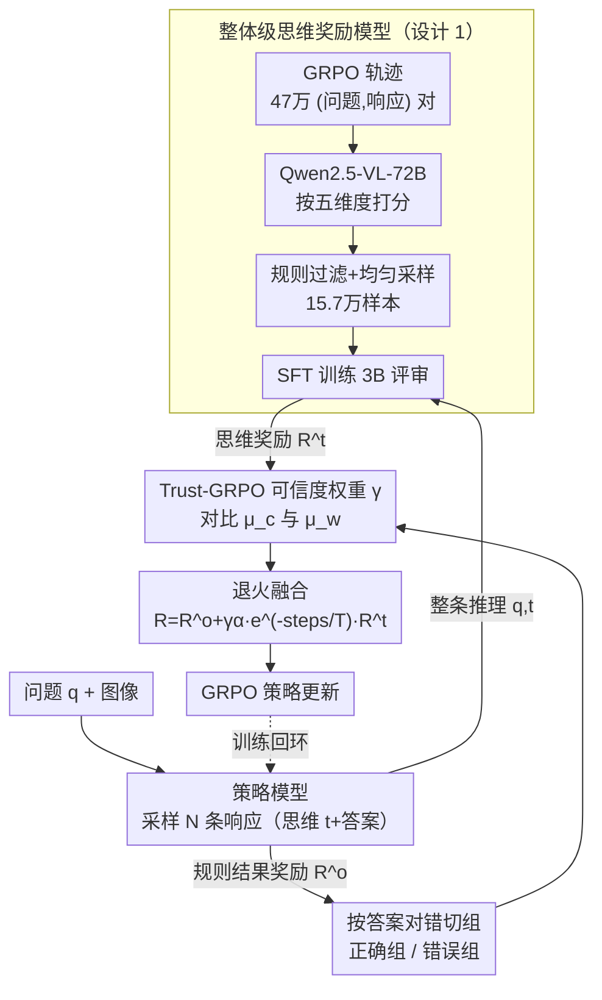

# SophiaVL-R1: Reinforcing MLLMs Reasoning with Thinking Reward

**会议**: ICLR 2026  
**arXiv**: [2505.17018](https://arxiv.org/abs/2505.17018)  
**代码**: [GitHub](https://github.com/kxfan2002/SophiaVL-R1)  
**领域**: 多模态推理/RL对齐  
**关键词**: 思维奖励, MLLM推理, Trust-GRPO, 退火策略, 过程监督

## 一句话总结
提出SophiaVL-R1——在规则基RL训练MLLM推理时引入整体级思维过程奖励：训练Thinking Reward Model从逻辑一致性/冗余度等五维度评估推理质量→提出Trust-GRPO基于正确/错误答案组的思维奖励对比计算可信度权重$\gamma$缓解reward hacking→退火策略$e^{-\text{steps}/T}$渐减思维奖励使后期更依赖准确的规则奖励→7B模型在MathVista(71.3%)和MMMU(61.3%)等多个基准全面超越LLaVA-OneVision-72B。

## 研究背景与动机

**领域现状**：DeepSeek-R1式规则基RL(GRPO+outcome reward)已成功激发LLM/MLLM的推理能力，代表工作有R1-OneVision、OpenVLThinker、Video-R1等，关键在于用规则函数产生准确的结果奖励信号。

**核心问题**：仅依赖结果奖励(outcome reward)无法保证推理过程质量——模型可能通过有缺陷的推理路径"歪打正着"得到正确答案，GRPO会同等鼓励这些响应，导致学到次优甚至错误的推理策略，泛化能力差。

**PRM的局限**：传统过程奖励模型(PRM)施加步级(step-wise)约束→(1)过于rigid，限制灵活性和泛化性；(2)步级正确性评估本身困难；(3)模型可通过重复有效步骤或插入无意义步骤exploit奖励。

**奖励hacking风险**：模型生成的思维奖励在某些样本上不可靠(Ye et al., 2024; Li et al., 2025a)，直接加入GRPO可能导致reward hacking——模型学会迎合奖励模型而非真正改善推理。

**思维奖励的时序问题**：训练全程保持相同强度的思维奖励不一定最优——初期有助于发现好策略，但后期可能因不完美的奖励信号累积误差。

**研究目标**：设计一种可靠地将思维过程奖励融入GRPO训练的方法，在不引入额外计算开销的前提下，引导模型发展出更强、更可泛化的推理能力。

## 方法详解

### 整体框架

SophiaVL-R1 在标准 GRPO 训练之上叠了一层"思维过程"的监督。它分两段：第一段离线训练一个轻量的思维奖励模型（Thinking Reward Model, TRM），第二段把这个模型嵌进 RL 主循环。RL 时策略模型对每个问题采样 $N$ 条响应（含思维过程 $t$ 和最终答案），一边由规则函数算出结果奖励 $R^o$、按答案对错把这组响应切成正确组与错误组，一边由 TRM 对每条整段推理打出思维奖励 $R^t \in [0,1]$；Trust-GRPO 用两组思维奖励的对比算出一个可信度权重 $\gamma$，再叠一条随训练步数衰减的退火曲线，把两类奖励融成最终奖励喂给 GRPO 更新策略。这样"答案对不对"（$R^o$）和"想法好不好"（$R^t$）就被统一进同一套目标，且后者的影响被可信度和时间双重约束住，避免被刷分。

### 关键设计

**1. 整体级思维奖励模型：用一个 3B 评审整体打分取代步级 PRM**

传统过程奖励模型（Process Reward Model, PRM）逐步打分既约束过死、限制泛化，又容易被"重复有效步骤、插入无意义步骤"刷高，而且步级正确性本身就难判定。SophiaVL-R1 改成对整条推理做整体评估：给定问题 $q$ 与思维过程 $t$，奖励模型直接输出一个标量 $R^t = f_{\phi}(q, t) \in [0, 1]$，只看推理质量、不管最终答案对错。它的训练数据取自 GRPO 训练轨迹本身——先收集 Qwen2.5-VL-7B 训练中产出的 470,331 个 (问题, 响应) 对，用更强的 Qwen2.5-VL-72B 从逻辑一致性、推理正确性、错误识别、语言一致性、冗余度五个维度打分（这五维正是从 GRPO 训练里观察到的真实错误模式提炼的），再经规则过滤与均匀采样压到 156,703 个分布均衡的高质量样本，以 Qwen2.5-VL-3B-Instruct 为基座做 SFT。从真实轨迹采数据保证它见过的正是模型真会犯的错误，整体级评分则绕开了步级正确性难判、约束过死这两个老问题。

**2. Trust-GRPO：用正确/错误组的奖励对比给思维奖励配可信度权重**

模型生成的思维奖励并非总是可靠，直接塞进 GRPO 会引来 reward hacking——模型学会迎合奖励模型而非真改推理。Trust-GRPO 复用 GRPO 本就有的组采样：对每个问题的 $N$ 条响应，按结果奖励切成正确组 $G_{\text{correct}}$ 和错误组 $G_{\text{wrong}}$，各算组内平均思维奖励 $\mu_c = \frac{1}{|G_{\text{correct}}|}\sum_{i \in G_{\text{correct}}} R_i^t$ 和 $\mu_w = \frac{1}{|G_{\text{wrong}}|}\sum_{i \in G_{\text{wrong}}} R_i^t$。可信度权重定义为

$$\gamma = \begin{cases} 1, & \mu_c \geq \mu_w \\ e^{\mu_c - \mu_w}, & \mu_c < \mu_w \end{cases}$$

直觉很清楚：正常情况下正确答案应当配更高的思维奖励，一旦反过来（错误组反而更高，$\mu_c < \mu_w$），说明这批思维奖励与结果奖励错位、信号不可信，$\gamma$ 就随差距指数衰减把它压低。整个可信度估计只是对已采样的两组响应取均值再对比，零额外采样、零额外前向，比 MC Dropout 这类要多次推理的不确定性估计省得多，对本就算力吃紧的 MLLM 训练很关键。

**3. 退火策略：让思维奖励的权重随训练步数指数衰减**

全程恒定强度的思维奖励不是最优——早期它帮模型发现好的推理策略，但后期模型推理已基本成型，不完美的思维信号反而会累积成噪声。退火在融合奖励里再乘一个时间衰减因子，使融合后的最终奖励为

$$R_i = R_i^o + \gamma \alpha e^{-\text{steps}/T} \cdot R_i^t$$

其中 $\alpha$ 是思维奖励的基础系数，$\text{steps}$ 是当前全局训练步数、$T$ 是总步数，$e^{-\text{steps}/T}$ 单调递减，使思维奖励贡献自然从大到小。整条曲线实现了"先发散探索、后收敛精炼"：早期靠思维奖励找方向，后期回归准确的规则结果奖励稳住优化，避免 reward hacking 在训练尾段累积。（去掉退火只保留可信度权重的 $R_i = R_i^o + \gamma \alpha \cdot R_i^t$ 即对应消融里的 -wo-annealing 变体。）

### 损失函数 / 训练策略

结果奖励 $R_i^o$ 沿用规则基设计，按任务类型分别给信号：数值题与多选题用精确/选项匹配得二值奖励，OCR 任务用负的 Word Error Rate（WER），自由文本则取 ROUGE-1/2/L 的平均值。这套规则奖励与上面三个设计组合进 $R_i = R_i^o + \gamma \alpha e^{-\text{steps}/T} \cdot R_i^t$，再喂给标准 GRPO 做策略优化。

## 实验关键数据

### 表1：数学推理基准(MathVista & MathVerse)

| 模型 | MathVista | MathVerse | 参数量 |
|------|-----------|-----------|--------|
| LLaVA-OneVision-72B | 68.4 | 27.2 | 72B |
| URSA-8B | 59.8 | 45.7 | 8B |
| R1-OneVision-7B | 64.1 | 46.4 | 7B |
| Qwen2.5-VL-7B+GRPO | 69.9 | 45.3 | 7B |
| Qwen2.5-VL-7B+SFT+GRPO | 66.8 | 43.1 | 7B |
| **SophiaVL-R1-7B** | **71.3** | **48.8** | **7B** |

### 表2：通用多模态基准

| 模型 | MMMU | MME | ChartQA | MMBench | MMStar |
|------|------|-----|---------|---------|--------|
| LLaVA-OneVision-72B | 56.8 | 2261 | 83.7 | - | 66.1 |
| URSA-8B | 43.1 | 1606 | 44.4 | 55.5 | 42.3 |
| Qwen2.5-VL-7B+GRPO | 58.0 | 2298 | 87.2 | 83.4 | 65.6 |
| **SophiaVL-R1-7B** | **61.3** | **2404** | **88.5** | **85.4** | **66.7** |

### 表3：消融实验

| 变体 | MathVista | MathVerse | MMMU |
|------|-----------|-----------|------|
| Qwen2.5-VL-7B+GRPO(基线) | 69.9 | 45.3 | 58.0 |
| 未训练TRM(SophiaVL-R1-wo-trained-TRM) | 68.4 | 47.9 | 57.0 |
| 无Trust+无退火 | 67.4 | 46.3 | 56.7 |
| 无Trust(仅退火) | 70.2 | 47.8 | 60.0 |
| **完整SophiaVL-R1** | **71.3** | **48.8** | **61.3** |

## 关键发现

1. **整体级思维奖励优于步级PRM**：与VisualPRM(InternVL2.5-8B)相比，SophiaVL-R1在MathVerse上提升18.1个点(48.8 vs 30.7)，在所有子任务上全面领先→整体级评估更灵活鲁棒。

2. **Trust权重$\gamma$有效防止reward hacking**：消融显示去除Trust权重后MMMU从61.3降至60.0、MathVista从71.3降至70.2→$\gamma$通过正确/错误组思维奖励对比有效识别不可靠信号并降权。

3. **退火策略不可或缺**：去除退火后(SophiaVL-R1-wo-trust-and-annealing)性能全面下降(MathVista 67.4 vs 71.3, MMMU 56.7 vs 61.3)→持续施加可能不完美的思维奖励导致优化偏差，退火使模型后期回归可靠规则奖励。

4. **未训练的TRM几乎无用**：用未训练Qwen2.5-VL-3B替代训练好的TRM→性能与纯GRPO基线相当→证明专门训练流程和SophiaVL-R1-Thinking-156k数据集的重要性。

5. **训练曲线**：SophiaVL-R1的outcome reward上升最快且最高→Trust-GRPO加速策略探索。

## 亮点与洞察

- **"不只看答案对不对→还看想法好不好"**：如同教师批改作业不只看最终分数还看解题过程→SophiaVL-R1通过思维奖励实现了MLLM训练中的过程监督。
- **Trust-GRPO的零成本自校准**：巧妙利用GRPO已有的组采样→正确/错误组的思维奖励对比→无需额外采样即可估计可信度→计算友好的reward hacking防御。
- **10倍参数鸿沟的逆转**：7B模型在MMMU上超越72B模型4.5个点(61.3 vs 56.8)→推理质量比参数规模更重要→对高效推理模型研究有重大启示。
- **退火的工程智慧**：初期思维奖励→探索发现；后期规则奖励→稳定精炼。这种"先发散后收敛"的思路具有普适价值。

## 局限性

1. **思维奖励模型依赖大模型标注**：训练数据由Qwen2.5-VL-72B评分→标注质量受限于该模型能力→可能存在系统性偏差，且标注成本较高。
2. **五维度评估的完备性未充分验证**：逻辑一致性、推理正确性等五个维度是从训练中观察到的错误模式提炼→不一定覆盖所有推理缺陷类型→在新任务/领域上可能需要扩展。
3. **仅在Qwen2.5-VL系列上验证**：未在InternVL、LLaVA等其他架构上测试→方法的通用性有待进一步验证。

## 相关工作对比

### vs VisualPRM (Wang et al., 2025b)
VisualPRM采用步级过程奖励模型→SophiaVL-R1采用整体级思维奖励→后者在MathVerse上提升18.1个点(48.8 vs 30.7)→说明整体级评估在MLLM推理训练中更有效，避免了步级约束的rigidity和exploit问题。

### vs Video-R1 / R1-OneVision
这些工作仅使用规则基outcome reward→不监督推理过程→SophiaVL-R1额外引入思维奖励+Trust-GRPO+退火→更全面的奖励信号带来更好的泛化(MathVista 71.3 vs R1-OneVision的64.1)。

## 评分

- **新颖性**: ⭐⭐⭐⭐ 整体级思维奖励+Trust-GRPO可信度机制+退火策略的三重组合有新意，但各个组件本身较直觉。
- **实验充分度**: ⭐⭐⭐⭐ 7个基准+详细消融+训练曲线+VLRewardBench验证TRM，缺少不同基座模型的实验。
- **写作质量**: ⭐⭐⭐⭐⭐ 问题定义→分析→解决方案的逻辑链清晰完整，公式推导简洁优雅。
- **价值与影响**: ⭐⭐⭐⭐⭐ 为MLLM推理RL训练中的过程监督提供了一条实用且有效的路径，Trust-GRPO的可信度估计思路有广泛适用性。

<!-- RELATED:START -->

## 相关论文

- [\[ICLR 2026\] VidGuard-R1: AI-Generated Video Detection and Explanation via Reasoning MLLMs and RL](vidguard-r1_ai-generated_video_detection_and_explanation_via_reasoning_mllms_and.md)
- [\[NeurIPS 2025\] Video-R1: Reinforcing Video Reasoning in MLLMs](../../NeurIPS2025/multimodal_vlm/video-r1_reinforcing_video_reasoning_in_mllms.md)
- [\[ICLR 2026\] Sparsity Forcing: Reinforcing Token Sparsity of MLLMs](sparsity_forcing_reinforcing_token_sparsity_of_mllms.md)
- [\[CVPR 2026\] STAR-R1: Multi-View Spatial TrAnsformation Reasoning by Reinforcing Multimodal LLMs](../../CVPR2026/multimodal_vlm/star-r1_multi-view_spatial_transformation_reasoning_by_reinforcing_multimodal_ll.md)
- [\[ICLR 2026\] Reasoning-Driven Multimodal LLM for Domain Generalization](reasoning-driven_multimodal_llm_for_domain_generalization.md)

<!-- RELATED:END -->
