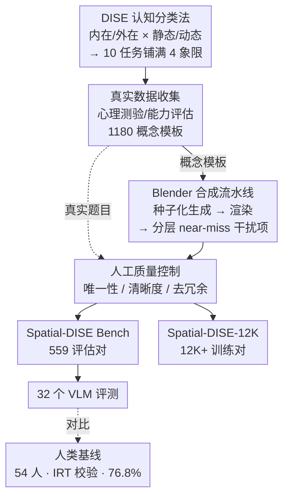

# Spatial-DISE: A Unified Benchmark for Evaluating Spatial Reasoning in Vision-Language Models

**会议**: ICLR 2026  
**arXiv**: [2510.13394](https://arxiv.org/abs/2510.13394)  
**代码**: [https://github.com/Spatial-DISE](https://github.com/Spatial-DISE)  
**领域**: 多模态VLM  
**关键词**: spatial reasoning, VLM benchmark, cognitive taxonomy, DISE framework, mental transformation

## 一句话总结
提出基于认知科学 2×2 分类法（内在/外在 × 静态/动态）的统一空间推理基准 Spatial-DISE，包含 559 个评估 VQA 对和 12K+ 训练数据，在 32 个 SOTA VLM 上的评测揭示了模型在动态空间推理（尤其是心理旋转和折叠）上与人类的巨大差距。

## 研究背景与动机

**领域现状**：空间推理能力对机器人、增强现实、自动驾驶等应用至关重要，近年来涌现了大量 VLM 空间推理基准如 SpatialRGPT、VSR、CV-Bench、BLINK 等。这些基准主要评估外在-静态（E-S）能力，即固定场景中物体间的空间关系理解。Table 1 对比了 18 个现有基准的 DISE 四象限覆盖情况，绝大多数只覆盖 1-2 个象限。

**现有痛点**：现有基准存在三大局限：(1) 缺乏系统的认知框架来分类和评估不同类型的空间推理能力，评测碎片化且不平衡；(2) 过度聚焦于静态空间问题，忽视需要多步动态推理的任务（如心理旋转和折叠）；(3) 少数涉及动态任务的基准（如 SAT、SPACE）规模太小，难以可靠评估模型能力或支持模型训练。

**核心矛盾**：人类的空间认知包含丰富的动态心理模拟能力（如想象物体旋转后的样子、折叠后的形状），但现有基准几乎没有系统地评估这类"内在-动态"（I-D）能力。模型在静态判断上可能表现不错，但在需要心理模拟的场景下可能完全失败——而这恰恰是实际应用中最关键的能力。

**本文目标** (1) 如何建立一个认知科学导向的统一分类框架覆盖所有空间推理类型？(2) 如何大规模生成可验证的动态空间推理数据来解决数据稀缺问题？(3) 当前 VLM 在不同空间推理维度上的能力边界和失败模式是什么？(4) 训练数据的补充能否有效改善空间推理能力？

**切入角度**：借鉴认知科学中 Uttal 等人的空间能力分类体系，将空间推理沿"内在 vs 外在"和"静态 vs 动态"两个维度组织为 DISE 四象限，设计 10 个涵盖所有象限的认知任务。利用 Blender 引擎构建可扩展的合成数据生成流水线，解决动态任务的数据稀缺问题。

**核心 idea**：用认知科学的 2×2 DISE 分类法统一组织空间推理评测，重点弥补现有基准在内在-动态维度上的空白。

## 方法详解

### 整体框架
Spatial-DISE 不是一个新模型，而是一套「认知分类法 + 数据构建流水线 + 评测」三位一体的空间推理基准。它先用 DISE 分类法把空间推理沿两个正交维度切成四象限、铺出 10 个认知任务；再用一条三阶段策展流水线（真实数据收集 → Blender 合成 → 人工质量控制）大规模产出可验证的 VQA（视觉问答）数据，得到 559 对评估集 Spatial-DISE Bench 和 12K+ 训练集 Spatial-DISE-12K；最后在 32 个 SOTA VLM 上评测，并以经 IRT 校验的人类基线为标尺，量化模型离人类还有多远。

10 个任务的设计都对标经典心理测验，并按象限分布：内在-静态（I-S）的 2D/3D 形状查找测部分-整体关系分析；内在-动态（I-D）的 2D/3D 旋转、2D/3D 折叠、Fold&Punch 测纯心理模拟变换；外在-静态（E-S）的 3D 投影测固定视角下的空间关系；外在-动态（E-D）的 2D/3D 组合测多部件动态装配。流水线里的真实数据（从心理测验和专业能力评估收集的 1180 个概念模板）既直接贡献部分题目，又为 Blender 合成提供任务模板。

### 关键设计

**1. DISE 认知分类法：用两个正交维度把空间推理切成四象限，补齐最薄弱的内在-动态**

针对现有基准评测碎片化、大多只覆盖 1-2 个象限的痛点，DISE 沿两个正交维度组织所有空间推理任务：第一维度区分内在（Intrinsic，关注物体内部结构和部件关系）与外在（Extrinsic，关注物体之间的空间关系）；第二维度区分静态（Static，信息固定不变）与动态（Dynamic，需要心理变换）。两维度交叉出四个象限——I-S（分析物体内部静态属性，如形状查找）、I-D（心理模拟物体变换，如旋转、折叠）、E-S（固定场景中的物体关系，如 3D 投影）、E-D（推理多物体的变化关系，如 2D/3D 组合）。以往基准大多挤在 E-S 一角，DISE 用这张 2×2 网格保证十个任务铺满四象限，尤其把最稀缺的 I-D 心理模拟单独拎出来评估。框架本身一个已知局限是不区分 2D 与 3D 空间推理的难度差异。

**2. Blender 可扩展合成流水线：把稀缺的动态空间数据变成可大规模生成、答案可自动验证的合成数据**

动态空间推理数据极度稀缺、难以从真实世界大规模收集，这是补齐 I-D 的最大瓶颈。流水线用五步把它工程化：(1) 用 question_id 哈希出可复现的随机种子，保证每个实例可重建、可验证；(2) 生成核心 3D 物体（如不规则形状、带纹理的立方体）；(3) 从最佳视角渲染问题图和正确答案图；(4) 系统性生成分层 near-miss 干扰项；(5) 在受控虚拟环境里统一渲染输出标准 VQA 对。这里干扰项是诊断性的关键——简单干扰项只能筛掉最差的模型，所以按任务定制四类容易混淆的近似错误：几何变体（增减组件）、模式/方向错误（纹理错位）、错误视角（正交投影方向错误）、组件替换（用几何相似但不正确的部件顶替）。每种都对准模型常犯的某类错误（如 3D 旋转靠微调角度、3D 折叠靠交换面纹理生成），逼模型必须做精确空间推理而非模式匹配。因为整个场景由 Blender 参数驱动，正确答案能直接用场景参数验证、无需人工标注；社区只要实现新的物体生成和干扰项策略就能扩展新任务。

**3. 人工质量控制：用唯一性、清晰度、去冗余三道闸把不合格实例直接踢出去**

合成数据规模虽大，仍可能有歧义题、渲染瑕疵或重复项，因此策展流水线的第三阶段对每个实例过三道质量闸：(1) 答案唯一性——每题必须有且只有一个正确答案；(2) 准确性与清晰度——图像无渲染瑕疵、问题表述清楚、所有选项都符合任务标准；(3) 冗余消除——去掉逻辑或视觉上重复的实例。任一闸不合格的实例直接从最终数据集中移除，保证评估集 559 对每一道都干净可用（12K 训练集则对分层抽样的 1000 个实例做人工核验、其余用程序化单解检查兜底）。

**4. 人类基线建立：用矩阵采样 + IRT 交叉验证给出心理测量学可靠的人类上界**

光有模型分数不知道"差距"有多大，所以要一个可靠的人类上界做标尺。作者招了 54 名参与者（年龄 15-55 岁），共收集 1679 个有效回答；采用矩阵采样设计，让每题平均被 3 个独立参与者作答；最终报告所有回答的平均准确率（76.8%），并用 Item Response Theory（IRT，项目反应理论）做交叉验证，确保这个基线在心理测量学上可靠，而非少数人偶然发挥。正是有了这条 76.8% 的人类线，才能定量说明 VLM 平均仅 28.4% 的成绩离人类有多远。

## 实验关键数据

### 主实验

| 模型类型 | 代表模型 | 总体准确率 | I-D（内在动态） | E-D（外在动态） | I-S（内在静态） |
|---------|---------|-----------|---------------|---------------|---------------|
| 闭源最佳 | Doubao1.5VL-thinking | 42.0% | 40.9% | 61.9% | 35.6% |
| 闭源平均 | — | 31.9% | 35.2% | 26.0% | 27.7% |
| 开源最佳 | Qwen2.5-VL-7B-sft | 47.0% | 43.1% | 66.7% | 51.7% |
| 开源平均 | — | 26.2% | 29.1% | 23.2% | 19.3% |
| **人类基线** | — | **76.8%** | **80.2%** | **61.1%** | **76.8%** |
| 随机猜测 | — | 24.8% | 24.3% | 25.4% | 24.7% |

### 微调实验（Spatial-DISE-12K）

| 模型 | Spatial-DISE | CVBench | SAT | SPACE | OmniSpatial |
|------|-------------|---------|-----|-------|-------------|
| Qwen2.5-VL-7B (Base) | 26.1% | — | — | — | — |
| Qwen2.5-VL-7B (SFT) | 47.0% (+20.9pp) | — | — | — | — |
| SpaceOm (Base) | 25.9% | 68.8% | 46.67% | 27.22% | 27.91% |
| SpaceOm (SFT) | 41.3% (+15.4pp) | 70.33% | 49.33% | — | — |

### 关键发现
- 所有 32 个模型平均准确率仅 28.4%，仅略高于随机猜测（25%），远低于人类基线（76.8%），空间推理是 VLM 的系统性弱点
- Fold&Punch 任务（需要折叠→打孔→展开三步心理模拟）上最优模型仅 30.8%，平均仅 25.4%（等同随机猜测），揭示了"空间工作记忆"的严重缺陷——模型无法在多步变换中维持连贯的心理状态
- 静态能力并非动态推理的前提：多个模型在动态任务上反而优于静态任务（如 Gemini-2.0-Flash 动态 38.3% vs 静态 23.6%），表明模型学到的是碎片化策略而非系统性空间认知
- Doubao-1.5-thinking 在 E-D 任务上超过人类（61.9% vs 61.1%），因为它将认知模拟转化为计算问题——算法式地比较几何特征而非依赖心理模拟
- Spatial-DISE-12K 微调带来显著提升（Qwen2.5-VL +20.9pp），且部分泛化到外部基准如 CVBench 和 SAT
- 推理增强训练（如 RLHF、GRPO）带来的提升有限且不均匀，不能从根本上解决认知空间推理问题

## 亮点与洞察
- DISE 分类法将分散的空间推理研究统一到一个框架下，可以精准诊断模型在哪个认知维度上最薄弱。这个框架可以迁移到其他认知能力评测领域（如因果推理、时序推理）
- Blender 合成流水线是一个可复用的工具——用种子化随机保证可验证性，用分层干扰项保证诊断性。社区可以在此基础上扩展新的空间推理任务类型
- "静态能力不是动态推理前提"的发现挑战了直觉，暗示当前 VLM 的空间"理解"可能只是模式匹配而非真正的空间认知
- Doubao-1.5-thinking 在 E-D 上超过人类的现象启示：对于可以算法化的空间任务，模型有天然优势——这指向了一种"计算式空间推理"的研究方向
- 微调 12K 数据即可获得 20pp+ 提升说明动态空间推理的训练数据极度匮乏，这一数据集本身就是重要贡献

## 局限与展望
- 评估使用 VQA 多选题形式，可能低估模型的开放式空间推理能力（如自由描述空间关系）
- 合成数据的视觉风格（纯色背景、简洁几何体）与真实世界差距较大，微调后是否能迁移到真实场景需要更多验证
- 只关注 2D/3D 几何空间推理，未涉及语义空间推理（如"厨房通常在餐厅旁边"）和导航空间推理
- 人类基线的 54 名参与者规模偏小，年龄跨度 15-55 岁但年龄/教育分布未详细说明
- Blender 流水线目前只覆盖 5 种 3D 任务，可扩展到遮挡推理、透视变换、镜像反转等更多类型
- Bench 规模（559 对）对于某些子类别（如 E-S 只有 70 对）可能偏小，模型置信区间较宽
- 未探索视频输入下的动态空间推理，多帧信息可能改善模型的心理模拟能力

## 相关工作与启发
- **vs SPARE3D**: SPARE3D 只覆盖 I-S 象限（用合成数据测试 3D 形状识别），Spatial-DISE 覆盖全部四象限，特别是补齐 I-D
- **vs SPACE**: SPACE 也涉及动态推理但规模小（5K），且缺乏统一框架；Spatial-DISE 有更大规模的训练集（12K+）和系统的认知分类
- **vs OmniSpatial**: OmniSpatial 覆盖所有四象限但规模小（1.5K）且使用真实世界数据，难以大规模扩展；Spatial-DISE 的 Blender 流水线提供了可扩展方案

## 评分
- 新颖性: ⭐⭐⭐⭐ DISE 分类法有认知科学基础，对内在-动态推理的系统性重视填补了重要评估空白
- 实验充分度: ⭐⭐⭐⭐⭐ 32 个模型（含闭源、开源、推理增强、空间特化四类）、四象限细分分析、微调实验和跨五个外部基准的泛化测试，覆盖广度和分析深度均突出
- 写作质量: ⭐⭐⭐⭐ 结构清晰，DISE 框架图示直观，认知分析有深度；部分实验表格过于密集难以快速提取关键信息
- 价值: ⭐⭐⭐⭐ 揭示了当前 VLM 在认知空间推理上的系统性弱点，Blender 合成流水线和 12K 训练集对社区有实际复用价值

<!-- END -->

<!-- RELATED:START -->

## 相关论文

- [\[ICLR 2026\] OmniSpatial: Towards Comprehensive Spatial Reasoning Benchmark for Vision Language Models](omnispatial_towards_comprehensive_spatial_reasoning_benchmark_for_vision_languag.md)
- [\[CVPR 2026\] SpatiaLQA: A Benchmark for Evaluating Spatial Logical Reasoning in Vision-Language Models](../../CVPR2026/multimodal_vlm/spatialqa_a_benchmark_for_evaluating_spatial_logical_reasoning_in_vision-languag.md)
- [\[ICLR 2026\] SpatiaLab: Can Vision-Language Models Perform Spatial Reasoning in the Wild?](spatialab_can_vision-language_models_perform_spatial_reasoning_in_the_wild.md)
- [\[ICLR 2026\] Spatial Reasoning is Not a Free Lunch: A Controlled Study on LLaVA](spatial_reasoning_is_not_a_free_lunch_a_controlled_study_on_llava.md)
- [\[ICLR 2026\] Spatial CAPTCHA: Generatively Benchmarking Spatial Reasoning for Human-Machine Differentiation](spatial_captcha_generatively_benchmarking_spatial_reasoning_for_human-machine_di.md)

<!-- RELATED:END -->
