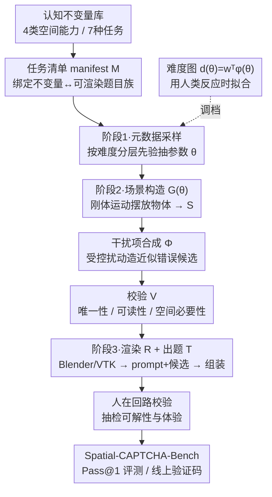

# Spatial CAPTCHA: Generatively Benchmarking Spatial Reasoning for Human-Machine Differentiation

**会议**: ICLR 2026  
**arXiv**: [2510.03863](https://arxiv.org/abs/2510.03863)  
**代码**: 无  
**领域**: 多模态VLM  
**关键词**: CAPTCHA, 空间推理, 多模态大模型, 人机区分, 程序化生成

## 一句话总结

提出 Spatial CAPTCHA，一种基于 3D 空间推理的新型人类验证框架，利用人类与多模态大语言模型在几何推理、视角变换、遮挡处理和心理旋转等任务上的根本性能力差异来区分人与机器，最优 MLLM 仅达 31.0% Pass@1 准确率，远低于人类表现。

## 研究背景与动机

CAPTCHA（Completely Automated Public Turing test to tell Computers and Humans Apart）是在线服务防御自动化攻击的第一道防线。然而，随着多模态大语言模型（MLLMs）的快速发展，传统 CAPTCHA 设计的有效性正被严重侵蚀：

**文本识别型 CAPTCHA 已不安全**：现代 OCR 模型和 MLLM 轻易破解扭曲文字验证码

**2D 图像理解型 CAPTCHA 也面临威胁**：如 Google reCAPTCHA 中的"选择所有交通灯"等任务，MLLM 已能高准确率完成

**底层原因**：传统 CAPTCHA 依赖的是低级感知任务（low-level perception tasks），而当前 AI 系统恰好在这些任务上已接近或超越人类

本文的核心洞察是：**空间推理是目前 AI 系统相对于人类仍存在巨大差距的认知能力**。几何推理、视角理解、遮挡判断和心理旋转等任务对人类来说直觉而自然，但对当前最先进的 AI 系统仍然极其困难。这一差距为设计新一代安全的 CAPTCHA 提供了天然基础。

## 方法详解

### 整体框架

Spatial CAPTCHA 要回答的问题是：当 MLLM 已经能破解文字和 2D 图像验证码时，还能用什么任务把人和机器分开？它的答案是把整条验证流程建在空间推理之上，并让这条流程完全由程序自动驱动。整套系统是"理论先行"的：先把人类空间认知拆成几类基础能力，每类能力锚定一个数学上良定义的不变量（invariant）；再把每类任务写成一份机器可校验的**任务清单**（manifest），声明该题目族怎么采样、怎么生成、怎么判分；最后由一条三阶段合成管线把清单批量实例化成一道道验证码——采样参数 → 程序化生成场景与干扰项并校验 → 渲染出题并组装。难度由一个单调函数连续调控，生成的题再经人工抽检兜底。产出物就是基准 Spatial-CAPTCHA-Bench，评测指标为 Pass@1（一次答对即通过），直接对应真实验证码「答对一次即放行」的判定。

### 关键设计

**1. 理论先行：把空间认知能力锚定到数学不变量**

传统验证码的题目靠人手工设计，"难度"和"是否真考空间能力"全凭经验，攻击者一旦摸清套路就能绕过。Spatial CAPTCHA 反过来从认知科学出发：人类空间认知被拆成四类基础能力——空间感知与参照系、空间定向与视角变换、心理旋转、多步空间可视化（再细分成 7 种具体任务，如展开图、太阳方位、旋转体、金字塔、Polyomino 等）。每类能力都被形式化成一个数学上良定义的不变量 $I$（拓扑关系、旋转等价、欧氏运动复合等）：一道题由参数采样 $x = G(\theta),\ \theta \sim P_\theta$ 生成，其问句 $f(x)$ 显式针对这个不变量。于是"答对"就等价于"识别出那个空间不变量"，而表面纹理或词汇线索都满足不了它——从机制上保证了**空间必要性**（spatial necessity）。这正是论文敢断言"破解=真正具备空间推理"的根基。

**2. 任务清单与 ground-truth 认证：让每道题机器自动判分且无歧义**

要把"无限生成 + 自动判分"做成闭环，每类任务被写成一份**任务清单**（task manifest，一个可被机器校验的 JSON 规范）$M = \langle \text{id}, I, (\theta, P_\theta), T, G, \Phi, V, R\rangle$，把不变量 $I$ 绑定到一族可渲染题目上，并显式声明采样先验、出题函数 $T$、场景函数 $G$、干扰项机制 $\Phi$、校验器 $V$、渲染器 $R$。关键在认证规则给出三条保证：**可靠性**（答案 $y$ 由场景 $S$ 算出、与渲染无关）、**唯一性**（在间隔约束下候选集里恰好一个正确）、**空间必要性**（干扰项只在被禁止的空间关系上与正确答案不同）。正因为答案能从生成参数直接算出精确真值，系统无需任何人工标注即可自动判分，从根上消除了标注成本与噪声。

**3. 三阶段实例合成管线：把一份清单变成一道可上线的验证码**

清单只声明"能生成什么"，真正把它变成题目的是一条三阶段管线。**阶段一·元数据采样**：按难度分层先验从清单抽出输入参数 $\theta$（物体数量、布局、基础几何）。**阶段二·程序化生成**：场景函数 $G(\theta)$ 用刚体运动把物体摆成候选世界模型 $S$；干扰项机制 $\Phi$ 在 $S$ 上做受控扰动，造出"视角错了 / 旋转不匹配 / 投影不一致"这类近似错误候选；校验器 $V$ 再把相交、间隔不足、不唯一、可读性差的退化样例全部拒掉，只放行 $V(S)=1$ 的场景。**阶段三·任务生成**：渲染器 $R$（可调 Blender 做高保真 3D 或 VTK 做轻量可视化）把场景画成图、套进出题模板 $T$ 生成自然语言 prompt 与候选集，最后组装成一个既能直接上线、又能入库评测的验证码实例。渲染对答案是"惰性"的——只改外观、不改由几何算出的标准答案。

**4. 约束化难度控制与人在回路：难倒机器，又不误伤真人**

好验证码不能只难倒机器，还要让真人轻松过。难度被做成清单层面可解释的旋钮，并用一个单调难度图 $d(\theta) = w^\top \varphi(\theta)$ 把这些旋钮映射成连续难度，其中权重 $w$ 用试点采集的**人类反应时**通过保序/分位数回归拟合，再用分层先验把题目分到 easy/medium/hard 三档。难度只由 $d(\theta)$ 决定，而不靠堆物体或加杂乱纹理——这样人类的可解性不受影响。最后还有一道**人在回路校验**：自动生成的题再交给人工抽检，剔除偶发的歧义题、打磨体验，给全自动管线兜底。

### 数据集与评测

Spatial-CAPTCHA-Bench 是该框架产出的首个基准：覆盖 $K=4$ 类空间能力、每类分 $D=3$ 个难度档、共 $T=7$ 种任务形式，合计 $N=1050$ 道题（含一个 70 题的 Tiny 子集供人类评测）。评测指标为 Pass@1（一次答对即通过），直接对应真实验证码"答对一次即放行"的判定。

## 实验关键数据

### 主实验

在 Spatial-CAPTCHA-Bench 上评测 10 个 SOTA MLLM 与人类，指标为 Pass@1（%）。

| 模型 | Pass@1 (%) | 备注 |
|------|-----------|------|
| 人类（Simple） | **89.5** | 与其他验证码一致地稳定在 90 上下 |
| o4-mini | **31.0** | 最佳模型，排名第 1 |
| gemini-2.5-pro | 29.0 | 排名第 2 |
| chatgpt-4o-latest | 26.1 | |
| qwen2.5-vl-72b-instruct | 24.0 | 最强开源模型 |
| gemini-2.5-flash | 21.6 | |
| claude-sonnet-4 | 21.4 | |
| claude-opus-4 | 7.1 | 最弱 |
| 随机基线 | 21.4 | 多选题随机猜测 |

最佳模型 31.0% 仅略高于随机基线 21.4%，远低于人类 89.5%——人机鸿沟一目了然。

**与 Google reCAPTCHA 的对比**：同一批模型在 reCAPTCHA 上得分明显更高，凸显空间推理任务的独特难度（数值为 Pass@1 %）。

| 模型 | Spatial-CAPTCHA | reCAPTCHA |
|------|----------------|-----------|
| gemini-2.5-pro | 29.0 | **55.3** |
| chatgpt-4o-latest | 26.1 | **52.7** |
| o4-mini | 31.0 | 36.7 |

### 分能力消融

按四类空间能力拆分 Pass@1（以最佳模型 o4-mini 为例）：

| 空间能力 | o4-mini Pass@1 (%) | 人类 (%) |
|---------|-------------------|---------|
| 空间感知 / 参照系 (SP) | 60.0 | 96.7 |
| 空间定向 / 视角变换 (SO) | 35.7 | 95.6 |
| 心理旋转 (MOR) | 31.6 | 89.6 |
| 多步空间可视化 (SV) | 25.3 | 83.3 |

越是需要在脑中模拟变换的能力（心理旋转、多步可视化），模型越薄弱、与人类差距越大；纯空间感知（SP）相对最好但仍落后人类 30+ 个百分点。

### 关键发现

1. **空间推理是当前 AI 的阿喀琉斯之踵**：即使最强的 o4-mini，Pass@1 也只有 31.0%，仅略高于随机基线、远低于人类 89.5%
2. **越抽象越弱**：心理旋转（31.6%）和多步空间可视化（25.3%）是最大短板，这两类都要求在内部模拟 3D 空间变换
3. **难度可被人机区分性印证**：同样的模型在 reCAPTCHA 上能拿 50%+，在 Spatial-CAPTCHA 上骤降到 30% 上下，说明掉分确实来自空间推理而非泛化能力不足
4. **程序化生成保证安全性**：每次验证内容都全新，从根本上防止了基于题库泄露或模板匹配的攻击
5. **CAPTCHA 可兼作 AI 诊断工具**：该基准不仅是安全机制，也可作为衡量 MLLM 空间推理能力的诊断性基准

## 亮点与洞察

1. **问题选择巧妙**：在 MLLM 全面崛起的背景下，选择空间推理这一 AI 的弱点作为新一代 CAPTCHA 的基础，兼具学术新颖性和实际安全价值
2. **程序化生成管线的可扩展性**：无限生成新场景的能力使系统具有理论上的不可攻破性（除非 AI 真正掌握空间推理）
3. **跨领域贡献**：同时服务于 AI 安全（CAPTCHA）和 AI 评测（空间推理基准）两个领域
4. **难度可控设计**：连续可调的难度参数使系统能在安全性和用户体验之间灵活权衡
5. **与 reCAPTCHA 的对比实验**具有很强的说服力，直观展示了传统方案的不足

## 局限与展望

1. **时效性风险**：随着 MLLM 空间推理能力的快速提升（如 GPT-5 等新模型），Spatial CAPTCHA 的有效性可能在未来被侵蚀，需要持续更新难度
2. **用户体验挑战**：空间推理任务（尤其是心理旋转）对部分人群（如空间感知能力较弱的用户）可能不友好，可能影响通过率
3. **可访问性问题**：视觉障碍用户无法完成视觉空间推理任务，需要提供替代验证方式
4. **3D 渲染质量**：程序化生成的 3D 场景在视觉质量上可能不如真实图像自然，这可能被攻击者利用（通过检测渲染风格来缩小搜索空间）
5. **评测模型范围**：仅测试了 10 个 MLLM，更多模型（特别是专门针对空间推理优化的模型）的评测会增强结论的稳健性
6. **对抗性攻击未充分讨论**：针对程序化生成管线的特定攻击方式（如逆向工程渲染参数）值得分析

## 相关工作与启发

- **传统 CAPTCHA 演化**：从文字扭曲（reCAPTCHA v1）→ 图像分类（reCAPTCHA v2）→ 行为分析（reCAPTCHA v3），Spatial CAPTCHA 代表了基于认知差异的下一代方案
- **空间推理基准**：SpartQA、ScanQA、3D-LLM 等已有 benchmark 关注 AI 的空间推理能力，但未将其与 CAPTCHA 场景结合
- **MLLM 评测**：MMBench、SEED-Bench 等综合基准涵盖多种能力，Spatial CAPTCHA 聚焦于空间维度提供深度评测
- **程序化内容生成**：游戏和合成数据中的程序化生成技术在此处找到了新的安全应用
- 本文启发我们思考：**AI 能力的不均匀发展本身可以被转化为安全资源**

## 评分

- 新颖性: ⭐⭐⭐⭐⭐ — 将空间推理的人机差异转化为 CAPTCHA 的想法新颖且有深度
- 实验充分度: ⭐⭐⭐⭐ — 10 个 MLLM + 人类对比 + reCAPTCHA 对比，覆盖面广
- 写作质量: ⭐⭐⭐⭐ — 问题动机清晰，系统设计叙述完整
- 价值: ⭐⭐⭐⭐⭐ — 兼具学术价值（AI 空间推理评测）和实际价值（新一代 CAPTCHA 设计）

<!-- RELATED:START -->

## 相关论文

- [\[CVPR 2026\] InfiniBench: Infinite Benchmarking for Visual Spatial Reasoning with Customizable Scene Complexity](../../CVPR2026/multimodal_vlm/infinibench_infinite_benchmarking_for_visual_spatial_reasoning_with_customizable.md)
- [\[ICLR 2026\] SpinBench: Perspective and Rotation as a Lens on Spatial Reasoning in VLMs](spinbench_perspective_and_rotation_as_a_lens_on_spatial_reasoning_in_vlms.md)
- [\[ICLR 2026\] OmniSpatial: Towards Comprehensive Spatial Reasoning Benchmark for Vision Language Models](omnispatial_towards_comprehensive_spatial_reasoning_benchmark_for_vision_languag.md)
- [\[ICLR 2026\] Spatial-DISE: A Unified Benchmark for Evaluating Spatial Reasoning in Vision-Language Models](spatial-dise_a_unified_benchmark_for_evaluating_spatial_reasoning_in_vision-lang.md)
- [\[ICLR 2026\] SpatiaLab: Can Vision-Language Models Perform Spatial Reasoning in the Wild?](spatialab_can_vision-language_models_perform_spatial_reasoning_in_the_wild.md)

<!-- RELATED:END -->
