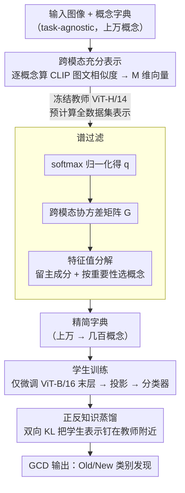

# SpectralGCD: Spectral Concept Selection and Cross-modal Representation Learning for Generalized Category Discovery

**会议**: ICLR 2026  
**arXiv**: [2602.17395](https://arxiv.org/abs/2602.17395)

**代码**: [GitHub](https://github.com/miccunifi/SpectralGCD)

**领域**: 类别发现/多模态学习  
**关键词**: 广义类别发现, CLIP, 跨模态表示, 谱过滤, 概念字典, 知识蒸馏

## 一句话总结

提出SpectralGCD，将图像表示为CLIP概念字典上的语义混合（跨模态相似度向量），通过谱过滤自动选择任务相关概念，配合正反知识蒸馏保持语义质量，在6个基准上以与单模态方法可比的计算代价达到多模态SOTA。

## 研究背景与动机

**广义类别发现(GCD)**：GCD旨在利用少量已知类的标注子集，从未标注数据中发现新类别。与新类发现(NCD)不同，GCD中未标注数据同时包含已知类(Old)和未知类(New)，更贴近现实场景。

**单模态方法的局限**：以SimGCD为代表的参数化分类器方法直接在视觉特征上训练，易过拟合到旧类的虚假视觉线索（如背景），导致Old/New类性能不平衡——旧类好但新类差。

**多模态方法的代价问题**：TextGCD和GET引入CLIP文本模态信息显著提升性能，但TextGCD需要LLM生成描述+分别训练图像/文本编码器，GET需训练反转网络——计算代价远高于单模态方法。

**独立模态处理的不足**：现有多模态GCD方法将视觉和文本模态独立输入到各自分类器，未充分利用CLIP天然的跨模态对齐能力。

**概率主题模型的启发**：类比LDA中「文档=主题的混合」，本文提出「图像=语义概念的混合」——用CLIP图文相似度直接作为统一的跨模态表示。

**实际部署需求**：现实中需随新数据到来周期性重跑发现流程，因此计算效率至关重要，多模态方法的高代价限制了其实用性。

## 方法详解

### 整体框架

SpectralGCD把每张图像表示成它在一部CLIP概念字典上的「语义混合」——即图文相似度向量，然后分两步走：先用一个冻结的强教师从庞大的字典里自动挑出任务相关的概念子集（谱过滤），再在这个精简表示上训练一个轻量分类器，并靠正反双向蒸馏防止表示在训练中语义漂移。两步都把教师的跨模态表示预计算好，因此整体计算量与纯视觉的单模态方法相当。

### 关键设计

**1. 跨模态充分表示：把图像翻译成概念坐标，让分类器拿到的就是语义本身**

GCD的痛点在于分类器直接吃原始视觉特征时，容易记住旧类的背景等虚假线索，新类因此泛化差。SpectralGCD换一种表示：对图像 $x_i$ 和概念字典 $\bar{\mathcal{C}} = \{c_j\}_{j=1}^M$，逐概念算CLIP图文余弦相似度并除以温度 $\tau$，得到一条 $M$ 维向量 $z_{\theta,\phi}(x_i; \bar{\mathcal{C}}) = \left[\frac{f_\theta(x_i)^\top g_\phi(c_j)}{\|f_\theta(x_i)\| \|g_\phi(c_j)\|} \cdot \frac{1}{\tau} \mid c_j \in \bar{\mathcal{C}}\right] \in \mathbb{R}^M$，每一维就是图像与某个概念的契合度。这条向量是对「充分表示」的近似：只要类别真正只依赖于语义概念，就有 $p(y|x) = p(y|z(x;\mathcal{C}))$，意味着抛开原始像素、仅凭概念坐标也能做最优预测。实际训练时再经一层线性投影 $u_i = W^\top z_{\theta,\phi}(x_i; \bar{\mathcal{C}})$ 压维，送入参数化分类器 $p_i = L_\psi(u_i)$。因为坐标轴是人类可读的语义概念，模型很难再钻背景纹理的空子，新类性能因此被显著拉起。

**2. 谱过滤：用协方差谱自动剔掉无关概念，把字典从上万压到几百**

字典动辄上万个概念，绝大多数与当前任务无关，全留下既慢又引入噪声。SpectralGCD让冻结教师（ViT-H/14）先把全数据集的跨模态表示算出来，对每条表示做softmax归一化（记为 $q_i$）后构造协方差矩阵 $G = \frac{1}{N-1} \sum_{i=1}^N (q_i - \mu)(q_i - \mu)^\top \in \mathbb{R}^{M \times M}$，再对它做特征值分解。分解结果用于两件事：一是噪声过滤，只保留累积解释方差达到 $\beta_e$（默认0.95）的前 $k^*$ 个主成分，把方差贡献微弱的方向当噪声丢掉；二是概念重要性筛选，按 $s = \sum_{i=1}^{k^*} \lambda_i v_i^2$ 给每个概念打分（$\lambda_i$、$v_i$ 为对应特征值与特征向量），保留累积重要性达到 $\beta_c$（默认0.99）的概念子集 $\hat{\mathcal{C}}$。之所以管用，是因为softmax会放大前景概念、压低背景噪声，叠加CLIP本身偏好物体语义，使协方差的主特征向量天然集中在任务相关的物体概念上——这与LSA里用词频加权挑出主题词同理，是有PCA/LSA数学解释的信息筛选而非黑箱。Stanford Cars上196类最终只选出200–450个概念，CIFAR-100的100类选出1000–4000个。

**3. 正反知识蒸馏：双向KL把学生表示钉在教师附近，防止联合训练时语义漂移**

微调会让学生的跨模态表示在联合优化中逐渐偏离原本干净的语义，谱过滤的成果被稀释。SpectralGCD用冻结教师的预计算表示做双向蒸馏：$\mathcal{L}_{\text{kd}} = \underbrace{-\frac{1}{|\mathcal{B}|}\sum_{i \in \mathcal{B}} \sigma(\hat{z}_i^*) \log \sigma(\hat{z}_i)}_{\text{前向}} + \underbrace{-\frac{1}{|\mathcal{B}|}\sum_{i \in \mathcal{B}} \sigma(\hat{z}_i) \log \sigma(\hat{z}_i^*)}_{\text{反向}}$，其中 $\hat{z}_i^*$ 是教师表示、$\hat{z}_i$ 是学生表示。前向项让学生去对齐教师分布，反向项则惩罚学生在教师认为不相关的概念上堆概率质量，两个方向夹住后师生对齐更紧。消融印证两者缺一不可：无蒸馏时表示一致性（Spearman ρ）只有0.487、All准确率77.4%，加上前向+反向后ρ升到0.665、准确率提到89.1%。由于教师表示一次算好可复用，蒸馏几乎不增训练开销。

### 损失函数 / 训练策略

总目标把三类损失相加 $\mathcal{L} = \mathcal{L}_{\text{cls}} + \mathcal{L}_{\text{c}} + \mathcal{L}_{\text{kd}}$：$\mathcal{L}_{\text{cls}}$ 是有监督与无监督分类损失，$\mathcal{L}_{\text{c}}$ 是有监督与无监督对比损失，$\mathcal{L}_{\text{kd}}$ 即上述双向蒸馏。训练侧只微调ViT-B/16的最后一个transformer block，文本编码器全程冻结、教师表示预计算，所以整体训练效率才能与单模态方法看齐。

## 实验结果

### 表1：与SOTA方法的全面对比（准确率%）

| 方法 | 类型 | CUB All | CUB New | Cars All | Cars New | Aircraft All | IN-100 All |
|------|------|---------|---------|----------|----------|-------------|-----------|
| SimGCD | 单模态 | 60.3 | 57.7 | 53.8 | 45.0 | 54.2 | 83.0 |
| SelEx | 单模态 | 73.6 | 72.8 | 58.5 | 50.3 | 57.1 | 83.1 |
| DebGCD | 单模态 | 66.3 | 63.5 | 65.3 | 57.4 | 61.7 | 85.9 |
| GET | 多模态 | 77.0 | 76.4 | 78.5 | 74.5 | 58.9 | 91.7 |
| TextGCD | 多模态 | 76.6 | 74.7 | 86.9 | 86.7 | 50.8 | 88.0 |
| **SpectralGCD** | **多模态** | **79.2** | **78.5** | **89.1** | **87.4** | **63.0** | **93.4** |

### 表2：蒸馏方式消融（Stanford Cars）

| 蒸馏损失 | Spearman ρ | All准确率 |
|----------|-----------|----------|
| FD + RD | 0.665±0.09 | **89.1** |
| 仅FD | 0.639±0.11 | 86.0 |
| 仅RD | 0.611±0.11 | 87.5 |
| 无蒸馏 | 0.487±0.15 | 77.4 |

### 表3：字典选择鲁棒性（Stanford Cars / CIFAR-100）

| 方法 | 字典 | Cars All | CIFAR100 All |
|------|------|----------|-------------|
| TextGCD* | OpenImagesV7 | 78.1 | 82.6 |
| TextGCD* | Tags | 86.2 | 84.3 |
| SpectralGCD | OpenImagesV7 | 85.8 | 84.9 |
| SpectralGCD | Tags | **89.1** | **86.1** |

## 关键发现

- **跨模态表示显著提升新类性能**：相比纯视觉特征，跨模态表示在New类上大幅提升，有效缓解对旧类虚假线索的过拟合。SpectralGCD在CUB上New类78.5%，大幅超越SimGCD的57.7%。

- **小学生超越大教师**：尽管学生模型(ViT-B/16)远小于教师(ViT-H/14)，在多个基准上SpectralGCD超越教师的零样本性能（如ImageNet-100上+6.6个点），说明方法贡献大于模型规模。

- **谱过滤对细粒度数据集特别关键**：在Stanford Cars上（196类，选出200-450个概念），谱过滤带来显著提升；在CIFAR-100上（100类，选出1000-4000概念）效果相对温和。

- **正反蒸馏缺一不可**：无蒸馏时All准确率仅77.4%，加入FD+RD后提升到89.1%。Spearman相关性从0.487升到0.665，说明蒸馏有效保持了师生表示的一致性。

- **训练效率媲美单模态**：在CUB上，SpectralGCD的训练时间与单模态SimGCD可比，远低于GET(3121秒准备)和TextGCD。

## 亮点与洞察

- **「图像=概念混合」的类比优美**：从概率主题模型到视觉概念表示的迁移自然合理，提供了理论动机。

- **统一跨模态表示vs独立模态**：不分别处理视觉/文本再融合，而是直接用图文相似度作为统一表示——简洁有效。

- **谱过滤的信息论基础**：协方差矩阵的特征值分解有PCA/LSA的解释——不是黑箱概念选择，而是有数学保证的信息筛选。

- **效率与性能兼得**：教师的表示预计算一次、文本编码器冻结、仅微调最后一个transformer block——实际部署友好。

## 局限性

- **对教师模型和字典的依赖**：SpectralGCD的性能受教师质量和概念字典覆盖范围影响。若教师缺乏领域知识或字典未覆盖关键概念，性能会下降。表4显示使用ViT-B/16作教师时CUB All仅72.7%，远低于用ViT-H/14的79.2%。

- **概念字典非图像特定**：当前使用数据集级别的全局概念字典，未针对每张图像做自适应——可能遗漏对特定图像重要但全局不显著的概念。

- **类别数需已知**：与大多数GCD方法一样，需要预设类别数K，在实际应用中可能难以确定。

- **谱过滤的阈值敏感性**：虽然默认 $\beta_e=0.95, \beta_c=0.99$ 在多数数据集上表现良好，但最优值可能因数据集而异。

## 相关工作对比

- **vs TextGCD**：TextGCD(Tags+Attributes)在Stanford Cars上All 86.9%，SpectralGCD仅用Tags达89.1%（+2.2）。TextGCD需要额外LLM生成Attributes描述且分别训练图像/文本分类器，SpectralGCD用统一跨模态表示更简洁高效。

- **vs GET**：GET通过反转网络将图像特征转换为文本token再提取文本特征，准备阶段需3121秒训练反转网络。SpectralGCD的谱过滤仅需194秒，且在ImageNet-100上超越GET 1.7个点(93.4 vs 91.7)。

- **vs SimGCD**：SimGCD是单模态参数化分类器的典范，训练效率高但受限于纯视觉表示。SpectralGCD在保持相近训练效率的同时，通过跨模态表示在New类上大幅提升（CUB: 78.5 vs 57.7）。

## 评分

- 新颖性: ⭐⭐⭐⭐ 跨模态概念混合表示+谱过滤的组合新颖，主题模型到视觉GCD的类比有创新性
- 实验充分度: ⭐⭐⭐⭐⭐ 6个基准×多baseline×效率分析×大量消融（蒸馏/字典/教师/学生/阈值/数据分割）
- 写作质量: ⭐⭐⭐⭐ 理论动机从充分表示切入清晰，方法描述结构化，图示直观
- 价值: ⭐⭐⭐⭐ 同时推进GCD性能和效率前沿，对多模态表示学习和概念选择有广泛启示

<!-- RELATED:START -->

## 相关论文

- [\[CVPR 2026\] Multi-Modal Representation Learning via Semi-Supervised Rate Reduction for Generalized Category Discovery](../../CVPR2026/multimodal_vlm/multi-modal_representation_learning_via_semi-supervised_rate_reduction_for_gener.md)
- [\[ICLR 2026\] Enhanced Continual Learning of Vision-Language Models with Model Fusion](enhanced_continual_learning_of_vision-language_models_with_model_fusion.md)
- [\[ICLR 2026\] Unified Vision-Language Modeling via Concept Space Alignment](unified_vision-language_modeling_via_concept_space_alignment.md)
- [\[CVPR 2026\] Learning What Matters: Prioritized Concept Learning via Relative Error-driven Sample Selection](../../CVPR2026/multimodal_vlm/learning_what_matters_prioritized_concept_learning_via_relative_error-driven_sam.md)
- [\[NeurIPS 2025\] On the Value of Cross-Modal Misalignment in Multimodal Representation Learning](../../NeurIPS2025/multimodal_vlm/on_the_value_of_cross-modal_misalignment_in_multimodal_representation_learning.md)

<!-- RELATED:END -->
