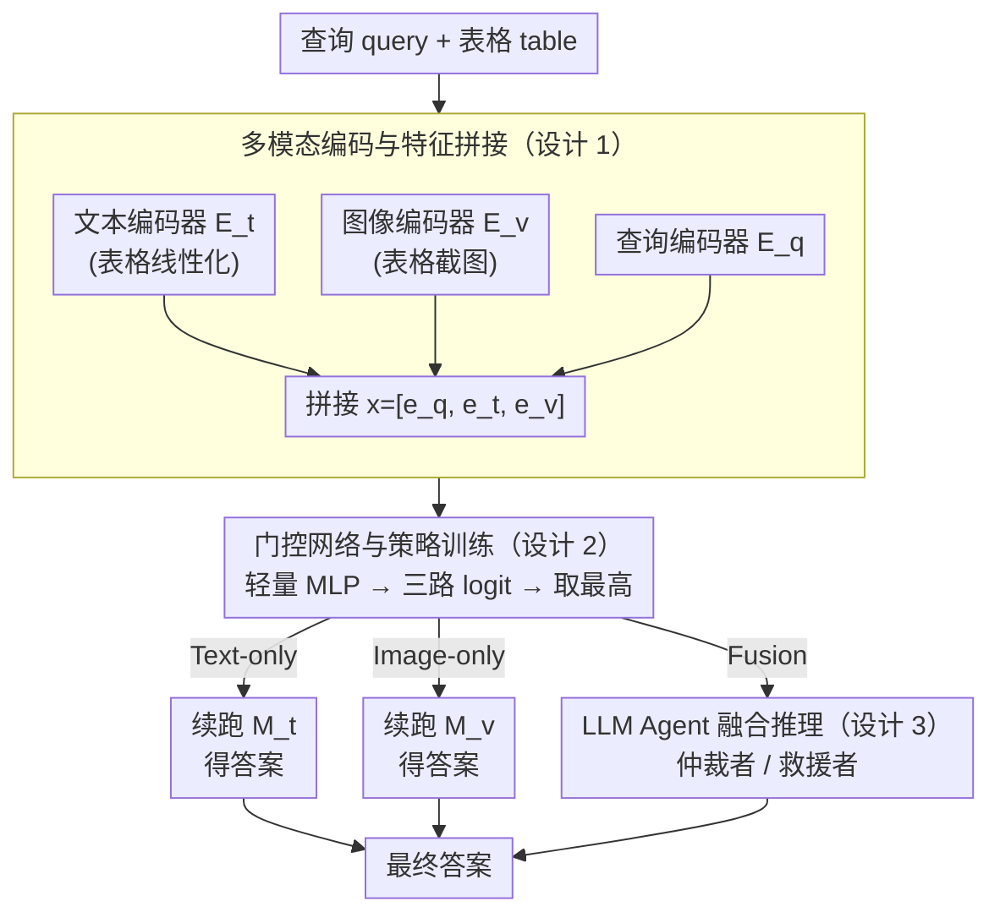

# TableDART: Dynamic Adaptive Multi-Modal Routing for Table Understanding

**会议**: ICLR 2026  
**arXiv**: [2509.14671](https://arxiv.org/abs/2509.14671)  
**代码**: [GitHub](https://github.com/xiaobo-xing/TableDART)  
**领域**: 多模态VLM  
**关键词**: Table Understanding, Dynamic Routing, Multi-modal Fusion, Gating Network, LLM Agent

## 一句话总结

提出 TableDART，通过仅 2.59M 参数的 MLP 门控网络为每个 query-table 对动态选择最优处理路径（Text-only / Image-only / Fusion），复用冻结的单模态专家模型并引入 LLM Agent 进行跨模态融合，在 7 个表格理解 benchmark 上平均超越最强 MLLM 基线 HIPPO 4.02%，同时延迟降低 24.5%。

## 研究背景与动机

**领域现状**：表格理解是连接结构化数据与自然语言的核心任务。现有方法分为三个范式：（1）Table-as-Text——将表格线性化为文本序列供 LLM 处理，有效但丢失空间结构信息且对序列化格式敏感；（2）Table-as-Image——截图后用 VLM 处理，保留结构但语义捕捉能力弱；（3）Table-as-Multimodality——融合文本和视觉两种视图，如 HIPPO 在 MLLM 内联合处理两种表征。

**现有痛点**：多模态方法虽前景好，但存在两个关键限制：（1）**静态融合导致冗余和冲突**——对所有 query-table 对强制使用双模态处理，但并非所有查询都需要多视图，文本线性化会引入行序敏感性而图像表示保持置换不变性，两者信号矛盾时反而误导模型；（2）**MLLM 微调代价过高**——即使用 LoRA 等参数高效策略，HIPPO 的可训练参数也达 25.87M，是 TableDART 的 10 倍。

**核心矛盾**：多模态融合的收益来自信息互补，但代价是引入冗余和潜在冲突。58.7% 的测试样本两个单模态路径都能正确回答（即"简单样本"），强制融合不仅浪费计算还可能引入噪声。

**切入角度**：既然不同 query-table 对的最优处理策略不同，就应该让系统自动学会"什么时候用文本、什么时候用图像、什么时候需要融合"。用一个极轻量的路由网络做实例级决策，完全复用已有的单模态专家。

**核心 idea**：用 2.59M 参数的 MLP 门控网络替代昂贵的 MLLM 微调，为每个 query-table 对动态选择 Text-only / Image-only / Fusion 路径。

## 方法详解

### 整体框架

TableDART 要解决的是"一刀切融合"的浪费：现有多模态方法对每个 query-table 对都强制走文本+图像双模态，但大量查询其实单模态就能答对。它的思路是在两个冻结的单模态专家之上，挂一个极轻的"调度员"——为每条查询实时判断该走哪条路。

整个系统由五个组件协作：Table-as-Text 模型 $\mathcal{M}_t$（TableGPT2-7B，冻结）、Table-as-Image 模型 $\mathcal{M}_v$（Ovis2-8B，冻结）、一个 query 文本嵌入模型、一个轻量 MLP 门控网络（全系统唯一可训练，仅 2.59M 参数），以及一个免训练的 LLM Agent（Gemini 2.0 Flash，只在 Fusion 路径上启用）。给定一条 query 和一张表格，三路编码器并行抽取文本表征 $\mathbf{e}_t$、图像表征 $\mathbf{e}_v$ 和查询嵌入 $\mathbf{e}_q$，拼成 $\mathbf{x} = [\mathbf{e}_q, \mathbf{e}_t, \mathbf{e}_v]$ 喂给门控网络；门控输出三路 logit，取最高分的那条路径（Text-only / Image-only / Fusion）执行最终推理。换句话说，路由这一步只看特征、不做完整推理，所以几乎不增加开销。

### 关键设计

**1. 多模态编码与特征拼接：让门控网络在做决策前就"看全"三种信号**

门控网络要选对路径，前提是它能同时感知到查询本身、表格的文本视图和图像视图。为此表格被同时序列化为文本（交给 $\mathcal{M}_t$ 的编码器 $\mathcal{E}_t$）和渲染成截图（交给 $\mathcal{M}_v$ 的编码器 $\mathcal{E}_v$），query 则由独立的文本嵌入模型 $\mathcal{E}_q$ 编码；三路特征经各自的模态特定池化后拼接为 $\mathbf{x} = [\mathbf{e}_q, \mathbf{e}_t, \mathbf{e}_v]$。关键在于这里只取编码器的前几层、而非跑完整专家推理——$\mathcal{E}_t$ 和 $\mathcal{E}_v$ 分别只激活对应专家 7.15% 和 7.63% 的参数，因此"看全三模态"这件事代价极低，门控拿到的是特征级表征而不是昂贵的完整答案。

**2. 门控网络与策略训练：用资源感知的软标签学会"够用就好"**

门控网络 $\mathcal{G}$ 是个轻量 MLP，对拼接特征输出三路 logit $\mathbf{z} = \mathcal{G}(\mathbf{x})$。训练它的难点在于：如果只追求答对，模型会发现"凡事都走 Fusion 最保险"，于是退化成又贵又静态的全融合。TableDART 的解法是把目标拆成任务项加资源项：

$$\mathcal{L}_{\text{total}} = \mathcal{L}_{\text{task}} + \lambda \mathcal{L}_{\text{resource}}$$

任务项不用硬分类，而是先对每条样本预计算三条路径各自是否答对的二值向量 $\mathbf{s} \in \{0,1\}^3$，经温控 softmax 转成软目标，再用 KL 散度让预测分布去逼近它——这样允许"多条路径同时正确"，比逼模型从中硬选一条更贴合实际。资源项 $\mathcal{L}_{\text{resource}} = \text{softmax}(\mathbf{z}/\tau_g)^T \mathbf{c}$ 则按各路径经验测得的推理成本向量 $\mathbf{c}$ 给昂贵路径加罚，从而把那些单模态就能答对的简单样本主动推向更省的路径。两项的权衡由 $\lambda = 0.15$ 控制，这个取值在准确率和延迟之间达到了最佳平衡。

**3. LLM Agent 融合推理：把"怎么融合"外包给免训练的强推理 Agent**

只有当门控判定一条 query 确实需要双模态时才会触发 Fusion，此时系统先并行跑完 $\mathcal{M}_t$ 和 $\mathcal{M}_v$，拿到各自的结果 $r_t, r_v$ 及辅助输出 $a_t, a_v$，连同原始表格一起交给 Fusion Agent（Gemini 2.0 Flash）。这里没有再去训练一个 MLLM 来学融合——那正是 HIPPO 那类方法昂贵的根源——而是让一个现成的强推理模型按两种角色后处理：当两个专家答案冲突时它充当**仲裁者**（Arbitrator），依据各自置信度挑出更可靠的一方；当两个专家都不确定时它充当**救援者**（Rescuer），把双方的部分证据拼起来推出新答案。实验里 Fusion 路径正是靠救援者的角色，在"两个单模态都失败"的困难样本中额外救回了一批。

### 损失函数 / 训练策略

训练集是从 5 个表格理解 benchmark 采样的 10K 混合样本。整个训练只更新门控网络，所有大模型全程冻结。对每条样本预先跑出三路正确性 $\mathbf{s} \in \{0,1\}^3$ 作为监督信号，用温度 $\tau$ 调节软标签分布的平滑度；推理阶段则确定性地选取最高 logit 的路径。

## 实验关键数据

### 主实验

| 方法 | WTQ | TABMWP | TAT-QA | HiTab | FeTaQA | TabFact | InfoTabs | 平均Acc |
|------|-----|--------|--------|-------|--------|---------|---------|--------|
| TableGPT2-7B (Text) | 61.42 | 83.87 | 50.39 | 70.27 | 28.97 | 77.80 | 71.07 | 69.14 |
| Ovis2-8B (Image) | 58.76 | 87.00 | 47.67 | 68.59 | 34.70 | 80.80 | 74.11 | 69.49 |
| HIPPO-8B (Multimodal) | 55.77 | 87.50 | 60.75 | 63.00 | 33.18 | 82.27 | 75.74 | 70.84 |
| Gemini 2.0 Flash | 63.56 | 46.29 | 35.62 | 60.41 | 10.57 | 81.33 | 54.31 | 56.92 |
| **TableDART** | **70.58** | **84.54** | **62.05** | **74.37** | **36.11** | **81.37** | **76.22** | **74.86** |

TableDART 平均准确率 74.86%，超越最强多模态基线 HIPPO-8B **+4.02%**。在未见数据集上泛化性更突出：TableDART 74.37% vs HIPPO 63.00%（**+18.05%**）。

### 消融实验

| 路由策略 | WTQ | TABMWP | TAT-QA | HiTab | TabFact | InfoTabs | 说明 |
|---------|-----|--------|--------|-------|---------|---------|------|
| 随机路由 | 65.40 | 75.50 | 58.94 | 70.49 | 79.50 | 69.57 | 无效路由 |
| 非自适应融合 | 70.97 | 81.47 | 63.34 | 73.35 | 81.56 | 76.83 | 全部走Fusion |
| **动态路由** | **70.58** | **84.54** | **62.05** | **74.37** | **81.37** | **76.22** | 本文方法 |

动态路由在 TABMWP（+3.07）和 HiTab（+1.02）上超越非自适应融合，证明强制融合在简单数据集上反而引入噪声。推理效率方面，动态路由平均延迟 2.20s vs 非自适应融合 2.92s，**降低 24.5%**。

### 关键发现

- **58.7% 样本属于"简单样本"**：两个单模态路径都能正确回答，强制融合完全不必要
- **24.0% 样本两个模态互补**：17.2% 仅图像正确、6.8% 仅文本正确，验证了保留独立单模态路径的必要性
- **Fusion 路径的"救援"成功率为 14%**：在 17.3% 两个单模态都失败的困难样本中，Fusion Agent 额外解决了 2.4%
- **路由策略可解释**：TABMWP 等简单数据集 97.2% 路由到 Image-only，TAT-QA 中 88.7% 困难样本路由到 Fusion

## 亮点与洞察

- **极致的训练效率**：仅训练 2.59M 参数就超越了训练 25.87M 参数的 HIPPO，核心洞察是"路由决策比模态融合更重要"。这种"元决策 + 冻结专家"的范式可迁移到任何多专家系统
- **路由策略的泛化性**：在 seen/unseen 数据集上性能几乎一致（74.95% vs 74.37%），而 HIPPO 从 72.41% 跌到 63.00%，说明门控网络学到的是通用的路由策略而非过拟合
- **训练信号的精妙设计**：用"三路独立预计算正确性"作为监督信号，允许多路径同时正确，配合 KL 散度软标签训练，比硬标签分类更合理

## 局限与展望

- **依赖外部 Gemini 作为 Fusion Agent**：Fusion 路径需要调用闭源 API，增加成本和隐私担忧，可探索用开源 LLM 替代
- **训练数据需预计算三路结果**：为每条训练样本运行三次推理的成本不低，限制了训练集扩展
- **门控网络仅考虑特征级信息**：当前路由决策基于编码器浅层特征，未利用 query 的语义复杂度等高层信息
- **仅支持三条固定路径**：未探索更灵活的路由策略，如部分融合或级联式推理

## 相关工作与启发

- **vs HIPPO**：HIPPO 在 MLLM 内部静态融合文本+图像表示，TableDART 在外部动态路由，不仅性能更好还更训练高效（2.59M vs 25.87M 参数）
- **vs Mixture-of-Experts**：TableDART 的思想类似 MoE 但在模型级别而非层级别路由，专家是完整的冻结模型而非可训练的子网络
- **vs Table-LLaVA/TabPedia**：这些方法在单一视觉模态上训练，无法利用文本模态的互补优势

## 评分

- 新颖性: ⭐⭐⭐⭐ 实例级动态路由 + 免训练 LLM Agent 融合的组合设计新颖，但动态路由的基本思想不新
- 实验充分度: ⭐⭐⭐⭐⭐ 7 个 benchmark、丰富的消融、路由策略分析、效率分析、泛化性验证，非常全面
- 写作质量: ⭐⭐⭐⭐ 结构清晰，动机论证有力，图表丰富
- 价值: ⭐⭐⭐⭐ 提供了一种训练高效的多模态融合范式，对表格理解和更广泛的多专家系统都有参考价值

<!-- RELATED:START -->

## 相关论文

- [\[ICLR 2026\] Multi-modal Data Spectrum: Multi-modal Datasets are Multi-dimensional](multi-modal_data_spectrum_multi-modal_datasets_are_multi-dimensional.md)
- [\[CVPR 2026\] Multi-modal Test-time Adaptation via Adaptive Probabilistic Gaussian Calibration](../../CVPR2026/multimodal_vlm/multi-modal_test-time_adaptation_via_adaptive_probabilistic_gaussian_calibration.md)
- [\[ICLR 2026\] Enhancing Multi-Image Understanding through Delimiter Token Scaling](enhancing_multi-image_understanding_through_delimiter_token_scaling.md)
- [\[NeurIPS 2025\] DanmakuTPPBench: A Multi-modal Benchmark for Temporal Point Process Modeling and Understanding](../../NeurIPS2025/multimodal_vlm/danmakutppbench_a_multimodal_benchmark_for_temporal_point_pr.md)
- [\[AAAI 2026\] TabFlash: Efficient Table Understanding with Progressive Question Conditioning and Token Focusing](../../AAAI2026/multimodal_vlm/tabflash_efficient_table_understanding_with_progressive_question_conditioning_an.md)

<!-- RELATED:END -->
