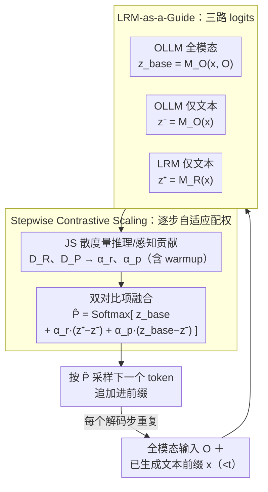

# ThinkOmni: Lifting Textual Reasoning to Omni-modal Scenarios via Guidance Decoding

**会议**: ICLR 2026  
**arXiv**: [2602.23306](https://arxiv.org/abs/2602.23306)  
**代码**: [https://1ranguan.github.io/thinkomni](https://1ranguan.github.io/thinkomni)  
**领域**: 多模态VLM  
**关键词**: 全模态推理, 引导解码, LRM, 无训练, 对比缩放

## 一句话总结
提出 ThinkOmni 无训练框架，利用纯文本大推理模型(LRM)在解码时引导全模态 LLM(OLLM)，通过 Stepwise Contrastive Scaling 自适应平衡感知与推理信号，MathVista 达 70.2%、MMAU 达 75.5%，匹配或超越 RFT 方法。

## 研究背景与动机

**领域现状**: 大推理模型(LRM)如 DeepSeek-R1、o1 在文本推理任务上表现卓越，但仅处理文本输入。全模态 LLM(OLLM)如 Qwen2.5-Omni 虽能处理文本+音频+图像+视频，但在复杂推理任务上仍有短板。

**现有痛点**: 提升 OLLM 推理能力的现有路径面临多重挑战：
   - **数据稀缺**: SFT 需要大量高质量多模态推理样本，获取成本高
   - **训练昂贵**: RFT（强化微调）需要大量 GPU 资源（7B 模型需 8×40G，32B 需 16×80G）
   - **任务特化**: 现有增强方案（如 Omni-R1、HumanOmniV2）局限于特定下游任务，缺乏泛化性
   - **模态局限**: 多数工作仅关注单一模态（图像或音频），未真正实现跨模态推理

**核心矛盾**: LRM 有强推理能力但无法处理非文本输入；OLLM 能处理多模态输入但推理能力不足。两者优势互补，但如何在推理时无训练地融合是关键难题。

**本文目标** 不依赖额外训练数据或微调，将 LRM 的文本推理能力"提升"到全模态场景。

**切入角度**: 从推理时引导解码(guidance decoding)切入，将 LRM 作为 OLLM 的解码时"顾问"，在 logits 层面融合两者信号。

**核心 idea**: 用 LRM 产生的纯文本推理信号在 logits 层引导 OLLM 的全模态解码，并通过逐步对比缩放自适应调节感知-推理平衡。

## 方法详解

### 整体框架
ThinkOmni 把纯文本大推理模型(LRM) $M_R$ 当作全模态模型(OLLM) $M_O$ 的解码时"顾问"：每生成一个 token，都在 logits 层把 OLLM 的全模态感知信号和 LRM 的文本推理信号对比融合成一个增强分布，按它采样下一个 token、追加进前缀，逐步生成。整个过程不动任何参数，只靠两个组件协作——**LRM-as-a-Guide** 把推理模型的文本推理增量"嫁接"进全模态解码，**Stepwise Contrastive Scaling** 在每一步自动判断当前该多听感知还是多听推理并分配权重，从而无须手动调参就能适配数学、音频、通用全模态等不同任务。

### 关键设计

**1. LRM-as-a-Guide：让看不见图像的推理模型也能贡献推理信号**

OLLM 能看图听音但推理弱，LRM 推理强却只吃文本，难点在于如何让一个感知不到多模态输入的模型去引导多模态解码。ThinkOmni 在每个解码步取三组 logits：OLLM 带全模态输入的基础项 $z^{base}=M_O(x_{<t},O)$、OLLM 去掉多模态输入的纯文本负项 $z^{-}=M_O(x_{<t})$、以及 LRM 仅看文本前缀的正项 $z^{+}=M_R(x_{<t})$，先按单一对比项融合 $\hat{P}=\mathrm{Softmax}[z^{base}+\alpha\cdot(z^{+}-z^{-})]$。关键在对比项 $z^{+}-z^{-}$——它像差分放大器，把 LRM 相对 OLLM 纯文本模式的推理偏好增量放大出来，同时抵消两个模型共有的语言噪声。LRM 虽看不到原始图像音频，但随着解码推进，已生成的文本前缀里已经隐含了 OLLM 写下的多模态信息，于是 LRM 仍能基于这些线索给出有效的推理引导。

**2. Stepwise Contrastive Scaling：让推理/感知权重随任务和解码步自适应**

固定的引导权重 $\alpha$ 适配不了所有场景——数学题需要更强推理、音频感知题需要更强感知；$\alpha$ 偏大时 $z^{+}/z^{-}$ 缺乏全模态内容会诱发幻觉，偏小又削弱引导，实验也表明各任务最优 $\alpha$ 差异很大。ThinkOmni 因此在每个解码步先用 Jensen-Shannon 散度在线度量推理与感知的相对贡献：推理项 $D_R=\mathrm{JS}(P_R\,\|\,P)$、感知项 $D_P=\mathrm{JS}(P_O\,\|\,P)$，其中 $P_O,P_R,P$ 分别是 $M_O(x_{<t},O)$、$M_R(x_{<t})$、$M_O(x_{<t})$ 的 softmax 分布，谁的分布偏离更大就说明谁此刻更该被信任。基于这把"标尺"，方法把原来的单一对比项展开成两路独立的对比信号：

$$\hat{P}=\mathrm{Softmax}\big[M_O(x_{<t},O)+\alpha^{r}_{t}\cdot(M_R(x_{<t})-M_O(x_{<t}))+\alpha^{p}_{t}\cdot(M_O(x_{<t},O)-M_O(x_{<t}))\big]$$

第一个对比项注入 LRM 的推理增量、由推理权重 $\alpha^{r}_{t}$ 控制；第二个对比项是一种较激进的视觉对比解码——直接用"有多模态输入减去无多模态输入"的差值来强化感知、由感知权重 $\alpha^{p}_{t}$ 控制。两个权重按 $D_R,D_P$ 的相对大小分配并归一化到 $\alpha^{r}_{t}+\alpha^{p}_{t}=1$，于是推理增强与感知增强能同时施加而互不挤占。此外在初始解码阶段对 $\alpha^{r}_{t}$ 做 warmup 压制，避免前缀尚短、信息不足时 LRM 过早主导导致跑偏。

### 损失函数 / 训练策略
完全无训练，不需任何额外数据或微调。唯一约束是 OLLM 与 LRM 共享词表（如同属 Qwen 家族），以便 logits 在同一词表空间对齐。代价是每个解码步需 3 次前向传播，推理开销约为原始模型的 2.88×。

## 实验关键数据

### 主实验

| 模型 | MathVista | MathVision | MathVerse | MMAU | DailyOmni | OmniBench |
|------|-----------|------------|-----------|------|-----------|-----------|
| GPT-4o | 63.8 | 30.4 | 50.8 | 62.5 | 56.5 | - |
| Gemini-2.0-Flash | 73.1 | 41.3 | 59.3 | 70.5 | 67.8 | - |
| Qwen2.5-Omni-7B | 66.8 | 25.0 | 40.2 | 71.5 | 57.9 | 42.1 |
| +DeepSeek Guide | 68.8(+2.0) | 28.2(+3.2) | 42.0(+1.8) | 73.8(+2.3) | 59.8(+1.9) | 43.2(+1.1) |
| **+Qwen3 Guide** | **70.2(+3.4)** | **32.9(+7.9)** | **45.1(+4.9)** | **75.5(+4.0)** | **59.5(+1.6)** | **43.6(+1.5)** |
| Omni-R1 (RFT) | 64.7 | 25.4 | 39.8 | 70.5 | 59.6 | 43.0 |
| +Qwen3 Guide | **71.3(+6.6)** | **31.5(+6.1)** | **45.2(+5.4)** | **75.4(+4.9)** | 59.8(+0.2) | 43.4(+0.4) |

### 消融实验 - 与其他无训练方法对比（基于 Qwen2.5-Omni-7B）

| 方法 | MathVista | MMAU | OmniBench |
|------|-----------|------|-----------|
| Base Model | 66.8 | 71.5 | 42.1 |
| Average Logits Fusion | 55.0(-11.8) | 55.7(-15.8) | 36.1(-6.0) |
| Caption-then-Answer | 61.0(-5.8) | 59.7(-11.8) | 32.3(-9.8) |
| VCD | 66.5(-0.3) | 72.2(+0.7) | 43.1(+1.0) |
| **ThinkOmni** | **68.8(+2.0)** | **73.8(+2.3)** | **43.2(+1.1)** |

### 关键发现
- 在已经过 RFT 的 Omni-R1 上再应用 ThinkOmni 仍有显著提升（MathVista +6.6），说明方法与 RFT 互补
- 更强的 LRM（Qwen3 > DeepSeek-R1-Distill）带来更大提升，验证了"引导质量决定提升幅度"
- 数学/科学任务提升最大（MathVision +7.9），音频/通用任务提升较小，符合预期（LRM 训练偏向数学科学）
- 简单的 logits 平均融合会严重损害性能（-11.8），说明对比融合的必要性
- 效率分析：7B+7B 配置下 generate 延迟 2.88×，prefill 延迟 1.38×（因 LRM 仅处理文本，前缀较轻）

## 亮点与洞察
- **无训练框架超越有训练方法**: 基于 Qwen2.5-Omni-7B + Qwen3，在多个基准上匹配或超越需要 RFT 的 Omni-R1 和 HumanOmniV2
- **Stepwise Contrastive Scaling 优雅实用**: 通过 JS 散度自动估计推理/感知需求，避免了手动调参的痛苦
- **即插即用 + 可扩展**: 随着更强 LRM 出现（LRM 发展通常快于多模态变体），ThinkOmni 可自动受益
- **质性分析丰富**: token 级别的 LRM 贡献可视化显示逻辑连接词和关键术语主要由 LRM 引导，内容词由 OLLM 贡献

## 局限与展望
- 要求 OLLM 和 LRM 共享词表，限制了模型组合的灵活性（如无法用 LLaMA 系 LRM 引导 Qwen 系 OLLM）
- 每步需 3 次前向传播，推理开销约 2.88× 原始模型，对部署延迟敏感的场景有挑战
- 在音频和通用全模态任务上提升有限（DailyOmni 仅 +1.6），说明对感知密集型任务帮助有限
- 当多模态输入中存在矛盾信息时（如标签与视觉内容矛盾），LRM 可能错误引导推理

## 相关工作与启发
- 与 ProxyTuning（同属引导解码范式）的关键区别：ThinkOmni 实现跨模态引导，LRM 无需感知多模态输入
- 与 VCD（视觉对比解码）互补：VCD 增强感知、ThinkOmni 增强推理
- 为"推理能力迁移"提供新范式：不微调模型，而是在推理时通过 logits 融合实现能力嫁接

## 评分
- 新颖性: ⭐⭐⭐⭐ 跨模态引导解码的思路新颖，Stepwise Contrastive Scaling 设计优雅
- 实验充分度: ⭐⭐⭐⭐⭐ 6 个基准、3 个 OLLM、多种 LRM、完整消融和效率分析
- 写作质量: ⭐⭐⭐⭐ 结构清晰，理论分析透彻，可视化案例丰富
- 价值: ⭐⭐⭐⭐⭐ 无训练即超越 RFT 方法，实用性极强，范式创新对社区有重要启发

<!-- RELATED:START -->

## 相关论文

- [\[ACL 2026\] OMHBench: Benchmarking Balanced and Grounded Omni-Modal Multi-Hop Reasoning](../../ACL2026/multimodal_vlm/omhbench_benchmarking_balanced_and_grounded_omni-modal_multi-hop_reasoning.md)
- [\[ICLR 2026\] Self-Aug: Query and Entropy Adaptive Decoding for Large Vision-Language Models](self-aug_query_and_entropy_adaptive_decoding_for_large_vision-language_models.md)
- [\[AAAI 2026\] Leveraging Textual Compositional Reasoning for Robust Change Captioning](../../AAAI2026/multimodal_vlm/leveraging_textual_compositional_reasoning_for_robust_change_captioning.md)
- [\[ICLR 2026\] Reasoning-Driven Multimodal LLM for Domain Generalization](reasoning-driven_multimodal_llm_for_domain_generalization.md)
- [\[ICLR 2026\] Multi-modal Data Spectrum: Multi-modal Datasets are Multi-dimensional](multi-modal_data_spectrum_multi-modal_datasets_are_multi-dimensional.md)

<!-- RELATED:END -->
