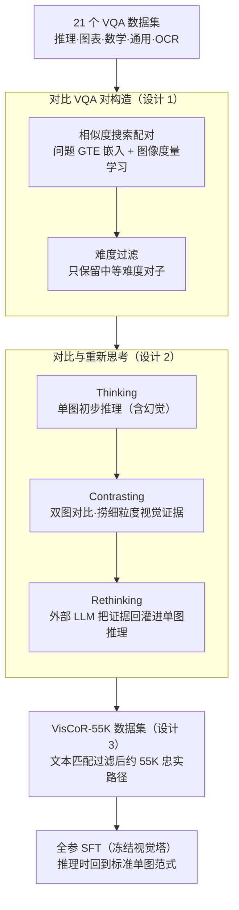

# Through the Lens of Contrast: Self-Improving Visual Reasoning in VLMs

**会议**: ICLR 2026 Oral  
**arXiv**: [2603.02556](https://arxiv.org/abs/2603.02556)  
**代码**: [https://github.com/zhiyupan42/VC-STaR](https://github.com/zhiyupan42/VC-STaR)  
**领域**: 多模态VLM / 视觉推理  
**关键词**: visual reasoning, self-improving, visual contrast, hallucination mitigation, contrastive VQA pairs

## 一句话总结
提出 VC-STaR（Visual Contrastive Self-Taught Reasoner），基于"VLM 在对比两张相似图像时看得更准"的观察，设计了一套对比式自改进框架：通过构造对比 VQA 对让模型在对比中生成更忠实的视觉分析，再由 LLM 将对比分析融入推理路径，产出高质量视觉推理数据集 VisCoR-55K，微调后在 MMVP 上提升 5.7%、Hallusion 上提升 3.2%。

## 研究背景与动机

**领域现状**：大型语言模型的延伸——视觉语言模型（VLM）已展现出强大的多模态推理能力。在纯文本领域，自改进方法（如 STaR、Self-Refine）通过让模型改进自身推理路径来获取高质量训练数据，已被证明是一种有效且可扩展的推理增强范式。

**现有痛点**：将文本领域的自改进方法直接迁移到 VLM 面临一个根本挑战——视觉幻觉。VLM 生成的推理路径中经常包含视觉幻觉（描述图中不存在的内容或错误解读视觉信息），而现有的文本为中心的自改进框架仅关注文本连贯性和最终答案的正确性，无法验证或修正推理过程中的视觉幻觉。更糟糕的是，这些方法可能陷入"思辨性推理"——让文本先验凌驾于真实视觉证据之上。

**核心矛盾**：自改进需要高质量的推理路径作为训练数据，但 VLM 自身生成的推理路径被视觉幻觉污染，形成了"垃圾进垃圾出"的恶性循环。核心问题在于：如何修正 VLM 推理路径中的视觉幻觉，以实现高质量的视觉推理数据生成？

**本文目标** (1) 设计一种可靠的视觉幻觉修正机制，使 VLM 自改进成为可能；(2) 构建一个大规模、高质量的视觉推理数据集；(3) 通过微调显著提升 VLM 的视觉推理能力。

**切入角度**：作者发现了一个有趣的现象——*VLM 在对比时看得更准*。当呈现一对对比 VQA 样本（两张视觉相似但答案不同的图像 + 语义相近的问题）时，VLM 能更精确地捕捉细粒度的视觉线索，从而修正原本的幻觉。统计分析表明，对比设置不仅能修正更多错误，还不会引入新的错误。

**核心 idea**：利用 VLM 固有的对比能力来修正自身推理路径中的视觉幻觉，实现视觉推理的自我引导式提升。

## 方法详解

### 整体框架
VC-STaR 的目标是造出一批"没有视觉幻觉"的推理路径来微调 VLM，难点在于 VLM 自己生成的推理本身就带幻觉，没法用来当训练数据。它的破局点是那个关键观察——VLM 单看一张图会看错，但同时摆出两张相似图让它对比，反而看得准。于是整条流水线围绕"对比"展开：先为每个 VQA 样本配一个视觉相似、问题语义相近的对比样本（对比 VQA 对构造），再让模型走"先单图推理 → 再双图对比 → 最后用对比结论改写单图推理"三步，把对比中捞到的细粒度视觉证据回灌进单图推理路径。所有改写后的路径汇成 VisCoR-55K 数据集做监督微调。注意对比只发生在数据构造阶段，**推理时回到标准的单图 VLM 范式，不需要任何对比样本**。

### 关键设计

**1. 对比 VQA 对构造：给每个样本配一个"逼模型睁眼"的对照组**

直接让 VLM 自我改进会卡在幻觉上，而幻觉恰恰在有对照时最容易暴露——所以第一步要为每个样本挑出合适的对比样本。作者从覆盖推理、图表、数学、通用、OCR 五大类的 21 个 VQA 数据集里收集样本保证多样性，然后用 GTE 文本嵌入算问题相似度、用一个基于 ID 的视觉度量学习模型算图像相似度，当两者的 cosine 距离同时满足 $\gamma(e_i^v, e_j^v) < \phi_v$ 且 $\gamma(e_i^q, e_j^q) < \phi_q$ 时，把样本 $j$ 选作样本 $i$ 的对比样本。这套筛选是为了保证对比对同时满足三个属性：问题语义相近（给模型一个语义锚点）、图像视觉相似但不平凡（逼它做细粒度辨别而非一眼看出）、问题需要推理（而不是简单事实问答）。

挑出对子后还要按难度过滤。把样本分成简单（VLM 直接答对）、中等（初始答错但在对比+提示下能纠正）、困难（连对比也救不回来）三档，**只保留中等难度的样本**。两头都被砍掉是有讲究的：简单样本不需要推理，留着反而教会模型"过度思考"；困难样本对比也修不对，生成的路径质量无法保证。只有中等难度这一档既能产生有价值的推理信号、又能被对比机制可靠地纠正。

**2. 对比与重新思考：把双图对比的视觉证据回灌进单图推理**

有了中等难度对比对，这一步负责把一条带幻觉的推理路径改写成忠实版本，分三步走。**Thinking**：给定目标样本 $(v_i, q_i, a_i)$ 并把正确答案作为提示，让 VLM 先生成一条初步推理 $r_i = f(v_i, q_i, a_i \mid \theta, \delta^t)$——此时路径里可能已混入幻觉。**Contrasting**：让 VLM 同时看目标样本和对比样本 $(\hat{v_i}, \hat{q_i}, \hat{a_i})$，输出对比分析 $c_i$；当两样本答案相同时它总结共同模式，答案不同时它分析细粒度差异，这正是模型"看得更准"的环节。**Rethinking**：交给一个外部 LLM $\psi$（Qwen2.5-72B），用对比分析 $c_i$ 去修正初步推理 $r_i$，得到更忠实的 $\tilde{r_i} = f(r_i, c_i \mid \psi, \delta^r)$，最后再用文本匹配后处理把答案仍不对的路径过滤掉。

举个具体的转法：目标图里有只猫坐在键盘上，VLM 在 Thinking 时可能脑补"猫在打字"这种文本先验的幻觉；Contrasting 阶段配上一张"狗趴在键盘旁"的相似图后，模型被迫去辨别两图差异，注意到目标图里猫只是趴着、爪子并未按键；Rethinking 就用这条对比观察把"在打字"改写成"坐在键盘上"。之所以要由外部 LLM 来做最后一步，是因为对比阶段的细粒度视觉证据是从双图里捞出来的，需要 Rethinking 把它转译回一条**只描述单图**的推理路径——这样微调后的模型在推理时即便只有一张图，也能继承这份精准。

**3. VisCoR-55K 数据集构建：把改写后的路径汇成可训练的语料**

对所有中等难度对比对跑完上述三步、再经文本匹配筛选，最终得到约 55K 条高质量视觉推理样本，覆盖通用 VQA、推理、数学、图表/图形、OCR 五大领域——多领域是为了泛化，质量筛选是为了训练信号可靠。数据集用 LLaMA-factory 框架做全参数 SFT，跑 3 个 epoch、学习率 $1e-5$、batch size 256，并冻结视觉塔参数以最大化语言侧对推理知识的吸收。

### 损失函数 / 训练策略
采用标准的监督微调（SFT）损失，在 VisCoR-55K 上训练 3 个 epoch，学习率 $1e-5$、batch size 256、冻结视觉塔。推理时不走对比流程，遵循标准 VLM 单图推理范式。

## 实验关键数据

### 主实验

基础模型为 Qwen2.5VL-7B，与自改进基线和现成视觉推理数据集训练的模型对比：

| 方法 | MMVP | Hallusion | MathVista | MathVision | MMStar | MME-RW | Avg. |
|------|------|-----------|-----------|------------|--------|--------|------|
| Base Model | 70.0 | 53.1 | 68.4 | 24.0 | 61.8 | 55.9 | 55.5 |
| STaR (自改进) | 73.0(+3.0) | 55.9(+2.8) | 66.9(-1.5) | 19.8(-4.2) | 58.9(-2.9) | 58.1(+2.2) | 55.4 |
| Feedback (自改进) | 75.0(+5.0) | 53.4(+0.3) | 68.8(+0.4) | 22.1(-1.9) | 63.2(+1.4) | 56.0(+0.1) | 56.4 |
| LLaVA-CoT (数据集) | 71.7(+1.7) | 50.3(-2.8) | 68.4(+0.0) | 24.4(+0.4) | 63.1(+1.3) | 59.3(+3.4) | 56.2 |
| R1-Onevision (数据集) | 68.0(-2.0) | 55.8(+2.7) | 68.2(-0.2) | 25.4(+1.4) | 53.2(-8.6) | 46.3(-9.6) | 52.8 |
| LPT (数据集) | 74.0(+4.0) | 53.4(+0.3) | 69.2(+0.8) | 24.2(+0.2) | 64.3(+2.5) | 56.1(+0.2) | 56.9 |
| **VC-STaR (Ours)** | **75.7(+5.7)** | **56.3(+3.2)** | **69.7(+1.3)** | **25.3(+1.3)** | 62.4(+0.6) | **59.3(+3.4)** | **58.1** |

### 消融实验

| 实验配置 | 关键指标 | 说明 |
|---------|---------|------|
| 仅正样本对（答案相同） | GQA Total: 50.6(+5.2) | 正对比有效但不充分 |
| 仅负样本对（答案不同） | GQA Total: 53.7(+8.3) | 负对比更有效 |
| 正+负样本对 | GQA Total: **54.7(+9.3)** | 两者互补，组合最优 |
| +20K 简单样本 | Hallusion: 52.2(-4.1) | 简单样本有害（过度思考） |
| +40K 简单样本 | Hallusion: 55.7(-0.6), MMStar: 59.5(-2.9) | 更多简单样本掉点更多 |
| Qwen2.5VL-33B + VC-STaR | Hallusion: 53.2(+6.3), MathVision: 21.9(+3.5) | 大模型同样受益 |
| InternVL2.5-8B + VC-STaR | Hallusion: 55.4(+7.2), MathVision: 23.4(+2.1) | 跨模型泛化 |

### 关键发现
- **VC-STaR 是唯一在所有基准上均正向提升的方法**：其他自改进方法（STaR、Feedback）在提升幻觉基准的同时会损害数学能力，VC-STaR 则在幻觉、数学、通用三类基准上均有提升，平均提升 2.6%
- **纯文本推理路径无效**：Virgo 使用纯文本推理路径微调反而导致严重退化（MME-RW -26.5%），强力证明视觉模态在视觉推理中不可或缺
- **负对比样本比正对比更有效**：负对比样本（答案不同）在 GQA 上提升 8.3%，远超正对比的 5.2%，因为不同答案能产生更强的语义对比
- **简单样本有害**：加入简单样本反而导致性能下降，可能因为简单问题不需要深度推理，导致模型学习到"过度思考"的不良模式
- **方法具有模型无关性**：在 Qwen2.5VL-33B 和 InternVL2.5-8B 上同样有效，Hallusion 上分别提升 6.3% 和 7.2%

## 亮点与洞察
- **"对比使VLM看得更准"的洞察极其巧妙**：这一发现揭示了 VLM 的一个被忽视的能力——虽然单独看一张图会产生幻觉，但对比两张图时能进行更精准的视觉感知。这本质上是利用模型的比较推理能力来修正其直接推理的缺陷
- **三步流程的设计环环相扣**：Thinking → Contrasting → Rethinking 的流程设计使得对比中获得的细粒度视觉信息被优雅地转化为单图推理能力——推理时无需对比，但推理质量得到了对比的加持
- **难度采样的设计思想**：只选择"中等难度"样本的策略值得学习——太简单的不值得花时间推理（过度思考），太难的对比也救不回来（质量不可控），恰到好处的难度才能产生最有价值的训练信号

## 局限与展望
- **对比对构造的计算成本较高**：需要对大量数据集计算嵌入并搜索对比样本，数据构造流程不够轻量
- **Rethinking 依赖外部 LLM**：使用 Qwen2.5-72B 进行推理修正，增加了方法的资源需求和依赖
- **仅在7B级模型上做全面评估**：虽然在33B和8B上有初步验证，但未覆盖更大规模或更多类型的模型
- **VisCoR-55K 的领域分布可能存在偏差**：数据集组成可能偏向某些任务类型，影响泛化性
- 可考虑探索无需对比对的在线自改进方法，或设计更高效的对比对构造流程

## 相关工作与启发
- **vs STaR**: STaR 通过答案提示重新生成推理路径，但无法修正视觉幻觉。VC-STaR 的对比机制直接解决了幻觉问题，在 Hallusion 上提升 3.2% vs STaR 的 2.8%
- **vs LLaVA-CoT**: LLaVA-CoT 使用 GPT-4o 填充手工模板生成推理数据，但模板化方法难以泛化跨任务。VC-STaR 不依赖手工模板，通过对比机制自动生成更多样化的推理路径
- **vs R1-Onevision**: R1-OV 基于图像描述通过 DeepSeek-R1 生成推理路径，但文本描述会丢失视觉信息。VC-STaR 的"视觉原生"方法直接操作图像，保留了完整的视觉信息

## 评分
- 新颖性: ⭐⭐⭐⭐⭐ "对比使VLM看得更准"的洞察新颖且深刻，对比式自改进范式开辟了新方向
- 实验充分度: ⭐⭐⭐⭐⭐ 6个基准涵盖幻觉/数学/通用能力，消融实验全面（对比类型、难度采样、跨模型泛化）
- 写作质量: ⭐⭐⭐⭐ 论文结构清晰，图示设计好，但部分技术细节较密集
- 价值: ⭐⭐⭐⭐⭐ 提出了有效的视觉推理自改进范式，数据集和方法均具有广泛影响力

<!-- RELATED:START -->

## 相关论文

- [\[ICLR 2026\] SpinBench: Perspective and Rotation as a Lens on Spatial Reasoning in VLMs](spinbench_perspective_and_rotation_as_a_lens_on_spatial_reasoning_in_vlms.md)
- [\[ICML 2026\] Learn to Think: Improving Multimodal Reasoning through Vision-Aware Self-Improvement Training](../../ICML2026/multimodal_vlm/learn_to_think_improving_multimodal_reasoning_through_vision-aware_self-improvem.md)
- [\[CVPR 2026\] Rethinking Model Selection in VLM Through the Lens of Gromov-Wasserstein Distance](../../CVPR2026/multimodal_vlm/rethinking_model_selection_in_vlm_through_the_lens_of_gromov-wasserstein_distanc.md)
- [\[CVPR 2026\] Visual Reasoning through Tool-supervised Reinforcement Learning](../../CVPR2026/multimodal_vlm/visual_reasoning_through_tool-supervised_reinforcement_learning.md)
- [\[CVPR 2026\] Consensus Entropy: Harnessing Multi-VLM Agreement for Self-Verifying and Self-Improving OCR](../../CVPR2026/multimodal_vlm/consensus_entropy_harnessing_multi-vlm_agreement_for_self-verifying_and_self-imp.md)

<!-- RELATED:END -->
