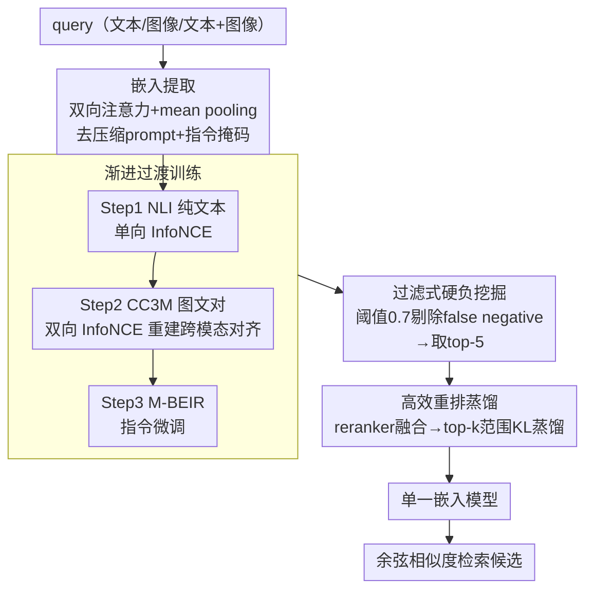

# U-MARVEL: Unveiling Key Factors for Universal Multimodal Retrieval via Embedding Learning

**会议**: ICLR 2026  
**arXiv**: [2507.14902](https://arxiv.org/abs/2507.14902)  
**代码**: [GitHub](https://github.com/chaxjli/U-MARVEL)  
**领域**: 多模态VLM  
**关键词**: 通用多模态检索, MLLM嵌入学习, 对比学习, 渐进训练, 重排蒸馏

## 一句话总结

系统消融MLLM嵌入学习的设计空间，揭示双向注意力+mean pooling优于主流last token、可学习温度被严重低估等关键因子，据此构建U-MARVEL三阶段框架（渐进过渡→过滤硬负→重排蒸馏），在M-BEIR上以单模型63.2% Avg大幅超越现有SOTA，零样本迁移CIR和T2V同样领先。

## 研究背景与动机

**领域现状**：通用多模态检索（UMR）要求单一检索器处理query和candidate跨越文本、图像及其组合的复杂检索场景。近期LamRA、MM-Embed、GME、UniME等方法均基于MLLM+对比学习，但各自的架构选型（嵌入提取方式、训练超参、负样本策略）差异很大，缺乏统一研究来回答"哪些设计决策真正重要"。

**现有痛点**：decoder-only MLLM天然服务于自回归生成，如何将其改造为嵌入模型存在大量未探索的设计选择。现有方法几乎都沿用last token+causal attention+压缩prompt的范式，但这种做法是否最优从未被系统验证。此外，recall-then-rerank虽能提升精度，但推理开销翻倍，缺乏高效的单模型替代方案。

**核心矛盾**：多个看似无关紧要的细节（注意力方向、pooling策略、温度参数）可能对性能有决定性影响，但社区对此缺乏系统认知。

**本文目标** (1) 嵌入提取：decoder-only→embedder的最优适配方式是什么？(2) 训练策略：InfoNCE的batch/lr/温度如何交互？硬负样本怎样避免崩塌？(3) 效率：能否将recall+rerank蒸馏成单模型，同时保持精度？

**切入角度**：作者没有直接提方法，而是先实现一个通用pipeline，然后沿三条轴线系统消融，每步用实验证据推导出最优设计，最后组装成统一框架。这种"先理解再构建"的范式让每个设计决策都有数据支撑。

**核心 idea**：通过系统消融发现被忽视的关键因子（bidir+mean、learnable temp、过滤硬负），将其整合为三阶段渐进训练框架+高效蒸馏，实现单模型SOTA。

## 方法详解

### 整体框架

U-MARVEL 想回答一个被社区忽略的问题：把一个为自回归生成而生的 decoder-only MLLM 改造成通用多模态检索器，到底哪些设计决策真正重要。它的做法是"先理解再构建"——先实现一个通用的对比学习 pipeline，沿三条轴线逐项消融：嵌入怎么从 token 序列里提取、对比目标的超参怎么调、recall+rerank 双模型怎么压成单模型；每条轴线上跑赢的配置才被组装进最终框架。

成品 U-MARVEL 以 Qwen2-VL-7B-Instruct 为骨干、用 LoRA 微调，可以分成"提取"和"训练"两层来看。底层是**嵌入提取架构**（双向注意力 + mean pooling + 去掉压缩 prompt + 指令掩码），决定任意模态的 query 如何被压成一个检索向量；上层是**三阶段渐进训练**——先分三步把模型从纯文本检索平滑过渡到多模态指令检索，再做过滤式硬负挖掘进一步拉开难分候选，最后把 recall+rerank 双模型蒸馏成单模型。推理时 query（文本/图像/文本+图像）经嵌入提取得到统一向量，用余弦相似度检索候选。

### 关键设计

**1. 嵌入提取：双向注意力 + mean pooling + 去压缩 prompt**

这是全文最核心的发现。社区主流做法几乎一致——causal attention + 一句压缩 prompt（"Summarize above image and sentence in one word: emb"）+ 取 last token 作嵌入。作者把注意力方向、pooling 方式、是否加压缩 prompt 排列组合成 5 种方案逐一对比，结论是**双向注意力 + mean pooling + 不加压缩 prompt** 最优（Local 57.2 vs 主流方案 56.6）。关键洞察在于压缩 prompt 和 mean pooling 本质上互相打架：prompt 逼着模型把信息全挤到最后一个 token 上，而 mean pooling 恰恰要求信息均匀摊在所有 token 上——消融里把 last token 直接换成 mean token 而不去 prompt，性能反而暴跌 22.9%/27.2%，正是这种冲突的体现。去掉 prompt 后 mean pooling 才能正常聚合全局信息；再配上双向注意力，每个 token 都能看到完整上下文，也就消除了 last token 固有的 recency bias。这个结论直接挑战了社区默认的 last token 范式——它与纯文本领域的 NV-Embed 一致，却与同样基于 Qwen2-VL 的 GME 相反。

改用双向注意力后还顺手带来一个修正——**指令掩码**。双向 self-attention 下，instruction tokens 在前向传播里已经把语义渗进了 query 的每一个 token，若 mean pooling 时再把 instruction tokens 一起平均就成了重复计算。于是 pooling 阶段把 instruction tokens 全部 mask 掉、只对 query 部分取平均，数值提升虽小（+0.1%/+0.3%），却从原理上消除了 instruction bias，让嵌入更纯粹地反映 query 与 candidate 的语义匹配。

**2. 渐进过渡训练：分三步把 decoder-only 模型平滑变成嵌入模型**

直接拿多模态检索数据去微调一个为自回归生成而生的 MLLM，任务跨度过大，结果反而次优。作者把适配拆成由简到难的三步：Step 1 在 NLI 纯文本上用单向 InfoNCE 训练，先建立文本编码器的语义检索能力；Step 2 在 CC3M 图文对上换成双向 InfoNCE，重建文本与视觉编码器的跨模态对齐——MLLM 原本用 causal attention，一旦切到 bidirectional 就会破坏已有对齐，必须显式重建；Step 3 才在 M-BEIR 多模态检索数据上做指令微调。一个有意思的细节是 Step 2 里 CC3M 的简洁文本比 ShareGPT4V 的详细描述更适合检索，说明对齐阶段要的是干净的图文对应而非冗长描述。每一步都站在上一步的基础上，使整条适配路径平滑收敛，也是模型对 CIR、视频检索零样本泛化的根源。

**3. 过滤式硬负挖掘：先剔除 false negative，再挖硬负**

在渐进过渡得到的模型上继续用硬负样本训练，能进一步拉开 query 与难混淆候选的距离，但直接取 top-k 硬负会崩塌——检索数据标注常有遗漏，相似度最高的"硬负"里混着实际为正例的 false negative，把它们当负样本会给出矛盾梯度。作者的做法是先设相似度阈值 0.7 把过高的候选（疑似漏标正例）滤掉，再从剩下的取 top-5 作硬负，与 in-batch negative 混合训练。这一步过滤把性能从 60.6 提到 61.7，说明硬负挖掘的关键不在"挖得多硬"，而在"先把假负样本择干净"。

**4. 高效重排蒸馏：把 recall+rerank 双模型蒸成单模型**

recall-then-rerank 能提精度，但推理开销翻倍。U-MARVEL 想让单模型也逼近双模型的效果。作者先训练一个生成式 reranker（对每个 query-candidate 对输出 YES/NO），把它与 recall 模型的分数线性融合（$\alpha=0.5$）当作 teacher，再用 KL 散度把 teacher 蒸进单一 student。真正巧妙的是蒸馏范围：传统做法在整个 $O(n^2)$ 的 similarity matrix 上蒸馏，U-MARVEL 只对每个 query 的 top-k 硬负范围（$O(nk)$）做蒸馏，计算量降到传统方法的 4.1%（14h vs 340h），训练特征的多样性反而增加 26 倍。蒸馏后单模型 63.2% 已逼近双模型 63.7%，差距仅 0.5%。

### 损失函数 / 训练策略

对比学习目标为 InfoNCE：

$$\mathcal{L}_{\text{InfoNCE}}=-\log\frac{\exp(\text{sim}(e_q,e_{c^+})/\tau)}{\sum_i\exp(\text{sim}(e_q,e_{c_i})/\tau)}$$

作者发现其中两个常被忽视的超参与训练规模有强交互效应：

- **batch size 必须配合 learning rate 线性缩放**：单纯增大 batch 而不调 lr 几乎无效（480→1920 仅 +0.2%），配合 lr 线性缩放后才显著（+1.7%），与视觉训练里的 lr scaling rule 一致。
- **可学习温度 ≫ 固定温度**：把 $\tau$ 从固定 0.05 改为可学习参数，同等 batch 下提升 1.2~1.4%，这个增益甚至超过把 batch 从 480 扩到 3840 的效果。可学习温度能自适应调节 softmax 分布的锐度，是被社区严重低估的关键因子。

## 实验关键数据

### 主实验——M-BEIR基准（Local Pool）

| 方法 | 类型 | $q^t→c^i$ | $q^t→c^t$ | $q^i→c^t$ | $(q^i,q^t)→c^i$ | Avg |
|------|------|-----------|-----------|-----------|-----------------|-----|
| UniIR-CLIP | 单模型 | 30.3 | 82.9 | 45.5 | 46.3 | 50.6 |
| LamRA-Ret | 单模型 | 35.2 | 83.9 | 54.1 | 64.8 | 56.6 |
| GME-Qwen2VL-7B | 单模型 | 37.7 | 83.3 | 55.2 | 67.5 | 58.6 |
| UniME | 单模型 | 39.1 | 84.6 | 55.0 | 68.3 | 59.5 |
| **U-MARVEL** | **单模型** | **40.2** | **85.0** | **58.3** | **72.1** | **63.2** |
| LamRA(+reranker) | 双模型 | 41.6 | 85.6 | 59.2 | 73.8 | 63.7 |
| **U-MARVEL⁺**(+reranker) | 双模型 | **41.8** | **85.6** | **63.7** | **73.9** | **64.8** |

U-MARVEL单模型63.2%已接近LamRA的双模型63.7%，验证了蒸馏策略的有效性。加reranker后U-MARVEL⁺达到64.8%，全面领先。

### 消融实验——各组件贡献

| 配置 | Local Avg | Global Avg | 说明 |
|------|-----------|------------|------|
| Baseline（causal+last token） | 56.6 | 54.8 | 主流默认方案 |
| + Bidir+Mean+去prompt | 57.2 | 55.2 | 嵌入提取优化，+0.6 |
| + 指令掩码 | 57.3 | 55.5 | 消除instruction bias |
| + 渐进过渡（NLI+CC3M） | 57.7 | 55.8 | 渐进预训练，累计+1.1 |
| + Batch/LR/Temp优化 | 60.1 | — | 训练参数交互，+2.4 |
| + 过滤硬负样本 | 61.7 | 59.9 | 硬负挖掘，+1.6 |
| + 重排蒸馏 | **63.2** | **60.7** | 蒸馏，+1.5 |

### 零样本迁移——CIR与T2V

| 方法 | CIRCO MAP@5 | MSR-VTT R@1 | MSVD R@1 |
|------|-------------|-------------|----------|
| VLM2Vec | — | 43.5 | 49.5 |
| LamRA-Ret | 33.2 | 44.7 | 52.4 |
| LLaVE-7B | — | 46.8 | 52.9 |
| **U-MARVEL** | **36.2** | **47.2** | **54.6** |

在从未见过CIR和视频数据的情况下，U-MARVEL零样本超越所有对比方法，验证了渐进训练带来的泛化能力。

### 关键发现

- **Bidir+Mean是被低估的最优嵌入方案**：社区主流Last token+causal+prompt反而不是最优解。核心原因是last token存在recency bias，而mean pooling+双向注意力让每个token都能全面聚合上下文信息
- **可学习温度是最被忽视的关键因子**：在batch=3840条件下，learnable vs fixed温度差距达1.2%，这个提升超过了将batch从480增大到3840的效果
- **硬负样本必须过滤false negative**：直接用top-k硬负必然崩塌，阈值过滤是必要手段
- **改进蒸馏使单模型逼近双模型**：计算量仅为传统蒸馏的4.1%，但单模型精度差距仅0.5%

## 亮点与洞察

- **"先理解再构建"的研究范式**：不是直接提出一个方法，而是通过系统消融理解每个设计决策的影响后再组装。这种范式让每个选择都有实验支撑，结论更可靠且可复现
- **三个被忽视的因子**统一揭示：bidirectional+mean pooling、learnable temperature、filtered hard negative看似小改动，但累计带来6.6%的绝对提升（56.6→63.2），说明在MLLM嵌入学习中"魔鬼在细节中"
- **高效蒸馏设计巧妙**：将蒸馏范围从$O(n^2)$的全similarity matrix缩小到$O(nk)$的top-k范围，计算量降到4.1%同时特征多样性增加26倍。这个思路可迁移到任何recall-then-rerank系统的知识蒸馏

## 局限与展望

- **模态覆盖有限**：仅支持文本和图像，未扩展到音频、视频（虽然零样本视频检索效果不错，但缺乏时序建模，reranker在视频上甚至退化）
- **模型规模受限**：仅在7B模型上验证，更大（70B+）或更小（1B）模型上的表现未知
- **RAG场景未验证**：作为检索器接入RAG pipeline的端到端效果未评估
- **硬负阈值0.7为手工设定**：不同数据分布下的最优阈值可能不同，可考虑自适应阈值策略
- **渐进过渡的数据选择**：CC3M vs ShareGPT4V的结论可能受数据规模和质量混淆影响，需要更严格的控制实验

## 相关工作与启发

- **vs GME**：GME同样基于Qwen2-VL做通用多模态检索，但沿用last token+causal attention方案。U-MARVEL的消融实验直接挑战了GME关于"last token优于mean pooling"的结论，表明GME的结论可能受限于其未去除压缩prompt的实验设计
- **vs LamRA**：LamRA使用recall+rerank双模型达到63.7%，而U-MARVEL通过蒸馏用单模型达到63.2%，推理效率大幅提升。LamRA的reranker是生成式的，U-MARVEL沿用了这一设计但加入融合蒸馏
- **vs NV-Embed**：NV-Embed在纯文本embedding领域也发现bidir+mean pooling优于last token，U-MARVEL将这一结论扩展到多模态场景并进一步发现了压缩prompt与pooling方式的冲突机制

## 评分

- 新颖性: ⭐⭐⭐⭐ 核心贡献在系统消融而非全新架构，但揭示的insights很有价值
- 实验充分度: ⭐⭐⭐⭐⭐ 消融极其细致，每个设计决策都有对比实验，M-BEIR+零样本CIR+T2V全面覆盖
- 写作质量: ⭐⭐⭐⭐⭐ 结构清晰，从消融到框架的叙事逻辑很流畅
- 价值: ⭐⭐⭐⭐ 对MLLM嵌入学习社区有重要参考意义，多个被忽视的因子可直接复用

<!-- RELATED:START -->

## 相关论文

- [\[ICML 2025\] Universal Retrieval for Multimodal Trajectory Modeling](../../ICML2025/multimodal_vlm/universal_retrieval_for_multimodal_trajectory_modeling.md)
- [\[ACL 2025\] MegaPairs: Massive Data Synthesis For Universal Multimodal Retrieval](../../ACL2025/multimodal_vlm/megapairs_massive_data_synthesis_for_universal_multimodal_retrieval.md)
- [\[ICLR 2026\] PPE: Positional Preservation Embedding for Token Compression in Multimodal Large Language Models](ppe_positional_preservation_embedding_for_token_compression_in_multimodal_large_.md)
- [\[CVPR 2026\] Illuminating Visual Identity in Universal Multimodal Embeddings](../../CVPR2026/multimodal_vlm/illuminating_visual_identity_in_universal_multimodal_embeddings.md)
- [\[ICML 2026\] CHARM: 用 Multimodal JEPA + 通道描述做时间序列 foundation embedding](../../ICML2026/multimodal_vlm/giving_sensors_a_voice_multimodal_jepa_for_semantic_time-series_embeddings.md)

<!-- RELATED:END -->
