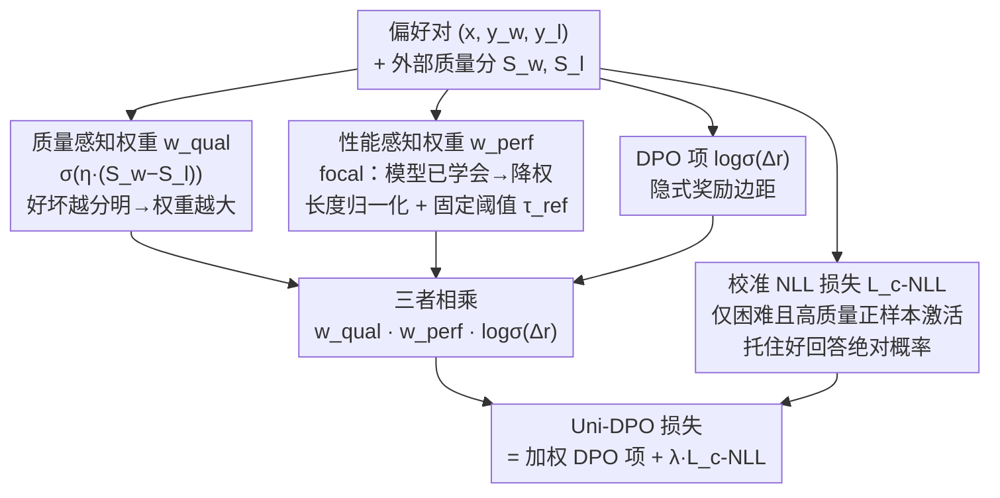

# Uni-DPO: A Unified Paradigm for Dynamic Preference Optimization of LLMs

**会议**: ICLR 2026  
**arXiv**: [2506.10054](https://arxiv.org/abs/2506.10054)  
**代码**: [https://github.com/pspdada/Uni-DPO](https://github.com/pspdada/Uni-DPO)  
**领域**: 对齐RLHF / DPO  
**关键词**: DPO改进, 动态权重, 质量感知, focal loss, 偏好优化

## 一句话总结
提出Uni-DPO，通过质量感知加权（高分差偏好对优先）+性能感知加权（focal loss聚焦欠拟合样本）+校准NLL损失三个组件统一动态调整DPO偏好对权重，在文本理解和数学推理基准上一致超越DPO/SimPO，Gemma-2-9B在Arena-Hard达67.1%超过Claude 3 Opus(60.4%)。

## 研究背景与动机

**领域现状**：DPO通过隐式奖励直接从偏好数据优化策略，已成为LLM对齐的标准方法。SimPO进一步简化去掉参考模型。

**现有痛点**：
   - 标准DPO等权对待所有偏好对，但数据质量差异巨大——高质量对有清晰的好坏区分，低质量对含噪/模糊
   - 数据质量与模型性能存在错配：高质量对可能已被模型学好，过分强调导致过拟合
   - DPO缺乏细粒度的外部奖励信号（不像PPO/GRPO）

**核心矛盾**：如何同时考虑数据内在质量和模型当前学习状态来动态调权？

**核心 idea**：质量权重区分好坏数据 + 性能权重聚焦难样本 + 校准NLL防止好回答概率下降

## 方法详解

### 整体框架

Uni-DPO 想解决的核心问题是：标准 DPO 把所有偏好对一视同仁，既不看这对数据本身好坏区分得清不清楚，也不看模型当前到底学没学会。Uni-DPO 的做法是在 DPO 的每个偏好对前面挂上两个动态权重，再额外加一项校准 NLL 把整体损失拼成：

$$\mathcal{L}_{\text{Uni-DPO}} = -\mathbb{E}[w_{\text{qual}}(y_w, y_l) \cdot w_{\text{perf}}(\pi_\theta) \cdot \log\sigma(\Delta_r)] + \lambda\mathcal{L}_{\text{c-NLL}}$$

其中 $w_{\text{qual}}$ 衡量这对偏好数据本身的内在质量（外部信号、off-policy），$w_{\text{perf}}$ 衡量模型对这对样本当前的掌握程度（内部动态、on-policy），二者相乘后再乘上常规 DPO 的 $\log\sigma(\Delta_r)$ 项，而 $\mathcal{L}_{\text{c-NLL}}$ 则在特定条件下托住好回答的绝对概率。这样每个偏好对的实际贡献就同时被"数据有多干净"和"模型还差多少"两件事调制。

下图把一个偏好对在训练时的两条加权通路和最终损失的拼装关系画出来：质量通路看外部分数、性能通路看当前策略，二者与 DPO 项相乘，再叠加门控触发的校准 NLL。

### 关键设计

**1. 质量感知权重 $w_{\text{qual}}$：让信噪比高的偏好对说话更响**

这一项针对的痛点是数据质量参差不齐——有的偏好对好坏分明，有的则含噪、模糊。Uni-DPO 用外部评分的差异来量化"这对数据区分度有多高"：

$$w_{\text{qual}}(y_w, y_l) = \sigma(\eta \cdot (S_w - S_l))$$

这里 $S_w, S_l$ 是 chosen / rejected 两个回答的外部分数，可以来自人工标注、GPT-4 或 ArmoRM 之类的奖励模型，$\eta$ 控制分差到权重的映射陡峭程度。分差越大说明好坏越清晰，权重越接近 1；分差小甚至接近 0 的模糊对则被压低权重。效果上等于在训练里软性地过滤噪声和模糊偏好对，把梯度让给高信噪比的数据。

**2. 性能感知权重 $w_{\text{perf}}$：把火力集中到模型还没学会的难样本上**

光看数据质量还不够——一个高质量对如果模型早就学好了，再使劲强调只会过拟合。$w_{\text{perf}}$ 借鉴 focal loss 的思路，对已经掌握的样本降权、对当前做不好的样本加权：

$$w_{\text{perf}} = \Big[1 - \sigma\big(\tfrac{\beta}{|y_w|}\log\pi_\theta(y_w|x) - \tfrac{\beta}{|y_l|}\log\pi_\theta(y_l|x) - \tau_{\text{ref}}\big)\Big]^\gamma$$

括号内是模型当前在这对样本上的隐式边距，$\gamma$ 控制 focal 强度（边距越大、即学得越好，权重压得越狠）。这里有两个关键改进：一是用固定阈值 $\tau_{\text{ref}}$ 取代对参考模型的逐样本依赖来设定期望边距，避免朴素 focal DPO 那种逐样本约束带来的训练不稳定；二是对 $\log\pi_\theta$ 做长度归一化（除以 $|y_w|$、$|y_l|$）防止长回答天然占便宜的长度偏差。

**3. 校准 NLL 损失 $\mathcal{L}_{\text{c-NLL}}$：别让好回答的概率被 DPO 越推越低**

DPO 训练有个已知的副作用——优化相对边距时，chosen 回答的绝对概率有时反而会下降。$\mathcal{L}_{\text{c-NLL}}$ 就是用来托住这个绝对概率的，本质是对 $y_w$ 加一项长度归一化的 NLL，但它不是无脑加的，而是用两个指示函数做门控：只在 $\mathbf{1}(\log\pi_{\text{ref}}(y_w|x) > \log\pi_\theta(y_w|x))$（当前策略对好回答的似然还不如参考模型）且 $\mathbf{1}(S_w \ge \tau_{\text{good}})$（该样本质量分高于阈值 $\tau_{\text{good}}$）同时成立时才激活，从而把置信度集中强化到那些困难又值得学好的高质量正样本上，而不会干扰其他情况下的正常优化。

### 损失函数 / 训练策略
- $\eta = 0.7$, $\lambda = 0.001$, $\gamma = 3.0$, $\tau_{\text{ref}} \in [0.5, 2.0]$
- 支持不同质量评分来源（人工、GPT-4、ArmoRM等奖励模型）

## 实验关键数据

### 主实验：文本理解

| 模型 | 方法 | AlpacaEval2 LC | Arena-Hard | IFEval Loose | SedarEval |
|------|------|---------------|-----------|-------------|-----------|
| Llama3-8B-Base | DPO | 15.5 | 15.9 | 45.5 | 31.80 |
| | SimPO | 19.4 | 23.4 | 45.7 | 32.43 |
| | **Uni-DPO** | **23.8** | **23.9** | **47.9** | **38.49** |
| Gemma-2-9B-IT | SimPO | 53.2 | 59.1 | 67.7 | 57.7 |
| | **Uni-DPO** | **54.7** | **67.1** | **72.8** | 57.5 |

### 主实验：数学推理（Qwen2.5-Math-7B）

| 方法 | GSM8K | MATH | AIME24 | AMC23 | Avg |
|------|-------|------|--------|-------|-----|
| Baseline | 64.3 | 65.8 | 23.3 | 47.5 | 39.11 |
| DPO | 83.2 | 75.8 | 26.7 | 57.5 | 51.55 |
| SimPO | 85.7 | 76.4 | 26.7 | 57.5 | 53.73 |
| **Uni-DPO** | **88.9** | **78.2** | **26.7** | **67.5** | **56.80** |

### 消融实验

| 配置 | AlpacaEval2 WR | Arena-Hard | SedarEval |
|------|---------------|-----------|-----------|
| Full Uni-DPO | **20.5** | **23.9** | **38.49** |
| w/o $w_{\text{qual}}$ | 15.9 | 22.8 | 37.43 |
| w/o $w_{\text{perf}}$ | 18.5 | 21.4 | 40.46 |
| w/o LN | 3.8 | 2.7 | 28.18 |
| w/o $\mathcal{L}_{\text{c-NLL}}$ | 19.4 | 23.3 | 37.73 |

### 关键发现
- **长度归一化(LN)是关键**：去掉后性能断崖式下降(SedarEval -10.31)，训练不稳定
- **质量权重最影响AlpacaEval**：去掉后WR从20.5→15.9(-4.6)
- **Gemma-2-9B+Uni-DPO超越Claude 3 Opus**：Arena-Hard 67.1 vs 60.4
- **数学推理提升显著**：Qwen2.5-Math-7B平均+3.07 over SimPO

## 亮点与洞察
- **双视角动态权重的统一**：数据质量(外部信号)和学习难度(内部动态)的联合考量，比任一单独视角更有效
- **校准focal loss的改进设计**：固定阈值替代参考模型依赖+长度归一化，解决了朴素focal DPO的训练不稳定问题
- **迁移到数学推理**：证明该框架不限于对话/指令遵循，数学任务同样获益

## 局限与展望
- **依赖外部评分**：质量权重需要奖励模型或GPT-4评分，增加了数据准备成本
- **超参数较多**：$\eta, \gamma, \tau_{\text{ref}}, \lambda, \tau_{\text{good}}$ 需要调优
- **改进思路**：可以用self-reward替代外部评分；可结合NSPO的零空间约束增加安全维度

## 相关工作与启发
- **vs DPO**：DPO等权对待→Uni-DPO双维度动态调权，一致提升
- **vs SimPO**：SimPO去参考模型简化→Uni-DPO在SimPO基础上加质量/性能权重，叠加增益
- **vs 标准focal loss**：直接focal DPO不稳定，Uni-DPO的校准版本（固定阈值+LN）解决了这个问题

## 评分
- 新颖性: ⭐⭐⭐⭐ 双视角动态权重自然但非突破性
- 实验充分度: ⭐⭐⭐⭐⭐ 4模型×多基准×数学推理，消融详尽
- 写作质量: ⭐⭐⭐⭐ 方法动机清晰
- 价值: ⭐⭐⭐⭐ DPO的实用性改进，容易集成到现有流程

<!-- RELATED:START -->

## 相关论文

- [\[ICML 2026\] TUR-DPO: Topology- and Uncertainty-Aware Direct Preference Optimization](../../ICML2026/multimodal_vlm/tur-dpo_topology-_and_uncertainty-aware_direct_preference_optimization.md)
- [\[CVPR 2026\] Unified Generation and Self-Verification for Vision-Language Models via Advantage Decoupled Preference Optimization](../../CVPR2026/multimodal_vlm/unified_generation_and_self-verification_for_vision-language_models_via_advantag.md)
- [\[CVPR 2026\] Dynamics-Aware Preference Optimization for Vision-Language Models](../../CVPR2026/multimodal_vlm/dynamics-aware_preference_optimization_for_vision-language_models.md)
- [\[CVPR 2026\] UVU: Improving Multimodal Understanding via Vision-Language Unified Autoregressive Paradigm](../../CVPR2026/multimodal_vlm/uvu_improving_multimodal_understanding_via_vision-language_unified_autoregressiv.md)
- [\[ICLR 2026\] K-Sort Eval: Efficient Preference Evaluation for Visual Generation via Corrected VLM-as-a-Judge](k-sort_eval_efficient_preference_evaluation_for_visual_generation_via_corrected_.md)

<!-- RELATED:END -->
