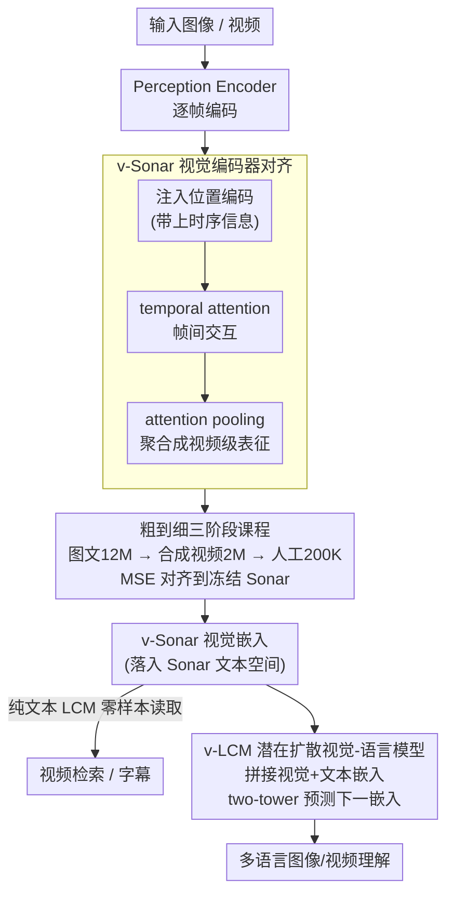

# Unified Vision-Language Modeling via Concept Space Alignment

**会议**: ICLR 2026  
**arXiv**: [2603.01096](https://arxiv.org/abs/2603.01096)  
**代码**: 无  
**领域**: 多模态VLM  
**关键词**: 视觉-语言嵌入空间, 潜在扩散模型, 多语言, 视频字幕, Large Concept Model

## 一句话总结

提出v-Sonar将视觉编码器后置对齐到文本嵌入空间Sonar，使得在Sonar空间上训练的Large Concept Model (LCM)能零样本处理视觉输入，并通过指令微调扩展为v-LCM，在61/62种语言上超越现有VLM。

## 研究背景与动机

现有的语言和模态无关嵌入空间（如SONAR，支持1500种文本语言和177种语音语言）在文本和语音任务中取得了出色表现，但仍局限于文本和语音模态，无法处理视觉任务。Large Concept Model (LCM)在Sonar空间中用扩散目标做next-embedding预测，展示了在连续嵌入空间而非离散token上进行语言建模的可行性。

本文的核心动机是：能否将视觉模态也对齐到Sonar空间，使LCM无需任何视觉数据训练就能理解视觉输入？进一步地，能否通过视觉-语言指令微调来增强LCM？

## 方法详解

### 整体框架

方法的核心是把视觉这个"新模态"塞进已经训练好的 Sonar 文本/语音嵌入空间里，从而免费复用在该空间上预训练的 Large Concept Model。具体分三步走：先用 v-Sonar 把 Perception Encoder 的输出对齐到 Sonar 文本嵌入，验证纯文本训练的 LCM 能零样本读懂这些视觉嵌入，最后在 v-Sonar 与 Sonar 共享的统一空间上做视觉-语言指令微调，得到 v-LCM。

### 关键设计

**1. v-Sonar 视觉编码器对齐：让视觉嵌入落进文本空间。** 难点在于 Perception Encoder (PE) 产出的逐帧特征既无时序结构，也不在 Sonar 这个目标空间里。作者不重训编码器，而是在 PE 之上堆一个轻量投影器：先注入位置编码让帧带上时序信息，再过一层 temporal attention 做帧间交互，最后用 attention pooling 把所有帧聚合成单一视频级表征。整个对齐用最朴素的 MSE 把视觉嵌入往冻结的 Sonar 文本嵌入上拉，目标为 $\mathcal{L}_{\text{align}} = \frac{1}{N}\sum_{i=1}^{N}\|f_\theta(V_i) - g(T_i)\|_2^2$，其中 Sonar 编码器 $g$ 全程冻结作为"锚点"，只更新投影器和视觉编码器。因为目标空间已经是高质量、模态无关的，对齐做的只是搬运而非重建语义，所以一个回归损失就够，也正是这一点让后续的零样本迁移成为可能。

**2. 粗到细的三阶段课程：从图文先验过渡到视频时序。** 直接用稀缺的人工视频字幕训练既不够量又难收敛，所以作者把对齐拆成由粗到细三段：Stage 1 用 12M 大规模图文对建立从像素到 Sonar 空间的基础映射，Stage 2 引入 2M 合成视频字幕让模型适应时序动态，Stage 3 再用 200K 高质量人工标注视频字幕做精细对齐。这种"先打地基、再补时序、最后抛光"的顺序既摊薄了对昂贵标注的依赖，消融里去掉合成视频阶段（w/o Stage2）Bleu 从 40.1 掉到 39.6 也印证了中间过渡数据确实在起作用。

**3. v-LCM 潜在扩散视觉-语言模型：在统一空间上做生成式建模。** 一旦视觉和文本都落在同一个连续嵌入空间，就可以把它们拼成一条潜在嵌入序列，用和 LCM 文本预训练完全相同的潜在扩散目标继续训练，而不必引入离散 token。模型采用 two-tower 架构，contextualizer 负责编码前序嵌入作为条件 $c$，denoiser 在此条件下迭代重建下一个嵌入。前向加噪为 $x_t = \alpha_t x^0 + \sigma_t \epsilon$，训练则最小化 $\mathcal{L}(\theta) = \mathbb{E}\|x^0 - \mu_\theta(\alpha_t x^0 + \sigma_t \epsilon, t, c)\|_2$，即在每个噪声水平上预测干净嵌入 $x^0$。由于建模目标和文本侧一致，v-LCM 天然继承了 Sonar 原生支持 1500 种语言的多语言能力。

### 损失函数 / 训练策略

v-Sonar 阶段只用上面的 MSE 对齐损失配合三阶段课程。训练时一个实际坑是：投影器是新初始化的、而 PE 已预训练好，若用同一学习率会让梯度不稳定，作者因此采用异步学习率给投影器和编码器分别设置不同步长；消融显示加上异步学习率后 Bleu 从 38.0 提到 39.7，是单项收益最大的技巧，再叠加归一化初始化和 attention pooling 进一步把 Cos.Sim 推到 0.716。v-LCM 阶段则沿用 LCM 原始文本预训练的潜在扩散目标，在 M3IT 多模态多语言指令数据上做指令微调。

## 实验关键数据

### 主实验

| 数据集 | 指标 | v-Sonar | PECoreG | SigLIP2-G-OPT |
|--------|------|---------|---------|---------------|
| PE-Video | R@1 | **73.03** | 63.91 | 47.55 |
| Vatex | R@1 | **40.75** | 18.90 | 27.52 |
| Dream-1k | R@1 | 63.30 | **72.10** | 61.50 |

| 数据集 | 指标 | v-Sonar+OmniSONAR Decoder | PLM-3B | Qwen2.5-VL-3B |
|--------|------|---------------------------|--------|---------------|
| PE-Video | Bleu | **39.0** | 21.1 | 30.0 |
| Dream-1k | Bleu | **23.9** | 19.6 | 16.1 |
| Vatex-zh | R-L | **26.9** | - | - |

| M3IT多语言评测 | v-LCM | InternVL | Qwen-VL |
|---------------|-------|----------|---------|
| 62种语言中超越对手数 | **61/62** | - | - |

### 消融实验

| 配置 | MSE↓ | Cos.Sim↑ | Bleu↑ | 说明 |
|------|------|----------|-------|------|
| Linear Proj. | 1.45e-3 | 0.694 | 38.0 | 冻结PE基线 |
| Full PE | 1.54e-3 | 0.672 | 37.1 | 全部微调反而更差 |
| + Async. LR | 1.43e-3 | 0.700 | 39.7 | 异步学习率有效 |
| + Norm. Init. | 1.39e-3 | 0.708 | 39.8 | 归一化初始化 |
| + Attn. Pooling | 1.39e-3 | 0.708 | 39.8 | 注意力聚合 |
| Full Pipeline (3-stage) | **1.36e-3** | **0.716** | **40.1** | 完整三阶段最优 |
| w/o Stage2 (SV) | 1.39e-3 | 0.710 | 39.6 | 去掉合成视频阶段 |
| w/o Stage1&2 | 1.39e-3 | 0.708 | 39.8 | 仅用人工标注 |

### 关键发现

- v-Sonar在PE-Video和Vatex上检索R@1分别比原始PE提升9.12和21.85
- 纯文本训练的LCM可以零样本处理v-Sonar视觉嵌入，在视频字幕任务上与VLM差距有限
- OmniSONAR较Sonar1对齐更容易（嵌入范数1.69 vs 0.264，协方差trace 1.83 vs 0.049），Sonar1空间存在坍缩问题
- v-LCM在M3IT评测中匹配SOTA VLM的图像/视频理解能力，同时在61种非英语语言上显著领先

## 亮点与洞察

- 提出了一种新范式：在模态无关的连续嵌入空间中统一视觉和语言，使用扩散目标而非离散token
- 后置对齐策略(post-hoc alignment)的成功证明高质量文本嵌入空间可以"免费"接纳新的模态
- LCM零样本视觉理解能力令人印象深刻，验证了共享嵌入空间的跨模态迁移潜力
- 多语言能力是天然优势：Sonar原生支持1500种语言，v-LCM自动继承

## 局限与展望

- Dream-1k检索v-Sonar不如原始PE（63.3 vs 72.1），说明对齐可能损失某些特征
- Vatex短字幕场景表现不及InternVL，受训练数据偏向详细字幕影响
- 当前v-LCM规模较小，与大规模VLM（7B+）的直接对比有待验证
- Sonar1版本空间坍缩问题需要更好的解决方案（目前依赖OmniSONAR改进版）

## 相关工作与启发

- 与Chameleon等token-based多模态模型形成对比，提出连续嵌入空间的替代方案
- 粗到细课程训练策略可借鉴到其他跨模态对齐任务
- 对低资源语言的多模态模型开发有重要参考价值

## 评分

- 新颖性: ⭐⭐⭐⭐⭐ 将视觉对齐到模态无关嵌入空间+潜在扩散生成的新范式极具创新
- 实验充分度: ⭐⭐⭐⭐ 检索、字幕、多语言评测全面，消融完整；但大规模对比有限
- 写作质量: ⭐⭐⭐⭐ 结构清晰，方法描述流畅
- 价值: ⭐⭐⭐⭐⭐ 为多模态多语言AI提供了极具潜力的新方向，61/62语言领先很有说服力

<!-- RELATED:START -->

## 相关论文

- [\[CVPR 2026\] Modeling Cross-vision Synergy for Unified Large Vision Model](../../CVPR2026/multimodal_vlm/modeling_cross-vision_synergy_for_unified_large_vision_model.md)
- [\[ICLR 2026\] UniHM: Unified Dexterous Hand Manipulation with Vision Language Model](unihm_unified_dexterous_hand_manipulation_with_vision_language_model.md)
- [\[ICLR 2026\] Spatial-DISE: A Unified Benchmark for Evaluating Spatial Reasoning in Vision-Language Models](spatial-dise_a_unified_benchmark_for_evaluating_spatial_reasoning_in_vision-lang.md)
- [\[ICLR 2026\] Procedural Mistake Detection via Action Effect Modeling](procedural_mistake_detection_via_action_effect_modeling.md)
- [\[CVPR 2026\] DSCA: Dynamic Subspace Concept Alignment for Lifelong VLM Editing](../../CVPR2026/multimodal_vlm/dsca_dynamic_subspace_concept_alignment_for_lifelong_vlm_editing.md)

<!-- RELATED:END -->
