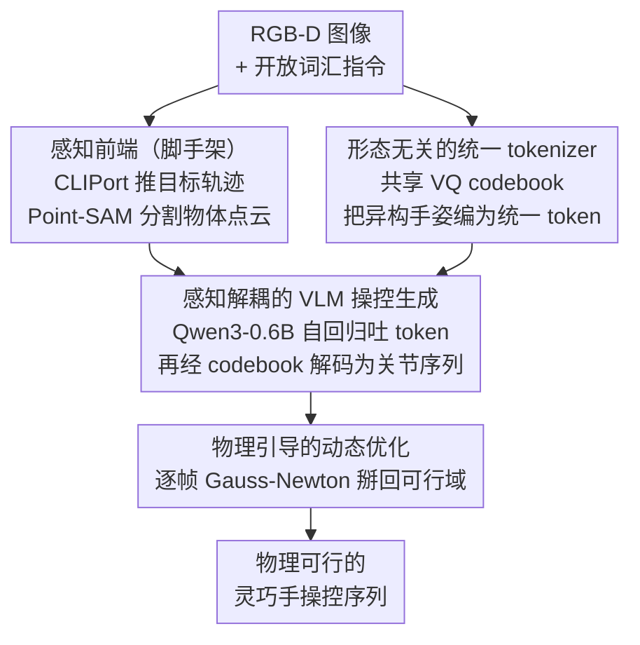

# UniHM: Unified Dexterous Hand Manipulation with Vision Language Model

**会议**: ICLR 2026  
**arXiv**: [2603.00732](https://arxiv.org/abs/2603.00732)  
**代码**: [GitHub](https://unihm.github.io/)  
**领域**: 多模态VLM  
**关键词**: 灵巧手操控, VLM, 统一 tokenizer, 物理动态优化, 跨形态泛化

## 一句话总结

提出UniHM，首个统一的语言条件灵巧手操控框架，通过形态无关VQ codebook将异构机械手映射到共享离散空间，结合VLM进行指令驱动操控序列生成，并通过物理引导动态优化确保物理可行性。

## 研究背景与动机

灵巧手操控要求感知、抓取和重新配置复杂环境中的物体，生成多样、长时域、物理可行的操控序列是推进人形机器人应用的关键。

现有方法的不足：
- **以物体为中心的方法**（UniDexGrasp, DexGraspNet等）：缺乏开放词汇指令引导，仅能处理固定序列
- **语言引导的抓取方法**（SemGrasp, AffordDexGrasp等）：主要生成静态抓取姿态，忽略时序结构，无法产生平滑连续的操控序列
- **现有VLM操控方法**（MotionGPT, HOIGPT等）：主要针对数字手或低自由度夹持器，缺乏跨手型泛化和物理可行性保证

本文目标：直接从图像和开放词汇指令生成动态灵巧手操控序列，支持多种手型，且不依赖遥操作数据。

## 方法详解

### 整体框架

UniHM 把"图像+开放词汇指令→动态灵巧手操控序列"拆成三段串起来的流水线：先用一个跨手型共享的 VQ-VAE 把异构机械手的姿态压成统一离散 token，再让一个小型 VLM 在感知线索的条件下自回归生成这串 token，最后用物理优化逐帧把生成结果掰回可行域。三段各自训练、推理时首尾相接，既复用了人类视频数据，又避免了对遥操作数据的依赖。

### 关键设计

**1. 形态无关的统一 tokenizer：让一套 codebook 装下五种手。** 不同机械手（MANO、Shadow、Allegro 等 5 种）自由度和结构都不一样，直接学一个跨手型模型几乎不可能。UniHM 给每种手型配一对专用编码器 $E_h$ 和解码器 $D_h$，但让它们共享同一本 VQ-VAE codebook $\mathcal{Z} = \{\mathbf{e}_k\}_{k=1}^K$，量化时把编码结果就近映射到最接近的码字 $c = \arg\min_k \|E_h(\mathbf{x}^{(h)}) - \mathbf{e}_k\|_2^2$。这样异构手型就被投影进同一个离散空间，跨手型翻译只是"编码-量化-解码"三步：$\hat{\mathbf{x}}^{(j)} = D_j(\mathbf{e}_{Q(E_i(\mathbf{x}^{(i)}))})$，即插即用。接入新手型时不必重训整本 codebook——量化是不可微的，梯度传不回去，于是改用知识蒸馏把新编码器对齐到参考手型 $\mathcal{L}_{\text{distill}} = \|E_{\text{new}}(\mathbf{x}_{\text{new}}) - E_{\text{ref}}(\mathbf{x}_{\text{ref}})\|_2^2$，绕过不可微的量化步骤，只训新的编解码器即可。

**2. 感知解耦的 VLM 操控生成：把"看懂场景"和"生成动作"分开。** 直接让 VLM 端到端从原始 RGB-D 生成动作，既吃数据又难收敛。UniHM 把感知拆出来单独做：CLIPort 模块从 RGB-D 和指令里推断目标轨迹 $\mathcal{T}_{\text{tar}}$，Point-SAM 分割出目标物体点云 $\mathcal{P}_{\text{obj}}$。然后以 Qwen3-0.6B 这样的小基座为生成器，把初始手姿态编码、目标轨迹、物体点云和文本 token 拼成一条序列输入，自回归吐出操控 token。训练上用渐进遮蔽课程缓解自回归的曝光偏差：从完全教师强制起步，逐步抬高遮蔽比例直到纯自回归，让模型在训练后期就习惯依赖自己生成的历史。深度输入在这里很关键——消融显示去掉深度只用 RGB 时 MPJPE 暴涨约 40%，说明 3D 几何线索是动作生成的地基。

**3. 物理引导的动态优化：把生成结果掰回物理可行域。** VLM 生成的序列语义对、但常有穿透、抖动等物理瑕疵。UniHM 逐帧做带 Levenberg-Marquardt 阻尼的 Gauss-Newton 优化，把三类能量拧成一个目标：接触能量 $\mathcal{E}_{\text{contact}}$ 用指尖到物体表面的有符号点到面距离配非对称平滑惩罚，鼓励该接触时贴合、不该穿透；生成先验 $\mathcal{E}_{\text{gen}}$ 惩罚偏离 VLM 原始配置，守住语义意图；时序先验 $\mathcal{E}_{\text{time}}$ 正则化一阶（速度）与二阶（加速度）差分，压住抖动。每一帧解一个阻尼线性系统更新关节角 $\Delta q_t$：

$$(J_t^T J_t + \mathbf{W}_{\text{gen}} + \mathbf{W}_{\text{vel}} + \mathbf{W}_{\text{acc}} + \lambda I)\Delta q_t = -J_t^T r_{\text{contact}}(q_t) - \tilde{\mathbf{W}}$$

其中 $\mathbf{W}_*$ 是各先验项的权重矩阵，$\lambda I$ 是 LM 阻尼。这一步只做后处理、不改 VLM，因此既保住了生成的灵活性，又拿回了物理可行性——消融里去掉它 MPJPE 从 61.40 退到 65.78。

### 损失函数 / 训练策略

VQ-VAE 用重建损失加 codebook 损失训练，$\mathcal{L}_{\text{vq}} = \|\text{sg}[\mathbf{z}_e] - \mathbf{z}_q\|_2^2 + \beta\|\mathbf{z}_e - \text{sg}[\mathbf{z}_q]\|_2^2$，其中 $\text{sg}[\cdot]$ 是停梯度，$\beta$ 为承诺项权重。训练数据靠两步自动标注得到：GPT-4o 对关键帧生成 5 条开放词汇指令，Dex-Retargeting 把 MANO 姿态映射到 5 种机械手，从而无需任何遥操作采集就能覆盖多手型。

## 实验关键数据

### 主实验

| 方法 | DexYCB Seen MPJPE↓ | FID↓ | Diversity(GT=125.53) | DexYCB Unseen MPJPE↓ | FID↓ |
|------|-------------------|------|------|---------------------|------|
| TM2T | 85.33 | 54.83 | 37.12 | 94.22 | 55.94 |
| MDM | 88.06 | 52.33 | 33.95 | 93.05 | 55.13 |
| FlowMDM | 82.75 | 48.05 | 61.25 | 86.13 | 51.33 |
| MotionGPT3 | 74.80 | 43.35 | 72.51 | 77.93 | 46.14 |
| **UniHM** | **61.40** | **31.24** | 39.62 | **63.56** | **41.03** |

| 真实世界成功率 | Grab | Pick&Place | Pull&Push | Open&Close |
|--------------|------|------------|-----------|------------|
| MDM+Retarget (Seen) | 20% | 10% | 0% | 5% |
| MotionGPT3+Retarget (Seen) | 30% | 15% | 25% | 25% |
| **UniHM (Seen)** | **65%** | **50%** | **60%** | **55%** |
| **UniHM (Unseen)** | **60%** | **35%** | **55%** | **45%** |

### 消融实验

| 配置 | DexYCB Seen MPJPE↓ | FID↓ | DexYCB Unseen MPJPE↓ | FID↓ | 说明 |
|------|-------------------|------|---------------------|------|------|
| w/o Depth Input | 85.47 | 56.36 | 90.12 | 77.38 | 仅RGB严重退化 |
| w/o Masked Training | 73.41 | 44.87 | 74.63 | 43.09 | 渐进遮蔽重要 |
| w/o Physical Refinement | 65.78 | 33.57 | 65.39 | 45.06 | 物理优化提升可行性 |
| **Full UniHM** | **61.40** | **31.24** | **63.56** | **41.03** | 各模块均不可或缺 |

### 关键发现

- UniHM在DexYCB和OakInk上全面超越SOTA，Seen/Unseen场景MPJPE分别降低18%/18%
- 真实世界抓取成功率远超基线（Grab: 65% vs 30%），且对未见物体泛化良好
- 深度输入对3D场景理解至关重要，去掉后MPJPE增加约40%
- 物理优化对减少穿透和提升稳定性效果显著
- 统一codebook实现了跨5种手型的即插即用迁移

## 亮点与洞察

- 首个完全统一的语言条件灵巧手操控框架，从静态姿态生成扩展到动态序列操控
- 形态无关codebook设计优雅：知识蒸馏绕过VQ不可微，新手型仅需训练新编解码器
- 仅用人类视频数据训练即可，无需昂贵的遥操作数据收集
- 物理引导优化将生成先验、时序先验和接触约束统一在同一框架中

## 局限与展望

- 依赖RGB-D输入，缺乏触觉和力反馈
- 接触和摩擦的能量项较简化
- 未覆盖双手协作和工具使用场景
- Qwen3-0.6B基座较小，更大模型可能进一步提升
- CLIPort在新场景需微调，端到端统一感知和生成是未来方向

## 相关工作与启发

- 将VQ-VAE token化思想从人体运动生成扩展到多手型操控，codebook共享策略有广泛适用性
- 渐进遮蔽训练课程是处理自回归生成中曝光偏差的有效方案
- 物理引导后处理保持了生成灵活性和物理可行性的平衡

## 评分

- 新颖性: ⭐⭐⭐⭐⭐ 首个统一语言条件灵巧手操控框架，多项首创设计
- 实验充分度: ⭐⭐⭐⭐ DexYCB+OakInk+真实世界，消融完整；但跨手型泛化定量评估有限
- 写作质量: ⭐⭐⭐⭐ 方法描述详细，物理优化公式推导清晰
- 价值: ⭐⭐⭐⭐⭐ 解决了灵巧手操控领域的核心痛点，实际应用潜力大

<!-- RELATED:START -->

## 相关论文

- [\[ICLR 2026\] EgoHandICL: Egocentric 3D Hand Reconstruction with In-Context Learning](egohandicl_egocentric_3d_hand_reconstruction_with_in-context_learning.md)
- [\[ICLR 2026\] Unified Vision-Language Modeling via Concept Space Alignment](unified_vision-language_modeling_via_concept_space_alignment.md)
- [\[CVPR 2026\] Modeling Cross-vision Synergy for Unified Large Vision Model](../../CVPR2026/multimodal_vlm/modeling_cross-vision_synergy_for_unified_large_vision_model.md)
- [\[CVPR 2026\] UARE: A Unified Vision-Language Model for Image Quality Assessment, Restoration, and Enhancement](../../CVPR2026/multimodal_vlm/uare_a_unified_vision-language_model_for_image_quality_assessment_restoration_an.md)
- [\[ICLR 2026\] Spatial-DISE: A Unified Benchmark for Evaluating Spatial Reasoning in Vision-Language Models](spatial-dise_a_unified_benchmark_for_evaluating_spatial_reasoning_in_vision-lang.md)

<!-- RELATED:END -->
