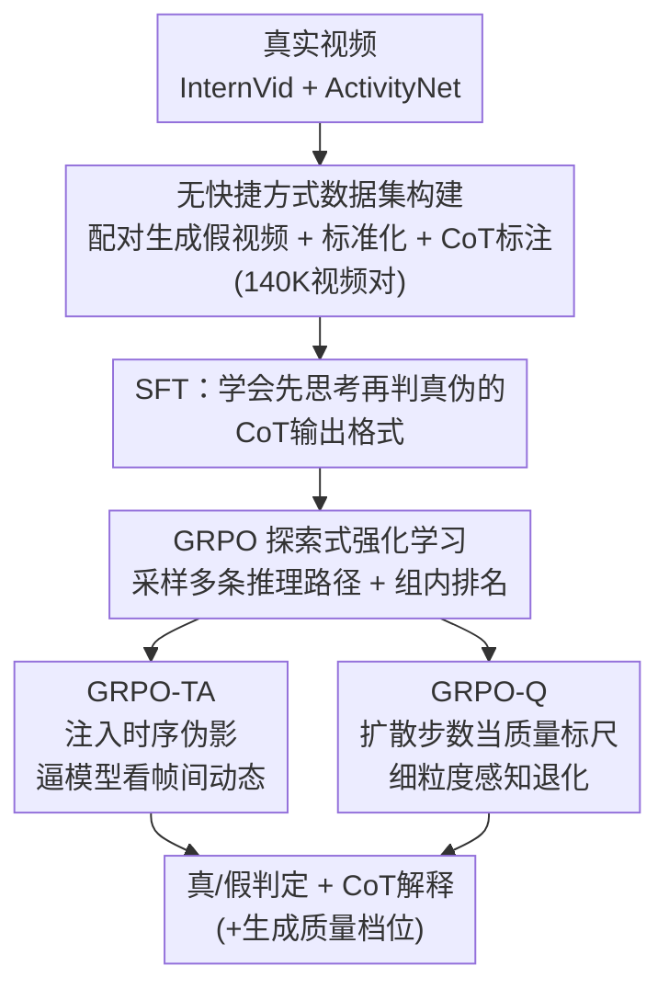

# VidGuard-R1: AI-Generated Video Detection and Explanation via Reasoning MLLMs and RL

**会议**: ICLR 2026  
**arXiv**: [2510.02282](https://arxiv.org/abs/2510.02282)  
**代码**: [项目页面](https://vidguard-r1.github.io/)  
**领域**: 多模态VLM  
**关键词**: AI生成视频检测, MLLM推理, GRPO, 时序伪影, 可解释取证

## 一句话总结

VidGuard-R1 是首个采用 GRPO（Group Relative Policy Optimization）强化学习微调 MLLM 的视频真伪检测器，通过构建 14 万无快捷方式的真/假视频对数据集，并设计时序伪影奖励和扩散步数质量奖励两种专用奖励机制，在自建数据集上达到 86.17% 准确率，在 GenVidBench 和 GenVideo 基准上实现 95%+ 的 SOTA 零样本检测性能，同时生成可解释的思维链推理。

## 研究背景与动机

**领域现状**：AI 视频生成模型（Sora、HunyuanVideo、Wan 等）的视频质量飞速提升，生成视频与真实视频的界限日益模糊，带来虚假信息传播、隐私侵犯、诈骗等严重社会风险，亟需准确且可解释的检测工具。

**现有痛点**：

1. **传统检测器局限性大**：早期 DeepFake 检测器仅针对面部伪造，无法泛化到开放域多场景视频；时空一致性方法容易被后处理绕过
2. **MLLM 直接应用效果差**：GPT-4o 等强大 MLLM 直接用于视频真伪判断时准确率仅约 57%，与随机猜测相差无几
3. **SFT 微调推理能力弱**：SFT 虽提升了检测准确率，但模型无法生成"为什么是假的"这样有意义的解释——推理能力不足
4. **现有数据集有快捷方式**：GenVideo、GenVidBench 等基准中真假视频在分辨率、帧率、码率、时长上存在系统性差异，模型利用元数据而非视觉真实性进行判断

**核心矛盾**：需要模型既能准确检测又能深度推理"假在哪里"，而 SFT 只能教会格式无法激发探索性推理。

**本文方案**：引入 GRPO 强化学习框架，通过多路径推理采样和组内排名，鼓励模型自主发现物理不一致性，并设计两种专用奖励信号引导时序推理和质量感知。

## 方法详解

### 整体框架

VidGuard-R1 想解决的是"既能准确判断视频真伪、又能说清楚假在哪里"这件事，而单纯把强大的 MLLM 直接拿来用（GPT-4o 准确率仅约 57%）或只做监督微调都做不到。它以 Qwen2.5-VL-7B 为基座，整条流水线分两段：先用 30K 带思维链（CoT）注释的视频做监督微调（SFT），让模型学会"先思考再判真伪"的输出格式；再在 100K 视频上做强化学习（RL），用组相对策略优化（GRPO，Group Relative Policy Optimization）激发模型自主探索推理路径。检测能力的真正来源是 RL 阶段——其中两个针对生成视频内在缺陷设计的专用奖励 GRPO-TA、GRPO-Q，一个逼模型盯住时序、一个逼模型感知质量退化，最终输出真/假判定、可解释的思维链，以及对生成视频的质量档位估计。

### 关键设计

**1. 无快捷方式的训练数据：让模型学视觉真实性而非元数据**

现有基准（GenVideo、GenVidBench）的致命问题是真假视频在低级特征上系统性可分——真实视频常 >10 秒、生成视频 <4 秒，分辨率、帧率、码率也各不相同，模型只要数元数据就能"作弊"，根本没在看画面。本文构建 140K 视频对（70K 真 + 70K 假）消除这种捷径：真实视频取自 InternVid（55K）和 ActivityNet（15K），再用 HunyuanVideo-I2V（50K）和 CogVideoX-5B（20K）以真实视频的首帧加文本描述生成一一对应的假视频，使真假样本内容配对、抹掉内容偏置。所有视频统一标准化为 49 帧、8 FPS、720×480、YUV420p，彻底抹平元数据差异。最后用 Qwen2.5-VL-72B 在给定真伪标签的条件下，沿物体交互、背景细节、光照不一致等维度自动标注 CoT 推理注释，供后续 SFT 学习解释格式（其中 30K 用于 CoT 学习、100K 用于 RL）。这样训出的模型被迫从画面本身找破绽，泛化才有可能。

**2. GRPO 探索式强化学习：从被动模仿升级为主动探索推理路径**

光有数据还不够——SFT 只能让模型照抄注释里的理由、学会输出格式，本身不具备判别能力（消融里 SFT 仅 66%）；DPO 靠静态偏好对（把配对真假视频的 CoT 互换构造正负样本），难以捕捉不断演化的时序不一致。GRPO 换了条路：对同一视频采样一组 $G$ 个推理输出，用组内相对排名来更新策略——优势项 $A_i$ 把奖励 $r_i$ 在组内归一化，鼓励模型自己探索、对比多条推理路径，而不是死记一条。因为不依赖偏好标注，视频标签可直接当奖励信号（预测对给 1、错给 0）。检测能力的真正来源就是这一步：消融里从 DPO 到 GRPO 再提约 2%，零样本泛化大幅领先，正是因为探索-排名学到的是物理一致性而非偏好捷径，也为下面两个专用奖励留出了改造奖励函数的接口。

**3. GRPO-TA：用时序伪影逼模型看"动起来对不对"**

标准 GRPO 容易躺在单帧线索上（像素失真、光照异常）拿分，对时序不一致性视而不见。GRPO-TA（GRPO with Temporal Artifacts）主动往训练里注入时序破坏来纠偏：对视频按高斯分布选一段区域做片段重复或帧序反转，制造原本不存在的时序异常，这些篡改后的视频都应被判为假，模型认出来就给额外奖励。奖励设计刻意非对称——真实视频运动连贯，被篡改后的异常更隐蔽，认出来给高奖励 $\alpha_1 = 0.5$；生成视频本就运动不稳、破绽多，篡改后更易发现，只给 $\alpha_2 = 0.3$，把学习压力压到难的一侧。为避免模型还没学好时乱给奖励，额外奖励 $w_i$ 仅在原始视频已预测正确、且篡改视频的组内准确率 $\tilde{p} > \mu = 0.8$ 时才激活，整体写作

$$r_i^{\text{GRPO-TA}} = \begin{cases} r_i^{\text{GRPO}} + w_i, & \text{若 } o_i \text{ 正确且 } \tilde{p} > \mu \\ r_i^{\text{GRPO}}, & \text{否则} \end{cases}$$

这一项把模型的注意力从静态像素拉到帧间动态，正是生成视频最易露馅的地方。

**4. GRPO-Q：用扩散步数当"质量标尺"做细粒度感知**

扩散模型有个天然属性——反向去噪步数越少，生成视频质量越差、伪影越重。GRPO-Q（GRPO with Quality evolutionary videos）把这个连续属性变成可监督的信号：对 12K 真实视频用 10-50 不等的扩散步数各生成 5 个质量档（对应 20%、40%、60%、80%、95%），每个生成模型凑出 72K 样本，让模型不止判真假、还要估出生成视频退化到什么程度。标签空间从二值扩展为 $\mathcal{Y} = \{\text{real}\} \cup \{\text{fake-}s\}$（$s$ 为扩散步数）。奖励按预测档位与真实档位的接近程度给分——真/假判错给 0，完全对上得满分 $\delta = 1$，只判对真假但步数估偏则按距离折算 $g(o_i, y_i) = \delta \cdot (1 - |s(o_i) - s(y_i)|)$，其中 $s(\cdot)$ 把输出映射到 $[0,1]$ 的归一化质量刻度。把二值判真伪升级成连续质量回归，模型对"假"的理解从有无变成程度，这也是消融里增益最大的一项（+2.5%）。

## 实验结果

### 主实验：自建数据集上的检测性能

| 方法 | 类型 | CogVideoX 准确率(%) | HunyuanVideo 准确率(%) |
|------|------|:---:|:---:|
| I3D | CNN | 64.78 | 62.13 |
| SlowFast | CNN | 77.87 | 77.03 |
| TimeSformer | Transformer | 78.53 | 74.55 |
| VideoSwin | Transformer | 76.81 | 79.71 |
| GPT-4o | MLLM | 56.81 | 57.42 |
| Qwen2.5-VL-7B | MLLM | 50.95 | 52.83 |
| VidGuard-R1 (CoT/SFT) | MLLM | 66.18 | 63.19 |
| VidGuard-R1 (DPO) | MLLM | 79.13 | 80.88 |
| VidGuard-R1 (GRPO) | MLLM | 81.30 | 81.90 |
| VidGuard-R1 (GRPO-TA) | MLLM | 82.17 | 83.72 |
| VidGuard-R1 (GRPO-Q) | MLLM | **84.32** | **86.17** |

关键观察：(1) Qwen2.5-VL-7B/GPT-4o 直接应用接近随机（~50-57%）；(2) SFT 将准确率提升至 66%，但仍不如传统视频模型；(3) GRPO 在 DPO 基础上再提 ~2%；(4) GRPO-TA 和 GRPO-Q 分别再提 ~2% 和 ~5%，证实专用奖励的有效性。

### 跨基准零样本泛化

| 方法 | GenVidBench 均值(%) | GenVideo 最优指标 |
|------|:---:|:---:|
| MViT V2 | 79.90 | - |
| GPT-4.1 mini | 59.62 | - |
| VidGuard-R1 (GRPO, 零样本) | 96.37 | F1: 0.97 |
| VidGuard-R1 (GRPO, 微调) | **97.53** | F1: **0.98** |

VidGuard-R1 在 GenVidBench 上零样本达到 96.37%，超过先前 SOTA（MViT V2, 79.90%）约 17 个百分点；在 GenVideo 上 F1 也大幅领先。微调后进一步提升至 97.53%。

### 消融实验：各训练阶段贡献

| 训练配置 | CogVideoX | HunyuanVideo | 增益来源 |
|----------|:---:|:---:|----------|
| SFT (CoT) | 66.18 | 63.19 | 基础推理格式 |
| + DPO | 79.13 | 80.88 | 偏好对齐 +15% |
| + GRPO | 81.30 | 81.90 | 组排名探索 +2% |
| + GRPO-TA | 82.17 | 83.72 | 时序推理 +1.8% |
| + GRPO-Q | 84.32 | 86.17 | 质量感知 +2.5% |

每个阶段都带来明确且一致的提升，其中从 SFT 到 DPO 的跳跃最大（~15%），说明偏好学习是关键；GRPO-Q 的质量分级奖励带来最强的增量提升。

## 论文评价

### 优点

1. **首创性**：首次将 GRPO 强化学习应用于 AI 生成视频检测，建立了"检测 + 解释"的范式
2. **奖励设计巧妙**：GRPO-TA 的非对称时序伪影奖励和 GRPO-Q 的扩散步数质量奖励都利用了生成模型的内在特性，针对性强
3. **数据集严谨**：通过标准化消除快捷方式，确保模型学习视觉真实性而非元数据差异
4. **泛化能力突出**：零样本即在 GenVidBench/GenVideo 上达到 95%+，远超之前所有方法

### 不足

1. 基座模型固定为 Qwen2.5-VL-7B，未验证在其他 MLLM 上的通用性
2. GRPO-Q 需要生成多种扩散步数的视频，数据构建成本高
3. 生成模型快速迭代，检测方法的持久有效性不确定

### 评分

⭐⭐⭐⭐ — 将推理型 RL 引入视频取证领域的开创性工作，方法设计精巧、实验充分，为可解释的 AI 安全检测提供了强有力的范式。

<!-- RELATED:START -->

## 相关论文

- [\[ICLR 2026\] SophiaVL-R1: Reinforcing MLLMs Reasoning with Thinking Reward](sophiavl-r1_reinforcing_mllms_reasoning_with_thinking_reward.md)
- [\[NeurIPS 2025\] Video-R1: Reinforcing Video Reasoning in MLLMs](../../NeurIPS2025/multimodal_vlm/video-r1_reinforcing_video_reasoning_in_mllms.md)
- [\[ICLR 2026\] Shuffle-R1: Efficient RL Framework for Multimodal Large Language Models via Data-centric Dynamic Shuffle](shuffle-r1_efficient_rl_framework_for_multimodal_large_language_models_via_data-.md)
- [\[ICLR 2026\] Sparsity Forcing: Reinforcing Token Sparsity of MLLMs](sparsity_forcing_reinforcing_token_sparsity_of_mllms.md)
- [\[ICCV 2025\] AIGI-Holmes: Towards Explainable and Generalizable AI-Generated Image Detection via Multimodal Large Language Models](../../ICCV2025/multimodal_vlm/aigi-holmes_towards_explainable_and_generalizable_ai-generated_image_detection_v.md)

<!-- RELATED:END -->
