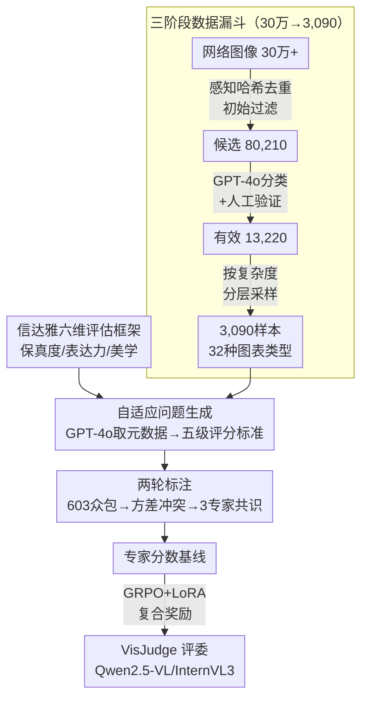

# VisJudge-Bench: Aesthetics and Quality Assessment of Visualizations

## 元信息
- **会议**: ICLR 2026
- **arXiv**: [2510.22373](https://arxiv.org/abs/2510.22373)
- **代码**: [GitHub](https://github.com/HKUSTDial/VisJudgeBench)
- **领域**: 多模态大模型 / 可视化质量评估
- **关键词**: 可视化评估, 美学质量, MLLM-as-a-Judge, 数据可视化, benchmark

## 一句话总结

提出首个面向数据可视化美学与质量评估的综合基准 VisJudge-Bench（3,090 样本，32 种图表类型），并训练 VisJudge 模型，将 MAE 相比 GPT-5 降低 23.9%，与人类专家的一致性提升 60.5%。

## 研究背景与动机

数据可视化是将复杂数据转化为直观洞察的有效方式，其质量取决于三个维度：**保真度**（Fidelity，数据是否准确呈现）、**表达力**（Expressiveness，信息是否清晰传达）和**美学**（Aesthetics，设计是否美观）。然而，现有工作存在明显空白：

**图表问答基准**（如 ChartQA、ChartInsights）只关注图表内容理解，不评估设计质量

**自然图像美学基准**（如 AVA、ArtiMuse）仅关注艺术美感，忽略可视化的核心目的——有效传达数据

**可视化评估基准**（如 VisEval）主要评估 NL2VIS 生成准确性，而非可视化本身的内在设计质量

因此，**缺乏一个系统性框架来衡量 MLLM 在可视化美学与质量评估方面的综合能力**。即便最先进的 GPT-5，在该任务上 MAE 高达 0.553，与人类评分的相关性仅 0.428。

## 方法详解

### 整体框架

这篇论文要解决的是"机器能不能像人一样判断一张可视化图表好不好"——既要看数据有没有被准确呈现，也要看信息读不读得懂、画面美不美。论文给出两件东西：一个 3,090 样本的专家标注基准 VisJudge-Bench，和一个在它之上训练出来的可视化"评委"模型 VisJudge。

整条流水线可以顺着数据流看一遍：先用一个"信达雅"六维框架定义"好可视化"该从哪些角度打分；再从网络海量图像里一层层漏斗筛出 3,090 张合格可视化，给每张图按其类型自适应生成五级评分标准、经众包加专家两轮标注得到可信分数；最后用 GRPO 强化学习把通用 MLLM 微调成专门给可视化打分的模型。前三步是造"考卷和标准答案"，最后一步是训"考官"。

### 关键设计

**1. "信达雅"六维评估框架：把模糊的"好不好看"拆成可打分的维度**

"这张图好不好"横跨数据准不准、信息读不读得懂、画面美不美三个层面，但这些概念太抽象，模型给分会飘。论文借中国翻译理论的"信、达、雅"把质量落到六个可观测维度：**保真度（Fidelity）**看视觉是否忠实反映数据，专门检测轴设置不当、刻度失真、截断基线等误导性编码；**表达力（Expressiveness）**再分为*语义可读性*（能否清晰解码视觉元素）和*洞察发现*（能否揭示深层模式、趋势、异常）；**美学（Aesthetics）**细分为*设计风格*（创新独特）、*视觉构图*（布局与元素定位的平衡秩序）、*色彩和谐*（配色在美感与信息传达间的取舍）。关键在于每个维度都收窄到能写进评分标准的具体观测点，这套维度既是后续生成评分问题的模板来源，也是标注和模型打分共同遵循的坐标系。

**2. 三阶段数据漏斗：从 30 万图像收到 3,090 高质量样本**

网络爬来的图像噪声大、重复多、很多根本不是合格可视化，直接拿来会污染基准。论文用逐级收紧的漏斗筛：先做**初始过滤**，自动脚本加感知哈希去重把 30 万+ 图像压到 80,210 候选；再用 GPT-4o 自动分类加人工验证剔除非可视化与低质图，得到 13,220 有效样本；最后做**分层采样**，按复杂度均衡选出 3,090 样本——单图 1,041、多图 1,024、仪表盘 1,025，覆盖 32 种子类型。分层这一步是关键：它保证从简单单图到复杂仪表盘的全谱系覆盖，避免基准被某一类常见图表主导而失去区分度。

**3. 自适应问题生成 + 两轮专家标注：给每张图配定制评分标准并换来可信标签**

这一步要解决两个连在一起的问题：统一的问题模板会问错重点，而单纯众包打分噪声又太高。论文先用 GPT-4o 从每张图提取元数据（图表类型、视觉元素），据此从预定义模板实例化出**定制化评分问题和五级评分标准**——例如保真度维度从"1 分 = 存在截断轴或误导性刻度"细化到"5 分 = 条形长度严格与显示值成比例"，把每一档分数锚定到可观测特征上。有了明确标准后再走两轮标注：第一阶段 603 名众包工人独立打分，每样本 3 人 × 6 维度；第二阶段基于评分**方差**识别冲突样本，做异常值移除与恶意评分检测；第三阶段由 3 位可视化分析专家审查、对复杂案例讨论达成共识。"先定标准、再众包广度、最后专家在分歧处精修"的组合，得到了相对可信的人类评分基线，也就是后面训练的标准答案。

**4. GRPO 微调出领域评委：用复合奖励把通用 MLLM 拉进可视化评估**

通用 MLLM 缺乏可视化评估的专业先验（最强的 GPT-5 MAE 仍高达 0.553），必须针对性训练。论文把基准按 70%/10%/20% 划分训练/验证/测试（2,163/279/648 样本），在 Qwen2.5-VL（3B/7B）、InternVL3-8B、Llava-v1.6-mistral-7B 等基座上用 GRPO 强化学习微调，并用 LoRA 做参数高效微调（5 个 epoch，学习率 $1 \times 10^{-5}$）。奖励是复合形式：准确度奖励最小化预测分与真值的误差、把模型往人类标注拉，格式奖励确保输出结构化可解析。两个奖励同时优化"打分准"和"输出规范"，最终一个 7B 小模型经微调即显著超越 GPT-5。

## 实验

### 主要结果（MAE ↓）

| 模型 | Overall | Fidelity | Readability | Insight | Design | Composition | Color |
|------|---------|----------|-------------|---------|--------|-------------|-------|
| GPT-5 | 0.553 | 0.862 | 0.781 | 0.778 | 0.649 | 0.699 | 0.682 |
| GPT-4o | 0.610 | 0.988 | 0.806 | 0.744 | 0.609 | 0.695 | 0.657 |
| VisJudge (Qwen2.5-VL-7B) | **0.421** | **0.661** | **0.648** | **0.677** | **0.580** | **0.545** | **0.604** |

### 关键发现

1. **GPT-5 仍不足**：即便最强闭源模型，MAE 仍高达 0.553，相关性仅 0.428，表明通用 MLLM 无法自动获得可视化评估的专业能力
2. **VisJudge 显著缩小差距**：最佳 VisJudge（Qwen2.5-VL-7B）MAE 降至 0.421（↓23.9%），相关性升至 0.687（↑60.5%）
3. **开源模型差距更大**：开源模型普遍 MAE > 0.7，尤其在 Fidelity 和 Expressiveness 维度表现最差
4. **美学评估相对容易**：所有模型在 Aesthetics 三个子维度上表现优于 Fidelity 和 Expressiveness

### 消融实验

- GRPO 强化学习显著优于纯 SFT 训练
- 复合奖励设计（准确度 + 格式）优于单一奖励
- 不同架构和参数规模的模型均受益于微调，验证了跨架构泛化性

## 亮点

- 首个面向可视化美学与质量评估的综合基准，填补了重要空白
- "信达雅"三维评估框架设计精巧，六个子维度覆盖全面
- 3,090 个专家标注样本、32 种图表类型，数据质量高
- GRPO 微调有效，小模型经微调后显著超越 GPT-5
- 揭示了当前 MLLM 在可视化评估上的关键不足

## 局限性

- 评估仅基于视觉层面的保真度，缺乏源数据进行真正的数据-视觉一致性验证
- 样本主要来自网络爬取，可能存在分布偏差
- 仅评估了中小规模开源模型的微调，未探索更大规模模型
- 人类专家标注本身存在主观性，不同标注者之间可能存在偏差

## 相关工作

- **可视化推荐**：Voyager、Draco（规则驱动），VizML、DeepEye（学习驱动）
- **NL2VIS 评估**：nvBench、MatPlotAgent — 关注代码生成而非设计质量
- **MLLM-as-a-Judge**：通用美学评估（AVA）、图表理解（ChartQA）、可视化评估（VisEval）均有局限
- **图像美学评估**：AVA、ArtiMuse — 针对自然图像，不适用于可视化

## 评分

- **新颖性**: ⭐⭐⭐⭐ — 首个面向可视化质量评估的专用基准
- **技术深度**: ⭐⭐⭐⭐ — 评估框架设计全面，标注流程严谨
- **实验充分度**: ⭐⭐⭐⭐ — 12 个模型系统评测，消融充分
- **实用价值**: ⭐⭐⭐⭐ — 对可视化自动评估有直接推动作用

<!-- RELATED:START -->

## 相关论文

- [\[ICLR 2026\] WebDS: An End-to-End Benchmark for Web-based Data Science](webds_an_end-to-end_benchmark_for_web-based_data_science.md)
- [\[ICLR 2026\] VTool-R1: VLMs Learn to Think with Images via Reinforcement Learning on Multimodal Tool Use](vtool-r1_vlms_learn_to_think_with_images_via_reinforcement_learning_on_multimoda.md)
- [\[ICLR 2026\] Vision-Zero: Scalable VLM Self-Improvement via Strategic Gamified Self-Play](vision-zero_scalable_vlm_self-improvement_via_strategic_gamified_self-play.md)
- [\[ICLR 2026\] VLM-SubtleBench: How Far Are VLMs from Human-Level Subtle Comparative Reasoning?](vlm-subtlebench_how_far_are_vlms_from_human-level_subtle_comparative_reasoning.md)
- [\[ICLR 2026\] Why Reinforcement Fine-Tuning Preserves Prior Knowledge Better: A Data Perspective](why_reinforcement_fine-tuning_enables_mllms_preserve_prior_knowledge_better_a_da.md)

<!-- RELATED:END -->
