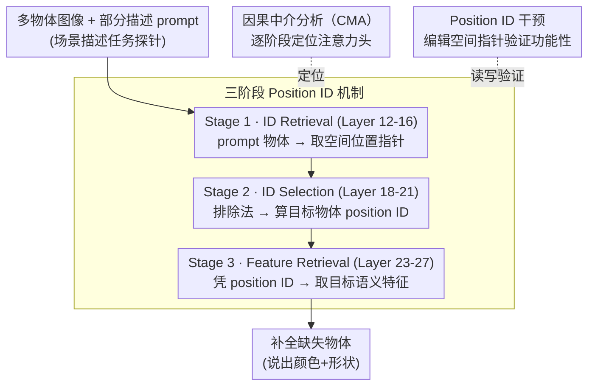

# Visual Symbolic Mechanisms: Emergent Symbol Processing in Vision Language Models

**会议**: ICLR 2026 Oral  
**arXiv**: [2506.15871](https://arxiv.org/abs/2506.15871)  
**代码**: 有（将开源数据集、分析和干预代码）  
**领域**: 多模态VLM / 可解释性  
**关键词**: visual binding, position IDs, mechanistic interpretability, causal mediation, VLM

## 一句话总结
发现 VLM 内部涌现了一套三阶段符号处理机制（ID retrieval → ID selection → feature retrieval），利用内容无关的空间位置索引（position IDs）来解决视觉绑定问题，并证明绑定错误可直接追溯到这些机制的失败。

## 研究背景与动机

**领域现状**：VLM 使用组合性表示（如"红色"+"方形"）来高效编码视觉场景。语言模型中已发现涌现的 binding IDs——内容无关的符号索引——用于追踪实体与属性的绑定关系。

**现有痛点**：VLM 在需要精确绑定的任务上表现极差（计数、视觉搜索、视觉类比），例如无法区分"红方+蓝圆"与"蓝方+红圆"。这就是经典的 **绑定问题（binding problem）**。但 VLM 内部是否像纯文本 LM 一样存在符号处理机制，尚一无所知。

**核心矛盾**：组合性表示的代价是必须解决绑定问题——将正确的特征绑定到正确的物体。VLM 的很多"谜题"式失败（如计数错误）本质上都是绑定失败，但我们不知道这些失败的内部机制是什么。

**本文目标** (a) VLM 是否使用类似符号的机制来处理视觉绑定？ (b) 这些机制具体是什么？ (c) 绑定错误是否可以追溯到这些机制的失败？

**切入角度**：借鉴纯文本 LM 中 binding IDs 的发现和认知科学中的视觉索引理论（Pylyshyn, 2001），假设 VLM 可能利用 **空间位置** 作为内容无关的索引来绑定物体特征。

**核心 idea**：VLM 涌现出三种注意力头（ID retrieval、ID selection、feature retrieval），利用空间位置作为符号变量来索引和检索视觉对象特征。

## 方法详解

### 整体框架
这篇论文想搞清楚一件事：VLM 在处理"哪个特征属于哪个物体"时，内部到底发生了什么。作者用**场景描述任务**当探针——给模型一张含多个形状/颜色物体的图片和一段只描述了部分物体的文字，让它补全缺失物体。这个任务逼着模型必须在脑子里把"位置"和"特征"对应起来，于是绑定机制会暴露在中间层的激活里。作者发现 VLM 内部涌现出一条三阶段流水线（ID retrieval → ID selection → feature retrieval），并把三种分析手段叠在一起去验证它：表征分析（PCA、RSA）看激活的几何结构、因果中介分析（CMA）把每个阶段钉到具体注意力头上、干预实验直接编辑这些头确认它们在控制输出。整套流程在 7 个 VLM（Qwen2-VL、Qwen2.5-VL-3B/7B/32B、Llava1.5-7B/13B、Llava-OneVision-7B）上跑下来，结论高度一致。

### 关键设计

**1. 三阶段 Position ID 机制：用与内容无关的空间位置当符号指针，把绑定问题拆成"先取位置、再算位置、最后凭位置取特征"**

这是论文的核心发现，针对的正是 VLM 为什么会"红方蓝圆"和"蓝方红圆"分不清。作者发现模型并不是直接在像素特征上做绑定，而是在中间层涌现出一套分工明确的处理流水线。**Stage 1（ID Retrieval，约 Layer 12-16）**负责"取位置"：拿到 prompt 里描述的物体（如"红色方形"），ID retrieval heads 去对应的图像 token 里把它的**空间位置索引**取出来——注意取出的是一个抽象的空间指针，而不是物体的颜色形状本身。**Stage 2（ID Selection，约 Layer 18-21）**负责"算位置"：手里已经有了已知物体的 position ID，模型通过**排除法**推断出还没被描述的那个目标物体的 position ID。**Stage 3（Feature Retrieval，约 Layer 23-27）**负责"取特征"：拿 Stage 2 算出的 position ID 当 query，回到图像 token 里把目标物体的语义特征（颜色、形状）检索出来，最终说出答案。

这套划分不是凭空猜的，PCA 给了很直观的旁证：Layer 19 的表示按**空间位置**聚类（不同特征的物体只要位置相同就聚到一起），到 Layer 27 则翻转成按**物体特征**聚类（位置信息退场），这个"先位置后特征"的转变恰好对应 Stage 2→3 的交接。这也和认知科学里的视觉索引理论（Pylyshyn, 2001）对上——人脑同样靠一组与内容无关的空间索引（FINST）来追踪物体，说明大模型可能独立摸索出了类似生物视觉的解法。

**2. 因果中介分析（CMA）：把"相关"升级成"因果"，逐阶段定位负责的注意力头**

光看 PCA 聚类只能说明激活和位置/特征相关，没法证明某个头**真的在执行**某个阶段。作者为三个阶段各设计了一组 CMA 条件，思路都是"准备一对只在关键变量上不同的图片，把某些头的输出做 patch，看下游预测怎么变"。具体地：**ID retrieval 条件**把 clean 与 modified 图里物体的位置互换，patch 发生在 prompt token 处的注意力头输出；**ID selection 条件**同样互换位置，但 patch 落在最后一个 token 处；**feature retrieval 条件**则让两张图里目标物体的特征不同，patch 最后 token 处的输出。每个头对某个阶段的因果贡献用如下打分衡量：

$$s = (M(c_1^*)[a_1^*] - M(c_1^*)[a_1]) - (M(c_1)[a_1^*] - M(c_1)[a_1])$$

它度量的是"把这个头的输出从原始换成被干预版本后，模型对正确答案 $a_1^*$ 与原答案 $a_1$ 的 logit 差被推动了多少"，并扣掉不 patch 时的基线效应。三个条件各自精确对准一个阶段，于是能干净地把每种功能映射到具体的一小撮头上。

**3. Position ID 干预：直接编辑空间指针，检验它是不是一个可读可写的通用索引**

发现了机制还不够，作者要证明 position ID 真的是**功能性**的——能写进去、能泛化、能跨任务迁移。做法是对相关头的输出施加一个加性编辑：

$$\tilde{o}_h(x) = o_h(x) + \alpha \cdot (d_t - d_o)$$

其中 $d_o$ 是物体原始 ID 的估计方向、$d_t$ 是想把它改写成的目标 ID 方向，$\alpha$ 控制强度。如果 position ID 真是通用索引，那么往里加一个 $d_t - d_o$ 就应该系统性地让模型"以为"物体挪到了新位置，进而改变输出。作者在三类越来越接近真实的设置上验证：逼真渲染图（PUG 环境）、真实照片（COCO），以及把场景描述任务里估出的 ID 直接搬到**空间推理任务**上用（跨任务迁移）。干预在这些设置下普遍奏效，说明这套空间索引不是某个合成任务的特例，而是 VLM 处理视觉的通用底层机制。

### 一个完整示例
拿一张"左边红方、右边蓝圆"的图、配上只描述了"红色方形"的 prompt，让模型补全缺失物体。**Stage 1** 的 ID retrieval heads 顺着"红色方形"去图里把它的空间指针取出来——拿到的是"左边那个位置"，而不是"红色/方形"本身。**Stage 2** 的 ID selection heads 看到已知物体占了"左边"，用排除法算出目标物体的 position ID 是"右边"。**Stage 3** 的 feature retrieval heads 拿"右边"这个指针回图像 token 里取特征，读出"蓝色、圆形"，模型最终答出"蓝色圆形"。这时若用设计 3 的干预把 Stage 2 算出的 ID 从"右边"改写成"左边"，模型就会转而去描述红方——这正是 position ID 可读可写、确实在驱动输出的直接证据。

### 损失函数 / 训练策略
本文是机制分析工作，不训练或微调任何模型，所有实验都跑在预训练好的开源 VLM 上。

## 实验关键数据

### 主实验

| 实验 | 模型 | 干预有效率 | 说明 |
|------|------|----------|------|
| PUG 图像干预 (ID retrieval) | 7 模型平均 | >79% | 编辑 ID retrieval heads 可控制模型输出 |
| PUG 图像干预 (ID selection) | 7 模型平均 | >79% | 编辑 ID selection heads 同样有效 |
| PUG 图像干预 (feature retrieval) | 7 模型平均 | >79% | 编辑 feature retrieval heads 有效 |
| 颜色检索干预 | 所有模型 | 高 | Position IDs 存储在物体对应的图像 patch keys 中 |
| 跨任务迁移 | 5/7 模型 | 显著提升 | 场景描述任务的 IDs 迁移到空间推理任务有效 |

### 消融/分析实验

| 分析 | 关键发现 | 说明 |
|------|---------|------|
| 相对 vs 绝对编码 | Qwen 系列使用**相对**位置编码 | Llava 系列差异不明显 |
| 高/低熵绑定错误 | 低熵场景（物体共享特征）ID retrieval 与 selection 精度下降 | 直接解释了绑定错误的原因 |
| 高熵 ID → 低熵修复 | Qwen2.5-VL-3B 提升 11.1%，Llava1.5-13B 提升 10.4% | 因果性证明 ID 机制失败导致绑定错误 |
| 计数任务消融 | 消除 top-250 heads → 性能降至 0%，bottom-500 → 仍 ~70% | Position ID heads 对计数任务至关重要 |

### 关键发现
- **三阶段架构跨模型/跨尺度一致**：在 Qwen2-VL, Qwen2.5-VL (3B/7B/32B), Llava1.5 (7B/13B), Llava-OneVision 7 个模型上都观察到相同模式
- **Position IDs 使用相对编码**：Qwen 系列明确使用相对于物体组的相对位置，而非图像中的绝对位置
- **IDs 存储在 patch keys 中**：Position IDs 存在于物体对应的图像 patch 的 key 向量中，独立于 RoPE 位置编码
- **机制可迁移**：从场景描述任务估计的 IDs 可直接用于改善空间推理任务的表现
- **绑定错误可因果性修复**：将高熵（特征区分度高）条件下的精确 IDs 注入低熵（特征相似）条件，可显著减少绑定错误

## 亮点与洞察
- **揭示了 VLM "看世界"的方式**：VLM 不是直接处理像素特征，而是先在中间层建立空间索引系统，再用索引去取特征。这与认知科学中的视觉索引理论（Pylyshyn 2001）高度一致，暗示深度神经网络可能独立发现了类似生物视觉的解决方案
- **从诊断到修复的路径**：论文不仅发现了机制，还展示了通过干预 position IDs 可以部分修复绑定错误（低熵场景提升 4.6-11.1%）。这为架构改进提供了具体方向——可以设计显式支持空间索引的架构，或通过 spatial pointing 任务训练来增强这些机制
- **跨模态的统一符号处理**：纯文本 LM 用 binding IDs，VLM 用 position IDs，本质上都是涌现的内容无关符号变量。这支持了"大规模 Transformer 会自发发展符号处理能力"的假说

## 局限与展望
- **实验场景偏简单**：主要用 2-3 个形状/颜色的合成图片，PUG 环境虽然逼真但物体仍简单。真实世界的多物体场景（如室内场景有几十个物体）是否仍适用？
- **仅分析开源模型**：GPT-4V、Gemini 等闭源模型无法分析，且这些模型在绑定任务上表现更好，可能有不同的机制
- **未研究文本-视觉交互**：Position IDs 如何与 prompt 中的语言表示交互？当 prompt 更复杂时（多跳推理问句）机制是否改变？
- **修复效果有限**：高熵→低熵干预最多提升 11.1%，说明绑定错误还有其他来源未被捕获
- **改进方向**：可考虑在训练中加入 spatial pointing/grounding 任务来增强 position ID 机制；或设计 object-centric attention 架构（如 Slot Attention）来显式支持空间索引

## 相关工作与启发
- **vs Binding IDs (Feng & Steinhardt 2023)**：纯文本 LM 的 binding IDs 是在序列维度上分配符号变量，VLM 的 position IDs 则利用二维空间作为索引维度，更自然地对应视觉场景的空间结构
- **vs Yang et al. 2025 (Emergent symbolic mechanisms in LMs)**：该工作发现 LM 在抽象推理中用符号变量，本文将此扩展到视觉域，且发现的电路功能不同（场景解析 vs 关系归纳），不是简单的跨模态迁移
- **与 VHD-Guided Adaptive Visual Re-injection idea 相关**：Position ID 机制的发现暗示长链多模态推理中，视觉信息可能通过空间索引来持续追踪，长推理链条中 position ID 的退化可能是视觉信息遗忘的原因之一

## 评分
- 新颖性: ⭐⭐⭐⭐⭐ 首次揭示 VLM 内部的视觉符号处理机制，理论意义重大
- 实验充分度: ⭐⭐⭐⭐⭐ 7 个模型×3 种分析方法（PCA/RSA/CMA）×多种干预实验，证据极其充分
- 写作质量: ⭐⭐⭐⭐⭐ Yoshua Bengio 参与，写作极为清晰，图表精美，逻辑链条完整
- 价值: ⭐⭐⭐⭐⭐ 对理解 VLM 失败模式和未来架构设计有直接启发，连接 AI 和认知科学

<!-- RELATED:START -->

## 相关论文

- [\[CVPR 2026\] Mechanisms of Object Localization in Vision-Language Models](../../CVPR2026/multimodal_vlm/mechanisms_of_object_localization_in_vision-language_models.md)
- [\[CVPR 2026\] Hierarchical Process Reward Models are Symbolic Vision Learners](../../CVPR2026/multimodal_vlm/hierarchical_process_reward_models_are_symbolic_vision_learners.md)
- [\[CVPR 2026\] Circuit Tracing in Vision-Language Models: Understanding the Internal Mechanisms of Multimodal Thinking](../../CVPR2026/multimodal_vlm/circuit_tracing_in_vision-language_models_understanding_the_internal_mechanisms_.md)
- [\[CVPR 2026\] Act2See: Emergent Active Visual Perception for Video Reasoning](../../CVPR2026/multimodal_vlm/act2see_emergent_active_visual_perception_for_video_reasoning.md)
- [\[CVPR 2026\] Keep it SymPL: Symbolic Projective Layout for Allocentric Spatial Reasoning in Vision-Language Models](../../CVPR2026/multimodal_vlm/keep_it_sympl_symbolic_projective_layout_for_allocentric_spatial_reasoning_in_vi.md)

<!-- RELATED:END -->
