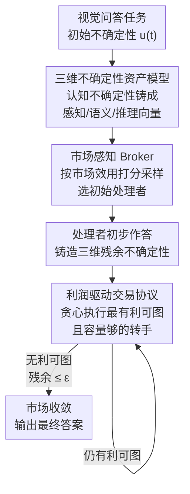

# Why Keep Your Doubts to Yourself? Trading Visual Uncertainties in Multi-Agent Bandit Systems

**会议**: ICLR 2026  
**arXiv**: [2601.18735](https://arxiv.org/abs/2601.18735)  
**代码**: 无  
**领域**: 多模态VLM/多智能体协调  
**关键词**: 多智能体系统, VLM协调, 不确定性交易, 市场机制, Thompson Sampling, 成本优化

## 一句话总结

提出 Agora 框架，将多智能体 VLM 协调问题重构为去中心化的不确定性交易市场——将认知不确定性铸造为可量化的三维可交易资产（感知/语义/推理），通过利润驱动的交易协议和市场感知的 Thompson Sampling Broker 实现成本高效的均衡分配，在 5 个多模态基准上一致超越启发式方法（如 MMMU 上 +8.5% 准确率同时成本降低 3 倍以上）。

## 研究背景与动机

**领域现状**：VLM 驱动的多智能体系统（MAS）在视觉理解任务中展现出强大的集体智能潜力，但在实际部署中面临**经济可行性危机**——操作成本急剧上升，阻碍大规模部署。

**问题根源**：现有范式将智能视为"蛮力商品"而非稀缺经济资源。当认知不确定性（主要成本驱动因素）缺乏经济纪律管理时，产生冗余计算，导致决策成本过高。

**现有方法缺陷**：
   - **聚合类启发式（MoA）**：通过统计共识等同认知真理，假设误差独立同分布（i.i.d.），但 VLM 共享架构偏差导致相关误差被放大，产生系统性幻觉。
   - **路由类启发式（KABB）**：依赖历史性能和语义相似度的代理评分 $S = \alpha \cdot P_{\text{hist}} + \beta \cdot \text{Sim}_{\text{sem}}$，混淆过去表现与未来成本效益，既**不感知成本**（代价向量 $\mathbf{c}$ 缺失）也**不感知不确定性结构**（向量 $\mathbf{u}(t)$ 被压缩为标量）。

**理论证明**：论文正式证明了"不可知协调低效定理"（Theorem 1）——任何同时满足成本不可知和不确定性结构不可知的协调机制对于优化目标 $\min_\pi \mathbb{E}[\mathcal{C}(\pi, \mathbf{u}(t), \mathbf{c}, \Xi)]$ 而言是可证明次优的。

**核心动机**：需要从启发式补丁转向一种拥抱去中心化本质的新范式——基于市场机制的协调，通过价格信号和经济激励实现信息不对称下的高效协调。

## 方法详解

### 整体框架

Agora 把多智能体 VLM 协调改写成一个去中心化微经济：每个智能体先把自己对一道题的"看不准"量化成可标价的不确定性资产，由一个市场感知的 Broker 挑出最划算的智能体先接手，再按"只做赚钱买卖"的规则把这些资产反复转手给更擅长处理它的同伴，直到没有任何有利可图的交易、市场收敛为止。系统里有 $N$ 个异构 VLM 智能体 $\mathcal{A} = \{a_1, \dots, a_N\}$，每个智能体带一个单位处理成本 $c_i > 0$ 和三维专长向量 $\boldsymbol{\xi}_i = [\xi_{i,\text{perc}}, \xi_{i,\text{sem}}, \xi_{i,\text{inf}}]^T$，整体要在把最终残余不确定性压到阈值以下的约束下最小化期望协调成本：$\min_\pi \mathbb{E}_{t \sim \mathcal{T}}[\mathcal{C}(\pi, \mathbf{u}(t), \mathbf{c}, \Xi)]$ s.t. $\|\mathbf{u}_{\text{final}}\| \leq \epsilon$。论文把整个过程落成一个两阶段算法：Phase 1 由 Broker 做效用最大化的初始化，Phase 2 进入迭代市场、对总成本函数做确定性的贪心下降。

### 关键设计

**1. 三维不确定性资产模型：把"看不准"拆成可路由的专家化资产**

以往方法用一个标量代表整体不确定性，于是无论是认错字、读不懂语境还是算错数，都只能让同一个模型重算，造成"一刀切"的冗余计算。Agora 先把总不确定性区分为可交易的认知不确定性（Epistemic，源自模型知识不足、可通过换人解决）和不可交易的偶然不确定性（Aleatoric，源自数据本身噪声），再把可交易部分铸造成三维向量 $\mathbf{u}_{\text{epis}} = [u_{\text{perc}}, u_{\text{sem}}, u_{\text{inf}}]^T$，分别对应视觉感知层面（如 OCR、物体识别）、语义理解层面（如上下文推断）和逻辑推理层面（如数学、因果）的"看不准"。每个智能体维护一个随交易动态变化的不确定性组合 $\mathbf{U}(a_i, t) = \mathbf{U}_{\text{base}}(a_i, t) + \sum_{j \neq i} \mathbf{U}_{\text{transfer}}(a_j \to a_i, t)$，其中第一项是它自身产生的不确定性，第二项是别人转移给它的。向量化之后，系统就能把每一类不确定性精准路由到最擅长那一维的专家，而不是让所有人对整道题重复劳动。

**2. 市场感知 Broker：用扩展 Thompson Sampling 选好"第一个接手人"**

交易能否收敛到好的均衡，很大程度取决于谁先拿到任务，纯随机或纯历史评分的选择都会浪费交易回合。Agora 的 Broker 把经典 Thompson Sampling 扩展成一个多因子市场效用，并从中采样选出初始智能体组合 $S$：

$$\tilde{\theta}_S^{(t)} = (\mathbb{E}[\text{Reward}_S^{(t)}] - \text{Cost}_S^{(t)}) \cdot \exp(-\lambda \cdot \text{Dist}(S, t)) \cdot U_{\text{strategic}}(S)^\omega \cdot \text{Synergy}(S)^\eta \cdot \gamma^{\Delta t}$$

这个效用把五件事乘在一起：净回报（期望奖励减成本，守住经济理性）、任务距离 $\text{Dist}(S,t)$（智能体与当前任务的匹配度，越近越好故取负指数）、战略不确定性 $U_{\text{strategic}}$（保留探索空间以防过早收敛到次优组合）、协同效应 $\text{Synergy}$（组合内成员能力互补的程度）和时间衰减 $\gamma^{\Delta t}$（让久未更新的历史信息权重下降）。消融显示其中战略不确定性因子贡献最大，去掉它准确率会掉 3 个百分点以上（MMBench 上 $-3.08\%$），说明在冷启动阶段保留探索对找到好均衡至关重要。

**3. 利润驱动交易协议：用经济理性约束每一笔不确定性转手**

选定第一个处理者后还需要回答"什么时候该把哪部分不确定性转给谁"，否则转手本身可能比重算更贵。Agora 给每笔交易设一道经济门槛：把不确定性包 $T_{ij}(t)$ 从 $a_i$ 转给 $a_j$ 带来的全局成本变化为 $\Delta \mathcal{C}(T_{ij}(t)) = T_{ij}(t) \cdot [c_j(1 - \xi_j) - c_i]$——接收方处理这部分不确定性的有效代价 $c_j(1-\xi_j)$（成本越低、专长越高则越便宜）减去发送方自己扛着的代价 $c_i$。只有当这笔买卖既有利可图又可行时才执行，即 $\text{Execute trade}(i \to j, T_{ij}(t)) \iff (\Delta \mathcal{C} < 0) \wedge (U_j(t) + T_{ij}(t) \leq C_j(t))$：第一个条件保证交易让系统总成本下降，第二个条件保证接收方还有足够认知容量 $C_j(t)$ 接得住。这样每一笔合法交易都等价于对全局成本函数走了一步贪心下降，市场在反复套利中自然朝低成本均衡收敛。

### 一个完整示例

给定一道视觉问答，Agora 分两阶段跑完一次协调。Phase 1（初始化）：Broker 按市场效用 $\tilde{\theta}_S^{(t)}$ 采样选出最划算的初始处理者 $a_{\text{handler}}$ 接手任务，它给出初步回答并把自己在感知/语义/推理三个维度上的残余不确定性铸造成可交易资产。Phase 2（迭代交易）：市场反复寻找当前 $\Delta\mathcal{C}$ 最负（最有利可图）且接收方容量充足的那笔交易并执行——例如把一段 OCR 上的感知不确定性转给视觉专长更强的智能体、把数学推理的不确定性转给推理专长更强的智能体——每成交一笔总成本就下降一步，直到再也找不到任何有利可图的交易，市场收敛到局部最优均衡，此时残余不确定性已被约束在 $\epsilon$ 以下，输出最终答案。

## 实验关键数据

### 五大基准综合性能

| 模型 | MMMU(Val) | MMBench_V11 | MathVision | InfoVQA | CC-OCR |
|------|-----------|-------------|------------|---------|--------|
| qwen2.5vl-72b | 70.2% | 88.4% | 39.3% | 87.3% | 79.8% |
| gemini-2.0-flash | 70.7% | 83.0% | 41.3% | 83.2% | 73.1% |
| qwen2.5vl-7b | 58.6% | 82.6% | 25.1% | 82.6% | 77.8% |
| gpt-4o-mini | 60.0% | 76.3% | 26.3% | 68.7% | 64.2% |
| gemini-2.5-pro | 81.7% | 88.3% | 63.5% | 81.0% | 73.0% |
| InternVL3-78B | 72.2% | 87.7% | 43.1% | 84.1% | 80.3% |
| **Agora (Ours)** | **79.2% (+8.5%)** | **89.5% (+1.1%)** | **44.3% (+3.0%)** | **88.9% (+1.6%)** | **81.2% (+1.4%)** |

Agora 在 MMBench、InfoVQA、CC-OCR 上取得 SOTA，在 MMMU 上仅次于专用推理模型 gemini-2.5-pro。

### MAB 策略消融（MMMU Val）

| 方法 | Acc (%) | $U_{\text{final\_epis}}$ ↓ | COI ↓ | UAPS (%) ↑ |
|------|---------|--------------------------|-------|------------|
| **Agora (Ours)** | **79.0** | **0.15** | **1.2** | **70.5** |
| Agora (No Trading) | 75.5 | 0.22 | 1.0 | 65.0 |
| KABB Selector + Trading | 76.0 | 0.25 | 1.5 | 65.5 |
| PPO Selector + Trading | 74.0 | 0.28 | 1.6 | 62.0 |
| MCTS Selector + Trading | 74.5 | 0.26 | 1.4 | 63.0 |
| DQN Selector + Trading | 73.0 | 0.30 | 1.7 | 60.0 |

### 模块消融（MMBench_V11）

| 变体 | Acc (%) ↑ | $U_{\text{final}}$ ↓ | COI ↓ | UAPS (%) ↑ | Rel. Cost ↓ |
|------|-----------|---------------------|-------|------------|-------------|
| **Agora (Full)** | **89.50** | **0.16** | **1.25** | **78.33** | 1.00 |
| w/o $U_{\text{strategic}}$ | 86.42 | 0.23 | 1.45 | 71.58 | 1.06 |
| w/o Synergy | 87.91 | 0.19 | 1.30 | 74.88 | 1.03 |
| w/o Dist | 88.53 | 0.18 | 1.27 | 76.21 | 1.01 |
| w/o $\Delta t$ | 89.05 | 0.17 | 1.26 | 77.14 | 1.00 |
| Only Net Return | 82.15 | 0.31 | 1.08 | 60.72 | 0.92 |

去除战略不确定性因子 $U_{\text{strategic}}$ 导致最大性能下降（Acc -3.08%, UAPS -6.75），证明其在引导智能体选择中的关键作用。

## 亮点与洞察

1. **经济学视角的范式创新**：首次将多智能体VLM协调建模为去中心化不确定性交易市场，从微观经济学（市场均衡、套利、资产交易）角度系统解决了成本-性能权衡问题，而非简单堆叠模型。

2. **理论基础扎实**：正式证明了现有启发式方法（MoA、KABB）的次优性定理，不是凭直觉而是通过严格的数学论证建立了新框架的必要性。

3. **成本效率优势显著**：Agora 在 N=1 时就能达到 87.5% 准确率（成本比 0.02057），甚至优于昂贵的 SOTA 模型；N=8 时准确率达到 89.6%，且成本比始终显著低于所有基线。

4. **可扩展性良好**：性能随智能体池多样化平滑上升，在 N=8 左右达到边际收益递减点——符合经济学规律，不需要无限扩展代价高昂的智能体池。

5. **不确定性分解有效**：三维不确定性（感知/语义/推理）分解使系统能根据任务特性精准分配专家，最终残余不确定性显著低于 KABB（0.16 vs 0.21）。

## 局限性

1. **智能体池依赖**：Agora 的性能上界受限于可用智能体池的质量和多样性，若池中所有模型在某类任务上都弱，市场交易机制也无法弥补。

2. **不确定性量化假设**：三维不确定性分解假设感知/语义/推理可清晰分离，但实际中这些维度可能存在耦合和交互。

3. **基准覆盖度**：实验仅覆盖多选和简答类视觉理解任务，未验证在开放生成、视觉对话等场景的有效性。

4. **成本模型简化**：当前成本模型假设每个智能体的单位处理成本固定，未考虑延迟、并发、网络开销等实际部署因素。

5. **Broker 收敛性**：Thompson Sampling 的探索-利用权衡依赖历史交互积累，在冷启动阶段可能效率较低。

## 相关工作

- **多智能体LLM/VLM系统**：MoA（Guo et al., 2024）通过层级聚合多模型输出；KABB（Zhang et al., 2025）基于知识库路由；FrugalGPT（Chen et al., 2024c）和 RouteLLM（Ong et al., 2024）聚焦成本优化路由但牺牲准确率。
- **不确定性量化**：传统 UQ 方法（MC Dropout、Deep Ensemble）聚焦单模型不确定性估计，Agora 将 UQ 扩展到多智能体间的不确定性交易与传递。
- **多臂老虎机（MAB）**：Thompson Sampling 是经典的探索-利用框架，Agora 将其扩展为市场感知的多因子效用函数。

## 评分

| 维度 | 分数 (1-10) |
|------|-------------|
| 创新性 | 9 |
| 理论深度 | 9 |
| 实验充分性 | 8 |
| 实用价值 | 7 |
| 写作质量 | 8 |
| **总体** | **8.5** |

创新性和理论深度是本文最大亮点，从经济学角度重新定义多智能体协调问题具有范式创新意义。实验覆盖多个基准、消融充分，但缺少开放生成类任务验证。实用价值受限于部署复杂性和智能体池依赖。

<!-- RELATED:START -->

## 相关论文

- [\[ACL 2026\] MONETA: Multimodal Industry Classification through Geographic Information with Multi Agent Systems](../../ACL2026/multimodal_vlm/moneta_multimodal_industry_classification_through_geographic_information_with_mu.md)
- [\[CVPR 2026\] OVOD-Agent: A Markov-Bandit Framework for Proactive Visual Reasoning and Self-Evolving Detection](../../CVPR2026/multimodal_vlm/ovod-agent_a_markov-bandit_framework_for_proactive_visual_reasoning_and_self-evo.md)
- [\[ICLR 2026\] Multimodal Prompt Optimization: Why Not Leverage Multiple Modalities for MLLMs](multimodal_prompt_optimization_why_not_leverage_multiple_modalities_for_mllms.md)
- [\[CVPR 2026\] Hierarchical Attacks for Multi-Modal Multi-Agent Reasoning](../../CVPR2026/multimodal_vlm/hierarchical_attacks_for_multi-modal_multi-agent_reasoning.md)
- [\[AAAI 2026\] Concept-RuleNet: Grounded Multi-Agent Neurosymbolic Reasoning in Vision Language Models](../../AAAI2026/multimodal_vlm/concept-rulenet_grounded_multi-agent_neurosymbolic_reasoning.md)

<!-- RELATED:END -->
