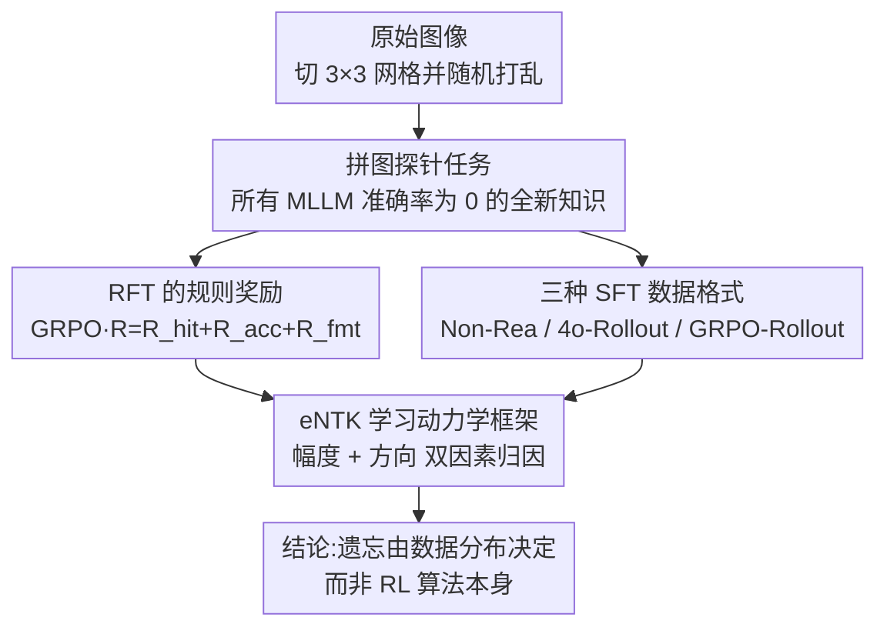

# Why Reinforcement Fine-Tuning Preserves Prior Knowledge Better: A Data Perspective

## 元信息
- **会议**: ICLR 2026
- **arXiv**: [2506.23508](https://arxiv.org/abs/2506.23508)
- **代码**: 未公开
- **领域**: 多模态大模型 / 强化微调 / 灾难性遗忘
- **关键词**: RFT, SFT, 灾难性遗忘, 学习动力学, GRPO, 拼图任务

## 一句话总结

通过拼图任务系统研究 SFT 与 RFT 对先验知识的影响，揭示 RFT 避免灾难性遗忘的核心在于**数据分布**而非算法差异——RFT 采样的数据天然与基模型概率景观对齐，干扰更小。

## 研究背景与动机

SFT 和 RFT 是大模型后训练的两种主要方法，但它们对先验知识保留的影响尚不明确。现有研究主要关注下游任务性能提升，忽视了微调对预训练知识的影响。

关键观察：
- SFT 能快速学习新任务但导致**灾难性遗忘**
- RFT 学习更慢但能**更好地保持先验知识**
- 原因尚不清楚：是算法差异还是数据差异？

本文引入**拼图任务**作为全新任务（现有 MLLM 包括 GPT-4o 准确率均为 0%），系统研究这一问题。

## 方法详解

### 整体框架

本文不提新算法，而是设计一套对照实验把"RFT 比 SFT 更不遗忘"这件事拆成可归因的因果链：先用一个所有 MLLM 都做不出来的拼图任务作为"全新知识"的纯净探针，再让 RFT 与不同数据格式的 SFT 在同一任务上训练，最后用 eNTK 学习动力学量化每条训练样本对先验知识的扰动，从而把差异归因到数据分布而非优化算法。

### 关键设计

**1. 拼图探针任务：找一个零基线的"全新知识"** 研究遗忘的前提是新任务确实是模型从未见过的，否则无法干净地区分"学新"与"忘旧"。本文将原始图像切成 $3 \times 3$ 网格并随机打乱，要求模型输出正确的位置索引序列以重建图像。选它的关键理由是所有 SOTA MLLM（包括 GPT-4o、Qwen2.5-VL-72B）在该任务上准确率均为 0%，因此任何性能提升都只能归功于微调引入的新知识，先验知识的任何下降也只能归因于微调本身的副作用。

**2. RFT 的规则奖励：用 GRPO 把部分正确性也利用起来** 拼图答案稀疏，全对才给奖会让早期探索几乎拿不到信号，因此奖励被拆成三项叠加 $R = R_{\text{hit}} + R_{\text{acc}} + R_{\text{fmt}}$。命中奖励 $R_{\text{hit}} = \frac{\#\text{correct indices}}{m \times n}$ 按摆对的格子数给出连续的部分分，让模型在远未全对时也能顺着梯度爬坡；准确度奖励 $R_{\text{acc}} \in \{0, 1\}$ 只有整盘全对才置 1，提供最终的稀疏目标；格式奖励 $R_{\text{fmt}} \in \{0, 1\}$ 要求输出满足 `<think>...</think><answer>...</answer>` 结构，保证答案可被规则解析。

**3. 三种 SFT 数据格式：把"算法"和"数据"分离开** 要验证差异来自数据而非 SFT 算法本身，就得让 SFT 吃不同来源的监督数据并观察遗忘是否随之变化。Non-Reasoning（Non-Rea）直接给答案、不含推理；Rea-4o-Rollout 用 GPT-4o 生成的推理轨迹加答案；GRPO-Rollout 则取 RFT 训练后模型自己产出的正确 rollout 作为监督。其中 GRPO-Rollout 是最关键的一组——它仍然走标准 SFT 的优化流程，唯一变化是数据改成了 RFT 自采样的分布，因此若它也能保住先验知识，就说明真正起作用的是数据而非 RL 算法。

**4. eNTK 学习动力学框架：量化每条样本对先验的扰动** 前面三组实验给出现象，这一框架给出机理——它回答训练样本 $x_u$ 究竟如何改变先验样本 $x_v$ 的概率。基于经验神经正切核（eNTK），一步更新后先验样本对数概率的变化近似为

$$\Delta \log \pi^t(x_v)|_{x_u} \approx \eta \cdot \underbrace{\nabla_\theta \log \pi_{\theta^t}(x_v)^\top \nabla_\theta \log \pi_{\theta^t}(x_u)}_{\text{eNTK}(x_u, x_v)}$$

把这个内积拆成两个可独立测量的因素：**幅度**是 eNTK 的范数大小，反映一次更新对先验的扰动强度；**方向**是两个梯度的对齐程度，决定扰动是把先验概率推高（增强）还是压低（遗忘）。RFT 自采样数据恰好落在基模型已有中等概率的区域，其梯度范数更小、方向与先验更对齐，因此干扰天然更弱——这正是数据视角解释遗忘差异的落点。

## 实验

### 新任务学习能力（Qwen2.5-VL-3B / 7B）

| 方法 | 训练步数 | 3×3 拼图准确率 |
|------|---------|---------------|
| Base | - | 0% |
| RFT (GRPO) | 27,360 | 66% / 75% |
| SFT-Non-Rea | 200 / 400 | 53% / 80% |
| SFT-Rea-4o-Rollout | 4,100 | 70% / 78% |
| SFT-Rea-GRPO-Rollout | 2,670 / 3,000 | 70% / 81% |

### 先验知识保留（Qwen2.5-VL-7B，性能变化）

| 基准 | RFT | SFT-Non-Rea | SFT-Rea-4o | SFT-GRPO-Roll |
|------|-----|-------------|------------|----------------|
| RefCOCO_val | ↓0.6 | **↓57.2** | **↓37.5** | ↓8.6 |
| DocVQA | ±0.0 | **↓27.4** | ↓2.3 | ↓0.9 |
| MME | ↓8 | **↓1854** | ↓249 | ↓126 |
| MMStar | ↑1.7 | **↓62.8** | ↓3.7 | ↓2.4 |
| POPE | ↓0.2 | **↓69.9** | **↓12.1** | ↓3.1 |

### 关键发现

1. **RFT 可以从零学会全新任务**：经过充分探索（27k 步），准确率从 0% 提升到 66-75%
2. **SFT 学得快但遗忘严重**：仅需 200-400 步即达到 RFT 水平，但 Grounding 能力暴跌 57.2%
3. **数据是关键，非算法**：用 RFT 模型生成的 rollout 训练 SFT（SFT-Rea-GRPO-Rollout），同样能保留先验知识，遗忘远小于标准 SFT
4. **推理轨迹有助于减轻遗忘**：带推理的数据（Rea-4o 和 GRPO-Rollout）遗忘明显小于 Non-Rea
5. **eNTK 幅度分析**：RFT rollout 数据的 eNTK 范数更小，对先验知识干扰更弱
6. **eNTK 方向分析**：RFT rollout 位于基模型已有中等概率的区域，梯度方向与先验知识更对齐

### 数学/科学 QA 验证

在 Qwen2.5 上的数学和科学 QA 任务中观察到一致的遗忘和学习动力学趋势，验证了结论的泛化性。

## 亮点

- 巧妙选择拼图任务作为"全新知识"的试金石，所有 MLLM 零基线
- 首次从数据视角解释 RFT vs SFT 的遗忘差异，提出可验证的因果链
- 学习动力学分析框架（幅度 + 方向分解）提供了理论深度
- SFT 在 GRPO-Rollout 上训练的实验是关键证据，干净地分离了算法与数据的作用
- 对"RFT 不能习得新能力"的观点提出反证

## 局限性

- 拼图任务虽然新颖，但相对简单且输出格式固定，泛化到更复杂任务的程度未验证
- 仅在 Qwen2.5-VL 3B/7B 上实验，未验证更大规模模型
- eNTK 分析基于近似，在大规模模型中的精确性可能受限
- 未提出新的抗遗忘算法，主要是分析和解释性工作
- GRPO-Rollout 的生成依赖于先完成 RFT 训练，增加了总体成本

## 相关工作

- **拼图任务**：Noroozi & Favaro (自监督学习)；Lyu et al. (MLLM 弱点探测)；Jigsaw-R1 (RFT 解拼图)
- **MLLM 强化微调**：DeepSeek-R1、Meng et al.（OOD 泛化）、感知任务 RFT
- **灾难性遗忘缓解**：EWC（正则化）、经验回放（数据混合）、架构方法 — 均不适用于大规模 MLLM
- **RL's Razor**：Shenfeld et al. 认为 RL 隐式偏向 KL 最小解，本文从数据视角给出互补解释

## 评分

- **新颖性**: ⭐⭐⭐⭐⭐ — 从数据分布角度解释遗忘差异的新视角
- **技术深度**: ⭐⭐⭐⭐⭐ — 学习动力学分析严谨，理论与实验紧密结合
- **实验充分度**: ⭐⭐⭐⭐ — 多模型多任务验证，消融设计精巧
- **实用价值**: ⭐⭐⭐⭐ — 对后训练策略选择有直接指导意义

<!-- RELATED:START -->

## 相关论文

- [\[ICLR 2026\] VTool-R1: VLMs Learn to Think with Images via Reinforcement Learning on Multimodal Tool Use](vtool-r1_vlms_learn_to_think_with_images_via_reinforcement_learning_on_multimoda.md)
- [\[ICLR 2026\] WebDS: An End-to-End Benchmark for Web-based Data Science](webds_an_end-to-end_benchmark_for_web-based_data_science.md)
- [\[AAAI 2026\] ReCAD: Reinforcement Learning Enhanced Parametric CAD Model Generation with Vision-Language Models](../../AAAI2026/multimodal_vlm/recad_reinforcement_learning_enhanced_parametric_cad_model_generation_with_visio.md)
- [\[AAAI 2026\] FT-NCFM: An Influence-Aware Data Distillation Framework for Efficient VLA Models](../../AAAI2026/multimodal_vlm/ft-ncfm_an_influence-aware_data_distillation_framework_for_efficient_vla_models.md)
- [\[ICLR 2026\] VLM-SubtleBench: How Far Are VLMs from Human-Level Subtle Comparative Reasoning?](vlm-subtlebench_how_far_are_vlms_from_human-level_subtle_comparative_reasoning.md)

<!-- RELATED:END -->
