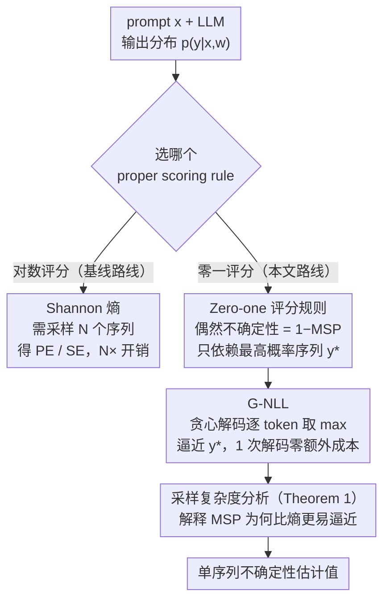

# Rethinking Uncertainty Estimation in LLMs: A Principled Single-Sequence Measure

**会议**: ICLR 2026  
**arXiv**: [2412.15176](https://arxiv.org/abs/2412.15176)  
**代码**: 无  
**领域**: 文本生成 / 不确定性估计  
**关键词**: 不确定性估计, 贪心解码, 负对数似然, proper scoring rules, LLM  

## 一句话总结
从 proper scoring rules 框架出发，证明最高概率输出序列的负对数似然（MSP）是理论上合理的不确定性度量，并提出 G-NLL——仅用一次贪心解码就能逼近该度量，在多个场景下匹配或超越需要多次采样的 SOTA 方法。

## 研究背景与动机

**领域现状**：LLM 不确定性估计主要基于对数评分规则（logarithmic score），导出的度量如预测熵（PE）和语义熵（SE）需要采样多个输出序列来近似，计算成本高昂。

**现有痛点**：多序列采样方法在实际部署中不可行——采样 10 个序列意味着 10 倍推理成本。此外，采样序列之间的差异可能仅是词汇变体而非真正的不确定性，需要额外的自然语言推理模型来聚类语义，进一步增加复杂度。

**核心矛盾**：对数评分规则必然需要对整个输出序列分布取期望（Shannon 熵），而该分布随序列长度指数增长，根本无法精确计算。有没有一种不需要遍历分布的 proper scoring rule？

**本文目标**：(a) 为单序列不确定性度量提供理论依据；(b) 分析其近似的采样复杂度优势；(c) 给出最高效的实现方案。

**切入角度**：探索 zero-one score 这一替代 proper scoring rule。在该规则下，偶然不确定性仅取决于最高概率序列的似然，不需要对全分布采样。

**核心 idea**：用 zero-one scoring rule 替代 logarithmic scoring rule 导出不确定性度量，发现只需贪心解码序列的负对数似然即可。

## 方法详解

### 整体框架
输入一个 LLM 和 prompt $\bm{x}$，输出一个有理论依据、却只需一次普通解码的不确定性估计值。整条思路是：先在 proper scoring rule 框架里用 zero-one 评分规则替换对数评分规则，把偶然不确定性归约成「只依赖最高概率序列」；再用贪心解码逼近这条序列，于是度量退化成贪心解码顺带累加的负对数概率，相比 PE/SE 的 $N$ 倍采样开销实现零额外成本。整套方法的关键在于一个「选哪个评分规则」的分叉：沿对数评分这条老路会走向需要多次采样的熵，而本文选的零一评分这条路只需逼近一条序列。

### 关键设计

**1. Zero-one 评分规则：让不确定性只依赖最高概率序列，绕开对全分布求期望**

对数评分规则之所以贵，是因为它导出的偶然不确定性是 Shannon 熵，要对所有可能输出序列取期望，而序列空间是 $|\mathcal{V}|^T$ 量级，根本无法精确遍历。本文改用另一个同样合法（proper）的评分规则——zero-one score：

$$\mathbf{S}_{0\text{-}1}(p, \bm{y}') = (1 - p(\bm{y}=\bm{y}'|\bm{x})) \cdot \mathbb{1}\{\bm{y}'=\arg\max p(\bm{y}|\bm{x})\}$$

把它代入「总不确定性 = 偶然不确定性 + 认知不确定性」的标准分解，偶然不确定性项就化简成 $1 - p(\bm{y}=\bm{y}^*|\bm{x},\bm{w})$，也就是最高序列概率（MSP）的补。关键在于：这一项只跟最高概率序列 $\bm{y}^*$ 有关，完全不需要对整个分布求和。换句话说，换评分规则不是工程取巧，而是从根上把「遍历指数空间」变成了「只找一个最大值」，这也顺带为此前被当作 ad hoc 基线的 MSP 补上了理论依据。

**2. G-NLL：用贪心解码把「找最高概率序列」拆成逐 token 取 max**

设计 1 把问题归约到求 $\bm{y}^* = \arg\max p(\bm{y}|\bm{x})$，但精确求全局最优序列仍要在指数空间里搜索（NP-hard）。本文的做法是直接用贪心解码逐 token 取最大概率，把序列级的 max 近似成每一步的 max：

$$\text{G-NLL} = -\sum_{t=1}^T \log\Big(\max_{y_t} p(y_t|\bm{x}, \bm{y}_{<t}, \bm{w})\Big)$$

贪心序列不保证就是全局最高概率序列，但它正好是模型做普通推理时已经在走的路径，所以这个度量是「白送」的——不增加任何采样或前向开销。至于近似质量，作者用实验和理论模拟两头佐证：贪心序列对真实 $\bm{y}^*$ 的偏差，远小于有限次采样对熵的估计偏差，足够支撑下游的不确定性判别。

**3. 采样复杂度分析（Theorem 1）：解释为什么 MSP 比熵更容易被逼近**

为了说明这套方案不是巧合，论文从采样复杂度上对比了两类度量。近似最高序列概率 $M(p(\bm{y}))$ 所需的采样数为

$$O\Big(\frac{C_\epsilon}{P_\epsilon}\log\frac{1}{\delta}\Big),$$

它取决于概率在 $\epsilon$-邻域内的集中程度 $P_\epsilon$；而近似 Shannon 熵 $H(p(\bm{y}))$ 的复杂度是

$$O\Big(\frac{(b-a)^2 C^2}{2\epsilon^2}\log\frac{2}{\delta}\Big),$$

它取决于似然取值范围 $[a,b]$ 和最坏情况下的重要性权重 $C$。LLM 的输出分布通常高度集中在少数高概率序列上，这恰好让 $M$ 极易逼近，却让 $H$ 的方差很大、难以估准。这条定理因此从理论上解释了：为什么一次贪心解码近似 MSP，能比十次采样近似熵更稳。

### 损失函数 / 训练策略
G-NLL 是纯推理时方法，不需要任何训练或额外模型。唯一需要注意的实现细节是：不要对 G-NLL 做长度归一化。长度归一化在 PE 这类熵度量上常被用来抵消序列长度的影响，但对 G-NLL 而言，它会破坏 G-NLL 与 MSP 之间的理论对应关系，实验也确认归一化后效果下降，因此应直接累加未归一化的负对数概率。

## 实验关键数据

### 主实验（6个模型 × 6个任务，AUROC 区分正确/错误答案）
6 种语言模型涵盖不同架构（transformer, state-space）、大小（7B, 8B, 70B）、训练阶段（PT, IT）：

| 方法 | 采样序列数 | 平均AUROC | 说明 |
|------|-----------|----------|------|
| PE | 10 | 基线 | 预测熵 |
| LN-PE | 10 | 略高 | 长度归一化PE |
| SE | 10 | 中等 | 语义熵 |
| D-SE | 10 | 中等 | 改进语义熵 |
| **G-NLL** | **1** | **SOTA** | 10倍效率提升 |

### 消融实验

| 配置 | 效果 | 说明 |
|------|------|------|
| G-NLL（不归一化） | 最优 | 理论正确的形式 |
| G-NLL + 长度归一化 | 下降 | 破坏与 MSP 的对应 |
| 采样序列 NLL（非贪心） | 下降 | 只有最高概率序列才有理论保证 |
| PE (N=5) | 下降 | 采样太少，方差大 |

### 关键发现
- G-NLL 用 1 次解码达到（甚至超越）PE/SE 用 10 次采样的效果——**10 倍计算效率提升**
- 不应对 G-NLL 做长度归一化，这在理论上没有依据且实验表明有害
- 必须用贪心解码（最高概率序列），采样序列的 NLL 效果更差
- 模拟实验表明，贪心解码对 MSP 的近似误差远小于多序列采样对 PE 的近似误差
- G-NLL 在不同模型架构和大小上表现稳定

## 亮点与洞察
- **理论贡献是核心亮点**：首次为单序列不确定性度量（MSP）提供 proper scoring rule 的理论基础，将此前的 ad hoc 基线提升为有理论保证的方法。这挑战了"多序列采样才可靠"的流行观点。
- **实用价值极高**：G-NLL 就是贪心解码的负对数似然，零额外计算成本，可以直接作为 LLM 部署中的不确定性信号。
- 采样复杂度分析为不同不确定性度量的计算可行性提供了理论基准。

## 局限与展望
- 贪心解码不一定找到真正的最高概率序列（NP-hard），只是上界近似
- 仅关注偶然不确定性（aleatoric），未处理认知不确定性（epistemic）
- 实验范围限于问答任务，未验证长文本生成场景
- Zero-one score 在语义层面的对应（MCP）尚未充分探索

## 相关工作与启发
- **vs PE (Malinin & Gales)**: PE 基于对数评分的 Shannon 熵，需要多次采样且方差大。G-NLL 基于零一评分，只需一次解码。
- **vs SE (Kuhn et al.)**: SE 进一步引入语义聚类减少虚假不确定性，但需要额外 NLI 模型。G-NLL 无需任何额外模型。
- **vs Fadeeva et al.**: 他们作为基线提出 MSP 但未给出理论依据，本文补充了理论基础。

## 评分
- 新颖性: ⭐⭐⭐⭐⭐ 从理论基础挑战主流范式，elegant 且实用
- 实验充分度: ⭐⭐⭐⭐ 6个模型×6个任务，有模拟分析和理论证明
- 写作质量: ⭐⭐⭐⭐⭐ 理论推导严谨清晰，研究动机令人信服
- 价值: ⭐⭐⭐⭐⭐ 对 LLM 不确定性估计领域有范式性影响

<!-- RELATED:START -->

## 相关论文

- [\[CVPR 2025\] Dense Match Summarization for Faster Two-view Estimation](../../CVPR2025/nlp_generation/dense_match_summarization_for_faster_two-view_estimation.md)
- [\[ACL 2025\] Principled Content Selection to Generate Diverse and Personalized Multi-Document Summaries](../../ACL2025/nlp_generation/dpp_diverse_multidoc_summary.md)
- [\[ACL 2026\] Children's English Reading Story Generation via Supervised Fine-Tuning of Compact LLMs with Controllable Difficulty and Safety](../../ACL2026/nlp_generation/childrens_english_reading_story_generation_via_supervised_fine-tuning_of_compact.md)
- [\[ACL 2025\] Rethinking Evaluation Metrics for Grammatical Error Correction: Why Use a Different Evaluation Process than Human?](../../ACL2025/nlp_generation/rethinking_evaluation_metrics_for_grammatical_error_correction_why_use_a_differe.md)
- [\[ACL 2025\] TagRouter: Learning Route to LLMs through Tags for Open-Domain Text Generation Tasks](../../ACL2025/nlp_generation/tagrouter_learning_route_to_llms_through_tags_for_open-domain_text_generation_ta.md)

<!-- RELATED:END -->
