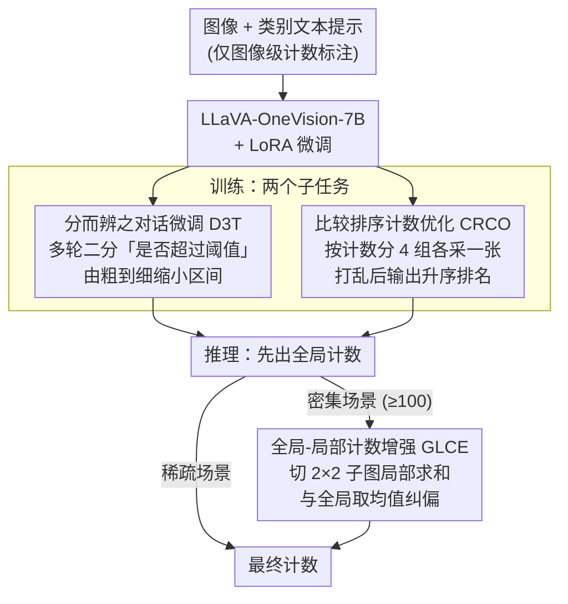

# Bootstrapping MLLM for Weakly-Supervised Class-Agnostic Object Counting (WS-COC)

**会议**: ICLR 2026  
**arXiv**: [2602.12774](https://arxiv.org/abs/2602.12774)  
**代码**: [https://github.com/viscom-tongji/WS-COC](https://github.com/viscom-tongji/WS-COC)  
**领域**: 多模态VLM  
**关键词**: object counting, weakly supervised, MLLM, class-agnostic, dialogue tuning  

## 一句话总结
提出 WS-COC，首个基于 MLLM 的弱监督类无关目标计数框架，通过分而治之的对话微调（逐步缩小计数范围）、比较排序优化（学习图像间相对计数关系）和全局-局部计数增强三个策略，仅用图像级计数标注即可匹敌甚至超越全监督方法。

## 研究背景与动机
**领域现状**：目标计数传统上依赖逐点标注的密度图回归（全监督），成本高昂。弱监督方法仅用图像级计数但目前仅限于单一类别（如行人计数）。

**现有痛点**：(1) 全监督方法需要标注每个目标实例的位置——在密集场景中极其耗时；(2) 现有弱监督方法基于 CNN/ViT，局限于特定类别；(3) MLLM 有潜在计数能力但在密集场景中严重低估（直接预测一个数字太难）。

**核心矛盾**：MLLM 预训练数据中多为稀疏场景，对密集场景的数量感知不足。直接微调 MLLM 回归计数值面临视觉-文本的模态鸿沟——高维视觉特征到离散标量的映射难以学习。

**本文目标** 如何利用 MLLM 的推理能力，仅用图像级计数标注实现类无关的目标计数？

**切入角度**：不直接预测计数值，而是分解为更易学的子任务——范围判断（二分法缩小范围）和相对比较（图像间排序）。

**核心 idea**：将计数从"预测一个数字"重构为"判断范围+相对排序+局部聚合"三个 MLLM 更擅长的子任务。

## 方法详解

### 整体框架
WS-COC 的出发点是：让 MLLM 在密集场景里直接吐出一个精确数字太难——高维视觉特征到离散标量的映射跨越了模态鸿沟（modality gap），模型往往严重低估。它的做法是把"预测一个数字"拆成三件 MLLM 更擅长的事：先逐步逼近数量所在的区间，再学会判断不同图像谁多谁少，最后在推理时把全局和局部的估计拼起来。整个框架建在 LLaVA-OneVision-7B 上用 LoRA 微调，训练阶段同时跑 D3T 与 CRCO 两个子任务，推理阶段叠加 GLCE，全程只需要图像级的计数标注，不需要逐点位置标注。

### 关键设计

**1. Divide-and-Discern Dialogue Tuning（D3T）：把精确计数变成一连串"是否超过阈值"的判断**

直接问 MLLM "这张图有几个目标"是它的弱项，但问"数量是否超过某个阈值"却容易得多。D3T 正是利用这一点，把计数重构成多轮二分对话：给一个初始范围 $[1, 2000]$，每轮取中点 $\tau$，问"图像中的 [obj] 数量是否超过 $\tau$？"，MLLM 答 Yes/No 后据此把范围对半收缩。如此反复，区间从 $[1,2000]$ 逐步压到 $[500,1000]$、$[750,1000]$……直到窄至 $U_t - L_t < 0.2c$（$c$ 为真值），此时才要求模型直接给出精确计数。训练用课程学习从粗到细安排这些对话，让模型先学会大刀阔斧的范围判断，再学精细估计。这种"二分搜索"把一次困难的回归换成了一串简单的判断题，密集场景下的改善尤其明显。

**2. Compare-and-Rank Count Optimization（CRCO）：让模型学会图像之间谁多谁少**

判断"哪张图目标更多"比报出绝对数字更贴近人的视觉直觉，也更能缓解模态鸿沟。CRCO 据此训练 MLLM 做相对排序：把同类别的图像按计数分成 4 个区间，每个区间各采一张组成图像集（这样稀疏到密集都被覆盖到），打乱顺序后让模型输出按数量升序的排列 "Image i < ... < Image j"。模型由此被迫建立跨量级的数量感知——不再孤立地看单张图，而是在图像之间形成相对刻度，这种刻度对建立稳定的计数直觉很关键。

**3. Global-and-Local Counting Enhancement（GLCE）：用全局与局部估计互相纠偏**

全局计数和局部计数有相反的系统性偏差：整图一次性数，密集场景容易低估；切块分别数再相加，又会因目标跨越切割边缘被重复计数而高估。GLCE 在推理时把两者取均值来互补。具体地，先得到全局预测 $c^g$；若 $c^g$ 超过阈值 $c^h=100$（说明场景偏密），就把图像切成 $2\times2$ 子图分别计数求和得到局部预测 $c^l$，最终输出 $(c^g + c^l)/2$。一边压低估、一边压高估，密集场景下的估计因此更稳。

### 损失函数 / 训练策略
训练目标是标准的语言建模 cross-entropy 损失（D3T 的对话回答与 CRCO 的排序输出都以文本序列形式监督）。骨干为 LLaVA-OneVision-7B，用 LoRA（rank=128）微调，在 FSC-147 上训练。

## 实验关键数据

### 主实验（FSC-147 Test Set，MAE / RMSE↓）

| 方法 | 监督类型 | MAE↓ | RMSE↓ |
|------|---------|------|-------|
| GroundingREC | 全监督(点标注) | 10.12 | 107.19 |
| T2ICount | 全监督(点标注) | 11.76 | 97.86 |
| CountGD | 全监督(点标注) | 14.76 | 120.42 |
| CLIP-Count | 全监督(点标注) | 17.78 | 106.62 |
| GCNet | 弱监督(图像级) | 17.83 | 102.89 |
| MLLM-Zero (无微调) | 零样本 | 38.19 | 145.42 |
| WS-COC-Base (直接微调) | 弱监督(图像级) | 21.08 | 122.18 |
| **WS-COC** | **弱监督(图像级)** | **13.91** | **97.28** |

WS-COC 仅用图像级标注，MAE 就已超过 CLIP-Count、CountGD 等点标注全监督方法，逼近最强的 GroundingREC（10.12）。

### 消融实验（FSC-147 Test Set，MAE / RMSE↓）

| 配置 | MAE↓ | RMSE↓ |
|------|------|------|
| WS-COC w/o D3T | 17.12 | 109.82 |
| WS-COC w/o CRCO | 16.75 | 107.45 |
| GLCE 仅全局 $c^g$ | 15.72 | 105.25 |
| GLCE 仅局部 $c^l$ | 16.52 | 99.34 |
| **WS-COC（完整）** | **13.91** | **97.28** |

### 关键发现
- 弱监督的 WS-COC（MAE 13.91）匹敌甚至超越多个全监督方法——颠覆性的标注效率提升
- D3T 贡献最大：去掉后 MAE 从 13.91 升到 17.12（+3.21）——从直接回归到范围判断的任务重构是关键；而把 D3T 用到测试阶段（w/ D3T-T）反而崩到 37.07，因为推理时中间轮一旦判断错就会把后续区间带偏
- 密集场景（>100 个目标）的 MAE 从 MLLM-Zero 的 149.69、WS-COC-Base 的 82.44 一路压到 54.37，三个策略对密集场景的纠偏效果最显著
- GLCE 单用全局（15.72）或单用局部（16.52）都不如二者取均值（13.91），印证全局低估、局部高估互相纠偏
- LoRA 微调让训练只需 3.44 小时（CountGD 11.73h、T2ICount 23.84h），代价主要来自 MLLM 骨干而非新增策略
- 跨数据集泛化（FSC-147→CARPK/PUCPR+/ShanghaiTech）表现良好，在 20 个以下目标的稀疏场景中 MLLM 零样本就已相当准确

## 亮点与洞察
- **任务重构是核心贡献**：不是设计更好的视觉特征，而是将"预测数字"重构为 MLLM 更擅长的子任务（判断/比较/分而治之），这种思路可推广到其他需要数值回归的 VLM 应用
- **弱监督达到全监督水平**：目标计数领域的重要突破——点标注的昂贵成本可能不再必要
- **对话式推理的优雅应用**：利用 MLLM 的多轮对话能力做"二分搜索"，是对 MLLM 交互能力的创造性利用

## 局限与展望
- GLCE 的简单均值融合可能不是最优——可以学习自适应的融合权重
- 2×2 分割对极密集场景可能仍不够细——需要更多层级的分割
- 依赖目标类别名称作为文本 prompt，对未知类别或难以命名的目标可能受限
- 计数阈值 $c^h=100$ 是手动设定的

## 相关工作与启发
- **vs 全监督计数方法（CounTR, CountGD）**: WS-COC 无需点标注即达到可比性能
- **vs CrowdCLIP（排序策略）**: CrowdCLIP 用裁剪同一图像做排序，WS-COC 用不同图像做排序——更合理
- **vs AQuA（VLM 不确定性处理）**: WS-COC 的对话式二分法可视为另一种处理 VLM 不确定性的策略

## 评分
- 新颖性: ⭐⭐⭐⭐⭐ 任务重构的三个策略都很有创意
- 实验充分度: ⭐⭐⭐⭐ 4 个 benchmark，详细消融
- 写作质量: ⭐⭐⭐⭐ 方法描述清晰，图示直观
- 价值: ⭐⭐⭐⭐⭐ 弱监督达到全监督水平，实用性极强

<!-- RELATED:START -->

## 相关论文

- [\[ICLR 2026\] SPWOOD: Sparse Partial Weakly-Supervised Oriented Object Detection](spwood_sparse_partial_weakly-supervised_oriented_object_detection.md)
- [\[CVPR 2026\] Partial Weakly-Supervised Oriented Object Detection](../../CVPR2026/object_detection/partial_weakly-supervised_oriented_object_detection.md)
- [\[ICLR 2026\] CGSA: Class-Guided Slot-Aware Adaptation for Source-Free Object Detection](cgsa_class-guided_slot-aware_adaptation_for_source-free_object_detection.md)
- [\[ICCV 2025\] Toward Long-Tailed Online Anomaly Detection through Class-Agnostic Concepts](../../ICCV2025/object_detection/toward_long-tailed_online_anomaly_detection_through_class-agnostic_concepts.md)
- [\[AAAI 2026\] TubeRMC: Tube-conditioned Reconstruction with Mutual Constraints for Weakly-supervised Spatio-Temporal Video Grounding](../../AAAI2026/object_detection/tubermc_tube-conditioned_reconstruction_with_mutual_constraints_for_weakly-super.md)

<!-- RELATED:END -->
