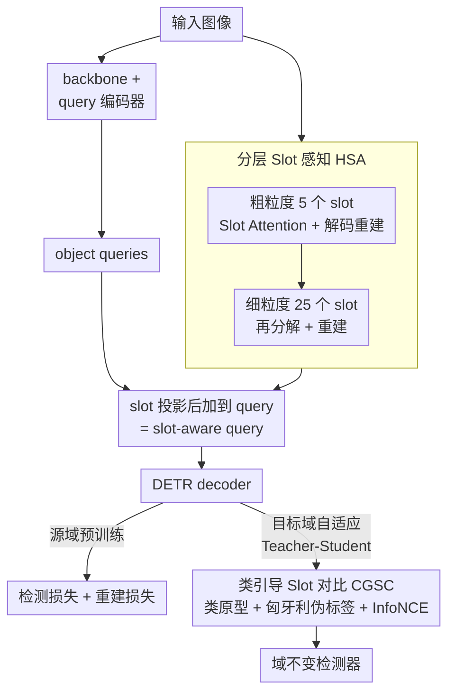

# CGSA: Class-Guided Slot-Aware Adaptation for Source-Free Object Detection

**会议**: ICLR 2026  
**arXiv**: [2602.22621](https://arxiv.org/abs/2602.22621)  
**代码**: [GitHub](https://github.com/Michael-McQueen/CGSA)  
**领域**: 目标检测  
**关键词**: source-free domain adaptation, object-centric learning, slot attention, DETR, contrastive learning

## 一句话总结

首次将 Object-Centric Learning（Slot Attention）引入无源域自适应目标检测（SF-DAOD），通过分层 Slot 感知模块提取域不变的目标级结构先验，并用类引导对比学习驱动域不变表征，在多个跨域基准上大幅超越现有方法。

## 研究背景与动机

**域偏移问题**：目标检测器部署时面临天气/摄像头/场景的域偏移，性能大幅下降

**无源域自适应（SF-DAOD）限制**：仅有源域预训练模型和无标注目标域数据，不可访问源数据（隐私/版权约束）

**现有方法局限**：主流 SF-DAOD 方法（SFOD/PETS/A2SFOD）专注于伪标签阈值调优或 teacher-student 框架改进，忽略了跨域数据中目标级结构的共性信息

**Slot Attention 的潜力**：OCL 将场景分解为离立的"slot"表征，每个 slot 绑定一个目标，天然隔离前景与背景。在分割/视频预测/机器人等任务中展示了强迁移性，但从未用于 SF-DAOD

**自然契合**：DETR 检测器已使用 object queries，将 slot 先验嵌入 query 空间是自然但未探索的方向

## 方法详解

### 整体框架

CGSA 要解决的是无源域自适应目标检测（SF-DAOD）：手里只有源域预训练好的检测器和一批无标注的目标域图像，不能碰源数据，还要让检测器在跨域（天气、相机、画风变化）后照样能用。它的整体思路是建立在 RT-DETR 之上、分两个阶段把"目标级结构"作为跨域桥梁。

源域预训练阶段：图像一路过 backbone 和 query 编码器得到 object queries，另一路并行送进分层 Slot 感知模块（Hierarchical Slot Awareness, HSA）被拆成由粗到细的 slot；slot 投影后与 object query 融合成 slot-aware query 再进 decoder，训练时除了标准检测损失还额外挂上 HSA 的重建损失，逼模型学会把场景拆成目标级 slot。目标域自适应阶段切换成 Teacher-Student 自训练：师生都用源域模型初始化，学生重走 HSA 这条路并用 slot 的注意力 mask 加权出 weighted slot，交给类引导 Slot 对比模块（Class-Guided Slot Contrast, CGSC）与一组动态类原型对比；教师对同图产出伪标签监督学生，并用学生权重的指数滑动平均（EMA）更新自己。两个核心模块各司其职——HSA 负责"提取域不变的目标级结构"，CGSC 负责"把这份结构对齐到统一的类语义空间"。

### 关键设计

**1. 分层 Slot 感知 HSA：把场景拆成目标级结构先验**

SF-DAOD 之所以难，是因为伪标签噪声大、跨域只剩零散的低层特征可用；HSA 的思路是改用 Object-Centric Learning 抽取的目标级结构，这种"一个 slot 绑一个目标、天然隔离前景与背景"的结构对天气、相机、画风等域偏移天然鲁棒。它采用两阶段由粗到细的分解：第一阶段对 backbone 特征 $h$ 做迭代式 Slot Attention（每个 slot 反复和输入特征算注意力、聚合更新，迭代 3–5 次），提取 $n=5$ 个粗粒度 slot，再经轻量的空间广播 MLP 解码重建，解码时跨 slot 的 softmax 竞争迫使每个 slot 绑定不同图像区域；第二阶段把第一阶段的重建结果当作新特征再走一遍同样的分解，细分出 $n^2=25$ 个细粒度 slot。两阶段重建都受监督，损失为 $\mathcal{L}_{rec} = \|\hat{h}^{(1)} - h\|_2^2 + \|\hat{h}^{(2)} - h\|_2^2$。最后把第二阶段 slot 投影后直接加到 object query 上，$Q_{aware} = Q_{obj} + f_{map}(z^{(2)})$，让 decoder 解码每个目标时都带上这份域不变的结构先验。传统 OCL 在真实数据上为防止 slot 坍缩通常把数量限制在 $\leq 10$，HSA 的 25 个 slot 远超这条惯例，而正是这种"先粗后细"的分层设计（受人类视觉先看整体再看细节的启发）保证了大规模 slot 仍能稳定收敛。

**2. 类引导 Slot 对比 CGSC：把结构先验对齐到统一语义空间**

光有结构还不够——跨域时同一类目标在两域的特征分布仍可能错位，CGSC 用对比学习把它们拉到一起。模块维护一组 EMA 更新的全局类原型 $P_c$，每个原型由 decoder queries 按预测类别平均聚合而来，跨 batch 持续积累成一个稳定的类语义锚点。对当前目标域图像，先用第二阶段的注意力 mask $m_k^{(2)}$ 对原始特征做加权聚合，得到压抑了背景 slot 的 weighted slot；再用余弦相似度矩阵加匈牙利算法把这些 weighted slot 与 decoder queries 一一匹配，从而给每个 slot 借来一个伪类标签。有了伪标签就能算 InfoNCE 对比损失，把同类的 slot 原型 $\bar{z}_c$ 往对应类原型 $P_c$ 拉近、把异类推远，逼着不同域的同类目标共享同一套语义表征。由于类原型随检测器变好而动态演化，这种对比是"边适应边校准"，而非一次性对齐。

### 损失函数 / 训练策略

目标域自适应阶段的总损失把自训练、对比、重建三项加权相加：

$$\mathcal{L}_{total} = \mathcal{L}_{unsup} + \lambda_{con} \mathcal{L}_{con} + \lambda_{rec} \mathcal{L}_{rec}$$

其中 $\mathcal{L}_{unsup}$ 是 Teacher-Student 框架下基于伪标签的无监督检测损失，$\lambda_{con}$、$\lambda_{rec}$ 分别平衡对比与重建项。论文还给出了理论支撑，证明每步自适应后目标域风险存在下降界 $\mathbb{E}[\mathcal{R}_T(\theta_{t+1})] \le \mathbb{E}[\mathcal{R}_T(\theta_t)] - c_1 \Delta_t + c_2(\epsilon_{rec} + \sigma^2)$，说明只要重建误差 $\epsilon_{rec}$ 和噪声 $\sigma^2$ 足够小，slot-aware 设计带来的风险下降就有保证，而非纯经验调参。

## 实验关键数据

### 主实验

| 跨域设置 | SF | 方法 | mAP |
|---------|-----|------|-----|
| Cityscapes→BDD100K | ✗ | DATR (有源DAOD) | 43.3 |
| Cityscapes→BDD100K | ✓ | TITAN (SF-DAOD) | 38.3 |
| Cityscapes→BDD100K | ✓ | **CGSA** | **53.0** |
| Cityscapes→Foggy | ✓ | A2SFOD | 41.2 |
| Cityscapes→Foggy | ✓ | **CGSA** | **49.8** |

### 消融实验

| 配置 | Cityscapes→BDD100K mAP | 说明 |
|------|------------------------|------|
| 仅 Teacher-Student | 35.4 | 无任何结构先验 |
| +HSA | 45.2 | slot 结构先验有效 |
| +CGSC | 41.8 | 类引导对比有效 |
| **+HSA+CGSC (CGSA)** | **53.0** | 两者互补，最佳 |

### 关键发现

- CGSA 在 SF 设置下甚至超越多个有源 DAOD 方法（需要源数据的方法）
- 基于 RT-DETR 检测器，4×A100 训练
- 在多个跨域场景（正常→雾天、真实→卡通/水彩等）均显著领先
- 25 个 slot 在数量上超越传统 OCL 的 ≤10 限制，但分层设计保证收敛稳定

## 亮点与洞察

- **OCL + SF-DAOD 的首创结合**：开辟了目标级结构先验用于域适应的新范式
- 分层 slot 设计巧妙突破了传统 slot 数量限制（5→25），且保持训练稳定
- 提供理论泛化分析——slot-aware 设计不仅是经验有效，还有理论支撑
- **在无源设置下超越有源方法**是强有力的实验证据

## 局限与展望

- 仅在驾驶场景数据集验证，医疗/航拍/工业等领域的泛化性待测试
- Slot 数量 $n=5$ 是手动设定，自适应机制可能更好
- 匈牙利匹配依赖检测器预测质量，early stage 可能不稳定导致错误类标签
- HSA 的两阶段 Slot Attention + 重建目标增加了训练时间和内存开销

## 相关工作与启发

- **SFOD/PETS/A2SFOD**：聚焦伪标签过滤，忽略目标级结构
- **DATR/MRT** (有源 DAOD)：需要源数据，CGSA 无源下仍超越
- **Slot Attention/SAVi**：原用于分割/视频预测，首次引入域自适应检测

## 评分

- 新颖性: ⭐⭐⭐⭐⭐ OCL + SF-DAOD 首创结合，开辟新方向
- 实验充分度: ⭐⭐⭐⭐ 5个数据集/跨域设置+完整消融+理论分析
- 写作质量: ⭐⭐⭐⭐ 动机清晰，理论+实验双支撑
- 价值: ⭐⭐⭐⭐ 为 SF-DAOD 提供了新的方法论基础

<!-- RELATED:START -->

## 相关论文

- [\[ICCV 2025\] SFUOD: Source-Free Unknown Object Detection](../../ICCV2025/object_detection/sfuod_source-free_unknown_object_detection.md)
- [\[AAAI 2026\] Beyond Boundaries: Leveraging Vision Foundation Models for Source-Free Object Detection](../../AAAI2026/object_detection/beyond_boundaries_leveraging_vision_foundation_models_for_so.md)
- [\[CVPR 2026\] Foundation Model Priors Enhance Object Focus in Feature Space for Source-Free Object Detection](../../CVPR2026/object_detection/foundation_model_priors_enhance_object_focus_in_feature_space_for_source-free_ob.md)
- [\[ICLR 2026\] Bootstrapping MLLM for Weakly-Supervised Class-Agnostic Object Counting (WS-COC)](bootstrapping_mllm_for_weakly-supervised_class-agnostic_object_counting.md)
- [\[CVPR 2026\] Black-Box Domain Adaptation for Object Detection with Retention-Driven Knowledge Compression](../../CVPR2026/object_detection/black-box_domain_adaptation_for_object_detection_with_retention-driven_knowledge.md)

<!-- RELATED:END -->
