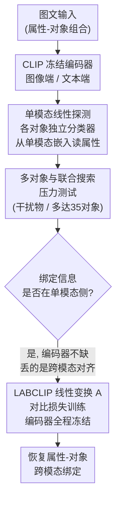

# CLIP Behaves like a Bag-of-Words Model Cross-modally but not Uni-modally

**会议**: ICLR 2026  
**arXiv**: [2502.03566](https://arxiv.org/abs/2502.03566)  
**代码**: [GitHub](https://github.com/kdariina/CLIP-not-BoW-unimodally)  
**领域**: 目标检测  
**关键词**: CLIP, compositionality, bag-of-words, attribute-object binding, cross-modal alignment

## 一句话总结
通过线性探测实验证明 CLIP 的 BoW（词袋）行为并非源于编码器缺乏绑定信息，而是跨模态对齐的失败；提出 LABCLIP，仅训练一个轻量线性变换即可显著恢复属性-对象绑定能力。

## 研究背景与动机
**领域现状**: CLIP 作为视觉-语言模型的基础组件被广泛使用，但已有研究（ARO, SugarCrepe 等）表明 CLIP 在组合性理解上表现差，常像 BoW 模型一样无法区分"红色方块和蓝色三角形"与"蓝色方块和红色三角形"。

**现有痛点**: 此前工作仅在跨模态（图像-文本匹配）层面评估 BoW 行为，无法区分问题来源——是编码器本身缺乏绑定信息，还是跨模态对齐不够好。

**核心矛盾**: 如果问题在编码器，需要重训;如果问题仅在对齐，轻量调整即可修复。诊断原因对改进方向有决定性影响。

**本文目标**: 定位 CLIP BoW 行为的根本原因，并据此提出最小代价的修复方案。

**切入角度**: 分别在图像和文本模态内部（单模态）评估属性-对象绑定信息是否存在。

**核心 idea**: CLIP 的单模态嵌入已编码了正确的属性绑定，只是跨模态对齐没有保留这些信息——一个线性变换就能修复。

## 方法详解

### 整体框架
全文是一条"先诊断、再治疗"的论证链。诊断阶段：此前判定 CLIP 像词袋（bag-of-words, BoW）的证据全都来自跨模态匹配，分不清问题出在编码器还是出在对齐，于是作者改用线性探测分别拆开 CLIP 的图像编码器和文本编码器，看属性-对象绑定信息到底在不在单模态嵌入里，并用多对象和联合搜索两个压力测试排除"任务太简单才碰巧成立"的可能。一旦确认绑定信息确实存在于单模态侧，就能断定 BoW 现象只是跨模态对齐没把它保留下来。治疗阶段：既然信息在、丢的只是对齐，就不动编码器，只在文本侧学一个轻量线性变换 LABCLIP 把绑定信息重新接回对齐。

### 关键设计

**1. 单模态线性探测：把"编码器没有绑定信息"和"对齐丢了绑定信息"两种假设区分开**

此前所有 BoW 结论都建立在跨模态匹配上，无法分辨问题出在哪一端。作者改为在单一模态内部做探测——对每个对象 $o \in \mathcal{O}$ 各训一个独立的线性分类器，从冻结的 CLIP 嵌入里预测该对象的属性，图像端是 $\text{image-probe}_o: f_{\text{image}}(\mathbf{x}^{\text{img}}) \mapsto a$，文本端是 $\text{text-probe}_o: f_{\text{text}}(\mathbf{x}^{\text{txt}}) \mapsto a$。在 CLEVR 上图像端拿到 0.96、文本端拿到 1.00 的准确率，而随机基线只有 0.12。一个线性分类器就能把属性读出来，说明绑定信息在单模态嵌入里早已线性可分，编码器并不缺这个能力。

**2. 多对象与联合搜索压力测试：排除"探针只在简单场景下侥幸成立"的质疑**

单对象场景下的高准确率可能只是任务太简单。作者把场景里的对象数量逐步加多，文本探测仍稳定在 0.8 以上，图像端虽从 0.9 降到 0.6 但远高于随机。更苛刻的是联合搜索实验：在堆满干扰物的图像里（比如绿色球体加红色方块）放一个"不协调"的对象（红色球体），让线性分类器去找它，即使场景里有 35 个对象准确率仍 >0.80，而 CLIP 的零样本分类完全是随机水平。图像嵌入能定位到属性与对象的特定组合，这是纯 BoW 表示做不到的，进一步坐实了绑定信息确实存在于单模态侧。

**3. LABCLIP：用一个最小代价的线性变换把已有的绑定信息接回跨模态对齐**

既然信息在、丢的是对齐，就不必动编码器。作者只在文本嵌入上叠一个线性变换 $\mathbf{A} \in \mathbb{R}^{D \times D}$，把图文相似度改写为 $\langle f_{\text{image}}(\mathbf{x}^{\text{img}}), \mathbf{A} f_{\text{text}}(\mathbf{x}^{\text{txt}}) \rangle$。$\mathbf{A}$ 从单位矩阵初始化（即从原始 CLIP 行为起步），用对比损失训练：在每个 batch 里加入交换了属性-对象对的负文本样本，形成 $B \times 2B$ 的对照，迫使变换后的文本嵌入只对正确绑定打高分。整个 CLIP 编码器全程冻结，只学这个 $D \times D$ 矩阵——ViT-B/32 下仅 262K 参数，相比 NegCLIP 要微调的 151M 参数小了三个数量级，训练也快 100 倍以上，且因为只改对齐不改特征，向量数据库里已有的图像特征无需重新提取，天然向后兼容。

## 实验关键数据

### 主实验
合成数据集跨模态绑定准确率:

| 模型 | CLEVR | PUG:SPAR | PUG:SPARE |
|------|-------|----------|----------|
| CLIP (随机级别) | 0.58 | 0.53 | 0.50 |
| LABCLIP | **0.95** | **0.97** | **0.94** |
| CLIP-FT (上界) | 1.00 | 1.00 | 1.00 |

真实世界基准 (ARO + SugarCrepe):

| 模型 | VG-A | VG-R | Replace | Swap | COCO R@1 |
|------|------|------|---------|------|----------|
| CLIP | 0.63 | 0.63 | 0.80 | 0.62 | 0.30 |
| NegCLIP | 0.71 | 0.81 | 0.85 | 0.75 | 0.41 |
| **LABCLIP** | **0.69** | **0.82** | **0.82** | **0.74** | **0.41** |

### 消融实验
线性探测 probe 权重相似度（对齐前 vs 后）:

| 数据集 | 对齐前 cos-sim | 对齐后 cos-sim |
|--------|---------------|---------------|
| CLEVR | 0.20 | 0.75 |
| PUG:SPAR | 0.18 | 0.78 |
| PUG:SPARE | 0.09 | 0.65 |

### 关键发现
- 训练专门的 BoW CLIP 后做线性探测仅 0.66/0.85 准确率，证实纯 BoW 表示确实缺乏绑定信息
- LABCLIP 仅 262K 参数即匹配 NegCLIP（151M 参数）的组合性推理效果
- 线性变换使 probe 权重的跨模态余弦相似度从 ~0.15 提升到 ~0.70，证实对齐确实恢复了绑定
- 在下游单对象分类（CIFAR, ImageNet）上 LABCLIP 略有下降，说明绑定和粗粒度识别之间存在权衡

## 亮点与洞察
- **诊断性洞察**: 将 BoW 问题从"CLIP 编码器不行"精确定位到"跨模态对齐不行"，改变了社区对 CLIP 能力的认知
- **极简修复**: 线性变换既有效又实用——不需要重新提取向量数据库中的特征，backward compatible
- **方法论贡献**: 引入 PUG:SPARE 数据集（去除位置偏差的 PUG:SPAR），提供更严格的评估
- **理论完整性**: 线性探测 → 多对象鲁棒性 → 联合搜索 → 跨模态修复，逻辑链条完整

## 局限与展望
- 实验主要在合成数据集上验证单模态绑定，真实世界场景的单模态分析不足
- 仅研究属性-对象绑定，空间关系、否定、计数等其他组合性任务未涉及
- LABCLIP 在单对象分类上有轻微退化，绑定与粗粒度识别存在权衡
- 仅验证了 ViT-B/32，更大 CLIP 模型（ViT-L/14, ViT-H）的结论一致性未确认
- 负样本通过简单 noun/adjective shuffle 构造，对复杂语言结构可能不足
- 未探索 LABCLIP 在文本生成图像等生成任务上的效果

## 相关工作与启发
- 回应了 Yuksekgonul et al. (2023) 的 BoW 结论，提出更精确的诊断
- NegCLIP 通过微调 151M 参数修复，LABCLIP 仅用 262K 参数的后处理即匹配其效果
- modality gap 文献：LABCLIP 可视为一种有针对性地缩小绑定相关模态差距的方法
- 与 Lewis et al. (2024) 对比：他们测试了绑定+组合泛化，本文聚焦于纯绑定问题，更精确地定位了原因
- 启发：预训练大模型中可能有被"对齐"掩盖的有用信息，值得更仔细的分层诊断
- 对下游 VLM（如文生图、图编辑）的启发：可将类似的线性对齐应用于改善组合性理解

## 评分
- 新颖性: ⭐⭐⭐⭐⭐ 精准诊断 + 反直觉发现（CLIP不是BoW），改变了对CLIP的认知
- 实验充分度: ⭐⭐⭐⭐⭐ 合成+真实数据集，探测+搜索+修复，多角度严格验证
- 写作质量: ⭐⭐⭐⭐⭐ 逻辑递进清晰，从诊断到治疗一气呵成
- 价值: ⭐⭐⭐⭐ 对理解和改进 VLM 组合性有重要意义，实用性强

<!-- RELATED:START -->

## 相关论文

- [\[CVPR 2025\] AA-CLIP: Enhancing Zero-Shot Anomaly Detection via Anomaly-Aware CLIP](../../CVPR2025/object_detection/aa-clip_enhancing_zero-shot_anomaly_detection_via_anomaly-aware_clip.md)
- [\[ICLR 2026\] OwlEye: Zero-Shot Learner for Cross-Domain Graph Data Anomaly Detection](owleye_zero-shot_learner_for_cross-domain_graph_data_anomaly_detection.md)
- [\[CVPR 2026\] FB-CLIP: Fine-Grained Zero-Shot Anomaly Detection with Foreground-Background Disentanglement](../../CVPR2026/object_detection/fb-clip_fine-grained_zero-shot_anomaly_detection_with_foreground-background_dise.md)
- [\[ICML 2025\] FG-CLIP: Fine-Grained Visual and Textual Alignment](../../ICML2025/object_detection/fg-clip_fine-grained_visual_and_textual_alignment.md)
- [\[CVPR 2025\] BACON: Improving Clarity of Image Captions via Bag-of-Concept Graphs](../../CVPR2025/object_detection/bacon_improving_clarity_of_image_captions_via_bag-of-concept_graphs.md)

<!-- RELATED:END -->
