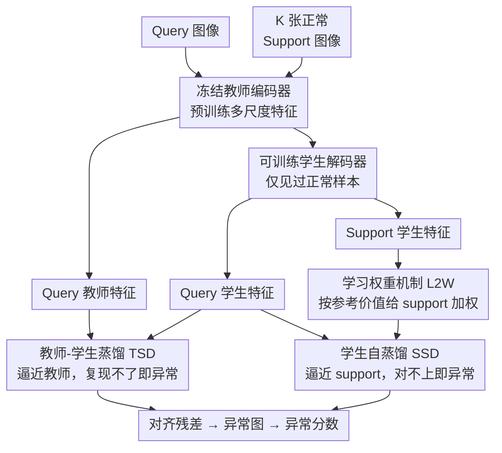

# Dual Distillation for Few-Shot Anomaly Detection

**会议**: ICLR 2026  
**arXiv**: [2603.01713](https://arxiv.org/abs/2603.01713)  
**代码**: [https://github.com/ttttqz/D24FAD](https://github.com/ttttqz/D24FAD)  
**领域**: 医学图像 / 异常检测 / 少样本学习  
**关键词**: 少样本异常检测, 双蒸馏, 教师-学生, 自蒸馏, 医学影像

## 一句话总结
提出双蒸馏框架 D24FAD，结合 query 图像上的教师-学生蒸馏（TSD）和 support 图像上的学生自蒸馏（SSD），辅以学习权重机制（L2W）自适应评估 support 重要性，在 APTOS 眼底数据集上仅用 2-shot 达到 100% AUROC。

## 研究背景与动机

**领域现状**：医学影像的异常检测面临标注稀缺的挑战，少样本异常检测利用极少量正常样本（2-8张）定义"正常"，检测偏离正常的异常。

**现有痛点**：现有方法要么只用教师-学生蒸馏（忽略 support 的直接参考），要么只做 support 匹配（忽略预训练知识的迁移），两种信息来源未被联合利用。

**核心矛盾**：教师-学生蒸馏提供通用的正常-异常判别能力，但不知道"什么是这个域的正常"；support 匹配提供域特定的正常参考，但缺乏通用的判别能力。两者应互补。

**本文目标**：如何同时利用预训练知识和少量正常样本来检测异常？

**切入角度**：设计双路径蒸馏——TSD 从教师学通用判别，SSD 从 support 学域特定模式。

**核心 idea**：教师-学生蒸馏学"什么是异常"（通用知识），学生自蒸馏学"什么是正常"（域特定知识）。

## 方法详解

### 整体框架
D24FAD 的目标是同时榨干两种互补的"正常"信号：预训练编码器里隐含的通用判别能力，和少量 support 图像给出的域特定参考。框架刻意做得极简，只有两个部件：一个冻结的预训练编码器（teacher）和一个可训练的解码器（student decoder，只在正常样本上训练）。query 图像和 K 张正常 support 图像先共享地过同一个教师编码器，拿到多尺度特征；再分别过学生解码器，重建出各自的学生特征。两条蒸馏路径都把落点放在 query 的学生特征上：TSD 让它逼近 query 自己的教师特征（学通用判别），SSD 让它逼近 support 的学生特征（学域内正常），训练时一起优化。推理时不再看损失，而是看对齐残差——哪些位置学生既复现不了教师、又和 support 对不上，就被判为异常；多尺度相似度图聚合成异常图，取均值得到图像级异常分数。

### 关键设计

**1. 教师-学生蒸馏（TSD）：用"复现不了教师"暴露异常**

这一路解决的是"没有通用判别能力"的问题。预训练编码器的特征空间编码了自然图像里"什么算正常"，TSD 让学生去逐位置模仿教师在 query 上的输出，最小化两者特征的余弦距离。正常区域的纹理常见、容易对齐，异常区域因为偏离预训练见过的分布，学生很难复现教师的响应，于是对齐残差天然就成了异常分数。换句话说，TSD 不需要任何异常样本，只靠"学生学不像教师的地方"来定位异常，把预训练知识转成了一个开箱即用的判别器。

**2. 学生自蒸馏（SSD）：用 support 注入"这个域的正常长什么样"**

TSD 懂"通用的异常"，却不知道当前医学域里到底什么算正常，SSD 补的就是这块。它把 K 张正常 support 也送进同一条教师编码器→学生解码器的通路，让 query 的学生特征去逼近每个 support 的学生特征，对 K 个余弦距离取均值作为损失。逻辑很直接：正常的 query 应该和正常 support 相似，异常的 query 则会被拉开距离。值得注意的是，单独用 SSD 就能拿到 90%+ AUROC，反而比单独 TSD 强得多——这说明对少样本异常检测来说，几张真正的域内正常参考，比泛泛的预训练知识更管用，support 信号才是主力。

**3. 学习权重机制（L2W）：让每张 support 按"对当前 query 多有参考价值"加权**

SSD 默认把 K 张 support 一视同仁地平均，但不同 support 对不同 query 的参考价值其实差很多。L2W 用一个缩放点积注意力来给它们打分：以 query 特征作 query、support 特征经映射 $\phi$ 作 key，算出权重

$$w = \mathrm{softmax}\!\left(\frac{z_{\text{query}} \, \phi(z_{\text{support}})^\top}{\sqrt{C}}\right)$$

再用这组 $w$ 对 SSD 的 K 项余弦距离做加权而非均匀平均（$C$ 为特征通道数）。这样和当前 query 更对得上的 support 自动获得更高权重，参考价值低的被压低，比硬平均更精准。消融里 L2W 平均带来 1.91% 提升、峰值 6.81%，代价只是一个轻量注意力。

### 损失函数
总损失把两路蒸馏线性相加：$L = \lambda \, L_{\text{TSD}} + L_{\text{SSD-L2W}}$，其中 $\lambda = 0.1$。TSD 权重被刻意压低，让 SSD 主导优化——这与"support 信号才是主力"的观察一致：TSD 是锦上添花的通用判别增强，真正的域特定监督交给 SSD。

## 实验关键数据

### 主实验（AUROC %）

| 数据集 | K-shot | InCTRL | MVFA | **D24FAD** |
|--------|--------|--------|------|----------|
| HIS | 2 | 71.8 | 76.4 | **94.2** |
| LAG | 4 | 71.1 | 77.2 | **96.2** |
| APTOS | 2 | 89.5 | 86.1 | **100.0** |
| RSNA | 4 | 81.4 | 87.4 | **97.9** |
| Brain Tumor | 4 | 91.8 | 93.7 | **95.3** |

### 消融实验

| 配置 | HIS (2-shot) | APTOS (2-shot) |
|------|-------------|---------------|
| TSD only | 66.1% | 58.2% |
| SSD only | 90.0% | 92.7% |
| SSD + TSD | 94.3% | **100.0%** |
| **SSD + TSD + L2W** | **96.7%** | **100.0%** |

### 关键发现
- SSD 是核心组件（单独 90%+），TSD 是增强（+4-13%）
- L2W 平均提升 1.91%，峰值 6.81%
- 推理速度 29.2 FPS，比 MVFA 快 2 倍
- WideResNet-50 是最佳骨干，过大模型（Swin-B）反而不好

## 亮点与洞察
- **双蒸馏的互补性**：TSD 学通用知识 + SSD 学域特定知识，概念简单但效果出色。lambda=0.1 说明域特定信号比通用信号更重要。
- **在医学影像上表现惊人**：APTOS 100% AUROC 只用 2-shot，说明该框架非常适合视觉差异明显的医学异常检测。

## 局限与展望
- 仅支持图像级异常检测，不支持像素级定位
- Support 样本质量直接影响结果，如果 support 中包含异常样本会灾难性失败
- Lambda = 0.1 是固定的，自适应调整可能更好
- 仅在医学影像上验证，工业缺陷检测等其他领域未测试

## 相关工作与启发
- **vs MVFA**: MVFA 用多视角特征对齐，D24FAD 用双蒸馏，思路不同但效果更好
- **vs InCTRL**: 基于元学习的少样本异常检测，D24FAD 更简单且性能更强

## 评分
- 新颖性: ⭐⭐⭐⭐ 双蒸馏框架简洁优雅，但各组件并非全新
- 实验充分度: ⭐⭐⭐⭐⭐ 5个医学数据集 + 多 shot 设置 + 骨干消融
- 写作质量: ⭐⭐⭐⭐ 方法描述清晰
- 价值: ⭐⭐⭐⭐⭐ 在医学少样本异常检测上达到惊人性能

<!-- RELATED:START -->

## 相关论文

- [\[CVPR 2026\] SubspaceAD: Training-Free Few-Shot Anomaly Detection via Subspace Modeling](../../CVPR2026/object_detection/subspacead_training-free_few-shot_anomaly_detection_via_subspace_modeling.md)
- [\[AAAI 2026\] Commonality in Few: Few-Shot Multimodal Anomaly Detection via Hypergraph-Enhanced Memory](../../AAAI2026/object_detection/commonality_in_few_few-shot_multimodal_anomaly_detection_via_hypergraph-enhanced.md)
- [\[CVPR 2026\] Defect Cue-Preserved Structural Feature Refinement for Few-Shot Anomaly Detection](../../CVPR2026/object_detection/defect_cue-preserved_structural_feature_refinement_for_few-shot_anomaly_detectio.md)
- [\[ICLR 2026\] FSOD-VFM: Few-Shot Object Detection with Vision Foundation Models and Graph Diffusion](fsod-vfm_few-shot_object_detection_with_vision_foundation_models_and_graph_diffu.md)
- [\[CVPR 2026\] FastRef: Fast Prototype Refinement for Few-shot Industrial Anomaly Detection](../../CVPR2026/object_detection/fastref_fast_prototype_refinement_for_few-shot_industrial_anomaly_detection.md)

<!-- RELATED:END -->
