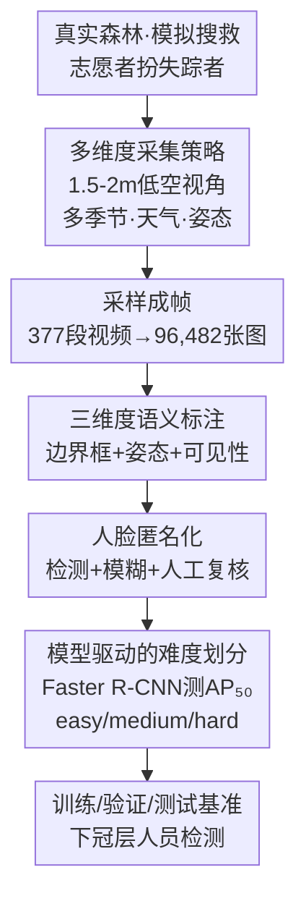

# ForestPersons: A Large-Scale Dataset for Under-Canopy Missing Person Detection

**会议**: ICLR 2026  
**arXiv**: [2603.02541](https://arxiv.org/abs/2603.02541)  
**代码**: [https://huggingface.co/datasets/etri/ForestPersons](https://huggingface.co/datasets/etri/ForestPersons)  
**领域**: 目标检测  
**关键词**: 人员检测, 森林搜救, 无人机, 遮挡感知, 数据集

## 一句话总结

ForestPersons 是首个专门面向森林树冠下失踪人员检测的大规模基准数据集（96,482 张图像 + 204,078 标注），通过模拟微型无人机（MAV）在 1.5-2.0 米高度的低空飞行视角，覆盖多季节、多天气、多姿态和多遮挡等级的真实搜救条件，为下冠层人员检测模型的训练和评估提供了坚实基础。

## 研究背景与动机

**领域现状**：无人机（UAV）已被广泛应用于搜救（SAR）任务中，能够快速覆盖大面积开阔区域。随着硬件微型化和 SLAM 技术发展，微型无人机（MAV）已具备在 GPS 受限的森林环境中安全导航和探索的能力。

**现有痛点**：

1. **视角局限**：现有 SAR 数据集（HERIDAL、WiSARD、SARD、VTSaR）均从高空俯视或斜视角采集，密集树冠遮挡导致人员在图像中仅占几个像素，检测极其困难
2. **场景偏差**：地面人员检测数据集（COCO、CrowdHuman、CityPersons）主要覆盖城市环境中站立行走的人，与森林搜救场景差异巨大——躺卧、坐姿、植被遮挡等情况几乎不涉及
3. **标注缺失**：没有数据集同时提供遮挡等级和姿态标注，无法系统性地评估不同难度条件下的检测能力

**核心矛盾**：森林搜救中最需要检测的失踪人员恰恰处于现有数据集最无法覆盖的场景——树冠之下、植被遮挡、非站立姿态。

**本文方案**：构建首个专注下冠层人员检测的大规模基准数据集 ForestPersons，模拟 MAV 低空视角，辅以姿态、可见性等语义标注，支撑面向真实搜救场景的检测模型开发。

## 方法详解

### 整体框架

ForestPersons 不是一个检测算法，而是一套数据集构建流程，目标只有一个——把"树冠之下找失踪者"的真实困难原样搬进数据里，而不是复用现有 SAR 或地面数据集的采集惯例。流程从真实森林里的模拟搜救视频出发：志愿者扮成疲劳、迷路的失踪者，摄像机贴地拍摄；视频采样成帧后，逐一为每个人标注边界框，并补上姿态与可见性两类语义属性；接着对人脸做匿名化；最后用一个检测器实测每段视频的难度，按难度均匀切分出训练、验证、测试集。三个真正的设计点分别落在这条流水线的三个环节上——**怎么采**（低空多样视角）、**怎么标**（多维语义属性）、**怎么切**（模型驱动难度划分）。

### 关键设计

**1. 多维度采集策略：把真实搜救场景的"难"复刻进数据里**

现有 SAR 数据从高空俯视采集，人员只占几个像素；地面数据又全是城市里站立行走的人。ForestPersons 要同时避开这两个偏差，于是把摄像机（手持或三脚架）架在 1.5-2.0 米高度拍摄，刻意模拟 MAV 在树冠下贴地飞行的低空视角。被拍的志愿者扮演疲劳或迷路的失踪者，覆盖站立、坐着、躺在地面三种姿态，自然地被植被、枝干和地形遮挡。采集还横跨四季（夏季密集树冠对照冬季落叶加积雪）、多种天气（晴、阴、小雨）和不同时段（下午、黄昏），最终从 377 段视频里采样出 96,482 张图像、204,078 个标注实例。正是这种"主动制造遮挡和非站立姿态"的策略，让数据集覆盖到了真实失踪人员最常出现、而旧数据集最缺的那部分场景。

**2. 三维度语义标注：让数据集能按难度被拆开研究**

光有边界框无法回答"模型在重度遮挡下还行不行"这类问题，所以每个人员实例额外标注两类 SAR 相关属性。一是姿态，分 Standing（站立，对应清醒可行动）、Sitting（坐着，对应疲劳等待）、Lying（躺着，对应受伤昏迷）三类，对应搜救中不同的伤情判断。二是可见性，按植被或地形造成的遮挡程度分四级：100 表示完全可见无遮挡，70 表示轻微遮挡但身体大部分清晰，40 表示部分遮挡但仍可辨识，20 表示严重遮挡几乎无法辨识。当遮挡严重到连姿态都难以判断时，标注员会参考相邻视频帧、按共享标注规范再做决策。有了这两个维度，后续就能定量分析"姿态多样性"和"遮挡强度"各自对检测精度的影响。

**3. 模型驱动的难度划分：用检测器自己的失败来定义难易**

数据集若随机切分，会让简单和困难场景在三个子集里分布不均，评测就失真了；而靠人工判断难度又会引入标注偏差。这里改用检测器实测难度来切分：先用 COCO 预训练的 Faster R-CNN（Detectron2 实现）在每段视频上算 $\text{AP}_{50}$，再把难度分数定义为 $1 - \text{AP}_{50}$（检测器越测不准，分数越高），然后把序列分成 easy（$\text{score} < 0.45$）、medium（$0.45 \le \text{score} < 0.75$）、hard（$\text{score} \ge 0.75$）三档，按比例均匀铺到训练/验证/测试集。切分以视频序列为单位而非单帧，避免时序相邻帧跨集造成数据泄露。最终训练集 67,686 图加 145,816 标注，验证集 18,243 图加 37,395 标注，测试集 10,553 图加 20,867 标注，三档难度连同季节、地点、天气、姿态、可见性的分布在每个子集里都成比例存在，保证了评测的代表性。

## 实验结果

### 主实验：现有数据集在下冠层场景的迁移表现

用 Faster R-CNN 在不同数据集上训练后在 ForestPersons 测试集上评估，验证现有数据的不足：

| 训练数据 | 类型 | 自有测试集 AP | ForestPersons AP | ForestPersons AP₅₀ |
|----------|------|:---:|:---:|:---:|
| SARD | SAR/俯视 | 58.6 | 3.0 | 7.8 |
| HERIDAL | SAR/俯视 | 35.0 | 0.2 | 0.3 |
| WiSARD | SAR/斜视 | 18.5 | 11.3 | 29.0 |
| COCO-Person | 地面/城市 | 54.0 | 40.8 | 66.9 |
| CrowdHuman | 地面/城市 | 39.4 | 31.9 | 58.8 |
| CityPersons | 地面/城市 | 38.7 | 5.9 | 15.1 |

SAR 数据集在 ForestPersons 上的 AP 均低于 12%，证实高空视角数据无法适应下冠层场景。地面数据集中 COCO 表现最好（AP=40.8），但仍有显著性能衰减，说明城市场景与森林环境的差距。

### 基准实验：ForestPersons 上多检测器性能

| 检测模型 | 骨干类型 | AP | AP₅₀ | AP₇₅ | AR |
|----------|----------|:---:|:---:|:---:|:---:|
| SSD | MobileNetV2 | 45.0 | 83.6 | 43.1 | 53.7 |
| YOLOv3 | YOLO | 50.2 | 86.5 | 53.9 | 58.6 |
| YOLOX | YOLO | 51.0 | 89.0 | 54.4 | 58.2 |
| DETR | Transformer | 53.9 | 88.7 | 59.4 | 67.9 |
| RetinaNet | ResNet-50 | 64.2 | 93.9 | 74.4 | 70.9 |
| Faster R-CNN | ResNet-50 | 64.4 | 92.7 | 75.4 | 70.0 |
| DINO | Transformer | 65.3 | 94.0 | 76.2 | **77.7** |
| YOLOv11 | YOLO | 65.6 | 93.4 | 75.6 | 71.7 |
| CZ Det | 级联缩放 | 65.6 | **96.1** | **77.9** | 71.6 |
| Deformable R-CNN | ResNet-50 | **66.3** | 93.4 | 77.5 | 71.3 |

Deformable R-CNN 取得最高 AP（66.3），但不同指标下最优模型不同：DINO 的 AR 最高（77.7，搜救中更关注召回率），CZ Det 的 AP₅₀ 和 AP₇₅ 最优。

### 消融实验：属性对检测性能的影响

| 训练属性 → 测试属性 | Standing AP | Sitting AP | Lying AP |
|---------------------|:---:|:---:|:---:|
| 仅 Standing 训练 | 45.3-60.1 | 30.0-44.5 | 31.7-46.0 |
| 全姿态训练 | 49.3-65.5 | 50.6-65.7 | 47.5-65.1 |

仅用 Standing 数据训练时，Sitting/Lying 检测性能严重下降（约 -20 AP）；全姿态训练则三种姿态均获得大幅提升，证实多姿态数据的必要性。

**可见性等级与检测性能的相关性**：检测精度随可见性等级增加而稳步提升（从 20 级到 100 级），验证了 ForestPersons 的难度梯度设计与真实 SAR 条件的一致性。

## 论文评价

### 优点

1. **填补空白**：首个专注下冠层视角的大规模人员检测数据集，96K+ 图像规模是此前最大 SAR 数据集（WiSARD, 44K）的两倍以上
2. **标注全面**：边界框 + 姿态 + 可见性三维标注体系为系统性研究遮挡鲁棒性提供了独特基础
3. **实验充分**：不仅评估了多种检测器基准，还通过跨数据集迁移实验定量论证了数据集的必要性

### 不足

1. 数据采集依赖人工模拟搜救场景，可能与真实失踪人员的外观/姿态分布存在偏差
2. 仅提供 RGB 数据（热红外 ForestPersonsIR 仅在附录中简要提及），多模态融合潜力未充分挖掘
3. 最优检测器 AP 仅 66.3%，说明该场景仍有巨大提升空间，但论文未提出针对性的检测方法

### 评分

⭐⭐⭐⭐ — 作为一个数据集论文，ForestPersons 在问题定义的清晰度、数据规模和标注质量上均表现优秀，为森林搜救中的计算机视觉研究开辟了重要方向。

<!-- RELATED:START -->

## 相关论文

- [\[ICCV 2025\] Kaputt: A Large-Scale Dataset for Visual Defect Detection](../../ICCV2025/object_detection/kaputt_a_large-scale_dataset_for_visual_defect_detection.md)
- [\[ICLR 2026\] InfoDet: A Dataset for Infographic Element Detection](infodet_a_dataset_for_infographic_element_detection.md)
- [\[CVPR 2026\] MMR-AD: A Large-Scale Multimodal Dataset for Benchmarking General Anomaly Detection with MLLMs](../../CVPR2026/object_detection/mmrad_multimodal_anomaly_detection.md)
- [\[CVPR 2026\] Omni-AD: A Large-scale and Versatile Benchmark for Industrial Anomaly Detection](../../CVPR2026/object_detection/omni-ad_a_large-scale_and_versatile_benchmark_for_industrial_anomaly_detection.md)
- [\[ICCV 2025\] Revisiting Adversarial Patch Defenses on Object Detectors: Unified Evaluation, Large-Scale Dataset, and New Insights](../../ICCV2025/object_detection/revisiting_adversarial_patch_defenses_on_object_detectors_unified_evaluation_lar.md)

<!-- RELATED:END -->
