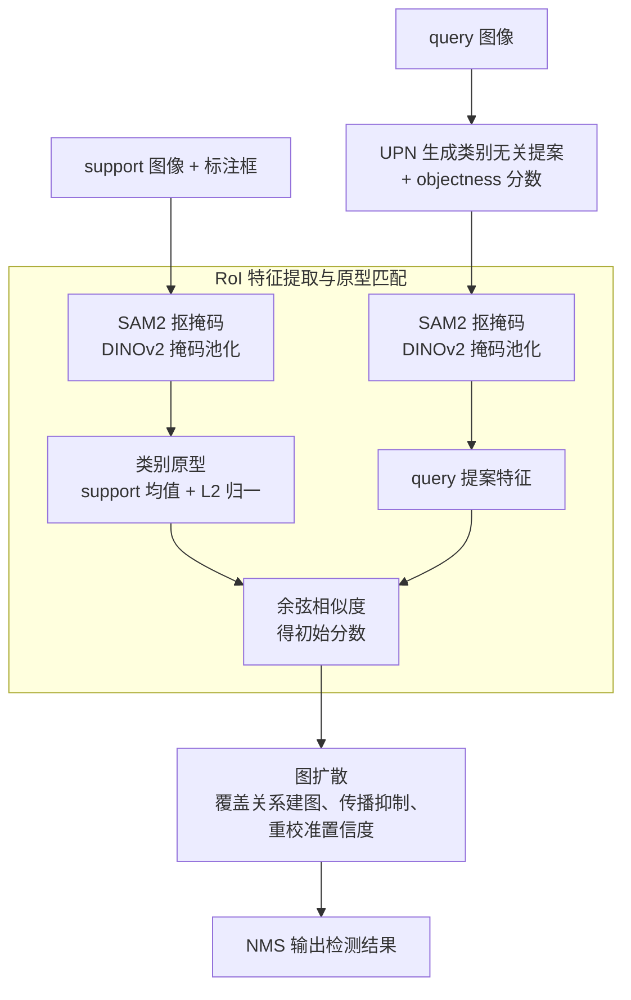

# FSOD-VFM: Few-Shot Object Detection with Vision Foundation Models and Graph Diffusion

**会议**: ICLR 2026  
**arXiv**: [2602.03137](https://arxiv.org/abs/2602.03137)  
**代码**: [https://intellindust-ai-lab.github.io/projects/FSOD-VFM](https://intellindust-ai-lab.github.io/projects/FSOD-VFM)  
**领域**: 目标检测 / 少样本学习  
**关键词**: 少样本目标检测, 视觉基础模型, 图扩散, 免训练, SAM2

## 一句话总结
提出一个无需训练的少样本目标检测框架，组合 UPN、SAM2 和 DINOv2 三个基础模型生成提案和匹配特征，并通过图扩散算法精化置信度分数和抑制碎片化提案，在 Pascal-5i 和 COCO-20i 上大幅超越 SOTA。

## 研究背景与动机

**领域现状**：少样本目标检测（FSOD）旨在从少量标注样本中检测新类别。传统方法需要微调训练，而最近的 training-free 方法利用基础模型直接进行检测。

**现有痛点**：基础模型（如 UPN）生成的提案常常过度碎片化——同一目标被切分为多个重叠的小框，且提案之间的冗余难以通过简单的 NMS 有效处理。

**核心矛盾**：SoftNMS 等后处理方法只考虑框的空间关系，无法利用提案间的语义和掩码重叠信息来判断哪个提案更好。

**本文目标**：如何在 training-free 的框架中有效抑制碎片化提案，产生高质量检测结果？

**切入角度**：将提案关系建模为有向图，通过 PageRank 式的图扩散传播置信度。

**核心 idea**：用图扩散算法在提案图上传播抑制信号，让被大框"覆盖"的碎片提案自动降低置信度。

## 方法详解

### 整体框架
这篇论文要解决的是 training-free 少样本目标检测里"提案碎片化"的痛点：基础模型一次能吐出大量类别无关的框，但同一个目标常被切成若干重叠小框，普通 NMS 只看框的 IoU，压不掉这种语义冗余。FSOD-VFM 的做法是把三个现成基础模型串成一条无训练流水线，再用一个图扩散后处理把碎片框筛掉。具体地，UPN 先生成类别无关提案，SAM2 把每个提案精化成精确掩码，DINOv2 在整图上提密集特征、再用掩码做池化得到提案级特征；这些特征与从 support 样本算出的类别原型做余弦匹配得到初始分数，最后图扩散在提案图上传播抑制信号、重新校准置信度，经 NMS 输出检测结果。

### 关键设计

**1. RoI 特征提取与原型匹配：用 SAM2 掩码把前景特征"抠干净"再比对**

为了判断一个 query 提案属于哪个新类，需要先有干净的类别表示。方法对每张 support 图按其标注框喂给 SAM2，得到该目标的二值掩码，再让 DINOv2 在整图上提密集特征，用这个掩码做池化——只聚合落在目标掩码内的特征，从而把背景噪声排除在外。同一新类的多张 support 特征取均值并做 L2 归一化，构成该类的原型。Query 端同样用 SAM2 掩码池化得到每个提案的特征，与各类原型算余弦相似度，相似度即该提案的初始类别分数。相比直接用框内全部像素，掩码池化保证拿到的是真正的前景语义，这在每类只有 1～5 张样本时尤其关键。

**2. 图扩散：把"谁覆盖了谁"建成有向图，让大框去压碎片框**

这是抑制碎片提案的核心。方法把同一类别下的所有提案当作图的节点，用有向边编码"覆盖关系"：当提案 $i$ 的 UPN objectness 分数不高于提案 $j$ 时，就从 $i$ 向 $j$ 连一条边，边权为 $i$ 被 $j$ 覆盖的比例 $\mathcal{E}_{i,j}=\mathrm{Area}(M_i \cap M_j)/\mathrm{Area}(M_i)$（分数更高的节点不向外扩散、保留自身能量）。直觉上，一个被高分大框几乎盖住的碎片 $i$，会沿这条边把能量"扩散"出去、自己累积成高抑制度。每个节点再取它对外最强的覆盖关系作为先验权重 $w_i=\max_j \mathcal{E}_{i,j}$（被大框紧紧盖住的碎片 $w_i$ 接近 1），然后在这张图上跑 PageRank 式迭代传播一个"被抑制度" $\pi$：

$$\pi^{t+1} = \alpha \, P \, \pi^{t} + (1-\alpha)\, w$$

其中 $P$ 是按上述边权行归一化的转移矩阵，$w$ 是上面的先验抑制分布，$\alpha$ 是平衡传播与重启的概率，初始 $\pi^0$ 取均匀分布、并以 $\lVert\pi^{t+1}-\pi^t\rVert<\tau$ 提前停止。迭代收敛后，被多个高分大框覆盖的碎片提案会累积到较高的 $\pi$ 值。最终置信度把这个抑制度乘回匹配分数：

$$\text{conf} = (1-\pi)^{\lambda}\cdot \cos\_sim$$

$\pi$ 越高、置信度被压得越低，$\lambda$ 调节压制强度。和只看框 IoU 的 NMS/SoftNMS 不同，图扩散同时利用了 SAM2 给出的精确掩码重叠和 UPN 的 objectness 分数，因此能更准地分辨哪些是冗余碎片、哪些是真正独立的目标；而且抑制是沿图全局传播的，不是逐对贪心删除，能处理一组互相重叠提案的整体关系。实践中 $\alpha=0.3$、$\lambda=0.5$，5～30 步即收敛。

### 训练策略
完全无需训练，UPN、SAM2、DINOv2 三个组件全部直接用预训练权重推理，图扩散是纯后处理、无可学习参数。

## 实验关键数据

### 主实验

| 数据集 | Shot | FSOD-VFM | 之前 SOTA (NtTT) | 提升 |
|--------|------|----------|-----------------|------|
| Pascal-5i | 1-shot | 77.5 | 70.8 | +6.7 |
| Pascal-5i | 5-shot | 85.8 | 77.2 | +8.6 |
| COCO-20i | 10-shot | 59.4 (nAP50) | 54.1 | +5.3 |
| CD-FSOD (ArTaxOr) | 1-shot | 51.4 | 28.2 | +23.2 |

### 消融实验

| 后处理方法 | Pascal-5i | COCO-20i |
|-----------|----------|----------|
| 无后处理 | 7.4 | 9.9 |
| NMS | 23.4 | 26.1 |
| Soft NMS | 28.1 | 26.6 |
| Soft Merging | 66.0 | 50.4 |
| **Graph Diffusion** | **77.5** | **59.4** |

### 关键发现
- 图扩散比最接近的 Soft Merging 提升 11.5/9.0 个点
- 在跨域 FSOD（CD-FSOD）上提升最显著（+23.2），说明图扩散的通用性
- 超参数 alpha=0.3, lambda=0.5 时最优，5-30 步收敛

## 亮点与洞察
- **图扩散替代 NMS**：将提案抑制从启发式规则提升为基于图结构的信息传播，工程上优雅且效果显著。可迁移到任何需要提案去冗余的任务。
- **纯组装式框架**：三个基础模型的组合+一个图扩散后处理，完全不需要训练。展示了基础模型组装的潜力。

## 局限与展望
- 推理速度较慢（2.4s/图 on A40），UPN+SAM2+DINOv2 三次前向推理开销大
- 图扩散需要掩码重叠计算，提案数多时计算量增加
- 依赖 UPN 生成的初始提案质量

## 相关工作与启发
- **vs No-Time-To-Train**: 同为 training-free FSOD，但 NtTT 用 SoftNMS 后处理，本文用图扩散
- **vs DINOv2/DINOv3**: 作为特征提取器使用，DINOv3 比 DINOv2 带来一致的小幅提升

## 评分
- 新颖性: ⭐⭐⭐⭐ 图扩散用于提案去冗余是新颖的，但整体是组件组装
- 实验充分度: ⭐⭐⭐⭐⭐ Pascal/COCO/CD-FSOD 全覆盖，消融详细
- 写作质量: ⭐⭐⭐⭐ 算法描述清晰
- 价值: ⭐⭐⭐⭐ 为 training-free FSOD 提供了强基线

<!-- RELATED:START -->

## 相关论文

- [\[CVPR 2026\] AnomalyVFM -- Transforming Vision Foundation Models into Zero-Shot Anomaly Detectors](../../CVPR2026/object_detection/anomalyvfm_--_transforming_vision_foundation_models_into_zero-shot_anomaly_detec.md)
- [\[AAAI 2026\] Beyond Boundaries: Leveraging Vision Foundation Models for Source-Free Object Detection](../../AAAI2026/object_detection/beyond_boundaries_leveraging_vision_foundation_models_for_so.md)
- [\[ICLR 2026\] Dual Distillation for Few-Shot Anomaly Detection](dual_distillation_for_few-shot_anomaly_detection.md)
- [\[ICLR 2026\] OwlEye: Zero-Shot Learner for Cross-Domain Graph Data Anomaly Detection](owleye_zero-shot_learner_for_cross-domain_graph_data_anomaly_detection.md)
- [\[AAAI 2026\] Temporal Object-Aware Vision Transformer for Few-Shot Video Object Detection](../../AAAI2026/object_detection/temporal_object-aware_vision_transformer_for_few-shot_video_object_detection.md)

<!-- RELATED:END -->
