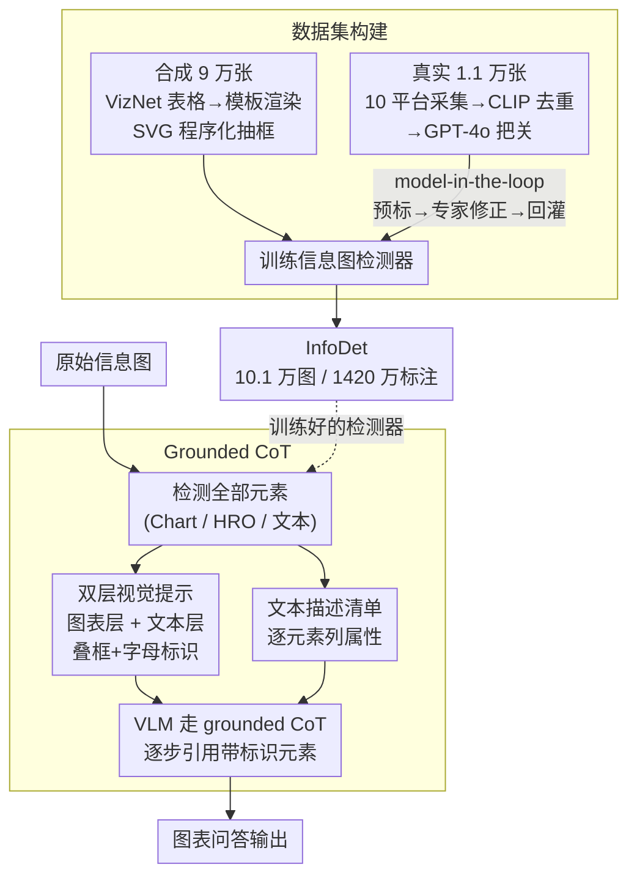

# InfoDet: A Dataset for Infographic Element Detection

**会议**: ICLR 2026  
**arXiv**: [2505.17473](https://arxiv.org/abs/2505.17473)  
**代码**: [https://github.com/InfoDet2025/InfoDet](https://github.com/InfoDet2025/InfoDet)  
**领域**: 目标检测 / 文档理解  
**关键词**: 信息图检测, 图表理解, 数据集, Grounded CoT, VLM

## 一句话总结
构建了一个大规模信息图元素检测数据集（101,264 张信息图、1420 万标注），涵盖图表和人类可识别对象两大类，并提出 Grounded CoT 方法利用检测结果提升 VLM 的图表理解能力。

## 研究背景与动机

**领域现状**：图表理解是 VLM 的重要应用场景（如 ChartQA），但现有方法让 VLM 直接从原始图像推理，忽略了结构化的视觉元素信息。

**现有痛点**：(a) 缺少大规模信息图检测数据集——现有基础模型（DINO-X, Grounding DINO）在信息图元素检测上的 AP < 15%，几乎完全失败；(b) 信息图包含大量非自然场景的元素（如图标、图表组件），与 COCO/Objects365 训练的检测器领域差距大。

**核心矛盾**：信息图元素的检测是图表理解的基础，但当前检测器在该域上完全不可用。

**本文目标** (a) 构建大规模信息图检测数据集，(b) 验证检测结果如何提升 VLM 的图表推理。

**切入角度**：结合合成数据（9 万张，模板化生成）和真实数据（1.1 万张，model-in-the-loop 标注），覆盖 75 种图表类型。

**核心 idea**：将元素检测作为图表理解的"视觉提示"——先检测再推理（Thinking-with-Boxes）。

## 方法详解

### 整体框架
这篇工作要解决的是「检测器在信息图上集体失灵、VLM 又只能盯着原始像素硬猜」这两件事，因此它同时给出一个数据集和一套用法。前半部分构建 InfoDet——10.1 万张信息图、1420 万个标注，把元素分成图表组件（Chart）和人类可识别对象（HRO，如图标）两大类；这个数据集用来训出一个真正能在信息图上工作的检测器。后半部分提出 Grounded CoT，把检测器吐出的元素框当成「视觉提示 + 文本描述」喂回 VLM，让它先看清元素再推理（Thinking-with-Boxes）。串起来就是：先靠合成+真实两路数据建库、训检测器，再把检测器接到推理期——原始信息图经检测器标出所有元素后，框和属性被拼成提示喂给 VLM，由 VLM 引用这些带标识的元素逐步作答。

### 关键设计

**1. 数据集构建：用合成数据撑规模、用真实数据保真实性**

信息图里大量元素是 COCO/Objects365 从没见过的非自然场景对象，纯靠人工标注既贵又慢，所以 InfoDet 走「合成兜底 + 真实精修」两条腿。合成侧造了 90,000 张：从 VizNet 的 3100 万张表格里采样数据，套进 1072 个设计模板渲染成信息图，由于图本身是 SVG 程序生成的，Chart 与 HRO 的标注能直接从绘图程序里程序化抽取，整个过程零人工。真实侧 11,264 张则从 10 个平台采集，先用 CLIP 相似度去重、再用 GPT-4o 把关质量；标注采用 model-in-the-loop 迭代精化——先拿合成数据训出一个检测器去预标真实图，专家只做修正，修正后的样本再回灌去改进检测器，如此多轮收敛。这样既绕开了纯人工的成本，又让真实样本的标注质量逼近自然图基准，最终精确率 93.9%、召回率 96.7%，与 COCO/Objects365 同级。

**2. Grounded Chain-of-Thought：把检测框变成 VLM 能引用的"视觉锚点"**

VLM 在多图表、密集信息图上推理时常常漏看或张冠李戴元素，光靠像素自己脑补很不稳。Grounded CoT 的做法是把检测结果显式注入两路提示：视觉一路在原图上叠加检测框并给每个框打上字母标识，关键是采用**双层分离**——图表层和文本层分开渲染，避免框线和字母标注挤在一起互相遮挡；文本一路则把每个元素的属性逐条列成清单。两路提示拼好后，让 VLM 走 CoT 逐步推理，并在每一步直接引用带字母标识的元素。和让 VLM 从原图直接答题相比，它相当于先给模型架好一副"放大镜"，把"哪里有什么"这件事从模糊感知变成可被文字引用的确定锚点，所以在复杂图表上的遗漏和混淆明显减少。

### 训练策略
检测器在 InfoDet 上做标准训练（Co-DETR、RTMDet），无特殊技巧。VLM 端完全不训练，Grounded CoT 是纯推理期的免训练增强。

## 实验关键数据

### 检测结果

| 模型 | 预训练 | Chart AP | HRO AP | Chart AR | HRO AR |
|------|--------|----------|--------|----------|--------|
| Co-DETR | Zero-shot | 0.4% | 1.1% | 5.6% | 4.8% |
| Co-DETR | InfoDet | **81.8%** | **64.5%** | **88.2%** | **76.8%** |

### Grounded CoT 结果（ChartQAPro 基准，增强松弛准确率）

| 模型 | 方法 | 信息图单图 | 信息图多图 | 总体 |
|------|------|----------|----------|------|
| o1 | Direct | 66.4% | 66.0% | 61.4% |
| o1 | CoT | 64.3% | 67.6% | 61.9% |
| o1 | **Grounded CoT** | **67.8%** | **71.9%** | **64.1%** |

### 消融实验

| Grounded CoT 组件 | 准确率 |
|------------------|--------|
| 仅视觉提示 | 62.8% |
| 仅文本描述 | 61.6% |
| 组合（单层） | 62.3% |
| **组合（双层）** | **64.1%** |

### 关键发现
- 零样本检测器在信息图上几乎失效（AP < 1.1%），说明该数据集填补了检测器在信息图域的空白
- InfoDet 预训练后 AP 提升到 81.8%，且能迁移到其他文档理解任务（Rico +8.5 AP, DocGenome +5.4 AP）
- Grounded CoT 在信息图场景提升 3-6% 准确率，在简单图表上提升有限
- 双层分离的视觉提示比单层高 1.8%，避免了框和文字标注重叠

## 亮点与洞察
- **数据集的稀缺性填补**：1420 万标注的大规模信息图检测数据集，是该领域的重要资源贡献。
- **Thinking-with-Boxes 范式**：先检测再推理的思路简单有效，类似于给 VLM 戴上"放大镜"。可迁移到任何视觉推理任务。
- **合成+真实的数据构建**：模板化合成（自动标注） + model-in-the-loop（高效标真实数据），平衡了规模和质量。

## 局限与展望
- 合成数据与真实数据的域差距仍存在（合成更简单），需要更多真实数据
- HRO（人类可识别对象）的检测 AP（64.5%）远低于 Chart（81.8%），说明图标检测更难
- Grounded CoT 的提升在简单图表上不明显，可能引入了信息过载
- 双层分离策略是手工设计的，更自适应的布局策略值得探索

## 相关工作与启发
- **vs ChartQA/ChartQAPro**: 提供问答基准，本文在其上验证 Grounded CoT
- **vs Grounding DINO**: 零样本在信息图上失败，说明需要领域特化数据
- **vs DocGenome**: 文档布局检测数据集，InfoDet 预训练可迁移提升其性能

## 评分
- 新颖性: ⭐⭐⭐⭐ 数据集和 Grounded CoT 任务定义新颖，方法本身较直接
- 实验充分度: ⭐⭐⭐⭐⭐ 检测 + 图表理解 + 迁移学习全覆盖
- 写作质量: ⭐⭐⭐⭐⭐ 数据集构建描述详尽
- 价值: ⭐⭐⭐⭐⭐ 大规模数据集 + 开源，社区价值极高

<!-- RELATED:START -->

## 相关论文

- [\[ICLR 2026\] ForestPersons: A Large-Scale Dataset for Under-Canopy Missing Person Detection](forestpersons_a_large-scale_dataset_for_under-canopy_missing_person_detection.md)
- [\[ICCV 2025\] Kaputt: A Large-Scale Dataset for Visual Defect Detection](../../ICCV2025/object_detection/kaputt_a_large-scale_dataset_for_visual_defect_detection.md)
- [\[CVPR 2026\] Online Data Curation for Object Detection via Marginal Contributions to Dataset-level Average Precision](../../CVPR2026/object_detection/online_data_curation_for_object_detection_via_marginal_contributions_to_dataset-.md)
- [\[CVPR 2026\] MMR-AD: A Large-Scale Multimodal Dataset for Benchmarking General Anomaly Detection with MLLMs](../../CVPR2026/object_detection/mmrad_multimodal_anomaly_detection.md)
- [\[CVPR 2026\] SteelDefectX: A Coarse-to-Fine Vision-Language Dataset and Benchmark for Generalizable Steel Surface Defect Detection](../../CVPR2026/object_detection/steeldefectx_a_coarse-to-fine_vision-language_dataset_and_benchmark_for_generali.md)

<!-- RELATED:END -->
