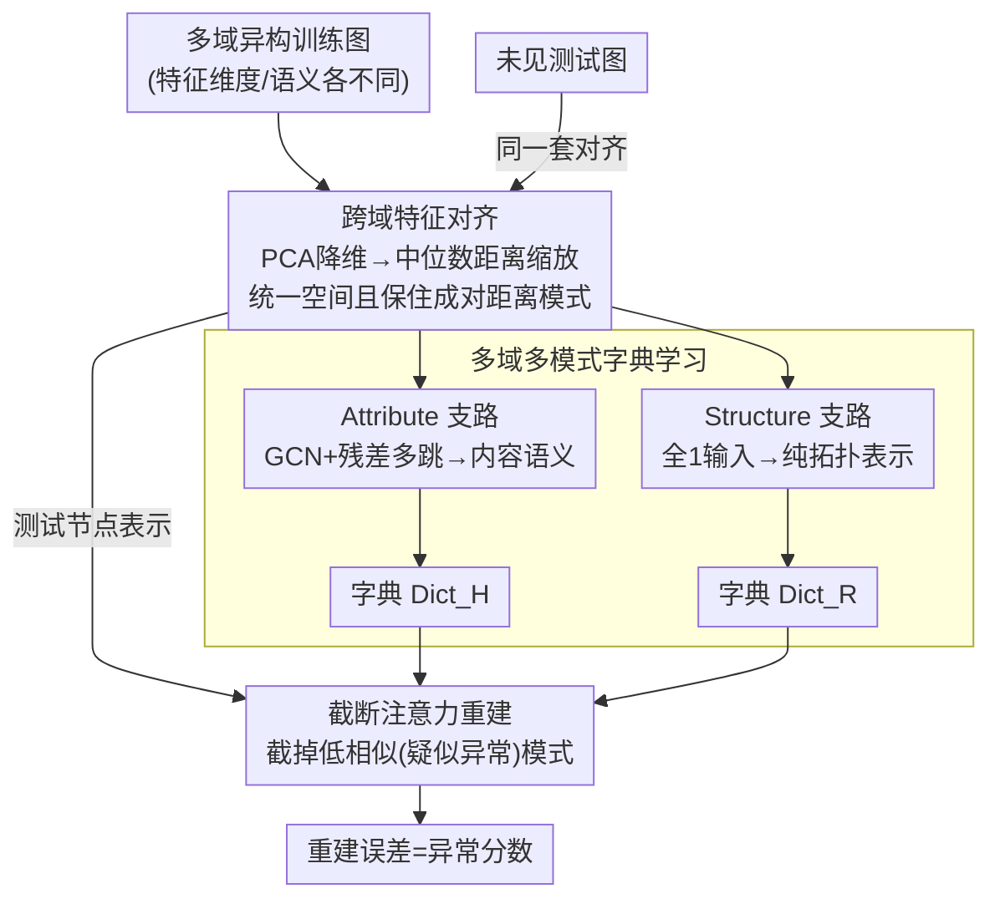

# OwlEye: Zero-Shot Learner for Cross-Domain Graph Data Anomaly Detection

**会议**: ICLR 2026  
**arXiv**: [2601.19102](https://arxiv.org/abs/2601.19102)  
**代码**: 无  
**领域**: 其他  
**关键词**: 图异常检测, 零样本学习, 跨域特征对齐, 字典学习, 持续学习

## 一句话总结

提出 OwlEye 框架，利用基于成对距离统计的跨域特征对齐将异构图嵌入共享空间，从多图中提取 attribute-level 和 structure-level 正常模式存入可扩展字典，并通过截断注意力重建机制在完全零样本条件下检测未见图的异常节点，8 数据集平均 AUPRC 36.17% 超越最强 baseline ARC 约 5.4 个百分点。

## 研究背景与动机

**领域现状**：图异常检测（GAD）广泛应用于金融欺诈检测、网络入侵检测和社交网络虚假信息识别。传统方法遵循"one model for one dataset"范式，针对每个图独立训练，已在 DOMINANT、SLGAD、TAM、CARE 等方法中取得进展。近期，ARC 和 UNPrompt 开创了"one-for-all"通用检测框架方向，试图训练一个模型后直接迁移到未见图上。

**现有痛点**：跨域通用检测面临三个核心难题。第一，不同域的图特征维度和语义完全异构——引用网络的节点特征是文本 embedding，社交网络的节点特征是用户画像属性，简单用 PCA/SVD 降维后做 normalization 无法保持语义一致性。第二，现有通用框架是静态的，不支持在已训完的模型上增量整合新图知识，每次新增训练图都需要从头重训。第三，ARC 等方法在推理时假设目标图有少量标注节点做 few-shot 学习，但实际场景中异常标注成本极高、需要领域专家。

**核心矛盾**：作者通过可视化实验揭示了现有方法的具体失败模式。ARC 的跨域处理倾向于将不同图在特征空间中分开而非对齐（TSNE 可视化清晰可见两个图的聚类被推开），这显然与跨域对齐的目标矛盾。UNPrompt 的 normalization 虽然能合并两个图的分布，但严重破坏了关键的距离模式——在 Weibo 数据集上，原始特征空间中 Normal-Normal 对的距离密度大于 Normal-Anomaly 对（这是区分正常和异常的重要信号），UNPrompt 处理后这一关系被反转，导致异常检测信号被抹去。

**本文目标** (1) 如何在不破坏语义模式的前提下统一异构图的特征空间？(2) 如何设计一个支持持续学习、可即时扩展的知识积累机制？(3) 如何在完全无标注的零样本设定下可靠地检测异常？

**切入角度**：作者观察到节点对之间的成对距离分布是一个可以在归一化过程中保持的不变量，并且正常行为模式可以在不同图之间共享——只要使用合适的对齐策略。这个观察引出了"学习正常模式字典 + 基于重建误差检测异常"的方案。

**核心 idea**：用基于中位数成对距离的缩放因子跨域对齐特征，用 attribute/structure 双支路字典存储正常模式，用截断注意力过滤潜在异常支持节点实现真正的零样本检测。

## 方法详解

### 整体框架

OwlEye 的 pipeline 由三个依次级联的模块构成。输入为来自多个域的带标注训练图集合 $\mathcal{T}_{train}$，输出为对未见测试图中每个节点的异常分数。整个流程为：(1) 跨域特征对齐模块将所有图的异构特征映射到同一维度的共享空间，且保持成对距离模式不变；(2) 多域多模式字典学习模块对每个训练图分别提取 attribute-level 和 structure-level 的正常节点模式，存入两个字典 $\text{Dict}_H$ 和 $\text{Dict}_R$；(3) 截断注意力重建模块用字典中的正常模式重建测试图的节点表示，正常节点可被准确重建而异常节点重建误差大，以此作为异常分数。训练阶段优化重建损失 + triplet 对比损失；推理阶段只需前向推断一次，无需任何标注数据。

### 关键设计

**1. 跨域特征对齐：把异构特征统一到共享空间，又不抹掉正常-异常的距离信号**

这一步直面前面那个核心矛盾——既要让不同域的图分布对齐，又不能像 UNPrompt 那样在归一化时反转关键的成对距离模式。做法分两步：先用 PCA 把各图的 $d_i$ 维特征降到统一的 $d$ 维；再做一次专门设计的跨域归一化。归一化时，先算第 $i$ 个图所有节点的平均 L2 范数 $N^i$，以及归一化前后所有节点对的平均成对距离 $\text{dist}^i$ 和 $\text{dist}_N^i$，然后以所有训练图的中位数距离 $\text{dist}^{\text{med}}$、$\text{dist}_N^{\text{med}}$ 为锚，算出缩放因子

$$f = \sqrt{\frac{\text{dist}^{\text{med}} \cdot \text{dist}_N^i}{\text{dist}^i \cdot \text{dist}_N^{\text{med}}}}$$

最终把特征归一化为 $\tilde{X}^i \leftarrow \frac{\tilde{X}^i}{N^i} \cdot \max(f, \tau)$，其中 $\tau=1$ 作为温度下界。这里用中位数而非均值是个关键选择：某些训练图节点距离特别大，用均值会让缩放因子被这种极端图主导，中位数则给出稳健的全局参考。作者直接拿这套对齐对比了 ARC 和 UNPrompt——ARC 让不同图在 t-SNE 空间被推开（与对齐目标背道而驰），UNPrompt 则在 Weibo 上把 Normal-Normal 与 Normal-Anomaly 的距离密度关系反转，本模块的目标正是在合并分布的同时保住这些区分异常的距离模式。

**2. 多域多模式字典学习：双支路提取正常模式，并让字典天然支持持续学习**

OwlEye 不直接训练一个端到端检测器，而是把"什么是正常"沉淀成一本可扩展的字典。两条 GNN 支路各管一个维度：Attribute 支路以对齐后的特征 $\tilde{X}^i$ 为输入，经多层 GCN 得到 $H_{\text{attr}}^{i,l}$，再用残差拼接多跳信息 $H^i = [H_{\text{attr}}^{i,2} - H_{\text{attr}}^{i,1}, \ldots, H_{\text{attr}}^{i,l+1} - H_{\text{attr}}^{i,1}]$ 捕获节点内容语义；Structure 支路则把输入特征全部换成全 1 向量 $\mathbf{1} \in \mathbb{R}^{n_i \times d}$，用一套独立的 GNN 权重学纯拓扑表示 $R^i$，从而彻底剥离属性信息、只看邻接结构。每个训练图随机采样 $n_{sup}=2000$ 个节点的双支路表示，存进字典 $\text{Dict}_H^j$ 和 $\text{Dict}_R^j$。图间相似度只用结构级表示来算：$\text{sim}(\mathcal{G}^i, \text{Dict}_R^j) = \max(\text{softmax}(R^i W_1 (R^j[\text{idx}])^T))$。之所以匹配时刻意避开 attribute，是因为伪装异常节点（camouflaged anomalies）会刻意模仿正常节点的属性，若用属性做相似度，这些伪装者反而拿高分逃过检测，只看结构就能绕开这个陷阱。字典这种存储方式还带来一个直接的好处：新图的正常模式只需跑一遍前向 extract 再 append 进去，模型参数完全不动，天然支持持续学习。

**3. 截断注意力重建：用字典重建测试节点，并在零样本下自动隔离潜在异常支持点**

检测的最后一步是拿字典里的正常模式去重建测试图节点——正常节点能被准确重建，异常节点重建误差大。重建用注意力机制：对 query（测试图节点）和 key（字典模式）算注意力分数 $\alpha = \sqrt{\frac{(W^Q H^i)(W^K (H^j)^T)}{\sqrt{ld}}}$，然后做关键的截断操作：把注意力分数最低的 $k$ 个模式得分设为 $-\infty$，经 softmax 后贡献归零。最终重建为

$$\hat{H}^i = \frac{1}{m} \sum_{j=1}^{m} \text{sim}(\mathcal{G}^i, \text{Dict}_H^j) \odot (\alpha_H^{ij} \text{Dict}_H^j)$$

即把截断后的注意力权重与图间 similarity 权重做 Hadamard 积再加权字典模式，structure-level 同理。截断这一招是为零样本量身设计的：没有标签时，朴素做法只能从测试图随机采"伪支持节点"当正常参考，但异常节点客观存在，随机采样难免混进异常、污染重建基准。而注意力分数低恰恰意味着该模式与已知正常模式不相似、大概率是异常，把它们直接截掉就形成了一个自筛选的安全网；作者还特意把温度压到 $\tau_a = 0.001$ 这种极低值，让注意力分布变得尖锐、放大正常与异常的差距。

### 损失函数 / 训练策略

总损失 $\mathcal{L} = \mathcal{L}_{\text{triplet}} + \mathcal{L}_{\text{recon}}$：

- **重建损失 $\mathcal{L}_{\text{recon}}$**：针对 attribute-level 表示，最大化正常节点与其重建的余弦相似度（$\frac{H_{v_j}^i (\hat{H}_{v_j}^i)^T}{|H_{v_j}^i||\hat{H}_{v_j}^i|}$），最小化异常节点的余弦相似度。设计意图是让正常节点在字典模式下可被精确重建
- **三元组损失 $\mathcal{L}_{\text{triplet}}$**：同时考虑 attribute 和 structure 两个维度，对每对（异常节点 $v_j$，正常节点 $v_k$）计算 $\max(\|\hat{H}_{v_j}^i - H_{v_j}^i\|^2 - \|\hat{H}_{v_j}^i - \hat{H}_{v_k}^i\|^2 + \lambda, 0)$，其中 margin $\lambda = 0.2$，structure 分支权重 $\beta = 0.01$。triplet loss 提供了更多的成对对比信号，增强区分度

推理阶段，异常分数为 $\mathcal{S}_{v_j} = \|\hat{H}_{v_j}^i - H_{v_j}^i\|^2 + \beta \|\hat{R}_{v_j}^i - R_{v_j}^i\|^2$，综合属性和结构两个维度的重建误差。

## 实验关键数据

### 主实验：零样本 AUPRC (%) 对比

| 数据集 | OwlEye | ARC | CARE | UNPrompt | DOMINANT | 说明 |
|--------|--------|-----|------|----------|----------|------|
| Cora | 43.94±0.46 | **45.20**±1.08 | 35.12±0.23 | 9.84±2.90 | 31.77±0.34 | ARC 略优，本文第二 |
| Flickr | **37.69**±0.25 | 35.13±0.20 | 25.64±0.16 | 25.21±1.84 | 28.76±1.52 | 大幅领先 ARC +2.56 |
| ACM | 39.75±0.13 | 39.02±0.08 | 37.76±0.35 | 11.18±1.67 | 32.49±4.97 | 各方法接近 |
| BlogCatalog | **34.99**±0.31 | 33.43±0.15 | 25.06±0.10 | 18.24±13.05 | 29.51±3.44 | 稳定优于所有 baseline |
| Facebook | 5.62±1.17 | 4.25±0.47 | 5.52±0.34 | 4.32±0.55 | 3.42±0.86 | 所有方法表现差（数据难） |
| Weibo | 60.90±0.21 | **64.18**±0.68 | 40.70±0.74 | 20.58±5.62 | 29.63±0.86 | ARC 在社交网络上强 |
| Reddit | 4.25±0.11 | 4.20±0.25 | 3.17±0.17 | 3.77±0.32 | 3.28±0.37 | 均低（数据极度不平衡） |
| Amazon | **62.20**±3.18 | 20.48±6.89 | 56.76±1.44 | 9.41±2.69 | 36.80±8.37 | ARC 崩溃，本文大幅领先 |
| **8 数据集平均** | **36.17**±0.73 | 30.74±1.23 | 28.72±0.44 | 12.82±3.58 | 24.46±3.11 | **+5.43 vs ARC** |

### 消融与持续学习分析

| 实验配置 | 关键指标 | 说明 |
|---------|---------|------|
| OwlEye（完整模型） | 平均 AUPRC 最高 | 三模块协同 |
| OwlEye-N（无特征归一化） | 平均 AUPRC 下降 | 特征对齐对跨域泛化至关重要 |
| OwlEye-S（无 structure 分支） | 平均 AUPRC 下降 | 结构信息与属性信息互补 |
| OwlEye-T（标准注意力替代截断） | 平均 AUPRC 下降 | 截断机制提升零样本鲁棒性 |
| 字典 $n_{sup}$=10 → 200 | 35.46 → 36.01 | +0.55%，字典越大越好 |
| 字典 $n_{sup}$=200 → 2000 | 36.01 → 36.17 | 增益递减，200 已近饱和 |
| 持续学习：添加 0→3 个辅助图（不重训）| 31.29 → 32.27 | 无需梯度更新即可提升 |
| 持续学习：添加 3 个辅助图（重训） | 31.33 | 反而不如不重训，训练难收敛 |

### 关键发现

- **跨域泛化的关键在特征对齐**：OwlEye-N 的消融说明去掉跨域归一化后，不同域图的特征分布差距无法靠 GNN 自行弥补，因此基于成对距离统计的对齐是框架的基石
- **ARC 在 Amazon 上崩溃**（20.48 vs 62.20）揭示了 ARC 将不同图推开而非对齐的致命问题——当测试图与训练图分布差异大时，ARC 的 in-context learning 完全失效
- **字典式持续学习优于 fine-tuning**：Case Study 1 vs 2 的对比显示，直接向字典添加新模式（不动参数）比用新图 finetune 参数效果更好，finetune 时训练在更多图上反而难以收敛
- **字典大小的边际效应**：从 10 到 200 个模式，性能从 35.46 升到 36.01；从 200 到 2000，仅从 36.01 升到 36.17，说明少量代表性模式即可捕获正常行为的主要分布
- **10-shot 设定下仍有优势**：即使给 baseline 们 10 个标注节点，OwlEye 的平均 AUPRC（36.73）仍优于所有配备 10-shot 信息的方法（ARC 31.68，CARE 30.74）

## 亮点与洞察

- **字典式持续学习**是本文最大的工程价值点。传统方法新增训练数据必须重训模型，OwlEye 只需对新图跑一遍 GNN 前向推理提取模式、append 到字典，零额外训练开销。这个设计思路可迁移到任何基于"模式匹配+异常检测"的场景（如时序异常检测、日志异常检测）
- **双支路设计中"用全 1 输入提取纯结构特征"**的做法非常巧妙。通过消除属性信息，让 GNN 只能从邻接矩阵的拓扑结构中学习表示，得到纯粹的结构 embedding。这比先前工作中用度数、聚类系数等手工结构特征更加端到端
- **截断注意力的自筛选机制**解决了零样本场景下"伪支持集可能被异常污染"的问题。设置极低温度 $\tau_a = 0.001$ 让注意力分布变得极其尖锐，少数高相似度模式主导重建，大多数模式贡献趋近于 0，有效隔离了潜在异常
- **跨域对齐中用中位数而非均值统计成对距离**是一个看似微小但至关重要的技巧。在有些训练图包含大量高维节点（导致极大的平均成对距离）的情况下，均值会让缩放因子被极端图主导，中位数则提供了稳定的全局参考

## 局限与展望

- **Facebook 和 Reddit 上所有方法表现都很差**（AUPRC 仅 4-7%），说明当前框架在某些特定域上仍有巨大提升空间。作者未深入分析这两个数据集为什么困难——是异常比例极低、还是异常模式与正常难以区分？
- **字典中模式是随机采样的**，缺乏代表性保障。可以考虑使用 k-medoids 等聚类方法选取更有代表性的字典原子，可能以更小的字典达到更好效果
- **训练阶段仍需标注数据**：虽然推理是零样本的，但训练集仍需每个节点的正常/异常标签来计算 triplet loss 和 recon loss。如果能改为完全无监督的训练范式（如纯重建目标），适用场景会更广
- **结构支路与属性支路共享相同的 GNN 层数和架构**，没有针对两种信号的特点分别优化。结构信息可能需要更深的聚合来捕获全局拓扑模式，而属性信息可能在浅层就足够
- **缺少对大规模图的效率分析**：成对距离计算的复杂度为 $O(n^2)$，对于百万节点级别的图不可行。需要引入采样或近似计算

## 相关工作与启发

- **vs ARC**：ARC 基于 in-context learning 编码高阶 affinity 和 heterophily 信息，但跨域特征处理粗糙，倾向于将不同域的图推开而非对齐。OwlEye 的特征对齐模块直接修复了这一问题。ARC 在 Amazon 上 AUPRC 仅 20.48（OwlEye 62.20），暴露了其在分布偏移大时的脆弱性
- **vs UNPrompt**：UNPrompt 用泛化邻域 prompt 预测属性作为异常分数，但其归一化方式会反转关键的成对距离模式。在 8 个数据集上平均 AUPRC 仅 12.82，远低于 OwlEye 的 36.17
- **vs CARE**：CARE 是无监督方法中最强的（28.72），基于 affinity 做检测。OwlEye 的字典重建范式提供了更显式的"正常模式库"概念，且支持持续学习，CARE 不具备这一点

## 评分

- 新颖性: ⭐⭐⭐⭐ 三个模块的组合设计有创新性，尤其字典式持续学习和截断注意力思路新颖，但单个模块（PCA对齐、GNN编码、注意力重建）不算全新
- 实验充分度: ⭐⭐⭐⭐ 8个测试数据集、3组消融、3个case study、可视化分析较完整，但缺少大规模图和效率对比
- 写作质量: ⭐⭐⭐⭐ 动机论证有力（图1的可视化直观展示了现有方法的失败），公式推导清晰
- 价值: ⭐⭐⭐⭐ 零样本跨域图异常检测是实际场景中非常需要的能力，字典式持续学习的工程价值高

<!-- RELATED:START -->

## 相关论文

- [\[CVPR 2026\] Remedying Target-Domain Astigmatism for Cross-Domain Few-Shot Object Detection](../../CVPR2026/object_detection/remedying_target-domain_astigmatism_for_cross-domain_few-shot_object_detection.md)
- [\[CVPR 2026\] Anomaly-Related Residual Fields for Cross-domain Anomaly Detection](../../CVPR2026/object_detection/anomaly-related_residual_fields_for_cross-domain_anomaly_detection.md)
- [\[ICLR 2026\] FSOD-VFM: Few-Shot Object Detection with Vision Foundation Models and Graph Diffusion](fsod-vfm_few-shot_object_detection_with_vision_foundation_models_and_graph_diffu.md)
- [\[ICLR 2026\] Towards Anomaly-Aware Pre-Training and Fine-Tuning for Graph Anomaly Detection](towards_anomaly-aware_pre-training_and_fine-tuning_for_graph_anomaly_detection.md)
- [\[CVPR 2026\] Learning Multi-Modal Prototypes for Cross-Domain Few-Shot Object Detection](../../CVPR2026/object_detection/learning_multi-modal_prototypes_for_cross-domain_few-shot_object_detection.md)

<!-- RELATED:END -->
