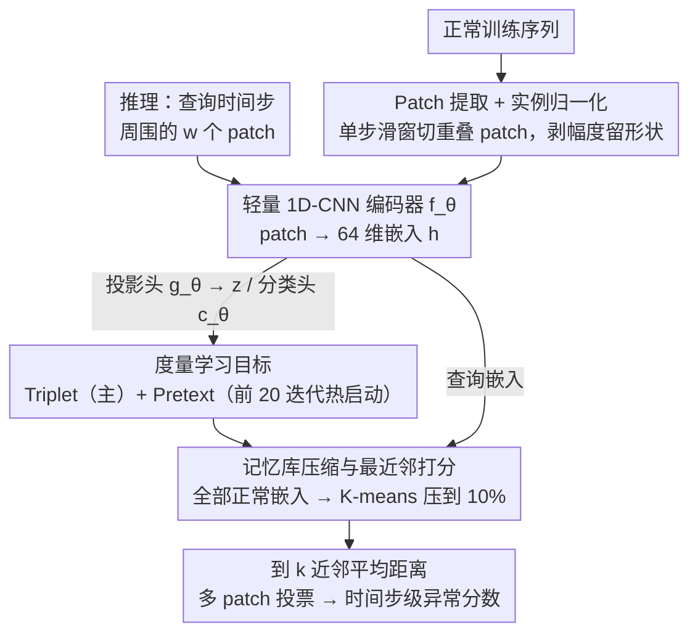

# PAANO: Patch-Based Representation Learning for Time-Series Anomaly Detection

**会议**: ICLR 2026  
**arXiv**: [2602.01359](https://arxiv.org/abs/2602.01359)  
**代码**: [有](https://github.com/jinnnju/PaAno)  
**领域**: 时间序列  
**关键词**: 时间序列异常检测, Patch表示学习, 轻量级CNN, 记忆库, 度量学习

## 一句话总结

提出 PaAno，一种基于 patch 级表示学习的轻量时间序列异常检测方法，使用 1D-CNN 编码器 + triplet loss + pretext loss 学习 patch 嵌入空间，通过与记忆库中正常 patch 的距离计算异常分数，在 TSB-AD 基准上全面 SOTA，且仅需 0.3M 参数和数秒推理。

## 研究背景与动机

时间序列异常检测在工业监控、金融交易、医疗健康等领域至关重要。近年来 Transformer 和 Foundation Model（如 AnomalyTransformer、MOMENT、TimesFM 等）逐步占据主导，但：

**现有方法的问题**：

**幻象式进步（illusion of progress）**：Sarfraz et al. 和 Liu & Paparrizos 揭示——在严格评估协议下（去除 point adjustment、避免阈值调优），复杂大模型并未显著超越简单方法

**计算成本高**：Transformer 和 Foundation Model 参数量大（0.5M-210M），运行时间长（几十秒到上千秒），不适合实时和资源受限场景

**局部性稀释**：全局自注意力机制对局部上下文不敏感，而异常检测恰恰依赖短区间内的局部时间模式

**PaAno 的定位**：

- 采用 **表示学习** 范式（而非预测或重构），这在异常检测中相对欠探索
- 引入局部性归纳偏置（locality inductive bias）：借鉴视觉异常检测中 PatchCore 等 patch-based 方法的成功经验
- 核心思想：正常时间序列具有重复的局部模式，异常打破这些短程规律

## 方法详解

### 整体框架

PaAno 把异常检测拆成"先学一个 patch 嵌入空间、再用记忆库做最近邻比对"两步。训练时从正常序列里用单步滑窗切出重叠的固定长度 patch，每个 patch 先做实例归一化再喂进一个轻量 1D-CNN 编码器，映射成向量；编码器后面挂两个只在训练时用的头——投影头配 triplet loss 把"相似局部模式"拉近、"异质模式"推远，分类头配 pretext loss 在早期热启动嵌入结构。训练完成后把全部正常 patch 的嵌入存成记忆库，并用 K-means 压到原来的 10%。推理时只保留编码器：对查询时间步周围的每个 patch 算它到记忆库的 k 近邻平均距离作为 patch 分数，再把覆盖该时间步的多个 patch 分数取平均得到时间步级异常分数。整个流程不预测也不重构原始信号，只靠"正常 patch 彼此相像、异常 patch 离正常簇远"这一几何直觉。

### 关键设计

**1. Patch 提取与实例归一化：把全局序列拆成可比对的局部单元**

给定训练序列 $\mathbf{X} = (\mathbf{x}_1, \ldots, \mathbf{x}_N)$，PaAno 用窗口大小 $w$、步长 1 的滑动窗口提取出重叠 patch 集合 $\mathcal{P} = \{\mathbf{p}_t\}_{t=1}^{N-w+1}$，让每个短区间都成为一个独立的比对单元——这正是异常检测真正需要的局部归纳偏置，而不是被全局自注意力稀释掉的长程信息。提取后每个 patch 都做实例归一化（把通道内所有值标准化到零均值单位方差），把绝对幅度信息剥掉、只留下形状信息，从而对分布漂移和体制切换（regime shift）更鲁棒，不会因为整段序列的基线平移就误判成异常。

**2. 轻量三组件架构：编码、投影、分类各司其职，推理只留编码器**

模型由三个小模块组成。Patch 编码器 $f_\theta$ 是 4 层 1D-CNN 接全局平均池化，把每个 patch 压成 64 维嵌入 $\mathbf{h}$，是整套方法唯一在推理阶段保留的部件；投影头 $g_\theta$ 是输出 256 维的两层 MLP，把 $\mathbf{h}$ 再映射成度量学习专用的表示 $\mathbf{z}$，让 triplet loss 在一个与下游解耦的空间里优化（即 projection head 的常规用法）；分类头 $c_\theta$ 是单层 MLP，吃两个 patch 的嵌入、判断它们时间上是否连续，只服务于辅助任务。三个模块加起来仅 0.3M 参数，比动辄百万到上亿参数的 Transformer 和 Foundation Model 小两三个数量级，却因为结构对局部模式更敏感而更管用。

**3. Triplet + Pretext 双损失：联手把嵌入空间塑成"正常聚簇、异质远离"的几何**

主损失是 triplet loss，关键在正负样本怎么取。对锚点 patch $\mathbf{p}_i$，正样本 $\mathbf{p}_i^+$ 取它在 $r$ 步内随机（非零）平移得到的 patch——同一段正常模式只挪了几步，理应嵌入相近，这等于强行教会编码器对微小时序抖动不敏感；负样本 $\mathbf{p}_i^-$ 用"最远负样本"（farthest negative）策略，从 minibatch 里挑余弦距离离锚点最远的 patch，逼模型把真正不同的局部模式拉开。损失写作

$$\mathcal{L}_{\text{triplet}} = \frac{1}{M} \sum_{i=1}^{M} \max\!\big(0,\ \text{dist}(\mathbf{z}_i, \mathbf{z}_i^+) - \text{dist}(\mathbf{z}_i, \mathbf{z}_i^-) + \delta\big)$$

其中 $\delta$ 是间隔超参。但只靠它在训练初期嵌入空间还很散乱，于是 PaAno 借鉴视觉异常检测里"预测 patch 空间关系"的自监督思路，加一个时序版 pretext 任务热启动：判断两个 patch 是否时间相邻。它把锚点的前一个 patch $\mathbf{p}_i^{\text{pre}}$ 当正例、随机采的 $\mathbf{p}_{i,j}^{\text{rand}}$ 当负例，用分类头 $c_\theta$ 做二分类

$$\mathcal{L}_{\text{pretext}} = \frac{1}{M} \sum_{i=1}^{M} \left[ -\log c_\theta(\mathbf{h}_i, \mathbf{h}_i^{\text{pre}}) - \frac{1}{U} \sum_{j=1}^{U} \log\big(1 - c_\theta(\mathbf{h}_i, \mathbf{h}_{i,j}^{\text{rand}})\big) \right]$$

这个辅助任务只在训练最初的 20 次迭代里起作用（权重线性衰减到 0），给编码器一个"时间局部性"先验、尽快把嵌入空间结构化，等主损失接管后就功成身退、不再干扰度量学习。两者合力下，正常模式聚成紧致簇、异常 patch 落到簇外，为后续最近邻打分提供干净的几何基础。

**4. 记忆库压缩与最近邻打分：以"到正常参照集的距离"衡量偏离程度**

训练完成后，把所有正常 patch 经编码器得到的嵌入存成记忆库 $\mathcal{M} = \{f_\theta(\mathbf{p}_t) \mid \mathbf{p}_t \in \mathcal{P}\}$，作为"正常长什么样"的参照集。直接全量存储在长序列上代价高，于是借鉴 PatchCore 的 coreset 思路对嵌入做 K-means 聚成 $K$ 个簇，每簇只保留离质心最近的那个真实向量作代表，得到压缩库 $\hat{\mathcal{M}}$——规模仅原始的 10%，既省存储又省推理时的最近邻搜索，实验显示几乎不掉点，说明正常模式本就高度冗余、少量代表就够覆盖。推理时对查询时间步 $t_*$，取覆盖它的全部 $w$ 个 patch，每个 patch 的分数定义为它到 $\hat{\mathcal{M}}$ 中 $k$ 个最近邻（余弦距离）的平均距离

$$S(\mathbf{p}_t) = \frac{1}{k} \sum_{i=1}^{k} \text{dist}\big(f_\theta(\mathbf{p}_t),\ \mathbf{m}_t^{(i)}\big)$$

离正常簇越远得分越高。最后把覆盖 $t_*$ 的所有 patch 分数取平均得到该时间步最终异常分数——多 patch 投票既平滑了单个 patch 的噪声，也让真正持续偏离的区段更突出。

### 损失函数 / 训练策略

总损失是两项加权之和

$$\mathcal{L} = \mathcal{L}_{\text{triplet}} + \lambda \cdot \mathcal{L}_{\text{pretext}}$$

其中权重 $\lambda$ 在前 20 次迭代从 1 线性衰减到 0，让 pretext 任务只在早期热启动。训练用 AdamW（weight decay $10^{-4}$），仅迭代 200 次、minibatch 512 就收敛，整套流程对超参不敏感、无需精细调优；报告结果取 10 个随机种子的平均以保证稳定性。

## 实验关键数据

### 主实验

在 TSB-AD 基准上评估，包括530条单变量序列（TSB-AD-U）和180条多变量序列（TSB-AD-M），与48个基线对比。

**单变量异常检测（TSB-AD-U）**：

| 方法 | VUS-PR | VUS-ROC | AUC-PR | AUC-ROC | 参数量 | 运行时间 |
|------|--------|---------|--------|---------|--------|---------|
| **PaAno** | **0.52** | **0.89** | **0.46** | **0.86** | 0.3M | 6.9s |
| KAN-AD | 0.43 | 0.82 | 0.41 | 0.80 | <0.1M | 12.1s |
| (Sub)-PCA | 0.42 | 0.76 | 0.37 | 0.71 | - | 1.5s |
| MOMENT (FT) | 0.39 | 0.76 | 0.30 | 0.69 | 109.6M | 43.6s |
| TimesFM | 0.30 | 0.74 | 0.28 | 0.67 | 203.5M | 83.8s |
| AnomalyTrans. | 0.12 | 0.56 | 0.08 | 0.50 | 4.8M | 48.9s |

**多变量异常检测（TSB-AD-M）**：

| 方法 | VUS-PR | VUS-ROC | AUC-PR | AUC-ROC | 参数量 | 运行时间 |
|------|--------|---------|--------|---------|--------|---------|
| **PaAno** | **0.43** | **0.79** | **0.38** | **0.76** | 0.3M | 12.8s |
| KAN-AD | 0.41 | 0.75 | 0.38 | 0.73 | <0.1M | 31.9s |
| DeepAnT | 0.31 | 0.76 | 0.32 | 0.73 | <0.1M | 9.5s |
| PCA | 0.31 | 0.74 | 0.31 | 0.70 | - | 0.1s |
| CATCH | 0.30 | 0.73 | 0.24 | 0.67 | 210.8M | 40.1s |

### 消融实验

论文在附录提供了详细消融，关键点：

- Triplet loss 是核心贡献（去掉后 VUS-PR 显著下降）
- Pretext loss 的早期应用加速了嵌入空间结构化
- 记忆库压缩（10%）几乎不损失性能
- 超参数鲁棒性高，不需要精细调优

### 关键发现

- PaAno 在所有6项评测指标上均为第一名（单变量和多变量）
- 参数量仅 0.3M，远小于 Transformer 方法（4.8M-210M）
- 运行时间 6.9-12.8s，而 Foundation Model 需 42-1221s
- 传统 PCA 和 KShapeAD 在严格评估下表现出乎意料地好，验证了"幻象式进步"现象
- AnomalyTransformer、DCdetector 等 Transformer 方法在严格评估下排名极低（20+）

## 亮点与洞察

1. **小即是美**：0.3M 参数的 1D-CNN 碾压百万级 Transformer 和 Foundation Model，从根本上质疑了"越大越好"的假设
2. **局部性优先**：异常检测需要精细的局部感知，全局注意力反而稀释了关键信号
3. **视觉→时序的成功迁移**：patch-based 表示学习 + 记忆库的范式（类 PatchCore）在时序领域同样有效
4. **严格评估的重要性**：去除 point adjustment 和阈值调优后，方法排名大幅变化

## 局限与展望

- 半监督设定假设训练数据全为正常，无法处理已知少量标注异常的场景
- patch 大小 $w$ 为固定超参，不同类型异常可能需要不同窗口
- 记忆库方案在超长训练序列上可能面临存储挑战（虽然压缩到10%）
- 仅评估了异常检测任务，其 patch 嵌入能否迁移到分类/预测等任务值得探索

## 相关工作与启发

- 受视觉异常检测（PaDiM、PatchCore、SPADE）启发，将 patch-level 表示+记忆库范式迁移到时序
- 与 预测/重构 方法形成互补：PaAno 属于 **表示学习** 范式，不需要重构原始信号
- 启发：简单但针对性强的方法（局部 patch + 度量学习）在特定任务上可能比通用大模型更有效

## 评分

- 新颖性: ⭐⭐⭐⭐ （视觉→时序的 patch 表示学习迁移，设计简洁有效）
- 实验充分度: ⭐⭐⭐⭐⭐ （48个基线、710条时序、严格评估协议、多项指标）
- 写作质量: ⭐⭐⭐⭐ （动机论证充分，对评估问题的讨论有深度）
- 价值: ⭐⭐⭐⭐⭐ （以极低成本达到 SOTA，实用性极高，有望成为工业界首选方案）

<!-- RELATED:START -->

## 相关论文

- [\[ICLR 2026\] Contextual and Seasonal LSTMs for Time Series Anomaly Detection](contextual_and_seasonal_lstms_for_time_series_anomaly_detection.md)
- [\[AAAI 2026\] Harnessing Vision-Language Models for Time Series Anomaly Detection](../../AAAI2026/object_detection/harnessing_vision-language_models_for_time_series_anomaly_detection.md)
- [\[ICML 2025\] Causality-Aware Contrastive Learning for Robust Multivariate Time-Series Anomaly Detection](../../ICML2025/object_detection/causality-aware_contrastive_learning_for_robust_multivariate_time-series_anomaly.md)
- [\[ICML 2025\] KAN-AD: Time Series Anomaly Detection with Kolmogorov-Arnold Networks](../../ICML2025/object_detection/kan-ad_time_series_anomaly_detection_with_kolmogorov-arnold_networks.md)
- [\[CVPR 2026\] Hierarchical Point-Patch Fusion with Adaptive Patch Codebook for 3D Shape Anomaly Detection](../../CVPR2026/object_detection/hierarchical_point-patch_fusion_with_adaptive_patch_codebook_for_3d_shape_anomal.md)

<!-- RELATED:END -->
