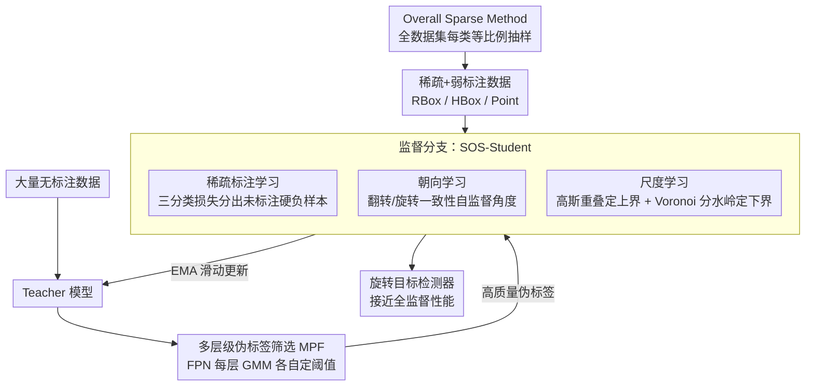

# SPWOOD: Sparse Partial Weakly-Supervised Oriented Object Detection

**会议**: ICLR 2026  
**arXiv**: [2602.03634](https://arxiv.org/abs/2602.03634)  
**代码**: 无  
**领域**: 目标检测 / 遥感  
**关键词**: 旋转目标检测, 弱监督, 稀疏标注, 半监督, 遥感

## 一句话总结
提出首个统一处理"稀疏标注 + 弱标注（HBox/Point）"的旋转目标检测框架 SPWOOD：用 SOS-Student 在一个学生模型里并联补齐未标注、缺角度、缺尺度三股信号，再以多层级伪标签筛选（MPF）从无标注数据自训练，在 DOTA-v1.0/v1.5、DIOR 上以混合标注（RBox:HBox:Point=1:1:1）达到接近全监督的性能。

## 研究背景与动机

**领域现状**：旋转目标检测（OOD）在遥感等领域至关重要，但精确的旋转框（RBox）标注成本极高——需要标注中心点、宽高和旋转角度。

**现有痛点**：现有降低标注成本的方法要么只处理弱标注（如用水平框 HBox 或点标注 Point 替代 RBox），要么只处理稀疏标注（只标注部分实例），但实际场景中两种问题同时存在。

**核心矛盾**：稀疏标注（不是所有实例都标了）和弱标注（标了但不精确）各自都会导致严重的训练信号缺失，二者叠加使问题更加困难——未标注实例可能被当作负例训练，弱标注可能引导错误的角度学习。

**本文目标** 在同时存在稀疏和弱标注的极端低成本设置下，如何训练高质量的旋转目标检测器？

**切入角度**：设计统一框架同时从三种不同质量的标注（RBox、HBox、Point）中学习，并通过自我训练挖掘未标注实例。

**核心 idea**：通过自适应旋转检测器统一处理精确/弱/无标注三种信号，结合空间布局学习和角度一致性约束来恢复旋转信息。

## 方法详解

### 整体框架
SPWOOD 面对的是"稀疏 + 弱"这一极端低成本设置：一张训练图里只有一小部分实例被标注（稀疏），而且这些标注还可能只是水平外接框 HBox 或一个中心点 Point（弱），此外还有大量完全没标的数据。它把这套设置拆成两条分支、两个阶段来训，整体沿用 teacher-student 半监督检测范式。**监督分支**是论文的核心学生模型 SOS-Student（Sparse-annotation-Orientation-and-Scale-aware Student，稀疏标注-朝向-尺度感知学生），它内部并联三股学习——稀疏标注学习把"没标的目标"从背景里区分出来、朝向学习从弱标注里自监督出旋转角、尺度学习从点标注里回归出宽高。**无监督分支**用多层级伪标签筛选（Multi-level Pseudo-labels Filtering，MPF）从 teacher 对无标注图的预测里挑出可靠伪标签。训练分两阶段：先 burn-in 阶段用少量稀疏弱标注（含增强视图）把 student 练起来、并以指数滑动平均（EMA）把权重镜像给 teacher；再进入 self-training 阶段，teacher 对无标注数据产出伪标签、经 MPF 筛过后回头监督 student，形成正反馈闭环。此外，在构建稀疏数据集这一步，SPWOOD 用 Overall Sparse Method 取代以往逐张图保标注的 Single Sparse Method——把全数据集的标注当成一个整体、对每个类别按统一比例采样，避免逐图采样时"含稀有类的图至少留一个标注"导致稀有类被过度保留、训练分布偏离原始分布。

### 关键设计

**1. SOS-Student 的稀疏标注学习：把"未标注目标"从背景里区分出来**

稀疏标注最致命的地方在于，没标的真实目标和真背景共用同一个"背景"标签，训练时未标注目标会被当成负样本反向惩罚，越学越把目标当背景。SOS-Student 借鉴 Focal Loss 的思路，把预测按"置信度 + 是否匹配 GT"切成三组分别对待：高置信且匹配到 GT 类别的算已标注正样本、低置信且匹配背景的算真背景、而**高置信却被匹配到背景**的判定为"未标注目标（硬负样本）"。前两组走标准 Focal Loss，第三组额外乘一个自适应因子 $\omega$ 把损失压低，避免这些大概率是真目标的预测被错误地往背景上拉。分类损失写成

$$\mathcal{L}_{cls}^{s}=\begin{cases}-\alpha_t(1-p_t)^{\gamma}\log(p_t) & \text{正样本}\\ -(1-\alpha_t)p_t^{\gamma}\log(1-p_t) & \text{负样本},\ p_t\le thr\\ -(1-\alpha_t)p_t^{\gamma}\log(1-p_t)\,\omega & \text{硬负样本},\ p_t> thr\end{cases}$$

其中 $p_t$ 是置信度、$thr$ 是阈值、$\omega$ 是压低硬负样本贡献的自适应因子。这样既保留了 Focal Loss 对易分样本的抑制，又专门给稀疏场景下的假负样本松了绑。

**2. 朝向学习：用对称与几何一致性自监督出缺失的旋转角**

HBox 和 Point 本身都不含方向信息，旋转角是弱标注里最难恢复的量。SOS-Student 利用一个朴素但可靠的先验：对同一张图施加翻转或旋转增强后，目标的真实朝向会按已知的变换量同步改变。于是对每张图随机做一次增强（翻转，或旋转一个已知角 $\mathcal{R}$）喂进 student，要求它在原图与增强图上预测的角度满足对应关系，监督写成

$$\mathcal{L}_{Ang}^{s}=\begin{cases} L_{Ang}^{s}(\theta_{flp}+\theta,\,0) & \text{翻转增强}\\ L_{Ang}^{s}(\theta_{rot}-\theta,\,\mathcal{R}) & \text{旋转 }\mathcal{R}\end{cases}$$

$L_{Ang}^s$ 取 Smooth-L1，$\theta$、$\theta_{flp}$、$\theta_{rot}$ 分别是原图、翻转图、旋转图上的预测角。因为变换量完全已知，整个过程不需要任何角度标注就能给角度回归提供梯度（消融里去掉朝向学习掉点明显）。

**3. 尺度学习：从孤立点标注的上下界里夹出宽高**

Point 只给了中心，宽高得另想办法约束，论文沿用 spatial layout learning 的思路从"上界"和"下界"两头夹出尺度。上界靠**高斯重叠损失** $\mathcal{L}_O^s$：把每个预测旋转框建模成二维高斯分布，用 Bhattacharyya 距离度量两两之间的距离并最小化，$\mathcal{L}_O^s=\frac{1}{N}\sum_{i\ne j}B(\mathcal{N}_i,\mathcal{N}_j)$，让相邻框互相"推开"、不至于无限膨胀（$N$ 为预测框数，$\mathcal{N}_i,\mathcal{N}_j$ 为两个高斯分布，$B$ 为 Bhattacharyya 距离）。下界靠 **Voronoi 分水岭损失** $\mathcal{L}_W^s$：先对图内所有点标注构建 Voronoi 图、保证每块区域只含一个点（天然把相邻目标隔开），再在每块里跑分水岭按像素相似性做前景分类得到轮廓，把轮廓按预测角度旋转对齐后回归宽高，用高斯 Wasserstein 距离约束 $\mathcal{L}_W^s=L_{GWD}\!\left((w/2,h/2)^2,(w_t/2,h_t/2)^2\right)$。一上一下两个损失把"没有尺度标注"的问题换成了"用外观与布局线索估尺度"，越稀疏越关键。

**4. 多层级伪标签筛选 MPF：给 FPN 每一层各自定一个阈值**

self-training 阶段伪标签的质量直接决定上限，而传统做法用一个固定阈值卡所有预测——问题是特征金字塔（FPN）各层（P3–P7）负责不同尺度，同一个目标在不同层上的置信度分布并不一致，一刀切阈值会漏掉或混入大量框。MPF 改成**逐层**建模：对第 $i$ 层的预测置信度用一个双峰高斯混合模型（GMM，正/负两个分量）拟合

$$\mathcal{P}^{i}(c^{i})=w_p^i\mathcal{N}_p^i(\mu_p^i,(\sigma_p^i)^2)+w_n^i\mathcal{N}_n^i(\mu_n^i,(\sigma_n^i)^2)$$

用期望最大化（EM）求解后，取正分量上的最优点作为该层阈值 $\tau^i=\arg\max_{c^i}\mathcal{P}^i(c^i,\mu_p^i,(\sigma_p^i)^2)$，每层各自筛出伪标签再合起来监督 student。阈值随训练动态自适应，比固定阈值对不同场景更稳。

### 损失函数 / 训练策略
监督分支的总损失把上面几项与标准检测项加权相加：$\mathcal{L}^s=w_{cls}\mathcal{L}_{cls}^s+w_{cen}\mathcal{L}_{cen}^s+w_{box}\mathcal{L}_{box}^s+w_{Ang}\mathcal{L}_{Ang}^s+w_O\mathcal{L}_O^s+w_W\mathcal{L}_W^s$，其中分类/centerness/box 权重为 1，$(w_{Ang},w_O,w_W)$ 默认取 $(0.2,10,5)$。无监督分支对 teacher 经 MPF 筛出的伪标签算分类、centerness、box 三项一致性损失 $\mathcal{L}^u$。最终 $\mathcal{L}=\mathcal{L}^s+\mathcal{L}^u$，student 与 teacher 经 EMA 互相促进、形成正反馈闭环。

## 实验关键数据

### 主实验

| 方法 | 类型 | 10%稀疏·10%部分 | 20%·20% | 30%·20% |
|------|------|-----------------|---------|---------|
| H2RBox-v2 | 弱监督(HBox) | 30.6 | 42.7 | 49.2 |
| MCL | 半监督(RBox) | 31.7 | 44.5 | 47.8 |
| PWOOD | 部分弱监督(RBox) | 38.0 | 51.9 | 55.2 |
| RSST | 稀疏监督(RBox) | 43.4 | 52.3 | 56.6 |
| **SPWOOD (RBox)** | **稀疏+弱** | **48.5** | **57.8** | **60.3** |
| SPWOOD (HBox) | 稀疏+弱 | 45.5 | 54.0 | 56.5 |
| SPWOOD (R:H:P=1:1:1) | 混合 | 42.4 | 53.0 | 54.8 |

### 消融实验

| 配置 | mAP (10%·10%) | 说明 |
|------|--------------|------|
| SPWOOD 完整 | 48.5 | 所有组件 |
| 无角度学习 | ~43 | 弱标注角度不准 |
| 无空间布局 | ~44 | 点标注尺度恢复差 |
| 无 teacher-student | ~40 | 未标注实例浪费 |

### 关键发现
- SPWOOD (RBox) 在所有稀疏-部分比例下都显著超越现有方法，最大提升 5+ mAP
- 即使使用混合标注 (R:H:P=1:1:1)，仍能达到接近全 RBox 稀疏监督的性能
- 角度学习对弱标注场景贡献最大
- 空间布局学习在极稀疏设置下更为关键

## 亮点与洞察
- **统一框架处理多种标注类型**：不同标注提供不同质量的信息，SPWOOD 优雅地整合三种信号源
- **几何一致性的巧妙利用**：通过图像增强的角度约束来自监督学习角度信息，不需要任何角度标注

## 局限与展望
- Voronoi 分水岭在密集目标场景中可能失效
- 角度学习假设增强变换已知，不适用于自然场景中的未知视角变化
- 仅在 DOTA-v1.0/v1.5、DIOR 等遥感数据上评估，对自然图像的旋转检测效果未知

## 相关工作与启发
- **vs Point2RBox**: 仅从点标注恢复旋转框，不处理稀疏标注问题
- **vs PWOOD**: 处理部分弱监督但不处理稀疏（假设所有实例至少有弱标注）

## 评分
- 新颖性: ⭐⭐⭐⭐ 首次统一处理稀疏+弱标注的旋转检测
- 实验充分度: ⭐⭐⭐⭐ 多种标注比例、多种方法对比
- 写作质量: ⭐⭐⭐ 方法描述清晰但公式较密
- 价值: ⭐⭐⭐⭐ 对低成本遥感检测有直接实用价值

<!-- RELATED:START -->

## 相关论文

- [\[CVPR 2026\] Partial Weakly-Supervised Oriented Object Detection](../../CVPR2026/object_detection/partial_weakly-supervised_oriented_object_detection.md)
- [\[ICLR 2026\] Bootstrapping MLLM for Weakly-Supervised Class-Agnostic Object Counting (WS-COC)](bootstrapping_mllm_for_weakly-supervised_class-agnostic_object_counting.md)
- [\[CVPR 2026\] Fourier Angle Alignment for Oriented Object Detection in Remote Sensing](../../CVPR2026/object_detection/fourier_angle_alignment_for_oriented_object_detection_in_remote_sensing.md)
- [\[ICLR 2026\] Long-Context Generalization with Sparse Attention](long-context_generalization_with_sparse_attention.md)
- [\[ICLR 2026\] CGSA: Class-Guided Slot-Aware Adaptation for Source-Free Object Detection](cgsa_class-guided_slot-aware_adaptation_for_source-free_object_detection.md)

<!-- RELATED:END -->
