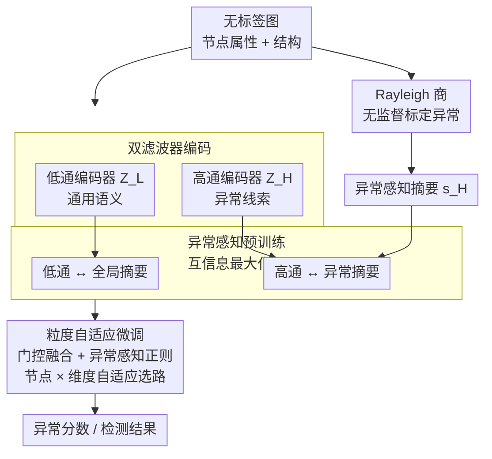

# Towards Anomaly-Aware Pre-Training and Fine-Tuning for Graph Anomaly Detection

## 论文信息
- **会议**: ICLR 2026
- **arXiv**: [2504.14250](https://arxiv.org/abs/2504.14250)
- **代码**: [https://github.com/Cloudy1225/APF](https://github.com/Cloudy1225/APF)
- **领域**: LLM评测
- **关键词**: GAD, 预训练微调, Rayleigh 商, 同质性差异, 双滤波器, 门控融合

## 一句话总结
提出 APF 框架，通过 Rayleigh 商引导的异常感知预训练和粒度自适应微调，解决图异常检测中标签稀缺和同质性差异的双重挑战。

## 研究背景与动机

### 核心问题
图异常检测（GAD）面临两大关键挑战：

**标签稀缺**：标注成本高，真实场景中标注节点极少

**同质性差异**：分为节点级（个体节点局部同质性变化大）和类别级（异常节点局部同质性更低）

### 现有局限
- 通用图预训练策略（DGI、GraphMAE）仅提取任务无关语义，无法捕捉异常线索
- 伪标签和合成样本方法在标签稀缺下不稳定
- 全局统一的处理方案（边重加权、谱滤波）缺乏节点自适应机制

### 关键观察
局部同质性 $h_i = \frac{|v_j \in \mathcal{N}_i: y_i = y_j|}{|\mathcal{N}_i|}$ 在节点间变化剧烈，且异常节点的平均局部同质性 $h^a$ 一致低于正常节点 $h^n$。现有方法在不同局部同质性分组上表现不一致。

## 方法详解

### 整体框架

APF（Anomaly-aware Pre-training and Fine-tuning）想解决的是这样一个两难：图异常检测既缺标签（真实场景只有零星标注），节点之间的同质性又差异巨大（异常节点的邻居一致性更低，且不同节点差异悬殊）。它的应对办法是把流程拆成两阶段——先在无标签数据上做**异常感知预训练**，让模型在没有任何标注时就学会把"语义"和"异常线索"分开编码；再用极少量标签做**粒度自适应微调**，按节点逐个决定该信任哪一路编码。整条链路是：用 Rayleigh 商无监督地标定哪里像异常 → 用低通/高通双滤波器分别编码语义与异常 → 预训练把异常信号注入互信息目标 → 微调时用门控网络在节点和维度两级上融合两路表示，并用极少量标签做异常感知正则。

### 关键设计

**1. Rayleigh 商：无需标签就能标定异常**

预训练阶段没有标签，模型怎么知道哪里"反常"？APF 借的是图信号处理里的 Rayleigh 商：

$$RQ(\boldsymbol{x}, \boldsymbol{L}) = \frac{\boldsymbol{x}^T \boldsymbol{L} \boldsymbol{x}}{\boldsymbol{x}^T \boldsymbol{x}} = \frac{\sum_{i,j} A_{ij}(x_j - x_i)^2}{\sum_{i=1}^n x_i^2}$$

它本质上度量的是节点属性与局部图结构的不一致程度——属性与邻居越冲突，分子里的差分项越大，商越高。论文观察到异常节点普遍呈现"谱能量右移"，也就是 Rayleigh 商更高，于是这个纯无监督的量就成了天然的异常信号。具体落地时，对每个节点 $v_i$ 用 MRQSampler 提取一个 2-hop 子图 $\mathcal{G}_i^{RQ}$，并以最大化该子图的 Rayleigh 商为准则挑选邻居，从而把最能体现异常的局部结构圈出来。

**2. 双滤波器编码：低通管语义、高通管异常**

针对同质性差异，APF 不用单一滤波器一刀切，而是并行两套可学习的 Chebyshev 多项式谱滤波器：

$$g_L(\hat{\boldsymbol{L}}) = \sum_{k=0}^{K} w_k^L T_k(\hat{\boldsymbol{L}}), \quad g_H(\hat{\boldsymbol{L}}) = \sum_{k=0}^{K} w_k^H T_k(\hat{\boldsymbol{L}})$$

低通编码器 $\boldsymbol{Z}_L = f_{\theta_L}(g_L(\hat{\boldsymbol{L}})\boldsymbol{X})$ 平滑邻域、抓通用语义模式；高通编码器 $\boldsymbol{Z}_H = f_{\theta_H}(g_H(\hat{\boldsymbol{L}})\boldsymbol{X})$ 放大邻域差分、抓那些细微的异常线索。两路分工的合理性有理论背书：定理 1 证明在异常随机块模型（ASBM）下，把低通、高通滤波器分别作用于同质性节点和异质性节点时，存在一组参数能让所有节点线性可分（概率 $1-o_d(1)$）——这正是后面要靠门控网络去"按节点选路"的依据。

**3. 异常感知预训练目标：把异常摘要写进互信息最大化**

预训练沿用 DGI 的互信息最大化框架，但在高通分支上动了手脚：

$$\mathcal{L}_{pt} = -\frac{1}{n}\sum_i \left[\log\mathcal{D}(\boldsymbol{Z}_i^L, \boldsymbol{s}^L) + \log(1-\mathcal{D}(\tilde{\boldsymbol{Z}}_i^L, \boldsymbol{s}^L))\right] - \frac{1}{n}\sum_i \left[\log\mathcal{D}(\boldsymbol{Z}_i^H, \boldsymbol{s}_i^H) + \log(1-\mathcal{D}(\tilde{\boldsymbol{Z}}_i^H, \boldsymbol{s}_i^H))\right]$$

低通分支配的是常规的全局摘要 $\boldsymbol{s}^L$，而高通分支配的 $\boldsymbol{s}_i^H$ 是基于前面 Rayleigh 商子图算出来的**异常感知摘要**——这一步把第 1 个设计里圈出的异常局部结构真正引进了训练目标，使得高通编码器在无标签时就被推着去对齐异常模式，而不只是学一套任务无关的语义。

**4. 门控融合 + 异常感知正则：微调时按节点、按维度自适应选路**

微调阶段要解决的是"每个节点到底该信低通还是高通"。APF 用一个逐节点、逐维度的门控系数矩阵 $\boldsymbol{C}$ 做加权融合：

$$\boldsymbol{Z} = \boldsymbol{C} \odot \boldsymbol{Z}_L + (1-\boldsymbol{C}) \odot \boldsymbol{Z}_H$$

系数由一个轻量门控网络从节点属性直接生成 $\boldsymbol{C} = \sigma(\boldsymbol{X}\boldsymbol{W}_c + \boldsymbol{b}_c)$。相比给每个节点单独学一组融合权重，这种由属性映射出系数的做法把参数复杂度从 $\mathcal{O}(n \times e)$ 压到 $\mathcal{O}((d+1) \times e)$，既呼应了定理 1 "按节点分配滤波器"的需求，又避免了在标签稀缺时为海量节点直接优化权重带来的不稳定。

但光有门控网络还不够，标签稀缺时它容易学偏，所以 APF 再加一个正则项，用那点宝贵的标签去约束门控系数的取向：

$$\mathcal{L}_{reg} = -\frac{1}{|\mathcal{V}^L|}\sum_{v_i, y_i=1}\left(p^a\log c_i + (1-p^a)\log(1-c_i)\right) - \frac{1}{|\mathcal{V}^L|}\sum_{v_i, y_i=0}\left(p^n\log c_i + (1-p^n)\log(1-c_i)\right)$$

它把已标注的异常节点（$y_i=1$）往目标比例 $p^a$、正常节点往 $p^n$ 上拉，并设定 $p^a \leq p^n$——也就是显式地要求异常节点的门控系数更偏向高通一侧，多保留异常相关信息。这条正则把"异常更依赖高通表示"这个先验直接灌进了融合层，与门控网络一起构成了微调阶段的核心。

## 实验

### 实验设置
- **10 个 GADBench 数据集**：Reddit, Weibo, Amazon, Yelp, T-Finance, Elliptic 等
- **半监督设置**：仅 100 个标注节点（20 异常 + 80 正常）
- **指标**：AUPRC, AUROC, Rec@K

### 主实验（AUPRC）

| 模型 | Reddit | Weibo | Amazon | T-Fin | 平均 |
|------|--------|-------|--------|-------|------|
| GCN | 4.2 | 86.0 | 32.8 | 60.5 | 29.3 |
| BWGNN | 4.2 | 80.6 | 81.7 | 60.9 | - |
| BernNet | 4.9 | 66.6 | 81.2 | 51.8 | 31.1 |
| **APF** | **最佳/次佳** | **最佳/次佳** | **最佳/次佳** | **最佳/次佳** | **最高** |

### 消融实验关键发现
1. Rayleigh 商引导的子图选择显著提升异常感知能力
2. 双滤波器比单一滤波器表现更好
3. 门控融合网络优于直接参数优化
4. 异常感知正则化在类别级差异大的数据集上效果更明显

## 亮点
1. **创新的无标签异常度量**：Rayleigh 商作为预训练阶段的异常信号
2. **双粒度设计**：从预训练时的节点级到微调时的节点+维度级自适应
3. **理论支撑**：ASBM 模型下的线性可分性证明
4. **10 个数据集的全面验证**

## 局限性
1. 预训练依赖 DGI 框架，可能不是所有场景的最优选择
2. Rayleigh 商假设异常表现为谱能量右移，对某些类型异常可能不敏感
3. 需要手动设定 $p^a, p^n$ 的值
4. 标注数据极少时正则化损失的优化可能不稳定

## 相关工作
- **图异常检测**: PCGNN, AMNet, BWGNN — 全局同质性处理
- **图预训练**: DGI, GraphMAE, BGRL — 任务无关语义
- **谱方法**: BernNet, ChebNet — 可学习谱滤波器

## 评分
- **创新性**: ⭐⭐⭐⭐ — Rayleigh 商 + 双滤波器预训练的组合很有洞察
- **实验充分性**: ⭐⭐⭐⭐⭐ — 10 个数据集全面评比
- **写作质量**: ⭐⭐⭐⭐ — 理论与实践结合紧密
- **实用性**: ⭐⭐⭐⭐ — 标签稀缺场景下有实际价值

<!-- RELATED:START -->

## 相关论文

- [\[CVPR 2025\] Multi-Sensor Object Anomaly Detection: Unifying Appearance, Geometry, and Internal Properties](../../CVPR2025/object_detection/multi-sensor_object_anomaly_detection_unifying_appearance_geometry_and_internal_.md)
- [\[ICLR 2026\] OwlEye: Zero-Shot Learner for Cross-Domain Graph Data Anomaly Detection](owleye_zero-shot_learner_for_cross-domain_graph_data_anomaly_detection.md)
- [\[CVPR 2026\] Bidirectional Multimodal Prompt Learning with Scale-Aware Training for Few-Shot Multi-Class Anomaly Detection](../../CVPR2026/object_detection/bidirectional_multimodal_prompt_learning_with_scale-aware_training_for_few-shot_.md)
- [\[CVPR 2026\] Geometry-Aligned and Anomaly-Aware Reconstruction for 3D Anomaly Detection](../../CVPR2026/object_detection/geometry-aligned_and_anomaly-aware_reconstruction_for_3d_anomaly_detection.md)
- [\[ICCV 2025\] Visual-RFT: Visual Reinforcement Fine-Tuning](../../ICCV2025/object_detection/visual-rft_visual_reinforcement_fine-tuning.md)

<!-- RELATED:END -->
