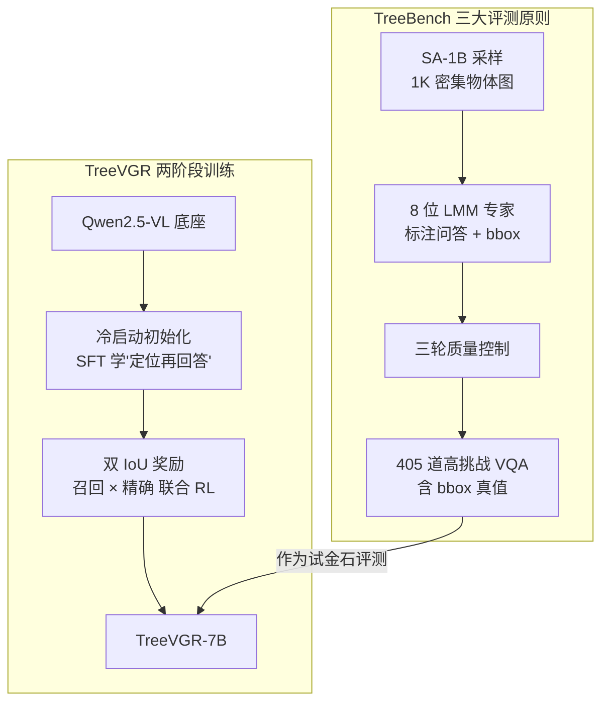

# Traceable Evidence Enhanced Visual Grounded Reasoning: Evaluation and Method

**会议**: ICLR 2026  
**arXiv**: [2507.07999](https://arxiv.org/abs/2507.07999)  
**代码**: [GitHub](https://github.com/Haochen-Wang409/TreeVGR)  
**领域**: 目标检测  
**关键词**: 视觉定位推理, 可追溯证据, 二阶推理, TreeBench, 强化学习, Dual IoU

## 一句话总结

提出 TreeBench（首个可追溯视觉推理基准，405道高挑战 VQA，OpenAI-o3 仅 54.87%）和 TreeVGR（通过双 IoU 奖励的强化学习联合监督定位与推理的训练范式），7B 模型在 V\*Bench +16.8、MME-RealWorld +12.6、TreeBench +13.4，证明可追溯性是推进视觉推理的关键。

## 研究背景与动机

**领域现状**：OpenAI-o3 开创了"用图像思考"（thinking with images）的范式——在推理过程中动态引用、放大任务相关的视觉区域，已展示出超越纯文本推理的潜力。然而，目前没有任何基准能全面评估这种能力。

**现有痛点**：
1. POPE、MMBench、SEED-Bench 等经典基准忽略精细定位和可验证的推理链
2. V\*Bench 仅支持简单空间查询（"A是否在B左边？"），且基于COCO图像存在数据泄露风险
3. MME-RealWorld、HR-Bench 支持高分辨率输入，但缺乏可追溯证据和复杂推理
4. 现有 RL 训练方法（DeepEyes、Pixel-Reasoner 等）仅监督最终答案，不监督中间定位过程

**核心矛盾**：没有基准同时满足三个关键要求——聚焦视觉感知（密集场景中识别细微目标）、可追溯证据（评估推理链中每步的定位质量）、二阶推理（超越简单定位的物体交互和空间层级推理）。训练方面，现有方法无法量化"定位-回答"框架中定位的实际贡献。

**本文方案**：双管齐下——TreeBench 建立评测标准，TreeVGR 建立训练方法，二者共同推进"用图像思考"能力的评估和提升。

## 方法详解

### 整体框架

本文是评测与训练的双线设计。评测线是 TreeBench：从 SA-1B 采样 1K 张密集物体场景图，交给 8 位 LMM 专家手工标注问题、选项、答案与目标的 bounding box，再经三轮质量控制层层筛选，凝练成 405 道带框真值的高挑战 VQA，专门拷问模型"看得准、说得清、推得对"。训练线是 TreeVGR：以 Qwen2.5-VL 为底座，先用一批带框推理轨迹的 SFT 数据做冷启动，让模型学会"先定位、再回答"；再用带可追溯证据的强化学习，靠双 IoU 奖励把定位与推理同时拉高。两条线在评测处汇合——TreeBench 充当试金石，验证 TreeVGR 学到的定位能力是否真的转化为更强的视觉推理。

### 关键设计

**1. TreeBench 的三大评测原则：让"用图像思考"变得可量化、可诊断**

TreeBench 想测的不是泛泛的 VQA 准确率，而是模型在精细视觉场景里"看得准、说得清、推得对"的全过程，因此把考点拆成三条原则。第一条是聚焦视觉感知：所有问题都瞄准复杂真实场景中的极小目标，目标实例平均仅占图像面积的 **3.05%**，逼模型必须给出详细、精确、唯一的文本描述才能锁定细微物体，而非靠常识蒙答案。第二条是可追溯证据：评测不只看最终答案对不对，还把推理链里模型生成的 bounding box 拿出来和 ground-truth 框比 mIoU——这样就能把"答错"拆成"理解错"还是"定位失败"，让错误来源可诊断。第三条是二阶推理：题目超越简单的"是什么/在哪"，覆盖 5 类感知任务（属性/材质/物理状态/目标检索/OCR）和 5 类推理任务（视角变换/排序/接触遮挡/空间包含/比较），其中视角变换（"从人 A 的视角看，物体 B 在哪个方向？"）需要换位想象空间关系，是全场最难的一类。这三条原则共同保证了基准的挑战性——最强的 o3 也只拿到 54.87%。

**2. 冷启动初始化：先 SFT 教会基本定位再上 RL，砍掉算力开销**

直接拿一个不会定位的模型上 RL 训练视觉推理代价极高——DeepEyes 的纯 RL 方案要 32 块 H100 跑 48 小时，因为模型早期几乎采不到带正确框的轨迹，奖励信号稀疏。本文先用精心构造的 SFT 数据做冷启动（基于 VGR-158K 等带伪推理链与 bounding box 标注的数据），每个样本都包含图像、问题、带 bounding box 的完整推理轨迹和最终答案，让模型在进入 RL 前就已经具备基本的"定位—推理"能力。有了这个起点，RL 阶段的探索从一个合理的策略附近出发，奖励更稠密、收敛更快，整体计算成本大幅下降。这一步也是后续双 IoU 奖励能稳定生效的前提——模型先得会发框，框上的奖惩才有意义。

**3. 双 IoU 奖励：让 RL 既奖励"找全"也惩罚"乱发框"**

冷启动之后进入强化学习阶段，总奖励由准确率、格式、定位三部分组成，$R = R_{\text{acc}} + R_{\text{format}} + R_{\text{IoU}}$，其中定位奖励 $R_{\text{IoU}}$ 是 TreeVGR 的核心创新。如果只用单向的召回奖励，模型会发现一个捷径：把图像铺满候选框就能保证每个 GT 都被覆盖，于是退化成"穷举所有可能框"的 reward hacking。本文用双向 IoU 把这条捷径堵死。召回项要求每个 GT 框 $b_k$ 至少被某个预测框匹配上，$R_{\text{IoU}}^{\text{R}} = \frac{1}{M} \sum_{k=1}^{M} \max_i \text{IoU}(\hat{b}_i, b_k)$；精确项反过来要求每个预测框 $\hat{b}_i$ 都得对得上某个 GT 框，$R_{\text{IoU}}^{\text{P}} = \frac{1}{N} \sum_{i=1}^{N} \max_k \text{IoU}(b_k, \hat{b}_i)$，乱发的多余框会拉低这一项；最终取两者平均 $R_{\text{IoU}} = \frac{1}{2}(R_{\text{IoU}}^{\text{R}} + R_{\text{IoU}}^{\text{P}})$。这样模型只有在"找全"和"找准"同时满足时才拿满分，定位质量被实打实地纳入优化目标，从而把人工标注的可追溯证据真正灌进策略里。

## 实验关键数据

### 主实验：TreeBench 各类别性能

| 模型 | Overall | 属性 | 物理状态 | 目标检索 | OCR | 视角变换 | 排序 | 接触遮挡 | 空间包含 | 比较 | mIoU |
|------|---------|------|----------|----------|-----|----------|------|----------|----------|------|------|
| o3-0416 | 54.8 | 69.0 | 69.2 | 65.2 | 68.8 | 79.4 | 22.4 | 38.6 | 61.0 | 86.2 | –† |
| Gemini-2.5-Pro | 54.1 | 51.7 | 61.5 | 56.5 | 75.0 | 83.8 | 20.0 | 36.8 | 65.9 | 86.2 | – |
| Qwen2.5-VL-72B | 42.2 | 65.5 | 69.2 | 56.5 | 56.3 | 48.5 | 11.8 | 33.3 | 51.2 | 72.4 | – |
| Qwen2.5-VL-7B | 37.0 | 55.2 | 53.8 | 56.5 | 62.5 | 27.9 | 20.0 | 35.1 | 39.0 | 44.8 | – |
| DeepEyes-7B | 37.5 | 62.1 | 53.8 | 65.2 | 68.8 | 51.5 | 11.8 | 24.6 | 36.6 | 51.7 | 30.0 |
| Pixel-Reasoner-7B | 39.0 | 58.6 | 61.5 | 65.2 | 50.0 | 48.5 | 14.1 | 31.6 | 39.0 | 44.8 | 35.7 |
| **TreeVGR-7B** | **50.4** | 65.5 | 53.8 | **82.6** | 68.8 | **63.3** | **22.4** | 36.8 | **61.0** | 69.0 | **44.0** |

### 消融实验：各基准提升对比

| 基准 | Qwen2.5-VL-7B（基线） | TreeVGR-7B | 提升幅度 |
|------|----------------------|------------|----------|
| TreeBench Overall | 37.0 | 50.4 | **+13.4** |
| V\*Bench Overall | 74.3 | 91.1 | **+16.8** |
| V\*Bench Attr. | 77.4 | 94.0 | +16.6 |
| V\*Bench Spatial | 69.7 | 87.0 | +17.3 |
| MME-RealWorld-Lite | 42.3 | 54.9 | **+12.6** |
| HR-Bench-4K | 72.1 | 77.1 | +5.0 |
| HR-Bench-8K | 68.8 | 73.1 | +4.3 |

### 核心发现

- **没有模型在 TreeBench 上超过 60%**：最强的 o3 也仅 54.87%，证明基准确实有挑战性
- **TreeVGR-7B 媲美 InternVL3-78B**：7B 模型通过定位-推理联合训练达到 78B 通用模型的水平
- **mIoU 高度相关于最终准确率**：TreeVGR 的 mIoU=44.0 显著优于 DeepEyes（30.0）和 Pixel-Reasoner（35.7），验证了精确定位对推理的促进作用
- **接触遮挡和排序是最难类别**：所有模型在这两类上表现最差（<25%），反映二阶推理的根本困难

## 亮点与洞察

- **"o3 不到 55%"的震撼**：当前最强多模态模型在精细视觉推理上仍然很弱——TreeBench 暴露了真实能力 gap
- **可追溯性 = 可验证性**：不只看最终答案，而是评估推理链每步的定位证据——使评测更可靠、更具诊断价值
- **双 IoU 奖励设计优雅**：同时约束召回和精确，避免了模型"穷举框"的 reward hacking 策略
- **冷启动+RL 范式高效**：相比 DeepEyes 的纯 RL 方案（32×H100, 48h），冷启动大幅降低了计算成本

## 局限与展望

- TreeBench 规模较小（仅 405 题），统计显著性受限
- TreeVGR 不实际裁剪和回看图像（仅文本空间定位），可能错失视觉细节
- 冷启动 SFT 数据的质量直接影响 RL 的上限，数据构造过程存在人工成本
- 二阶推理（视角变换/空间包含）的训练样本较少，RL 训练可能不充分
- 未探索多轮交互式定位推理的可能性

## 评分

- 新颖性: ⭐⭐⭐⭐⭐
- 实验充分度: ⭐⭐⭐⭐⭐
- 写作质量: ⭐⭐⭐⭐⭐
- 价值: ⭐⭐⭐⭐⭐

<!-- RELATED:START -->

## 相关论文

- [\[CVPR 2026\] ADSeeker: A Knowledge-Grounded Reasoning Framework for Industry Anomaly Detection and Reasoning](../../CVPR2026/object_detection/adseeker_a_knowledge-grounded_reasoning_framework_for_industry_anomaly_detection.md)
- [\[ICCV 2025\] VisRL: Intention-Driven Visual Perception via Reinforced Reasoning](../../ICCV2025/object_detection/visrl_intention-driven_visual_perception_via_reinforced_reasoning.md)
- [\[AAAI 2026\] Connecting the Dots: Training-Free Visual Grounding via Agentic Reasoning](../../AAAI2026/object_detection/connecting_the_dots_training-free_visual_grounding_via_agent.md)
- [\[CVPR 2026\] Reasoning-Driven Anomaly Detection and Localization with Image-Level Supervision](../../CVPR2026/object_detection/reasoning-driven_anomaly_detection_and_localization_with_image-level_supervision.md)
- [\[CVPR 2026\] YOLO-Master: MOE-Accelerated with Specialized Transformers for Enhanced Real-time Detection](../../CVPR2026/object_detection/yolo-master_moe-accelerated_with_specialized_transformers_for_enhanced_real-time.md)

<!-- RELATED:END -->
