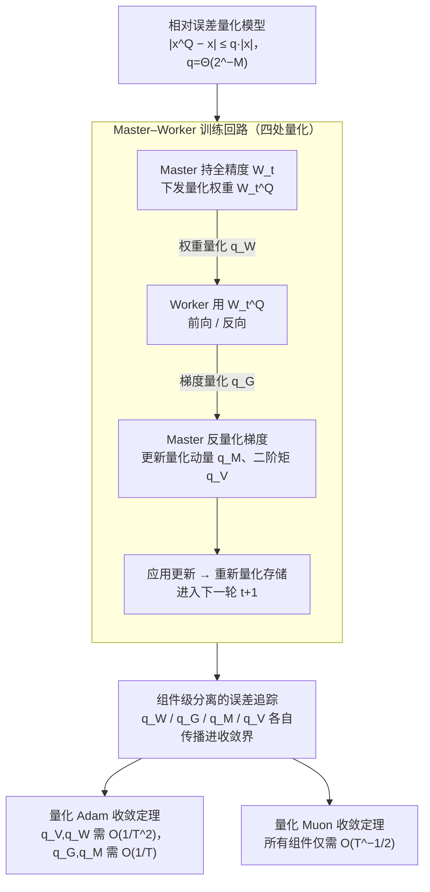

# A Convergence Analysis of Adaptive Optimizers under Floating-Point Quantization

**会议**: ICLR 2026  
**arXiv**: [2510.21314](https://arxiv.org/abs/2510.21314)  
**代码**: 无  
**领域**: 优化  
**关键词**: 低精度训练, Adam, Muon, 浮点量化, 收敛分析

## 一句话总结
本文建立了首个在浮点量化下分析自适应优化器收敛性的理论框架，对梯度、权重和优化器状态（动量、二阶矩）同时施加相对误差量化模型，证明了量化 Adam 和 Muon 在尾数长度仅需对数增长于迭代次数时即可保持与全精度相同的 $\tilde{O}(T^{-1/4})$ 收敛率，并揭示了 Adam 对权重和二阶矩量化高度敏感而 Muon 更为鲁棒的理论机制。

## 研究背景与动机
大语言模型（LLM）的快速规模扩展使得低精度训练成为降低内存、提高效率的关键技术。BF16、FP8等低精度格式已在实际的万亿 token 级训练中被广泛使用（如 DeepSeek-V3、FP8-LM 等），并且在经验上未观察到显著的精度损失。

然而，**理论理解严重滞后于实践**。现有的量化优化器收敛理论存在多个关键缺口：

**只分析梯度量化**: 大多数理论工作仅考虑随机梯度下降（SGD）中梯度的量化，而现代低精度训练同时量化权重、梯度和优化器状态

**不切实际的假设**: 现有分析要么假设无偏量化（unbiased quantization），要么依赖误差反馈（error feedback）机制——前者不符合浮点量化的特性，后者在大规模LLM训练中因内存开销而不实际

**忽略优化器状态量化**: Adam 的一阶矩和二阶矩在实践中也被量化以节省内存（如 8-bit Adam），但理论分析中这一环节被完全忽略

**未涵盖新型优化器**: Muon 等基于矩阵视角的新兴优化器在低精度下的理论保证为空白

**核心问题**: 为什么在所有组件都被激进量化的情况下，自适应优化器仍然能有效收敛？

## 方法详解

### 整体框架
本文构建了一个解析式低精度训练框架，把一轮 master-worker 训练拆成四处量化点来追踪：master 维护全精度权重 $\mathbf{W}_t$ 但只向 worker 传量化版本 $\mathbf{W}_t^Q$，worker 用 $\mathbf{W}_t^Q$ 做前反向、量化梯度回传，master 再反量化梯度、更新被量化的动量与二阶矩、应用优化器更新后重新量化存储。整个分析的支点是用**相对误差模型**取代以往的无偏量化假设，从而能在不引入误差反馈机制的前提下，逐个组件地刻画量化对收敛率的影响——四处量化点的误差系数 $q_W, q_G, q_M, q_V$ 被分别保留，最终汇入针对 Adam 与 Muon 两个优化器的收敛定理。

### 关键设计

**1. 相对误差量化模型：让浮点截断进入可分析的形式**
以往的量化收敛理论大多假设量化是无偏的，或依赖误差反馈来抵消偏差，但浮点量化两者都不满足——FP32→BF16 这类操作只截断尾数、保留符号位和指数位，误差天然与数值量级成比例。本文据此提出相对误差假设：对任意标量 $x$，量化值满足 $|x^Q - x| \leq q|x|$，其中 $q = \Theta(2^{-M})$，$M$ 为目标格式的尾数长度。这个看似简单的改写是整套分析的钥匙，它既贴合 per-tensor / per-channel scaling 在实践中的行为，又让量化误差随权重、梯度的范数一起进入不等式，使后续逐项放缩成为可能。

**2. 组件级分离的误差追踪：把"谁更怕量化"问题拆开**
框架不把量化误差合并成一个常数，而是对四个组件分别引入误差系数：权重 $q_W$、梯度 $q_G$、一阶矩 $q_M$、二阶矩 $q_V$，并在收敛证明中各自保留其传播路径。这种分离正是本文能回答"应该给哪个组件更高精度"的前提——最终的收敛界会显式地把每个 $q$ 与不同的 $T$ 多项式挂钩，使理论结论可以直接翻译成混合精度的位宽分配。

**3. 量化 Adam 的收敛定理：暴露二阶矩与权重是精度瓶颈**
在无偏随机梯度、$\ell_\infty$ 有界梯度、$L$-光滑等标准假设下，取 $\eta = \Theta(1/\sqrt{T})$、$1-\beta_2 = \Theta(1/T)$，并要求 $q_G, q_M = O(1/T)$ 而 $q_W, q_V = O(1/T^2)$，量化 Adam 即可达到 $\tilde{O}(T^{-1/4})$，与全精度 Adam 的已知最优率一致。关键之处在于这两类条件的不对称：二阶矩 $q_V$ 和权重 $q_W$ 需要苛刻的 $O(1/T^2)$，而梯度和一阶矩只需 $O(1/T)$。原因来自 Adam 的逆平方根结构——当 $\beta_2\to 1$ 时二阶矩几乎不衰减，其上的量化误差会被 $1/\sqrt{v}$ 非线性放大，因此必须用更高精度压住。

**4. 量化 Muon 的收敛定理：解释它为何更耐受低精度**
对 Muon，定理只需所有组件统一满足 $q_G = q_W = q_M = O(T^{-1/2})$ 就能保持同样的 $O(T^{-1/4})$ 收敛率，这一要求明显宽于 Adam 的 $O(1/T)$ 与 $O(1/T^2)$。机制上的差别在于 Muon 用基于 SVD 的 sign 型更新替代了逐元素的二阶矩归一化，既然没有逆平方根这一放大环节，量化误差就不会被非线性撑大，从理论上印证了实践中观察到的 Muon 在低精度下更稳健的现象。

### 损失函数 / 训练策略
两个定理共享一组标准假设：无偏随机梯度、梯度有界（Adam 取 $\ell_\infty$ 有界、Muon 取方差有界）、目标 $L$-光滑、初始化有界。量化在实现上以模拟方式给出——固定符号位与指数位、把尾数截断到 $M$ 位并配合随机舍入，从而与相对误差模型保持一致。

## 实验关键数据

### 主实验（合成实验 - Rosenbrock 函数）

| 优化器 | 尾数长度 M | 收敛行为 | 梯度范数 |
|--------|-----------|---------|---------|
| Adam | M=23 (FP32) | 基线，最佳收敛 | 最小 |
| Adam | M=10 | 接近全精度 | 略大 |
| Adam | M=7 (BF16) | 接近全精度 | 略大 |
| Adam | M=3 | 收敛变慢 | 明显增大 |
| Adam | M=1 | 严重退化 | 发散 |
| Muon | M=7 (BF16) | 接近全精度 | 略大 |
| Muon | M=3 | 仍可收敛 | 轻微退化 |
| Muon | M=2 | 开始退化 | 明显增大 |

### 真实数据实验（CIFAR-10，4层全连接网络）

| 优化器 | 尾数长度 M | 梯度范数收敛 | 与全精度对比 |
|--------|-----------|-----------|------------|
| Adam | M≥7 | 接近全精度 | 差距极小 |
| Adam | M=3 | 退化 | 可见差距 |
| Adam | M=1-2 | 严重退化 | 无法匹配 |
| Muon | M≥3 | 接近全精度 | 差距极小 |
| Muon | M=2 | 轻微退化 | 小幅差距 |

### 消融实验

| 配置 | 关键指标 | 说明 |
|------|---------|------|
| 仅量化梯度 | 影响最小 | 梯度对量化最鲁棒 |
| 仅量化权重 | Adam 敏感，Muon 较鲁棒 | 验证了 $q_W$ 的差异化影响 |
| 仅量化二阶矩 | Adam 最敏感 | $\beta_2 \to 1$ 导致误差放大 |
| 仅量化一阶矩 | 中等影响 | 衰减机制提供了一定保护 |
| Adam vs Muon 鲁棒性 | Muon 更鲁棒 | 验证了 $O(T^{-1/2})$ vs $O(T^{-2})$ 的理论预测 |

### 关键发现
- **尾数长度仅需对数增长**: $M = \Omega(\log T)$ 即可保证全精度收敛率，这与现有硬件精度（BF16 的 $M=7$, FP8 的 $M=3$）完全一致
- **Adam 的二阶矩和权重是瓶颈**: $q_V$ 和 $q_W$ 需要 $O(1/T^2)$ 精度，而 $q_G, q_M$ 仅需 $O(1/T)$——验证了 FP8-LM 中二阶矩需要略高精度的经验观察
- **Muon 需要的误差控制更弱**: 所有组件只需 $O(T^{-1/2})$，理论解释了 Liu et al. (2025) 观察到的 Muon 在低精度下表现更优的经验现象
- **相对误差模型比无偏假设更合理**: 浮点量化天然满足相对误差性质，不需要额外的误差反馈机制

## 亮点与洞察
- **填补了重要的理论空白**: 首次在实际的浮点量化模型下对自适应优化器（包括 Adam 和新兴的 Muon）给出了收敛保证
- **可解释的组件级灵敏度分析**: 精确量化了不同组件对收敛的差异化影响，为混合精度训练策略的设计提供了理论指导（如：二阶矩和权重需要更高精度）
- **Adam vs Muon 的定量对比**: 理论上清晰解释了 Muon 为何在低精度下更鲁棒（$O(T^{-1/2})$ vs $O(T^{-2})$），为优化器选择提供了依据
- **实际意义显著**: 结果直接证明了 BF16 和 FP8 训练的理论合理性，为工业界的低精度训练实践提供了理论背书
- **不依赖误差反馈机制**: 与之前需要per-parameter error feedback 的理论不同，本文的框架更贴合实际的大规模训练流程

## 局限与展望
- **标准光滑性假设**: 分析假设 $L$-光滑，而实际深度学习目标可能仅满足更弱的 $(L_0, L_1)$-光滑条件，作者将其列为未来方向
- **精确算术假设**: 分析假设量化状态的运算在精确算术下完成，未考虑 FP8 矩阵乘法等低精度运算的额外误差
- **未考虑通信效率**: 低精度训练的另一重要动机是分布式训练中的通信压缩，本文未涉及
- **实验规模较小**: 仅在 Rosenbrock 函数和 CIFAR-10 上的小规模网络验证，未在大规模 Transformer/LLM 训练中实测
- **$q_W = O(1/T^2)$ 条件可能过严**: 作者指出此条件来自证明中对权重范数无界增长的 worst-case 处理，在权重范数有界的实际场景中可放松至 $O(1/T)$

## 相关工作与启发
- **自适应优化理论**: Défossez et al. (2022) 的全精度 Adam 收敛性分析提供了本文的理论基础骨架
- **量化SGD/SGDM**: Alistarh et al. (2017) 的 QSGD 工作和后续的误差反馈方法（Karimireddy et al., 2019）仅处理了 SGD 场景
- **量化Adam的先前工作**: Chen et al. (2021) 需要误差反馈；Modoranu et al. (2024) 的 MicroAdam 忽略了优化器状态量化
- **低精度训练实践**: DeepSeek-V3 (FP8), FP8-LM, COAT 等工作展示了低精度训练的实际可行性
- **Muon 优化器**: Jordan et al. (2024) 提出的基于矩阵 SVD 的优化器，Shen et al. (2025) 给出了全精度收敛保证
- **启发**: 浮点量化的"相对误差"特性是一种自然优势（相对于整数量化的"绝对误差"），在设计量化方案时应充分利用这一结构。Adam 的 $\beta_2 \to 1$ 设置虽然对收敛必要，但会放大量化误差——这暗示对 Adam 的量化策略需要特别注意二阶矩的精度。

## 评分
- 新颖性: ⭐⭐⭐⭐
- 实验充分度: ⭐⭐⭐
- 写作质量: ⭐⭐⭐⭐⭐
- 价值: ⭐⭐⭐⭐

<!-- RELATED:START -->

## 相关论文

- [\[ICLR 2026\] MT-DAO: Multi-Timescale Distributed Adaptive Optimizers with Local Updates](mt-dao_multi-timescale_distributed_adaptive_optimizers_with_local_updates.md)
- [\[AAAI 2026\] A Unified Convergence Analysis for Semi-Decentralized Learning: Sampled-to-Sampled vs. Sampled-to-All Communication](../../AAAI2026/optimization/a_unified_convergence_analysis_for_semi-decentralized_learni.md)
- [\[ICLR 2026\] Non-Asymptotic Analysis of Efficiency in Conformalized Regression](non-asymptotic_analysis_of_efficiency_in_conformalized_regression.md)
- [\[ICLR 2026\] When to Restart? Exploring Escalating Restarts on Convergence](when_to_restart_exploring_escalating_restarts_on_convergence.md)
- [\[ICLR 2026\] Rethinking Consistent Multi-Label Classification Under Inexact Supervision](rethinking_consistent_multi-label_classification_under_inexact_supervision.md)

<!-- RELATED:END -->
