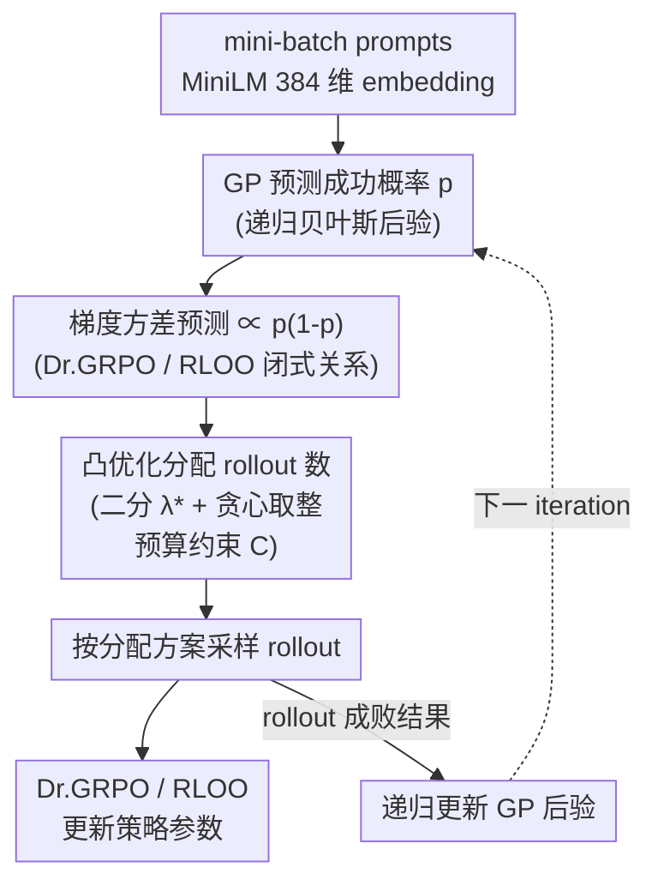

# Adaptive Rollout Allocation for Online RL with Verifiable Rewards (VIP)

**会议**: ICLR 2026  
**arXiv**: [2602.01601](https://arxiv.org/abs/2602.01601)  
**代码**: [https://github.com/HieuNT91/VIP](https://github.com/HieuNT91/VIP)  
**领域**: 优化  
**关键词**: GRPO, rollout allocation, gradient variance, Gaussian process, sampling efficiency  

## 一句话总结
提出 VIP（Variance-Informed Predictive allocation），通过高斯过程预测每个 prompt 的成功概率，据此用凸优化在计算预算约束下分配 rollout 数量以最小化梯度方差，在数学推理任务上一致提升 GRPO/RLOO 的采样效率，AIME24/25 上 Pass@32 最高提升 12.3 个点。

## 研究背景与动机
**领域现状**：GRPO/RLOO 等 group-based RL 方法通过为每个 prompt 生成多个 rollout 并估计相对优势来训练 LLM。通常对所有 prompt 均匀分配固定数量的 rollout（如 16 个）。

**现有痛点**：均匀分配隐式假设所有 prompt 同等重要——但成功率接近 0 或 1 的 prompt 的 rollout 几乎不产生有效梯度信号（方差为零），浪费了计算预算。现有的过滤方法需要先采样再过滤，可能抵消效率收益。

**核心矛盾**：需要在采样*之前*预测哪些 prompt 最有信息量（成功率接近 0.5 的 prompt 梯度方差最大），但成功率在训练过程中随模型更新而变化。

**本文目标** 如何在固定计算预算下，最优地将 rollout 分配给 mini-batch 中的各个 prompt？

**切入角度**：(1) 理论分析 Dr.GRPO 和 RLOO 的梯度方差与成功概率 $p$ 的关系——都正比于 $p(1-p)$；(2) 用高斯过程预测每个 prompt 的 $p$；(3) 用凸优化求解最优分配。

**核心 idea**：用 GP 预测成功概率 → 预测梯度方差 → 凸优化最小化总梯度方差 → 自适应分配 rollout。

## 方法详解

### 整体框架
VIP 想解决的是「rollout 预算怎么花」的问题：group-based RL 默认给每个 prompt 平均分配固定数量的 rollout，但很多预算花在了成功率接近 0 或 1 的 prompt 上，这些 prompt 几乎不产生梯度信号。VIP 把分配做成一个闭环：每个训练 iteration 先由一个高斯过程（Gaussian process, GP）根据历史 rollout 结果预测 mini-batch 里每个 prompt 当前的成功概率，再把这个概率通过「梯度方差 $\propto p(1-p)$」的闭式关系换算成方差贡献，据此用一个闭式凸优化在总预算约束下决定每个 prompt 分配多少 rollout，然后按这个方案采样，最后用本轮的 rollout 成败结果同时更新 GP 后验和模型参数。下一轮再从更新后的 GP 出发重复，整个模块即插即用地挂在 Dr.GRPO / RLOO 之上，不改原有的损失。

### 关键设计

**1. 梯度方差分析：把「哪些 prompt 值得采」量化成 $p(1-p)$**

这是整套方法的理论地基。论文先对 Dr.GRPO 和 RLOO 的相对优势估计做方差分析，得到梯度方差与该 prompt 成功概率 $p$ 的闭式关系：

$$\text{Var}(\tilde{G})_{\text{Dr.GRPO}} = \frac{n-1}{n^2}\, 4\sigma_Z^2\, p(1-p), \qquad \text{Var}(\tilde{G})_{\text{RLOO}} = \frac{1}{n-1}\, 4\sigma_Z^2\, p(1-p)$$

其中 $n$ 是分给该 prompt 的 rollout 数、$\sigma_Z^2$ 是投影梯度方差。两个估计器的方差都正比于 $p(1-p)$，于是「哪些 prompt 最有信息量」有了精确刻画：成功率 0.5 的 prompt 方差最大、梯度信号最强，而成功率趋于 0 或 1 的 prompt $p(1-p)\to 0$、几乎没有梯度。这把「该往哪投预算」从直觉变成了可优化的目标——预算应该向中间难度的 prompt 倾斜。

**2. 高斯过程成功概率预测：在采样之前就估出每个 prompt 的 $p$**

难点在于上面的 $p$ 必须在采样*之前*知道，而且它会随模型更新而漂移。VIP 用一个建在 prompt embedding 空间上的 GP 来预测：先用 MiniLM 把每个 prompt 编码成 384 维向量，用 RBF kernel 度量 prompt 之间的相似度，再用 sigmoid link function 把潜在函数值映射成 $[0,1]$ 的成功概率。GP 是非参数的，不需要显式跟踪模型权重的变化——它通过递归贝叶斯更新，把每一轮新观测到的 rollout 成败结果吸收进后验，自然跟上训练中 $p$ 的漂移。kernel 带来的相似性共享还让没采过的 prompt 也能借相邻 prompt 的历史结果给出预测。

**3. 凸优化分配：在预算约束下求最小总方差的闭式解**

有了每个 prompt 的预测 $p$ 和对应的方差贡献，分配就变成一个带约束的优化：在总 rollout 预算 $C$、且每个 prompt 的分配落在 $[L, U]$ 区间内的约束下，最小化整个 mini-batch 的总梯度方差。这本是整数规划，但论文做连续松弛后给出了闭式解（Theorem 5.1 / 5.2）——通过对拉格朗日乘子 $\lambda^*$ 做二分搜索即可定位最优点，再用一个贪心启发式把连续解取整成整数分配。配合哈希 embedding 与缓存的距离矩阵，GP 更新和这步凸优化都在 CPU 上完成，相对采样本身的运行时开销可以忽略。

### 损失函数 / 训练策略
即插即用地与 Dr.GRPO / RLOO 集成，不改原损失。在 DAPO-MATH-17K 上训练，评估 AIME24/25，使用两种预算设置（8×Q、16×Q）。

## 实验关键数据

### 主实验（AIME24/25 Pass@32）

| 模型 | 方法 | AIME24 Pass@32 | AIME25 Pass@32 |
|------|------|---------------|---------------|
| Qwen2.5-Math-1.5B | RLOO | 基线 | 基线 |
| | **RLOO+VIP** | **+12.3** | - |
| | Dr.GRPO | 基线 | 基线 |
| | **Dr.GRPO+VIP** | **提升** | **提升** |
| Qwen2.5-Math-7B | GRPO+VIP | 提升（但增幅较小） | 提升 |

### 关键发现
- VIP 在所有模型×基线×预算设置下一致提升 Pass@32 和 Mean@32
- 小模型（1.5B, 3B）受益更大——弱模型更容易浪费 rollout 在过难/过易的 prompt 上
- 7B 模型提升较小——因为强模型的成功率分布更集中在中间区域
- GP 预测的成功概率与实际成功率高度相关，验证了预测质量
- 运行时开销可忽略——embedding+距离矩阵预计算，GP 更新和凸优化在 CPU 上完成

## 亮点与洞察
- **理论基础扎实**：从梯度方差分析出发，推导出 $p(1-p)$ 的关键关系，为自适应分配提供了数学基础
- **凸优化的闭式解**：分配问题虽然是整数规划，但连续松弛有高效闭式解（bisection + 贪心取整），实际部署零额外负担
- **GP 是聪明的选择**：利用 prompt 嵌入的相似性进行信息共享——未见过的 prompt 可以通过相似 prompt 的历史结果预测

## 局限与展望
- 假设 $\sigma_Z^2$（投影梯度方差）对所有 prompt 相同——实际可能不成立
- GP 的 kernel bandwidth 用 median heuristic 设定，可能不是最优
- 仅在数学推理（RLVR 设置）上验证——RLHF 场景的奖励模型有噪声，分析可能需要修改
- 当 prompt 池非常大时 GP 的 $\Sigma$ 矩阵计算和存储可能成为瓶颈

## 相关工作与启发
- **vs 均匀分配 GRPO**: VIP 是均匀 GRPO 的严格升级——理论保证更低梯度方差
- **vs 过滤方法（Yu et al. 2025）**: 过滤方法在采样后丢弃无信息 prompt，VIP 在采样前预测并分配——避免浪费
- **vs 启发式难度分配（Zhang et al. 2025）**: VIP 有理论最优性保证（凸优化），而非启发式

## 评分
- 新颖性: ⭐⭐⭐⭐⭐ 梯度方差分析 → GP 预测 → 凸优化分配，完整理论框架
- 实验充分度: ⭐⭐⭐⭐ 多模型多预算多基线对比
- 写作质量: ⭐⭐⭐⭐⭐ 理论推导清晰，Theorem 有闭式解
- 价值: ⭐⭐⭐⭐⭐ 为 GRPO/RLOO 训练提供了即插即用的效率提升工具

<!-- RELATED:START -->

## 相关论文

- [\[CVPR 2026\] FedRAC: Rolling Submodel Allocation for Collaborative Fairness in Federated Learning](../../CVPR2026/optimization/fedrac_rolling_submodel_allocation_for_collaborative_fairness_in_federated_learn.md)
- [\[CVPR 2026\] Dynamic Momentum Recalibration in Online Gradient Learning](../../CVPR2026/optimization/dynamic_momentum_recalibration_in_online_gradient_learning.md)
- [\[ICLR 2026\] Conformal Prediction Adaptive to Unknown Subpopulation Shifts](conformal_prediction_adaptive_to_unknown_subpopulation_shifts.md)
- [\[ICLR 2026\] A Convergence Analysis of Adaptive Optimizers under Floating-Point Quantization](a_convergence_analysis_of_adaptive_optimizers_under_floating-point_quantization.md)
- [\[NeurIPS 2025\] Online Two-Stage Submodular Maximization](../../NeurIPS2025/optimization/online_two-stage_submodular_maximization.md)

<!-- RELATED:END -->
