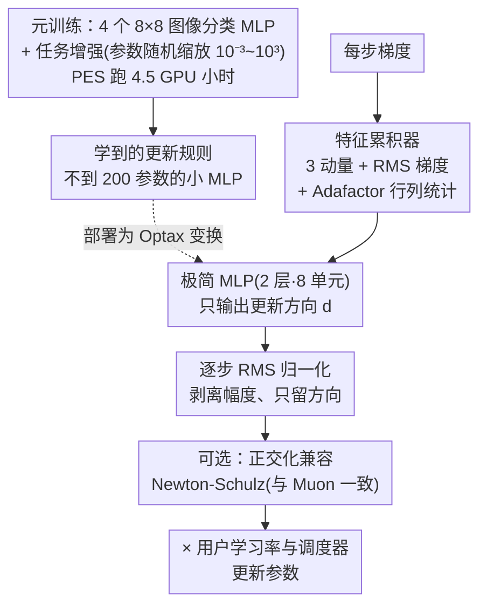

# Celo2: Towards Learned Optimization Free Lunch

**会议**: ICLR 2026  
**arXiv**: [2602.19142](https://arxiv.org/abs/2602.19142)  
**代码**: [https://github.com/amoudgl/celo2](https://github.com/amoudgl/celo2)  
**领域**: 优化  
**关键词**: 学习型优化器, 元学习, 元泛化, 归一化更新规则, AdamW替代

## 一句话总结

提出 Celo2——一个仅用 4.5 GPU 小时元训练的学习型优化器，通过归一化 MLP 更新规则和任务增强等简单配方，实现了到 10 亿参数级别模型（GPT-3 XL 1.3B）的稳定泛化（比元训练分布大 6 个数量级），性能超越了此前耗费 4000 TPU-month 的 VeLO 和精心调优的 AdamW 基线。

## 研究背景与动机

基础模型预训练主导了当今计算工作负载，而优化器选择（通常是 Adam 及其变体 AdamW）直接影响训练效率。学习型优化器（Learned Optimizer, LO）通过元学习发现更新规则，理论上可以超越手工设计的优化器。然而，这一方向面临三个核心挑战：

**元泛化（Meta-generalization）困难**: 在小规模任务上元训练的优化器往往无法泛化到大规模任务。VeLO 是此前最强的学习型优化器，尽管投入了 4000 TPU-month（约 10× GPT-3 训练量）的元训练计算，但仍未能泛化到超过 600M 参数的任务。

**元训练成本高昂**: VeLO 的 4000 TPU-month 计算量使得学习型优化器的研究迭代极为缓慢。

**稳定性不足**: 学习型优化器在超出训练分布时容易出现不稳定的训练动态，限制了实际采用。

核心矛盾：如何在极低的元训练成本下获得强大的元泛化能力？

本文给出了一个令人惊讶的答案：通过精心设计一个简单的归一化优化器架构并增强元训练策略，仅需 4.5 GPU 小时就能元训练一个性能优异的通用学习型更新规则，且该规则可以稳定扩展到比元训练分布大 6 个数量级的任务（GPT-3 XL 1.3B）。

核心 idea：不学习步长和调度器（解耦为用户调参），只学习归一化的更新方向——这种解耦使得学习到的规则具有更强的任务不变性和尺度泛化性。

## 方法详解

### 整体框架

Celo2 是一个即插即用的 Optax 优化器变换，用一行代码就能替换 AdamW。它先在 4 个 8×8 图像分类 MLP 任务上花 4.5 GPU 小时元训练出一个不到 200 参数的小 MLP 更新规则，再把这条规则作为变换插入标准训练流程，由用户自己配学习率调度和权重衰减。整套设计的内核只有一句话：**只学归一化后的更新方向**，把步长、调度器这些与任务规模强相关的东西全部解耦出去交给用户，从而换取跨数量级的尺度泛化能力。

具体到一步更新：当前梯度先喂进一组累积器（3 个动量 + RMS 梯度 + Adafactor 行列统计）算出特征，特征过那个极小 MLP 得到一个**方向**，再经逐步 RMS 归一化剥掉幅度，可选地做一次 Newton-Schulz 正交化，最后乘上用户给的学习率落到参数上。元训练阶段则靠"任务增强"——随机缩放被优化网络的参数——人为造出宽窄各异的损失景观，逼这条规则学到任务不变的方向。

### 关键设计

**1. 归一化更新规则：让 MLP 只学方向、不学步长**

先前的学习型优化器直接把 MLP 的原始输出当作更新步，输出幅度天然和具体任务的损失尺度绑定，一旦部署到更大模型就容易爆炸或消失。Celo2 把"方向"和"幅度"彻底拆开：更新规则本体只是一个 2 层、8 隐藏单元、ReLU 激活的小 MLP，喂给每个参数的输入特征包括 3 个动量累积器（$\beta_1,\beta_2,\beta_3=0.9,0.99,0.999$）、1 个 RMS 梯度累积器（$\beta_4=0.95$）以及 Adafactor 的行/列统计；MLP 只输出方向 $\mathbf{d}$、不输出幅度 $\mathbf{m}$，输出再经逐步 RMS 归一化

$$\Delta\mathbf{p}_t = \frac{\text{MLP}(\mathbf{F})}{\text{RMS}(\text{MLP}(\mathbf{F}))}$$

把幅度信息整个剥离，逼着 MLP 在元训练时只学任务不变的更新方向。这样做的直接后果是训练动态变得和 AdamW 几乎一致（权重范数曲线重合，Figure 2），于是规则放大到百倍千倍参数量时也不再发散。两条消融互相印证这个"只学方向"的取舍：去掉归一化，LM-30M 验证损失从 3.812 退到 3.961；反过来让 MLP 同时输出幅度（Table 1e），损失从 3.812 升到 3.900。作者还比过滚动 RMS、带截断的归一化等多种方案（Table 2），结论是最朴素的逐步 RMS 反而最稳。

**2. 步长与调度器解耦：宁可多调一个超参，也要换可靠泛化**

这是与 VeLO、Celo 等前作最根本的分歧——它们把学习率调度器也一并学进优化器里，结果调度器记住的是小任务的尺度，放大后就失效。Celo2 索性不学调度器，把步长完全留给用户搜。代价是部署时需要额外搜一个学习率，但回报是规则能稳定泛化到比元训练大 6 个数量级的任务。前作 Celo 正是因为学了调度器才卡在大规模上跑不动，这条权衡因此是整篇方法的胜负手，也和第 1 点的"幅度交给用户、MLP 只管方向"一脉相承。

**3. 任务增强：用参数缩放制造多样的优化景观**

元训练任务只有 4 个，景观太同质会让规则记住特定尺度。Celo2 在元训练时随机缩放被优化网络的参数，缩放系数 $\alpha \sim \text{LogUniform}(0.001, 1000)$ 横跨六个量级，等于人为造出一大批宽窄不同的损失景观让 MLP 见识。这一招对元泛化几乎不可或缺：消融里去掉任务增强（Table 1c），LM-30M 损失从 3.812 暴涨到 4.417（+16%），是所有组件中退化最严重的一个。

**4. 正交化兼容：把 Muon 的正交化从手工动量推广到学习规则**

Celo2 与 Muon 的 Newton-Schulz 正交化天然兼容，区别只在于对谁做正交化——Muon 正交化手工动量，Celo2 则把正交化作用在学习到的 MLP 更新上。Figure 4 给出递进叠加的效果：Celo2-base 之上叠正交化、再对 1D 参数单独用 Adam，三者逐级带来改善，说明学习型更新方向与正交化框架是正交可叠的两条增益。

### 损失函数 / 训练策略

元训练在 MNIST、Fashion-MNIST、CIFAR-10、SVHN 四个 8×8 图像分类 MLP 上进行，用 Persistent Evolution Strategies (PES) 做元优化以规避长展开带来的梯度偏差；内循环步数 $K=50$，展开长度在 [100, 2000] 间对数均匀采样，元目标取展开过程中的平均损失。整个过程跑 100K 次外循环、8 个任务并行，在 Nvidia L40S 上合计约 4.5 GPU 小时。部署时学习率在 $[10^{-5}, 10^{-3}]$ 对数均匀搜 7 个值，权重衰减取 0.0/0.1/10.0，配余弦衰减加 5% 线性预热的调度，默认 float32 精度（bfloat16 在 ImageNet 上同样稳定）。

## 实验关键数据

### 主实验

**语言建模（元训练分布外泛化）:**

| 任务 | 参数量 | 规模比 | Celo2 | AdamW | VeLO |
|------|--------|-------|-------|-------|------|
| LM-30M | 30M | 30,000× | 竞争力 | 基线 | 竞争力 |
| GPT-2 | 124M | 124,000× | 略优 | 基线 | 竞争力 |
| GPT-3 XL | 1.3B | 1,000,000× | **竞争力** | 基线 | **泛化失败** |

这是学习型优化器首次成功泛化到 10 亿参数级别的预训练任务。GPT-3 XL 是元训练分布的 **6 个数量级** 之外。

**ImageNet ViT 分类（长展开泛化，50K 步 = 25× 元训练展开长度）:**

| 指标 | Celo2 | AdamW | VeLO |
|------|-------|-------|------|
| 达到 VeLO 最终损失的步数 | ~50% 步 | 较慢 | 100% |
| 最终验证精度 | ~66% | ~66% | ~66% |
| 训练稳定性 | 高（与 AdamW 一致） | 高 | 非典型动态 |

Celo2 达到 VeLO 的最终损失只需 VeLO 约 50% 的步数。

**强化学习（Atari PPO，高方差梯度下的泛化）:**

| 环境 | Celo2 | AdamW | VeLO |
|------|-------|-------|------|
| Asterix | 与 AdamW 相当 | 基线 | 显著落后/停滞 |
| Freeway | 与 AdamW 相当 | 基线 | 显著落后/停滞 |
| SpaceInvaders | 与 AdamW 相当 | 基线 | 显著落后/停滞 |

VeLO 在所有 RL 任务上出现训练停滞（与 VeLO 原论文 Figure 11 一致），而 Celo2 表现稳定。

### 消融实验

| 配置 | 验证损失 (LM-30M) | 说明 |
|------|-------------------|------|
| 隐藏大小=8（默认） | **3.812** | 最优 |
| 隐藏大小=4 | 4.128 | 过小 |
| 隐藏大小=16 | 3.857 | 过大反而不好 |
| RMS 衰减 $\beta=0.95$（默认） | **3.812** | 最优 |
| $\beta=0.999$ | 3.893 | 经典 Adam 设置 |
| 有任务增强（默认） | **3.812** | 关键组件 |
| 无任务增强 | 4.417 | 严重退化 |
| 归一化（默认） | **3.812** | 关键组件 |
| 无归一化 | 3.961 | 明显退化 |
| 仅输出方向 $\mathbf{d}$（默认） | **3.812** | 最优 |
| 输出 $\mathbf{d}$ 和 $\mathbf{m}$ | 3.900 | 幅度输出反而有害 |

### 关键发现

- **归一化是泛化的关键**: RMS 归一化 MLP 输出使训练动态与 AdamW 一致，是实现跨规模泛化的核心机制
- **任务增强不可或缺**: 去除任务增强后损失从 3.812 升至 4.417（+16%），说明梯度landscape多样性对元泛化至关重要
- **Celo2 与 Muon 竞争力相当**: 在 GPT-2 上 Celo2（3.35588 或 3.36785）与 Muon（3.35636）相差无几（Figure 7），且二者的区别仅在于更新规则——Muon 用 momentum，Celo2 用学习到的 MLP
- **运行时和内存开销**: Celo2-base 与 Adam 有相同的挂钟时间；内存开销约 5×（3 个 momentum + 1 个 RMS + Adafactor 特征，vs Adam 的 3×）；加正交化后挂钟时间为 1.3×

## 亮点与洞察

- **"免费午餐"的惊人发现**: 仅 4.5 GPU 小时的元训练计算就能产出一个实用的通用优化器——对比 VeLO 的 4000 TPU-month，计算效率提升 5-6 个数量级
- **设计哲学的转变**: 从"学习一切"（VeLO 学习更新规则+调度器+步长）到"只学习更新方向"——越少学，泛化越好
- **归一化的威力**: 一个简单的 RMS 归一化就将学习型优化器从"玩具"级别提升到了"实用"级别
- **8×8 图像分类训练出 GPT-3 优化器**: 元训练任务之简单与部署任务之复杂的巨大反差，体现了学习到的更新规则的本质通用性
- **与 Muon 的互补性**: Celo2 将 Muon 的正交化框架从手工 momentum 正交化推广到了学习型更新规则正交化

## 局限与展望

- **需要调学习率**: 与 VeLO 的自调优模式不同，Celo2 需要搜索学习率（7 个候选值），虽然搜索空间不大，但这增加了使用门槛
- **内存开销较高**: 5× 的参数内存开销高于 Adam 的 3×，在内存受限场景下可能是问题
- **元训练任务过于同质**: 仅在 4 个 8×8 图像分类 MLP 上元训练，更多样的元训练任务可能带来更好的泛化
- **尚未在混合精度下充分测试**: 作者承认 float32 是默认精度，bfloat16 仅在 ImageNet 上做了初步测试
- **未学习调度器**: 虽然解耦步长是泛化的关键，但如何安全地将调度器也纳入学习仍是开放问题
- **与更新型的 SOAP、AdaMuon 等优化器的对比不充分**: 仅与 AdamW、VeLO、Muon 对比

## 相关工作与启发

- **VeLO (Metz et al., 2022)**: 此前最强的学习型优化器，计算量 4000 TPU-month，但泛化上限仅 600M 参数
- **Celo (Moudgil et al., 2025)**: Celo2 的前作，在 24 GPU-hour 实现了比 VeLO 更好的计算效率，但性能有所下降
- **Muon (Jordan et al., 2024)**: 手工设计的正交化优化器，在 NanoGPT 速度赛中表现出色，Celo2 与其高度兼容
- **SOAP (Vyas et al., 2024)**: 探索模块范数中的优化，与 Celo2 的方向互补
- **启发**: Celo2 的成功暗示存在一个低维的"通用更新规则空间"——不到 200 个参数的 MLP 就能捕获它。这为理解优化算法的本质提供了新视角

## 评分

- 新颖性: ⭐⭐⭐⭐ — 归一化+步长解耦的设计决策虽然简单，但其效果出人意料，且有充分的消融支持
- 实验充分度: ⭐⭐⭐⭐⭐ — 语言建模(30M→1.3B)、ImageNet ViT、Atari RL，覆盖了多个领域和规模
- 写作质量: ⭐⭐⭐⭐ — 方法描述清晰，消融实验组织得当，附录提供了完整的代码和背景知识
- 价值: ⭐⭐⭐⭐⭐ — 学习型优化器领域的里程碑式工作，首次实现了到十亿参数规模的实用泛化

<!-- RELATED:START -->

## 相关论文

- [\[CVPR 2026\] DABO: Difficulty-Aware Bayesian Optimization with Diffusion-Learned Priors](../../CVPR2026/optimization/dabo_difficulty-aware_bayesian_optimization_with_diffusion-learned_priors.md)
- [\[NeurIPS 2025\] Better NTK Conditioning: A Free Lunch from ReLU Nonlinear Activation in Wide Neural Networks](../../NeurIPS2025/optimization/better_ntk_conditioning_a_free_lunch_from_relu_nonlinear_activation_in_wide_neur.md)
- [\[NeurIPS 2025\] Problem-Parameter-Free Decentralized Bilevel Optimization](../../NeurIPS2025/optimization/problem-parameter-free_decentralized_bilevel_optimization.md)
- [\[ICML 2026\] HO-SFL: Hybrid-Order Split Federated Learning with Backprop-Free Clients and Dimension-Free Aggregation](../../ICML2026/optimization/ho-sfl_hybrid-order_split_federated_learning_with_backprop-free_clients_and_dime.md)
- [\[ICLR 2026\] Provable and Practical In-Context Policy Optimization for Self-Improvement](provable_and_practical_in-context_policy_optimization_for_self-improvement.md)

<!-- RELATED:END -->
