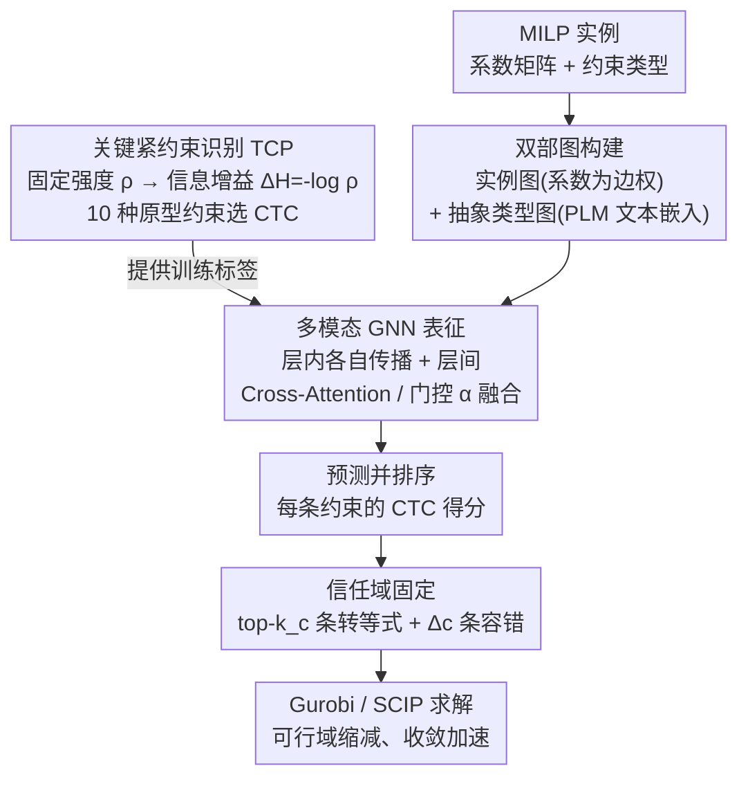

# Constraint Matters: Multi-Modal Representation for Reducing Mixed-Integer Linear programming

**会议**: ICLR2026  
**arXiv**: [2508.18742](https://arxiv.org/abs/2508.18742)  
**代码**: [https://github.com/Liwow/Constraint_Matters](https://github.com/Liwow/Constraint_Matters)  
**领域**: 优化/理论  
**关键词**: MILP, constraint reduction, tight constraint, multi-modal representation, GNN

## 一句话总结

提出基于约束缩减的 MILP 模型简化框架：定义固定约束强度 $\rho$ 并用信息增益 $\Delta H=-\log\rho$ 识别关键紧约束（CTC），设计融合实例级双部图与抽象级类型图的多模态 GNN 表征来预测 CTC，在 4 个大规模基准上解质量（$\text{gap}_\text{abs}$）平均提升 51.06%、收敛速度（PDI）平均加快 17.47%。

## 研究背景与动机

**领域现状**：大规模 MILP 问题在生产调度、供应链、能源管理等工业场景中广泛存在。Gurobi/SCIP 等精确求解器在大规模实例上计算代价高昂，ML-based 模型缩减（预测并固定变量子集）是主流加速手段。

**现有痛点**：

- 变量缩减（Predict-and-Search, ConPaS 等）预测错误时会导致不可行解
- 约束缩减（将不等式约束转为等式）几乎未被系统研究
- 直接固定所有紧约束效果极不稳定：在 CA_easy 任务上最佳固定仅需 1.85s vs 最差 465.74s（原始 378.23s）

**核心矛盾**：不同紧约束对求解加速贡献差异巨大——随机固定可能反而减速，必须有原则地选择。

**切入角度**：从对偶理论出发，约束与变量天然耦合，固定紧约束等价于缩减可行域。关键问题变成：哪些约束最值得固定？如何高效预测？

## 方法详解

### 整体框架

整套框架要解决的是"大规模 MILP 求解太慢"，思路是把一部分紧约束（在最优解处取等的不等式）直接固定成等式来缩减可行域——但前提是只固定真正有用的那些。它把这件事拆成三步串起来：先用一条信息论规则定义"哪类约束值得固定"，把它们标成关键紧约束（Critical Tight Constraints, CTC）作为训练目标；再用一个多模态图网络把 MILP 实例编码成既懂系数矩阵、又懂约束语义类型的特征，据此预测并排序每条约束的 CTC 得分；最后取 top-$k_c$ 条转成等式、配一个信任域容错，把缩减后的问题送进 Gurobi/SCIP 求解。三步分别回答"固定哪些约束""怎么表示与预测""怎么固定才安全"。

### 关键设计

**1. 关键紧约束识别：用信息增益量化哪条约束值得固定**

直接固定所有紧约束会出现最佳 1.85s、最差 465.74s 的巨大波动，所以必须有原则地排序，而不是一股脑全固定。本文用一个信息论启发的 TCP（Tight Constraints Priority）模块来排序：先定义固定约束强度 $\rho(C_i)=|S_{\hat{C}_i}|/|S_{C_i}|$，即固定类别 $C_i$ 的紧约束后局部可行域相对原始的缩减比例，再用信息增益 $\Delta H_{C_i}=-\log\rho$ 把它转成"固定收益"——$\rho$ 越小、可行域被压缩得越狠，$\Delta H$ 越大、对求解加速贡献越高。据此从 MIPLIB 的 17 种基本约束里选出 10 种原型来估计强度：Set Packing 这类约束 $\rho=n/(n+1)\to 1$、几乎不缩减可行域，信息增益低；Knapsack、Bin Packing 这类 $\rho=O(1/A\sqrt{n})$、强烈收紧可行域，信息增益高，于是优先把后者类别里的紧约束标成 CTC。这样网络要学的标签不再是"所有紧约束"的高维向量，而是一个有理论依据、规模小得多的关键子集。

**2. 多模态 GNN 表征：把约束的语义类型当成第二种模态**

光看实例的系数矩阵，网络分不清"这条约束是 Knapsack 还是 Set Packing"，跨实例泛化也弱，而 CTC 恰恰和约束类别强相关。方法因此叠两张图：低层是标准实例双部图（instance graph），变量与约束为节点、系数矩阵元素为边权，沿用 Gasse et al. 的消息传递；高层是抽象类型双部图（abstract graph），节点是变量/约束的类别，初始特征由预训练语言模型（PLM）编码各类别的文本描述得到。两张图先各自做层内消息传递（intra-layer MP）独立传播，再做层间消息传递（inter-layer MP）融合：抽象类别节点用 Cross-Attention 去查询它对应的那组实例节点特征，回收后经 MLP 增强；同时把实例侧该类别节点的均值特征 $\bar{h}_{V_j}$ 与抽象侧特征 $\hat{h}_{V_j}$ 拼接送进门控 $\alpha=\text{Gate}(\bar{h}_{V_j}\,\|\,\hat{h}_{V_j})\in[0,1]$，动态决定融回实例节点的两侧信息配比。把抽象数学模型本身当成一种"模态"与实例模态融合，正是标题里"多模态"的由来。

**3. 信任域固定：给预测误差留缓冲，保证缩减后仍可行**

预测难免出错，硬把 top-$k_c$ 条约束全转成等式可能直接把最优解排除在外、导致不可行。方法因此引入信任域参数 $\Delta_c$，允许最多 $\Delta_c$ 条被固定约束违反等式形式，等于在"全固定"与"全松弛"之间开了一个可调节的缓冲带。由于最优解 $x^*$ 本就满足这些紧约束，固定（或惩罚违反）它们不会丢掉 $x^*$；即便存在预测噪声，$\Delta_c$ 也保证缩减后的可行域始终是原始可行域的非空子集、大概率仍包含 $x^*$。这就把"预测错=求解失败"的风险降成"预测错=少固定几条、退化回接近原问题"。

### 损失函数

训练用 Focal Loss 而非交叉熵，是为了对抗一种选择性学习偏差：网络天然倾向于高置信度地预测那些简单、通常并不关键的约束。Focal Loss 用 $(1-\hat{y})^\gamma$ 下调容易样本的权重，把注意力逼回难而关键的 CTC 上。总损失把变量预测与约束预测两路加权合并，$\mathcal{L}=\lambda\mathcal{L}^{\text{sol}}_{\text{Focal}}+(1-\lambda)\mathcal{L}^{\text{con}}_{\text{Focal}}$，分别监督求解侧与约束侧。

## 实验关键数据

### 主实验（800s 时限，100 测试实例）

| 方法 | CA $\text{gap}_\text{abs}$↓ | CA PDI↓ | MIS $\text{gap}_\text{abs}$↓ | MIS PDI↓ | MVC $\text{gap}_\text{abs}$↓ | MVC PDI↓ | WA $\text{gap}_\text{abs}$↓ | WA PDI↓ |
|------|---:|---:|---:|---:|---:|---:|---:|---:|
| Gurobi | 477.51 | 76.29 | 2.70 | 33.09 | 8.38 | 68.02 | 0.20 | 4.76 |
| PS+Gurobi | 210.19 | 73.78 | 0.04 | 0.69 | 0.28 | 7.39 | 0.07 | 4.97 |
| ConPaS+Gurobi | 197.36 | 73.75 | 0.02 | 0.71 | 0.10 | 7.64 | 0.10 | 4.97 |
| **Ours+Gurobi** | **104.72** | **73.02** | **0.00** | **0.47** | **0.00** | **6.26** | **0.06** | **4.40** |
| 改进(%) | 77.06% | 4.22% | 100% | 98.58% | 100% | 90.80% | 70.00% | 7.56% |
| SCIP | 4005.99 | 190.18 | 4.16 | 103.91 | 12.42 | 140.89 | 2.60 | 37.06 |
| PS+SCIP | 3575.18 | 179.48 | 0.66 | 6.49 | 2.98 | 21.03 | 1.27 | 34.85 |
| ConPaS+SCIP | 3545.92 | 146.88 | 0.43 | 5.52 | 2.56 | 24.05 | 1.20 | 29.91 |
| **Ours+SCIP** | **3401.63** | **109.41** | **0.34** | **4.65** | **1.48** | **18.34** | **0.83** | **21.52** |
| 改进(%) | 15.08% | 42.47% | 91.83% | 95.52% | 88.08% | 86.98% | 68.08% | 41.93% |

在 Gurobi 上 MIS 和 MVC 的 $\text{gap}_\text{abs}$ 直接降至 0（完美找到最优解）；在 SCIP 上 PDI 最大改进 42.47%（CA 数据集）。

### 泛化与真实场景

| 方法 | CA（大规模）$\text{gap}_\text{abs}$↓ | CA PDI↓ | MVC（大规模）$\text{gap}_\text{abs}$↓ | MVC PDI↓ | MMCN（真实）$\text{gap}_\text{abs}$↓ | MMCN PDI↓ |
|------|---:|---:|---:|---:|---:|---:|
| SCIP | 7009.58 | 198.78 | 22.07 | 228.21 | 13819.90 | 427.63 |
| PS | 6541.87 | 169.86 | 4.07 | 39.63 | 8084.36 | 329.60 |
| ConPaS | 6287.22 | 156.95 | 2.20 | 35.39 | 6064.85 | 330.05 |
| **Ours** | **5955.86** | **131.44** | **0.55** | **24.54** | **3547.08** | **246.89** |

在真实物流网络 MMCN 上，$\text{gap}_\text{abs}$ 从 SCIP 的 13819.90 降至 3547.08（↓74.3%），验证了实际应用可行性。

### 约束固定的敏感性动机实验

| 场景 | CA_easy 时间(s) | WA 时间(s) |
|------|---:|---:|
| 原始求解 | 378.23 | >3600 |
| 最佳约束固定 | 1.85 | 50.73 |
| 最差约束固定 | 465.74 | >3600 |

最佳/最差固定差距可达 250 倍，直接说明"哪些约束被固定"至关重要。

## 亮点与洞察

- **约束缩减新维度**：ML4Optimization 领域几乎首次系统研究约束缩减，与变量缩减互补——消融实验证明二者结合效果最优
- **信息论原则性**：$\rho$ 和 $\Delta H$ 提供了有理论支撑的约束重要性度量，非启发式拍脑袋
- **"多模态"定义新颖**：将 MILP 的抽象模型（约束类型语义）视为一种模态，与实例系数矩阵模态融合——这一视角可推广到其他结构化优化问题
- **仅 5% 约束固定即有显著加速**：低预测负担 + 高回报

## 局限与展望

- 局部解耦假设（各约束类型独立影响可行域）在约束高度耦合时不完全成立
- CTC 标注依赖 oracle 最优解，数据获取代价高
- 仅验证了二元整数变量，未扩展到一般整数编码
- 无法直接应用于 MIPLIB 等缺少显式数学描述的标准基准

## 相关工作与启发

- **vs 变量缩减（PS/ConPaS）**：本文从对偶视角打开约束缩减新方向，二者互补
- **vs Bertsimas & Stellato (2022)**：后者预测所有紧约束→高维向量预测难，本文只选关键子集
- **vs Gasse et al. (2019) GNN 表征**：本文加入抽象类型图和 PLM 文本嵌入→跨实例泛化更强

## 评分

- 新颖性: ⭐⭐⭐⭐⭐ 约束缩减+信息论+多模态表征的创新组合
- 实验充分度: ⭐⭐⭐⭐ 4 数据集 + 真实场景 + 泛化 + 消融
- 写作质量: ⭐⭐⭐⭐ 动机实验驱动、理论分析清晰
- 价值: ⭐⭐⭐⭐⭐ 为 ML4Optimization 开辟约束缩减新方向

<!-- RELATED:START -->

## 相关论文

- [\[ICML 2026\] Provably Data-Driven Lagrangian Relaxation for Mixed Integer Linear Programming](../../ICML2026/optimization/provably_data-driven_lagrangian_relaxation_for_mixed_integer_linear_programming.md)
- [\[ICLR 2026\] Optimizer Choice Matters for the Emergence of Neural Collapse](optimizer_choice_matters_for_the_emergence_of_neural_collapse.md)
- [\[ICML 2025\] Integer Programming for Generalized Causal Bootstrap Designs](../../ICML2025/optimization/integer_programming_for_generalized_causal_bootstrap_designs.md)
- [\[ICCV 2025\] Addressing Representation Collapse in Vector Quantized Models with One Linear Layer](../../ICCV2025/optimization/addressing_representation_collapse_in_vector_quantized_models_with_one_linear_la.md)
- [\[ICML 2026\] On the Expressive Power of GNNs to Solve Linear SDPs](../../ICML2026/optimization/on_the_expressive_power_of_gnns_to_solve_linear_sdps.md)

<!-- RELATED:END -->
