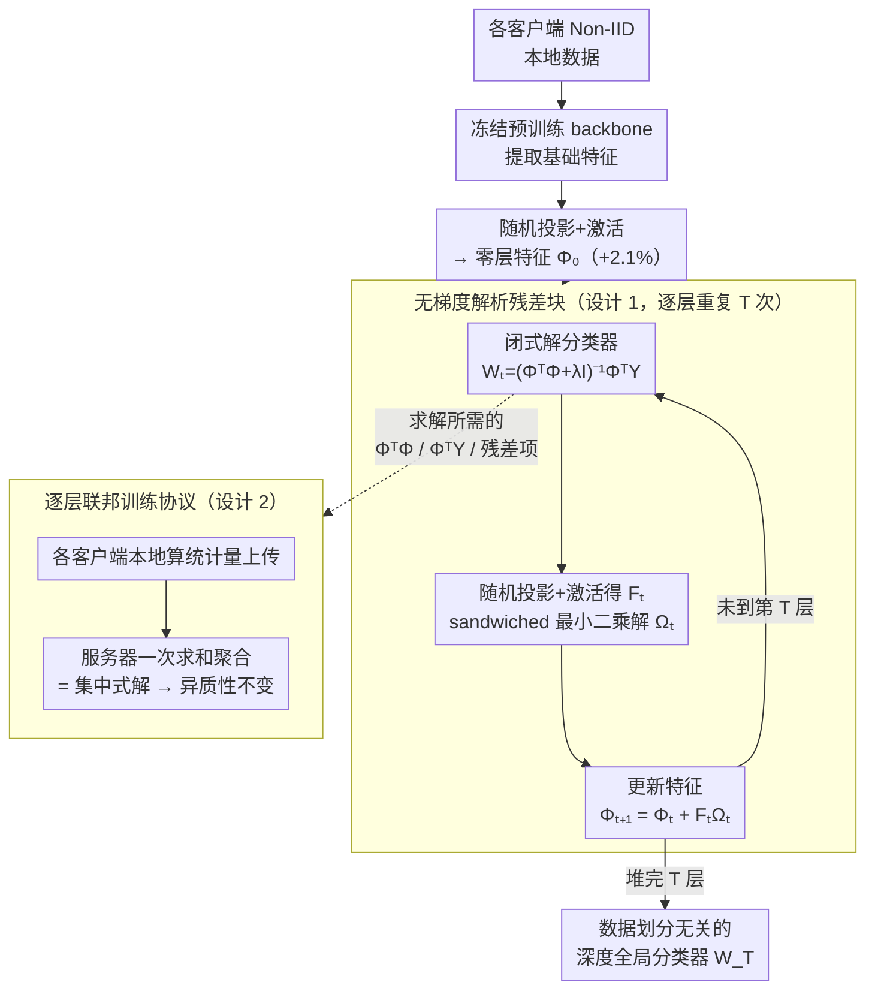

# DeepAFL: Deep Analytic Federated Learning

**会议**: ICLR 2026  
**arXiv**: [2603.00579](https://arxiv.org/abs/2603.00579)  
**代码**: [github.com/tangent-heng/DeepAFL](https://github.com/tangent-heng/DeepAFL)  
**领域**: 优化 / 联邦学习  
**关键词**: 联邦学习, 解析学习, 无梯度训练, 残差块, 数据异质性

## 一句话总结

提出 DeepAFL，通过设计无梯度的解析残差块并引入逐层联邦训练协议，首次实现了具有表征学习能力的深度解析联邦学习模型，既保持了对数据异质性的理想不变性，又突破了现有解析方法仅限于单层线性模型的局限，在三个基准数据集上超越 SOTA 5.68%-8.42%。

## 研究背景与动机

**联邦学习（FL）** 是打破数据孤岛的主流分布式学习范式。然而，传统的基于梯度的 FL 方法（如 FedAvg、FedProx、SCAFFOLD 等）面临四大核心问题：（1）**数据异质性**——不同客户端的数据分布差异导致模型聚合后性能下降（尤其在非 IID 场景）；（2）**收敛性**——异质数据导致客户端模型发散，聚合后可能偏离全局最优；（3）**可扩展性**——大量客户端参与时通信和计算开销成倍增长；（4）**通信开销**——多轮梯度交换需要大量带宽。

近年来，**解析学习（Analytic Learning）** 为上述问题提供了一条新思路。其核心想法是：通过封闭形式（closed-form）解替代迭代梯度更新，从根本上消除梯度训练的不稳定性。已有一些工作将解析学习引入联邦设定（如 FedAnalytic），在数据异质性不变性上表现优异——因为封闭形式解不依赖学习率、不需要多轮迭代，因此不受非 IID 数据分布的影响。

但现有解析 FL 方法存在一个**根本性瓶颈**：它们仅限于在冻结的预训练 backbone 上训练**单层线性模型**（如岭回归/最小二乘分类器）。由于没有表征学习能力，模型只能依赖预训练特征的质量，在需要特征适应的任务上表现次优。

本文的核心矛盾是：**如何在保持数据异质性不变性的前提下，赋予解析模型深层表征学习能力？** 核心 idea 是借鉴 ResNet 的成功经验，设计无梯度的解析残差块——每一层都有封闭形式解，通过逐层堆叠实现深度表征学习。

## 方法详解

### 整体框架

DeepAFL 想解决的是：解析联邦学习只能在冻结特征上训一个单层线性分类器、没有表征学习能力。它的做法是把 ResNet 的跳接搬进解析学习——所有客户端共享一个冻结的预训练 backbone 提取基础特征，先做一次随机投影加激活得到零层特征 $\Phi_0$（这一步就带来约 2.1% 的增益），再在其上**逐层堆叠无梯度的解析残差块**，每堆一层就把特征精炼一次。

关键在于每一层怎么训：不走反向传播，而是先给当前特征解一个闭式分类器，再解一个残差映射去微调特征、让分类残差变小。而这两次最小二乘求解只依赖一批可加的统计量（协方差类矩阵），于是天然能拆成"客户端本地算统计量、服务器一次求和"的联邦协议——从底到顶逐层堆完 $T$ 层，就得到一个与数据如何切分无关的深度全局分类器 $W_T$。输入是各客户端的 Non-IID 本地数据，输出是深层分类模型，全程纯前向、无梯度。

### 关键设计

**1. 无梯度解析残差块：让封闭形式解也能"变深"**

现有解析联邦方法只能在冻结特征上训一个单层线性分类器，缺乏表征学习能力。DeepAFL 借鉴 ResNet 的跳接，把第 $t$ 层特征写成 $\Phi_{t+1} = \Phi_t + g_t(\Phi_t)$，但残差映射 $g_t$ 不靠梯度下降、而要有封闭解，这就要回答两个问题：用什么当残差映射、它的参数怎么解。

第一，每一层都先给当前特征 $\Phi_t$ 配一个分类器 $W_t$，用标准岭回归直接拟合标签：$W_t = \arg\min_W \|Y - \Phi_t W\|_F^2 + \lambda\|W\|_F^2$，有唯一闭式解 $W_t = (\Phi_t^\top \Phi_t + \lambda I)^{-1}\Phi_t^\top Y$（用 MSE 而非交叉熵，因为只有前者有封闭解，且在解析学习里精度相当）。第二，残差块取 $g_t(\Phi_t) = \sigma(\Phi_t B_t)\,\Omega_{t+1} = F_t\,\Omega_{t+1}$：随机投影矩阵 $B_t$ 提供随机性（扮演梯度学习里 SGD 的角色）、激活 $\sigma$ 提供非线性、$F_t = \sigma(\Phi_t B_t)$ 是隐藏随机特征，只把可训练的 $\Omega_{t+1}$ 单独拎出来求解——这样既引入了深度表征所需的随机性与非线性，又把待解参数限制成一个仍可解析求解的线性问题。

求 $\Omega_{t+1}$ 时，固定上一层分类器 $W_t$，目标是让更新后的特征被 $W_t$ 分得更准：

$$\Omega_{t+1} = \arg\min_{\Omega}\ \|\,R_t - F_t\,\Omega\,W_t\,\|_F^2 + \gamma\|\Omega\|_F^2,\quad R_t = Y - \Phi_t W_t$$

注意拟合目标是**分类残差** $R_t$（当前分类器还没分对的部分），而未知量 $\Omega$ 被夹在已知的 $F_t$ 和 $W_t$ 中间——这是一个广义 Sylvester 矩阵方程的特例，作者称之为 **sandwiched 最小二乘（sandwiched least squares）**，并通过 $F_t^\top F_t$、$W_t W_t^\top$ 的谱分解给出闭式解 $\Omega_{t+1}$。跳接保证即便某层映射不理想、输入信息也能无损传到下一层，于是逐层堆叠就把"一步线性拟合"变成了"渐进精炼特征 + 不断削减分类残差"。此外，零层特征本身就用激活随机投影 $\Phi_0 = \sigma(\tilde{X}A)$ 升维以提升线性可分性，单这一步就带来约 2.1% 的增益。

**2. 逐层联邦训练协议：用求和的结合律换来异质性不变**

梯度式 FL 要对整个模型反复通信，非 IID 数据会让各客户端模型发散、聚合后偏离最优。DeepAFL 注意到上面两次最小二乘求解（分类器 $W_t$、残差映射 $\Omega_{t+1}$）都只依赖一批**可加的统计量**——本质是各种协方差/交叉协方差矩阵（如 $\Phi_t^\top\Phi_t$、$\Phi_t^\top Y$ 以及解 $\Omega$ 所需的 $F_t^\top R_t$ 等项）。于是把训练拆到每一层并改成"统计量聚合"：第 $t$ 层时，客户端 $k$ 只在本地用前向计算算出自己那份统计量上传，服务器对各客户端求和（如 $\Phi^\top\Phi = \sum_k \Phi_k^\top\Phi_k$）再解出该层的 $W_t$ 与 $\Omega_{t+1}$、下发给所有客户端更新特征。

由于求和满足结合律，无论数据怎样切分到各客户端，聚合结果都与把全部数据放在一起的集中式解**逐比特一致**——这正是数据异质性不变性的来源（也有严格证明）。同时每层只需"上传统计量、服务器求解、下发参数"这一轮通信即可收敛，总通信轮数等于层数（通常 3–5 轮）而非梯度式的数百上千轮；传输的是聚合统计量而非原始数据或梯度，也比共享梯度更隐私友好。

### 损失函数 / 训练策略

每层有两个最小二乘目标：分类器 $W_t$ 拟合标签的岭回归 $\|Y-\Phi_t W\|_F^2 + \lambda\|W\|_F^2$，残差映射 $\Omega_{t+1}$ 拟合分类残差的 sandwiched 最小二乘 $\|R_t - F_t\Omega W_t\|_F^2 + \gamma\|\Omega\|_F^2$，两者都是凸问题、有唯一全局最优闭式解。训练纯前向、逐层一次求解，总训练轮数等于模型层数（通常 3–5 层），除正则化系数 $\lambda$、$\gamma$ 外没有学习率、动量等超参需要调。

## 实验关键数据

### 主实验

在三个基准数据集上的比较（非 IID 联邦设置）：

| 方法 | 数据集 1 | 数据集 2 | 数据集 3 | 训练方式 |
|------|---------|---------|---------|---------|
| FedAvg | 基线 | 基线 | 基线 | 多轮梯度 |
| FedProx | ~FedAvg | ~FedAvg | ~FedAvg | 多轮梯度+正则化 |
| SCAFFOLD | 优于 FedAvg | 优于 FedAvg | 优于 FedAvg | 方差减少 |
| FedAnalytic (单层) | 受限于线性模型 | 受限于线性模型 | 受限于线性模型 | 单层解析 |
| **DeepAFL** | **SOTA (+5.68%~8.42%)** | **SOTA** | **SOTA** | 深层解析 |

DeepAFL 相比之前的 SOTA 方法在三个基准数据集上提升 5.68%-8.42%。

### 消融实验

| 配置 | 关键指标 | 说明 |
|------|---------|------|
| 1 层 vs 多层 | 多层显著更好 | 证明深度表征学习的必要性 |
| 有残差连接 vs 无残差连接 | 有残差更稳定 | 残差确保信息流 |
| 不同层数 | 回报递减 | 3-5 层后提升放缓 |
| IID vs 非 IID | 性能差距极小 | 证明数据异质性不变性 |
| 不同客户端数量 | 稳定 | 可扩展性好 |

### 关键发现

- **深度 + 解析 = 双赢**: DeepAFL 首次证明解析学习可以"变深"，且深度确实带来了显著的性能提升（超越单层解析方法和多轮梯度方法）
- **数据异质性不变性得到理论和实验双重验证**: 无论数据如何非 IID 划分，DeepAFL 的结果与集中式训练一致，这是梯度式 FL 无法实现的
- **通信效率极高**: 每层只需一轮通信，总通信轮数等于层数（通常 3-5 轮），远少于梯度式方法的数百轮
- **无超参数调优负担**: 没有学习率、动量等超参数需要调，正则化系数 $\lambda$ 是唯一需要设的超参

## 亮点与洞察

- **打破了"解析学习 = 浅层模型"的认知**: 通过解析残差块的设计，证明了无梯度方法也能构建深层网络，这是方法论上的突破
- **ResNet 思想的优雅迁移**: 将深度学习中最成功的架构设计（残差连接）迁移到解析学习中，体现了跨范式的方法论融合
- **联邦学习的范式替代**: 对于"数据异质性"这一 FL 的核心难题，DeepAFL 从根本上消除了它的影响（而不是用各种技巧去缓解），这是一种质变而非量变的改进
- **极简的算法设计**: 整个方法只涉及矩阵乘法、求逆和求和，实现简单、理论清晰
- **理论保证完备**: 异质性不变性有严格的数学证明，不仅仅是经验观察

## 局限与展望

- **依赖预训练 backbone 的质量**: 虽然 DeepAFL 增加了表征学习能力，但仍然在冻结的预训练特征之上操作。如果 backbone 的特征质量差，深层解析块也难以弥补
- **矩阵求逆的计算瓶颈**: 每一层需要对 $d \times d$ 的矩阵求逆（$d$ 为特征维度），当特征维度很高时（如使用 ViT-Large 的 1024 维特征），计算开销不可忽视
- **随机特征的局限性**: 使用随机特征近似核映射虽然高效，但与真实的深度网络学到的分层特征相比，表征能力仍有差距
- **任务类型受限**: 目前仅在分类任务上验证。对于生成任务（如联邦 LLM 训练）是否适用尚不清楚
- **传输矩阵的隐私风险**: 虽然传输的是聚合统计量而非原始数据，但协方差矩阵可能泄露客户端数据的统计特征，需要进一步的差分隐私分析
- **可能的改进方向**: 与差分隐私的结合；端到端的解析特征学习（不冻结 backbone）；更高效的矩阵运算方法（如 Woodbury 恒等式）

## 相关工作与启发

- **FedAvg**（McMahan et al., 2017）: 联邦学习的基础算法，通过多轮平均聚合客户端模型。DeepAFL 用单轮精确求和替代了多轮近似平均
- **解析联邦学习**（如 FedCR, ACIL-FL）: DeepAFL 的直接前身，但被限制在单层线性模型。DeepAFL 的残差块设计突破了这一根本限制
- **极端学习机（ELM）**: 随机特征 + 最小二乘求解的经典方法，可以视为 DeepAFL 单层的特例
- **深度展开（Deep Unfolding）**: 在优化算法中逐层展开迭代步骤的思想，与 DeepAFL 的逐层求解有概念上的相似性
- **启发**: 解析学习作为梯度学习的替代范式，在联邦学习这种对收敛稳定性要求极高的场景中展现出了独特优势。未来可以探索解析学习在其他分布式/去中心化场景中的应用

## 评分

- 新颖性: ⭐⭐⭐⭐
- 实验充分度: ⭐⭐⭐⭐
- 写作质量: ⭐⭐⭐⭐
- 价值: ⭐⭐⭐⭐

<!-- RELATED:START -->

## 相关论文

- [\[CVPR 2026\] Single-Round Scalable Analytic Federated Learning](../../CVPR2026/optimization/single-round_scalable_analytic_federated_learning.md)
- [\[ICLR 2026\] Incentives in Federated Learning with Heterogeneous Agents](incentives_in_federated_learning_with_heterogeneous_agents.md)
- [\[ICLR 2026\] Convex Dominance in Deep Learning I: A Scaling Law of Loss and Learning Rate](convex_dominance_in_deep_learning_i_a_scaling_law_of_loss_and_learning_rate.md)
- [\[ICLR 2026\] Weak-SIGReg: Covariance Regularization for Stable Deep Learning](weak-sigreg_covariance_regularization_for_stable_deep_learning.md)
- [\[CVPR 2026\] FedRG: Unleashing the Representation Geometry for Federated Learning with Noisy Clients](../../CVPR2026/optimization/fedrg_unleashing_the_representation_geometry_for_federated_learning_with_noisy_c.md)

<!-- RELATED:END -->
