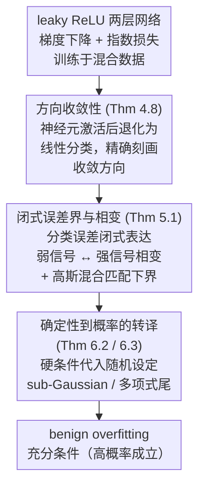

# Directional Convergence, Benign Overfitting of Gradient Descent in leaky ReLU two-layer Neural Networks

**会议**: ICLR2026  
**arXiv**: [2505.16204](https://arxiv.org/abs/2505.16204)  
**代码**: 无  
**领域**: 优化  
**关键词**: benign overfitting, directional convergence, leaky ReLU, implicit bias, gradient descent, neural networks

## 一句话总结

首次证明了梯度下降（gradient descent）在 leaky ReLU 两层神经网络中的方向收敛性（directional convergence），并据此在远超近正交数据（nearly orthogonal data）的更广泛混合数据设定下建立了 benign overfitting 的充分条件，同时发现了一个新的相变（phase transition）现象。

## 背景与动机

Benign overfitting 是深度学习中一个令人惊讶的理论现象：过参数化的神经网络可以完美插值训练数据（包括含噪标签），同时在测试集上仍能取得很小的误差。这一现象挑战了经典统计学中拟合-泛化之间必须折衷的传统认知。

虽然 benign overfitting 在线性回归、线性分类、核方法等经典模型中已有较好的理论理解，但在神经网络中的研究仍然非常有限。核心难点在于：对于 ReLU 类型网络，梯度下降的隐式偏置（implicit bias）难以精确刻画。在线性分类中，梯度下降训练对数/指数损失时会在方向上收敛到最大间隔分类器，这一性质是分析 benign overfitting 的关键。然而对于 ReLU 型网络，此前梯度下降的方向收敛性从未被证明——已有结果仅限于梯度流（gradient flow）或近似光滑的 leaky ReLU。

## 核心问题

1. **方向收敛性**：能否证明梯度下降在非光滑 leaky ReLU 两层网络中存在方向收敛，并精确刻画收敛方向？
2. **Benign overfitting 的广度**：能否将 benign overfitting 的理论保证从近正交数据推广到更一般的混合数据设定？
3. **紧性与失败条件**：benign overfitting 什么时候必然失败？现有的上界是否是紧的？

## 方法详解

### 整体框架

本文的分析对象是固定宽度为 $m$ 的两层 leaky ReLU 网络 $f(\boldsymbol{x};W) = \sum_{j=1}^m a_j \phi(\langle \boldsymbol{x}, \boldsymbol{w}_j \rangle)$，其中 $\phi$ 是 $\gamma$-leaky ReLU，第二层权重固定为 $a_j = \pm 1/\sqrt{m}$，只用梯度下降在指数损失 $\ell(u)=\exp(-u)$ 上训练第一层权重，数据来自混合模型 $\boldsymbol{x} = y\boldsymbol{\mu} + \boldsymbol{z}$。整条论证链路是层层递进的：先证明非光滑网络下梯度下降会发生方向收敛并精确写出收敛方向，再把这个方向代入闭式的分类误差界，最后将确定性条件落到随机分布上得到 benign overfitting 的高概率保证。

### 关键设计

**1. 方向收敛性：把非光滑网络的训练动力学归结成线性分类**

这是全文的核心技术突破，也是后续一切结论的地基。难点在于 leaky ReLU 是非光滑的，先前工作只能在梯度流或对激活做光滑近似的前提下谈方向收敛，而真正的梯度下降一直缺证明。作者（Theorem 4.8）在两种条件下补上这个缺口：一是**正相关**情形，当信号 $\boldsymbol{\mu}$ 足够强、使所有训练样本对满足 $\langle y_i \boldsymbol{x}_i, y_k \boldsymbol{x}_k \rangle \geq 0$ 时成立，这突破了先前工作对信号强度的上限约束；二是**近正交**情形，把已有结果作为特例涵盖进来。关键招数是"神经元激活"——只要把初始化的尺度压到远小于步长，就能保证在梯度下降第 $t=1$ 步后所有神经元都被激活，即 $a_j y_i \langle \boldsymbol{x}_i, \boldsymbol{w}_j \rangle > 0$ 对所有 $i,j$ 成立。一旦激活模式固定下来，整个优化就退化成变换空间里的线性分类问题，从而可以直接借用 Soudry et al. (2018) 的经典结论。最终收敛方向被刻画为一个严格凸约束优化问题 (5) 的唯一解，对应的网络具有线性决策边界——这正是后面能写出闭式误差界的前提。

**2. 闭式分类误差界与相变现象：让"信号强度"成为决定泛化的开关**

有了精确的收敛方向，作者（Theorem 5.1）把它代回去推出分类误差的闭式表达，并发现了一个此前未被揭示的**相变**：以 $n\|\boldsymbol{\mu}\|^2$ 与噪声量级 $R$ 的比较为分界，当 $n\|\boldsymbol{\mu}\|^2 \lesssim R$ 时处于**弱信号区间**，误差由噪声主导，恰好对应先前工作研究的近正交设定；当 $n\|\boldsymbol{\mu}\|^2 \gtrsim R$ 时进入**强信号区间**，信号开始主导，误差界的形式随之改变。更进一步，对高斯混合模型作者同时给出了上界和匹配的下界，证明这个误差界是紧的，从而能明确指出 benign overfitting 在哪些信号-噪声比下必然失败——相变是模型固有的特征，而非分析手法留下的人为产物。

**3. 确定性到概率的转译：把硬条件落到更宽的分布族上**

前两步的结论都以确定性条件给出，最后一步（Theorem 6.2 与 6.3）才把这些条件代入随机设定，得到 benign overfitting 的高概率保证。对 **sub-Gaussian 混合模型**，benign overfitting 以高概率成立，且在各向同性高斯强信号区间下，分类误差界与 Bayes 最优只差一个常数。更关键的是对**多项式尾混合模型**的推广：作者首次把结果做到分布尾部更重的情形，只要求 $\mathbb{E}|\xi_j|^r \leq K$、$r \in (2,4]$，大幅放松了先前必须 sub-Gaussian 或 bounded log-Sobolev 常数的假设。这种"先证确定性结论、再换分布"的分层设计，正是让同一套理论能覆盖更多分布类的原因。

## 实验关键数据

本文为纯理论工作，无数值实验。主要结果以定理形式给出：

| 方面 | 先前最好结果 | 本文结果 |
|------|------------|---------|
| 方向收敛（梯度下降） | 仅梯度流或光滑近似 | 首次在非光滑 leaky ReLU 下证明 |
| 数据设定 | 近正交数据 | 混合数据（含强信号区间） |
| 分布假设 | sub-Gaussian / bounded log-Sobolev | 扩展到多项式尾分布 |
| 网络宽度 | $m$ 需随 $n$ 增长 | 固定宽度 $m$ |
| 误差下界 | 无 | 高斯混合下给出匹配下界 |

## 亮点

1. **方向收敛的首次证明**：本文是第一个在 ReLU 类型网络中为梯度下降（而非梯度流）证明方向收敛并精确刻画收敛方向的工作，填补了该领域的关键空白。
2. **确定性与概率的分离**：所有核心定理先以确定性形式给出，再应用于随机设定，使得理论框架可以推广到更多分布类。
3. **相变现象的发现**：首次在两层神经网络中揭示弱信号—强信号的相变，且通过上下界对偶证明其为模型的固有特征而非分析的人为产物。
4. **固定宽度网络**：不要求网络宽度 $m$ 随 $n$ 增长，超越了 NTK/lazy training 区间。

## 局限与展望

1. **仅限两层网络**：推广到深层网络是显而易见的开放方向，但技术难度极大。
2. **无标签噪声**：本文未考虑标签翻转噪声；作者推测弱信号区间不变，但强信号区间可能受显著影响。
3. **第二层固定**：仅训练第一层权重，第二层固定为 $\pm 1/\sqrt{m}$，这是该领域的标准简化假设但与实践有差距。
4. **初始化条件较强**：要求初始化远小于步长以保证首步激活，条件较为技术性。
5. **无数值验证**：纯理论工作缺乏实验验证，难以直观评估理论界的紧度在实际中是否成立。

## 与相关工作的对比

| 工作 | 优化方法 | 方向收敛 | 数据设定 | 分布要求 |
|------|---------|---------|---------|---------|
| Frei et al. (2022) | 梯度下降 | 光滑近似 | 近正交 | sub-Gaussian |
| Frei et al. (2023b) | 梯度流 | ✓ | 近正交 | sub-Gaussian |
| Xu & Gu (2023) | 梯度下降 | 部分 | 近正交 | bounded log-Sobolev |
| Cai et al. (2025) | 梯度下降 | ✓（需二阶可微） | - | - |
| **本文** | **梯度下降** | **✓（非光滑）** | **混合数据（含强信号）** | **多项式尾** |

本文的定位非常清晰：在所有关键维度上（优化方法、数据宽泛度、分布假设、网络宽度）同时推进了最好已知结果。

## 启发与关联

- 方向收敛通过"神经元激活后归结为线性分类"的证明策略非常优雅，可能启发其他非光滑激活函数（如标准 ReLU）的分析。
- 相变现象的发现暗示了 benign overfitting 的适用范围可能比人们想象的更加受限——在某些信号-噪声比下，即使方向收敛成立，泛化也必然失败。
- 确定性条件与概率条件的分离是一种值得借鉴的理论分析范式，可应用于其他统计学习理论问题。

## 评分
- 新颖性: ⭐⭐⭐⭐⭐ （首次在 ReLU 型网络中证明梯度下降方向收敛）
- 实验充分度: ⭐⭐ （纯理论无实验）
- 写作质量: ⭐⭐⭐⭐ （结构清晰，Table 1 对比一目了然）
- 价值: ⭐⭐⭐⭐⭐ （填补理论空白，影响深远）

<!-- RELATED:START -->

## 相关论文

- [\[ICML 2026\] Sharp Description of Local Minima in the Loss Landscape of High-Dimensional Two-Layer ReLU Networks](../../ICML2026/optimization/sharp_description_of_local_minima_in_the_loss_landscape_of_high-dimensional_two-.md)
- [\[AAAI 2026\] On the Learning Dynamics of Two-Layer Linear Networks with Label Noise SGD](../../AAAI2026/optimization/on_the_learning_dynamics_of_two-layer_linear_networks_with_label_noise_sgd.md)
- [\[ICML 2026\] On the Convergence Rate of LoRA Gradient Descent](../../ICML2026/optimization/on_the_convergence_rate_of_lora_gradient_descent.md)
- [\[NeurIPS 2025\] Do Neural Networks Need Gradient Descent to Generalize? A Theoretical Study](../../NeurIPS2025/optimization/do_neural_networks_need_gradient_descent_to_generalize_a_theoretical_study.md)
- [\[NeurIPS 2025\] Quantitative Convergence of Trained Single Layer Neural Networks to Gaussian Processes](../../NeurIPS2025/optimization/quantitative_convergence_of_trained_single_layer_neural_networks_to_gaussian_pro.md)

<!-- RELATED:END -->
