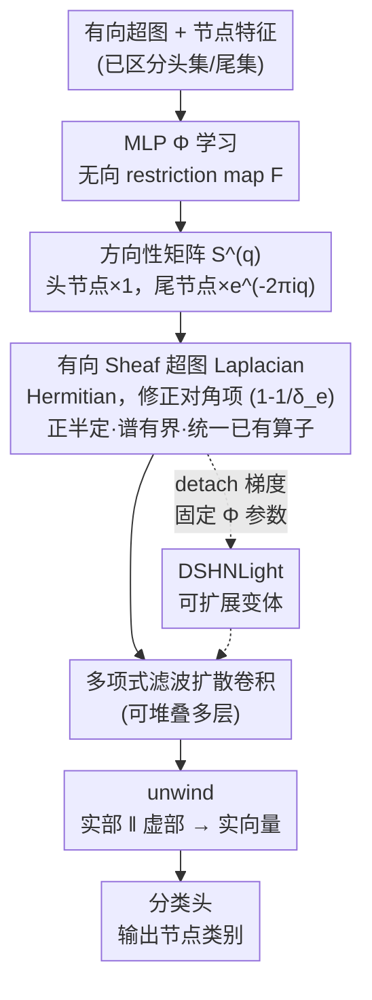

# Directional Sheaf Hypergraph Networks: Unifying Learning on Directed and Undirected Hypergraphs

**会议**: ICLR 2026  
**arXiv**: [2510.04727](https://arxiv.org/abs/2510.04727)  
**代码**: [GitHub](https://github.com/EmaMule/DirectionalSheafHypergraphs)  
**领域**: 其他  
**关键词**: sheaf neural networks, directed hypergraphs, Laplacian, spectral methods, heterophily

## 一句话总结

本文提出 Directional Sheaf Hypergraph Networks (DSHN)，通过将 Cellular Sheaf 理论与有向超图的方向信息结合，构造了一种复值 Hermitian Laplacian 算子，统一并推广了现有的图和超图 Laplacian，在 7 个真实数据集上相对准确率提升 2%–20%。

## 研究背景与动机

**超图的高阶交互建模**：许多真实系统存在多实体间的高阶关系，传统图只能表达成对关系。超图通过超边连接多个节点来建模多路交互。

**无向超图的局限**：大多数 HGNN 仅处理无向超图，忽略了超边中可能存在的方向性（化学反应中反应物→产物、因果交互的发起方→接收方）。

**Sheaf 理论缓解异质性**：通过为节点和边分配向量空间及可学习的 restriction map，能有效缓解过平滑和异质性问题。但已有 Sheaf 超图方法不支持有向超图。

**已有 SHN 的谱性质缺陷**：Duta et al. (2023) 的 Sheaf Hypergraph Laplacian 不满足正半定性，无法作为合格卷积算子。

**有向图方法的成功经验**：Magnetic Laplacian 用复数相位编码方向，但未推广到超图。

## 方法详解

### 整体框架

DSHN 要解决的问题是：现有 Sheaf 超图网络只能处理无向超边，把"反应物→产物"这类方向角色直接丢掉，而少数有向方法又没有 sheaf 缓解异质性的能力。DSHN 把两者拼到同一个复值算子里。整条流水线是这样转的：先对输入的有向超图，用一个 MLP 为每个节点-超边对学一个无向 restriction map；再用一个由相位参数 $q$ 控制的方向性矩阵 $\mathcal{S}^{(q)}$ 给它"上色"（头节点不变、尾节点乘上一个复相位），让 map 变成复值；这些复值 map 组装成一个 Hermitian 的 Directed Sheaf Hypergraph Laplacian，论文证明它正半定、谱有界，因而是一个合格的谱卷积核；以它做多项式滤波的扩散卷积、堆叠若干层后，把复值特征 unwind 成实向量送进分类头输出节点类别。关键就在于让"方向"和"sheaf 的异质性建模"在这一个算子里相容，同时仍满足谱卷积所需的全部数学性质。

### 关键设计

**1. 方向性矩阵 $\mathcal{S}^{(q)}$：用复数相位区分头尾节点**

无向超图里节点对超边是对称的，无法表达"谁是反应物、谁是产物"这类方向角色。DSHN 借鉴 Magnetic Laplacian 的思路，把一个无向 restriction map $\mathcal{F}_{u\trianglelefteq e}$ 左乘一个复值系数变成有向 map $\vec{\mathcal{F}}_{u\trianglelefteq e}=\mathcal{S}^{(q)}_{u\trianglelefteq e}\mathcal{F}_{u\trianglelefteq e}$：头节点取 $1$，尾节点取 $e^{-2\pi i q}$，由单一相位（charge）参数 $q$ 统一控制方向信息的强度。当 $q=0$ 时所有系数退化为实数 $1$，模型回到无向 sheaf 情形（即 Duta et al. 2023 的定义）；当 $q=1/4$ 时尾节点系数变为纯虚数 $e^{-\pi i/2}$，方向差异被编码进虚部，恰好与有向图上的 Magnetic Laplacian 对齐。这样一个标量参数就把方向性以可控、可退化的方式注入了整套算子，既保留了对无向数据的兼容，又给有向数据提供了相位上的判别能力。

**2. 有向 Sheaf 超图 Laplacian：修正对角项才得到合格算子**

有了方向编码后，DSHN 把复值 map 和超边结构一起组装成 Laplacian $\mathbf{L}^{\vec{\mathcal{F}}} = \mathbf{D}_V - \mathbf{B}^{(q)\dagger}\mathbf{D}_E^{-1}\mathbf{B}^{(q)}$，其中 $\mathbf{B}^{(q)}$ 是带方向相位的关联块矩阵、$\mathbf{D}_V$ 与 $\mathbf{D}_E$ 分别为节点和超边的度矩阵。对角块为实值，承载节点自身信息；非对角块在超边有向时取复值，承载带方向的邻居耦合。本文的关键修正在对角项系数上：Duta et al. (2023) 用的是 $\tfrac{1}{\delta_e}$，而 DSHN 改成 $(1-\tfrac{1}{\delta_e})$（$\delta_e$ 为超边大小）。正是这个差别——前者只在 2-uniform 超图（即普通图）上才成立——会让一般超图上的算子产生负特征值、不再正半定，从而无法当作扩散算子。改成 $(1-\tfrac{1}{\delta_e})$ 后，$\mathbf{L}^{\vec{\mathcal{F}}}$ 成为一个真正 Hermitian 的算子，为后续谱性质打下基础。

**3. 谱性质与统一泛化：既是合格卷积核，又是已有算子的母框架**

光是 Hermitian 还不够，要支撑谱卷积，Laplacian 还得可对角化、特征值实且非负、整体正半定、谱有界。DSHN 证明 $\mathbf{L}^{\vec{\mathcal{F}}}$ 全部满足：Hermitian 保证可酉对角化、特征值为实；把二次型写成 Dirichlet 能量并证其非负，得到正半定与非负特征值；进一步给出谱上界。只有这组性质齐了，图 Fourier 变换才有良好定义、多项式滤波器才在谱域稳定，扩散卷积才能安全堆叠多层而不发散——这正是 Duta et al. (2023) 因负特征值而做不到的。同一个算子还具有强普适性：恰当取特殊参数时它能退化为多种已有定义——取平凡 sheaf 得标准超图 Laplacian、限制为图结构得 Graph Sheaf Laplacian、去掉 sheaf 保留方向相位得 Magnetic Laplacian，并涵盖 Zhou 超图 Laplacian、GeDi Laplacian 等。这说明它不是又一个孤立定义，而是把"方向 / sheaf / 超图"三条线统一在同一个复值 Hermitian 算子之下。

**4. DSHNLight：detach 梯度换取可扩展性**

完整 DSHN 的瓶颈在于：从 $d\times d$ 的 restriction map 拼出的 Laplacian 规模是 $nd\times nd$，而 map 随训练更新就要每步重建它，开销很大。DSHNLight 在构建 Laplacian 时 detach 梯度、把预测 restriction map 的 MLP $\Phi$ 参数全程固定（相当于一次随机投影），模型的适应性改由前端那层投影承担。这样大幅降低了计算成本，而实验上它在多个数据集上的性能与完整版相当、个别情况甚至更好，呼应了极限学习机里"随机特征也能很有效"的观察。

### 损失函数 / 训练策略

训练用标准交叉熵节点分类损失。restriction map 由 MLP $\Phi$ 学习，输入是节点特征与超边特征的拼接 $\mathcal{F}_{v\trianglelefteq e}=\Phi(\mathbf{x}_v\,\|\,\mathbf{x}_e)$（超边特征缺失时由其节点特征 mean/sum 聚合得到）。由于第一层之后特征已是复值，无论是送入 $\Phi$ 还是送入最终分类头，都先做 unwind 操作 $\mathrm{unwind}(\mathbf{X})=\Re(\mathbf{X})\,\|\,\Im(\mathbf{X})$ 把实部虚部拼接还原成实向量，再接全连接层输出类别。

## 实验关键数据

### 主实验

7 个数据集上对比 13 个 baseline 的节点分类准确率：

| 数据集 | DSHN 相对最佳 baseline 提升 |
|--------|--------------------------|
| Cora (co-auth) | ~2% |
| Citeseer (co-auth) | ~5% |
| Senate-committees | ~8% |
| House-committees | ~4% |
| Walmart-trips | ~20% |
| Zoo | ~3% |
| 20Newsgroups | ~2% |

### 消融实验

| 变体 | 效果 |
|------|------|
| $q=0$（无方向） | 退化为无向 sheaf 方法，性能下降 |
| $q=1/4$（标准相位） | 有向数据上表现最佳 |
| Trivial sheaf ($\mathcal{F}=I$) | 退化为有向超图 Laplacian，性能大幅下降 |
| DSHNLight | 计算效率高，多数数据集性能接近 |

### 关键发现

- 方向性 + Sheaf 联合使用效果显著优于单独使用任一
- Duta et al. (2023) 的 Laplacian 确实存在负特征值（附录给出反例）
- DSHNLight 的"随机投影"策略出乎意料地有效
- 在异质性数据集上优势最为明显

## 亮点与洞察

1. 一个复值 Hermitian 算子统一了多种已有 Laplacian 定义
2. 严格纠正了 Duta et al. (2023) 的谱性质错误
3. 方向信息用复数相位编码的思路从有向图自然推广到超图
4. DSHNLight 与极限学习机思想呼应，说明随机特征在图学习中有效

## 局限与展望

- $nd \times nd$ Laplacian 的可扩展性问题
- $q$ 作为全局参数，未能为每条超边学习不同 $q$
- 实验仅覆盖节点分类
- 有向超图真实数据集稀缺
- 缺少 WL 层级等表达能力分析

## 相关工作与启发

- **Hansen & Gebhart (2020)**：Graph Sheaf NN → 本文推广到有向超图
- **Zhang et al. (2021)**：Magnetic Laplacian → 本文推广到超图 + sheaf
- **Duta et al. (2023)**：SheafHyperGNN → 本文修正其谱性质缺陷
- **启发**：复值 Hermitian + Sheaf 范式可推广到 simplicial complex 等更一般拓扑结构

## 评分

- **新颖性**: ⭐⭐⭐⭐ Sheaf + 有向超图的结合和统一性结果有重要理论价值
- **实验充分度**: ⭐⭐⭐⭐ 7 个数据集、13 个 baseline、完整消融
- **写作质量**: ⭐⭐⭐⭐ 数学推导清晰，符号系统较重但定义精确
- **价值**: ⭐⭐⭐⭐ 修正了已有方法缺陷并提供统一框架

<!-- RELATED:START -->

## 相关论文

- [\[ICLR 2026\] Unifying Formal Explanations: A Complexity-Theoretic Perspective](unifying_formal_explanations_a_complexity-theoretic_perspective.md)
- [\[ICLR 2026\] Directional Convergence, Benign Overfitting of Gradient Descent in leaky ReLU two-layer Neural Networks](directional_convergence_benign_overfitting_of_gradient_descent_in_leaky_relu_two.md)
- [\[CVPR 2026\] DC-Merge: Improving Model Merging with Directional Consistency](../../CVPR2026/optimization/dc-merge_improving_model_merging_with_directional_consistency.md)
- [\[ICLR 2026\] Entropic Confinement and Mode Connectivity in Overparameterized Neural Networks](entropic_confinement_and_mode_connectivity_in_overparameterized_neural_networks.md)
- [\[ICLR 2026\] Rapid Training of Hamiltonian Graph Networks using Random Features](rapid_training_of_hamiltonian_graph_networks_using_random_features.md)

<!-- RELATED:END -->
