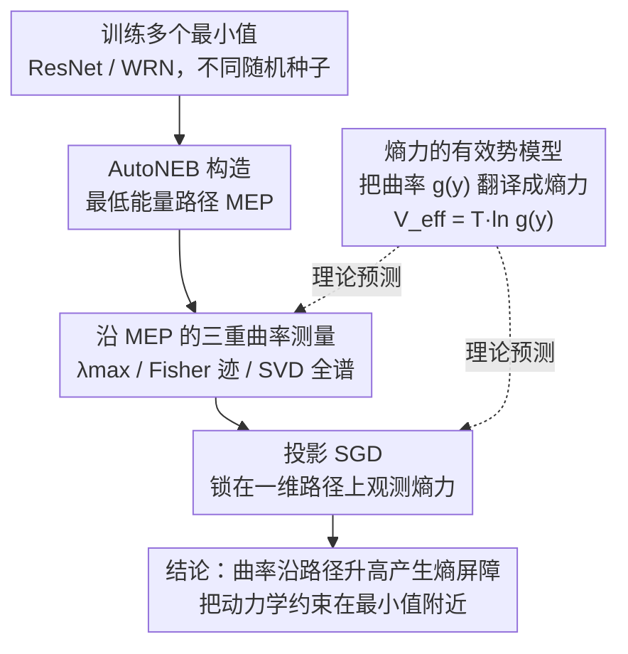

# Entropic Confinement and Mode Connectivity in Overparameterized Neural Networks

**会议**: ICLR 2026  
**arXiv**: [2512.06297](https://arxiv.org/abs/2512.06297)  
**代码**: 无（论文承诺解盲后公开）  
**领域**: 深度学习理论 / 优化  
**关键词**: 损失景观, 模式连通性, 熵力, SGD动力学, 过参数化

## 一句话总结
揭示了低损失路径上曲率的系统性增长会产生熵力屏障，即使路径能量平坦，SGD噪声也会将优化动力学约束在最小值附近的平坦区域，从而解释了"模式连通但动力学受限"的悖论。

## 研究背景与动机

**领域现状**：过参数化神经网络的不同最小值之间可以通过低损失路径相连（mode connectivity），但SGD训练却很少探索这些连接路径上的中间点，一旦收敛到某个最小值就不再移动。

**现有痛点**：模式连通性意味着损失景观并不崎岖，最小值之间有平坦路径相连，但优化器却表现出"受限"行为——这构成一个明显的悖论，现有理论无法很好解释。

**核心矛盾**：仅关注损失值（能量）忽略了曲率变化产生的隐含力——类似统计物理中的熵力，这种力在有噪声的优化动力学中会偏置系统走向更平坦的区域。

**本文目标** 为什么能量连通的最小值在动力学上是不连通的？曲率如何在低损失路径上变化？熵屏障与能量屏障在训练过程中如何此消彼长？

**切入角度**：借鉴统计物理中布朗运动的有效势（effective potential），将SGD噪声视为有效温度，分析曲率变化如何通过熵力约束优化轨迹。

**核心 idea**：低损失连接路径上的曲率系统性上升产生了熵屏障，使得噪声优化动力学被约束在最小值附近，即使能量路径完全平坦。

## 方法详解

### 整体框架
本文把统计物理里的"熵力"搬进损失景观分析，要回答的悖论是：既然不同最小值之间存在低损失路径相连（模式连通），为什么 SGD 收敛后几乎不沿这些路径游走？整套分析分四步走——先用有效势模型给出理论预测：曲率沿路径变化会产生一股偏置噪声动力学的隐含力；再在真实网络上验证：训练多个 ResNet/WRN 得到不同最小值，用 AutoNEB 找出它们之间的最低能量路径（minimum energy path，MEP），沿路径密集测量曲率，最后用投影 SGD 把高维动力学压到这条一维路径上，直接观测曲率变化是否把模型推回最小值。核心论点是：能量平坦不等于动力学自由——曲率沿路径系统性升高，在有噪声的优化里相当于一道熵屏障。

### 关键设计

**1. 熵力的有效势模型：把曲率变化翻译成一股看不见的力**

模式连通性只盯着损失（能量），却忽略了曲率本身能产生力，因此无法解释"能量连通却动力学受限"。本文借布朗运动的有效势思路建模：设势函数 $V(x,y) = \frac{1}{2}g(y)x^2$，其中 $x$ 是被快速热化的"硬"方向（Hessian 大特征值方向），$y$ 是缓慢演化的"软"方向（曲率近乎平坦、损失几乎不变的方向），$g(y)$ 是软方向上的曲率。当 $x$ 的弛豫远快于 $y$ 时，把快变量 $x$ 积掉，慢变量 $y$ 看到的有效势变成

$$V_{\text{eff}}(y) = T \ln g(y),$$

对应的力正比于 $-\frac{d}{dy}\ln g(y)$，方向指向 $g(y)$ 更小、即更平坦的区域。这里有效温度 $T \propto \eta/B$，由学习率 $\eta$ 与批大小 $B$ 决定，噪声为零时熵力随之消失。这一步把"SGD 偏好平坦最小值"从经验观察落到具体机制上：只要曲率在路径上不均匀，噪声就会把系统挤向平坦端，而不需要损失本身有任何起伏——熵甚至可能压过能量，驱使优化逆着损失梯度往上爬。

**2. 沿 MEP 的三重曲率测量：用互相独立的方法交叉确认屏障真实存在**

有了理论预测，还得在真实网络上证明曲率确实沿路径升高，而单一谱估计可能受方向选择或数值误差影响。本文沿最低能量路径同时用三种互补手段刻画 Hessian 谱：用幂迭代估计最大特征值 $\lambda_{\max}$，每步只需 $\mathcal{O}(N)$ 次 Hessian-向量乘积，无需显式构造 $N\times N$ 的 Hessian；在最小值附近用 Fisher 信息矩阵 $\mathcal{F}(\theta^\star) = \mathbb{E}_{(x,y)}[s_\theta s_\theta^\top]$（$s_\theta=\nabla_\theta \log p_\theta(y\mid x)$ 为得分）近似 Hessian 来高效估计迹；再在一小批训练样本上对得分矩阵做奇异值分解（SVD）取前几个奇异值看完整谱形。三者一致显示路径中部曲率明显高于两端，且 SVD 全谱分析表明是整个谱集体向上平移、而非个别方向变陡——说明屏障来自各向同性的曲率升高。更关键的是：损失在第一、二个 pivot 之间下降后就基本持平，曲率却继续上升，这就排除了"曲率升高只是损失下降的副产品"这一替代解释。

**3. 投影 SGD：把动力学锁在一维路径上，孤立看熵力**

直接在高维空间观测熵力会被模型沿其他方向逃逸所干扰——不加约束的标准 SGD 会让模型直接离开 MEP 往别的方向漂走。本文每步 SGD 更新后就把参数投影回路径上最近的线段，把运动严格限制在路径内部。为公平比较不同学习率，结果按有效时间 $t_{\text{eff}} = (\text{更新步数}) \times \eta$ 作图。结果很直接：初始化在路径中部的模型被系统性地推向两端的最小值，越深入路径内部弛豫得越慢，哪怕沿这个方向损失在上升——这正是系统最小化自由能（而非能量）的表现。进一步把批大小调小、学习率调大都会加速这一弛豫过程，定量上吻合 $T \propto \eta/B$ 的预测，反过来印证了有效温度的设定。

### 损失函数 / 训练策略
基础模型用标准 SGD（动量 0.9、权重衰减 $5 \times 10^{-4}$、学习率 0.1）训练 200 个 epoch，批大小 256，并在 30%/60%/80%/90% 处把学习率除以 5。AutoNEB 用 4 个精化周期、学习率从 0.1 逐步降到 $10^{-3}$ 来收紧路径。投影 SGD 实验以 $\eta=0.02$、$B=16$ 为基准，再围绕它扫批大小与学习率以验证熵力随有效温度的变化。

## 实验关键数据

### 主实验

| 实验设置 | 观察指标 | 结果 |
|--------|------|------|
| WRN-16-4 MEP (多对最小值) | Hessian迹沿路径变化 | 端点处最低，中部系统性上升2-3倍 |
| WRN-16-4 MEP | $\lambda_{\max}$ 沿路径变化 | 中部比端点高约2倍 |
| WRN-16-4 MEP | SVD完整谱 | 沿路径深入，整个谱向上平移 |
| 投影SGD (B=16, η=0.02) | 弛豫时间 vs 初始位置 | 越深入路径内部，弛豫到端点越慢 |

### 消融实验

| 配置 | 弛豫行为 | 说明 |
|------|---------|------|
| Vanilla SGD (基准) | 标准弛豫 | B=16, η=0.02 |
| Adam | 更快弛豫 | 自适应优化器对曲率变化更敏感 |
| SGD + Nesterov动量 | 更快弛豫 | 动量优化器同样增强熵力效应 |
| B=16 vs B=256 | ~10倍弛豫时间差异 | 验证熵力强度与有效温度正比 |
| η=0.01 vs η=0.05 | 大学习率更快弛豫 | 高温增强熵力 |

### 关键发现
- 即使损失沿路径保持平坦甚至下降，曲率依然系统性上升，排除了"曲率增加仅因损失降低"的替代解释
- 熵屏障比能量屏障更持久：在线性模式连通性实验中，随着分裂epoch $k$ 增大，损失不稳定性先消失，但曲率不稳定性持续更久
- 熵力可以驱动模型逆梯度方向移动——自由能最小化而非能量最小化
- 以上现象在CIFAR-10/100、ResNet-20/ResNet-110/WRN-16-4上一致成立

## 亮点与洞察
- 将统计物理的熵力概念引入深度学习优化理论，用简洁的物理类比解释了长期未解的悖论：能量连通不意味着动力学连通。这一框架把"SGD隐式正则化偏好平坦最小值"从经验观察提升为有物理基础的机制性解释。
- 实验设计精巧：投影SGD将高维问题降维到一维路径，使熵力效应可直接测量和量化，避免了间接推断。

## 局限与展望
- AutoNEB和线性插值找到的路径在所有低损失路径中有选择偏差，需要更有原则的路径采样方法
- SGD噪声被简化为高斯白噪声，实际中既不完全白也不完全高斯，可能影响定量结论
- 仅在CIFAR-10/100和较小规模模型上验证，是否推广到大规模Transformer尚未研究

## 相关工作与启发
- **vs Frankle et al. (2020)**: 该工作发现共享早期训练的模型线性模式连通，本文进一步揭示这些线性路径上的曲率屏障比损失屏障持续更久，补充了"什么决定最终收敛区域"的理解
- **vs Keskar et al. (2017)**: 该工作指出小批量SGD偏好平坦最小值，本文从熵力角度给出了更精确的物理机制解释，并将其推广到路径上的曲率变化

## 评分
- 新颖性: ⭐⭐⭐⭐ 从统计物理角度引入熵力解释模式连通性悖论，理论视角独特
- 实验充分度: ⭐⭐⭐⭐ 三种曲率测量方法交叉验证，投影SGD设计精巧，跨架构/数据集一致
- 写作质量: ⭐⭐⭐⭐⭐ 物理直觉与数学推导结合流畅，图示清晰，逻辑链完整
- 价值: ⭐⭐⭐⭐ 对理解损失景观结构和SGD行为有重要理论价值，对权重空间集成等实用方法也有启示

<!-- RELATED:START -->

## 相关论文

- [\[ICML 2025\] Understanding Mode Connectivity via Parameter Space Symmetry](../../ICML2025/optimization/understanding_mode_connectivity_via_parameter_space_symmetry.md)
- [\[NeurIPS 2025\] Neural Thermodynamics: Entropic Forces in Deep and Universal Representation Learning](../../NeurIPS2025/optimization/neural_thermodynamics_entropic_forces_in_deep_and_universal_representation_learn.md)
- [\[ICLR 2026\] Neural Networks Learn Generic Multi-Index Models Near Information-Theoretic Limit](neural_networks_learn_generic_multi-index_models_near_information-theoretic_limi.md)
- [\[ICLR 2026\] Πnet: Optimizing Hard-Constrained Neural Networks with Orthogonal Projection Layers](pinet_optimizing_hard-constrained_neural_networks_with_orthogonal_projection_lay.md)
- [\[ICLR 2026\] Rapid Training of Hamiltonian Graph Networks using Random Features](rapid_training_of_hamiltonian_graph_networks_using_random_features.md)

<!-- RELATED:END -->
