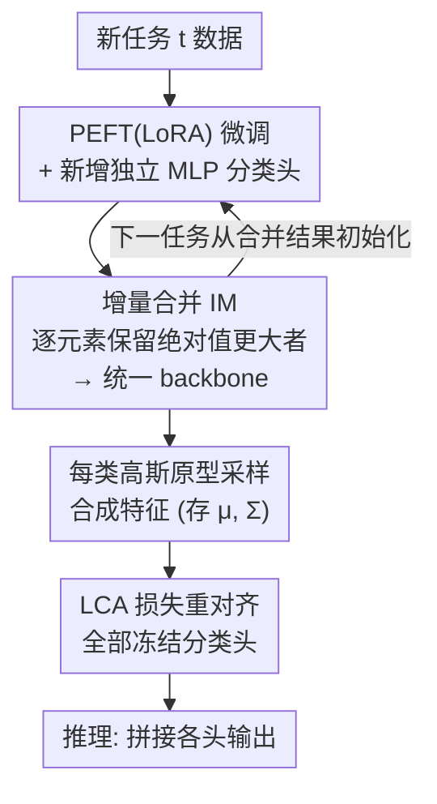

# LCA: Local Classifier Alignment for Continual Learning

**会议**: ICLR 2026  
**arXiv**: [2603.09888](https://arxiv.org/abs/2603.09888)  
**代码**: [GitHub](https://github.com/tung-tran-kyushu/LCA)  
**领域**: 持续学习  
**关键词**: 类增量学习, 分类器对齐, 模型合并, 鲁棒性, 预训练模型

## 一句话总结

提出 Local Classifier Alignment (LCA) 损失函数，通过在类原型高斯分布的局部区域内同时最小化分类损失和损失灵敏度，解决持续学习中 backbone 增量合并后分类器不匹配的问题，配合增量 PEFT 合并策略 (IM)，在 7 个基准数据集上达到整体 85.6% 的平均精度，大幅超越 SOTA。

## 研究背景与动机

**领域现状**：基于预训练模型 (PTM) 的类增量学习 (CIL) 是持续学习的主流范式。PTM 提供强大的特征提取能力，只需轻量微调即可适应新任务，但朴素的序列微调仍会导致灾难性遗忘。

**两大路线的不足**：(1) 仅在第一个任务上微调 (如 APER)，随任务增多、分布偏移加大，性能快速衰退；(2) 逐任务微调 + backbone 合并 (如 EASE, MOS)，虽然综合能力强，但冻结的旧分类器与合并后 backbone 产生不匹配 (mismatch)。

**核心痛点**：backbone 在多任务合并后参数发生变化，之前冻结的任务特定分类器与新 backbone 的特征空间不再对齐→旧任务性能急剧下降。由于无法回访旧数据，直接重训分类器不可行。

**切入角度**：借助类的高斯原型 (Gaussian prototype) 生成合成样本，在合成样本上重新对齐所有分类器。关键创新：不仅最小化分类损失，还正则化损失对输入扰动的灵敏度→实现局部鲁棒性→更好泛化。

**模型合并的启发**：Task Arithmetic、TIES-Merge 等工作表明，独立训练的任务特定模型可以通过参数合并形成更强的统一模型。本文将此思想融入 CIL，仅合并 PEFT (LoRA) 参数，存储开销极低。

**理论缺口**：现有 CIL 方法缺乏理论分析来指导分类器对齐。本文提供了测试误差的分解定理，将 CIL 性能拆分为特征分布偏移、类损失和鲁棒性三个可控部分。

## 方法详解

### 整体框架

LCA 把类增量学习拆成"逐任务训练—合并 backbone—重对齐分类器"三步：每个新任务只微调一组 PEFT (LoRA) 参数并按元素增量合并进统一 backbone，再为该任务挂一个独立的 MLP 分类头；由于合并改变了特征空间、冻结的旧分类头随之失配，最后用每类存下的高斯原型采样合成特征，跑一遍 LCA 损失把所有分类头重新对齐到新 backbone 上。整套设计由一条测试误差分解定理统领，把 CIL 性能拆成"特征分布偏移 + 训练误差 + 局部鲁棒性"三项，分别由增量合并与 LCA 损失的两项各自负责控制。

### 关键设计

**1. 独立分类头 + 高斯原型：每任务一个头、每类一个高斯，既防改写旧头又给"无数据对齐"提供样本源**

为避免新任务训练时改写旧分类器而加剧遗忘，每来一个任务就在特征提取器上新增一个独立 MLP 分类头，输出维度等于该任务的类数，推理时把各头输出拼接 $h(x) = \text{concat}(h(x;\theta_1^{\text{cls}}), \ldots, h(x;\theta_t^{\text{cls}}))$；旧头始终冻结、不被后续任务改写。与此配套，每个类在特征空间里用一个高斯分布 $\mathcal{N}_i$（均值 + 协方差）描述——预训练 backbone 产生的特征足够结构化，单高斯就能近似类分布。这套设计的关键价值在于：后续的对齐阶段无需回放任何原始数据，只要从各类高斯采样合成特征即可重训分类头，每类仅额外存均值与协方差、存储复杂度 $\mathcal{O}(n)$，远低于保留 exemplar，也回避了隐私问题。

**2. 增量合并 (Incremental Merging, IM)：在不存历史参数的前提下整合多任务知识**

逐任务训练若各自独立微调再统一合并，既要存所有历史 PEFT 参数，又因参数空间相距过远而难以稳定合并。IM 让每个新任务都从上一次合并结果初始化训练，使相邻任务的参数保持邻近 (Li et al., 2025)；训练后算出任务向量 $\tau_{\text{curr}} = \theta_{\text{peft}_i} - \theta_{\text{peft}_0}$，再与累积向量 $\tau$ 逐元素比较，只保留绝对值更大的那一维：$\tau^{(k)} \leftarrow \tau_{\text{curr}}^{(k)}$ 当 $|\tau_{\text{curr}}^{(k)}| \geq |\tau^{(k)}|$，否则保持 $\tau^{(k)}$ 不变，最终 backbone 为 $\theta_{\text{merged}} = \theta_{\text{peft}_0} + \alpha \cdot \tau$。这样内存里始终只有一份累积向量和当前任务向量，存储开销极低，而保留绝对值大者等价于保留最显著的任务特定更新，避免互相抵消。论文还发现：仅合并 PEFT 参数（而非整个 backbone）让合并显著更稳，连合并系数 $\alpha$ 都可固定为 1.0 无需调参。

**3. LCA 损失：在原型邻域内同时压低分类误差和损失灵敏度**

backbone 合并后特征空间偏移，旧分类头失配，但旧数据已不可回访，只能靠设计 1 留下的高斯原型 $\mathcal{N}_i$ 采样合成特征来重训。朴素做法只最小化合成样本上的交叉熵，问题在于高斯采样会产生一些远离原型、贴近其他类的"有害样本"，逼分类器去拟合它们反而损害泛化、加剧类间重叠。LCA 对每个类 $i$ 在分类损失之外加一个损失灵敏度正则项：

$$
L_i = \underbrace{\mathbb{E}_{\boldsymbol{z} \sim \boldsymbol{D}_i}[\ell(h_t, \boldsymbol{z})]}_{\text{分类损失}} + \lambda \underbrace{\mathbb{E}_{\boldsymbol{z}, \boldsymbol{z}' \sim \boldsymbol{D}_i}[|\ell(h_t, \boldsymbol{z}) - \ell(h_t, \boldsymbol{z}')|]}_{\text{损失灵敏度正则项}}
$$

总损失取所有已见类的均值 $L(\boldsymbol{D}, h_t) = \frac{1}{C_t} \sum_{i=1}^{C_t} L_i$。第二项衡量同类分布中两个随机样本的损失差异，惩罚损失对输入扰动的敏感度，把损失面在原型邻域内"压平"，从而削弱有害样本的影响——思路与 Sharpness-Aware Minimization 一脉相承，但落点在分类器对齐而非权重优化。强度由 $\lambda$ 控制，实验中 $\lambda = 0.1$ 在全部数据集上稳定，过大则因过度正则化掉点。

**4. 理论误差分解：用一条定理把 IM 与 LCA 的两项各自对位**

为给对齐策略提供依据，论文证明了测试误差的上界分解。backbone 固定时（定理 3.1），对有界损失 $\ell$ 有 $L(P, h_t) \leq L(\boldsymbol{D}, h_t) + \sum_{i=1}^{C_t} \frac{n_i}{n} \bar{\epsilon}_i(h_t) + \ell_{\max} \sqrt{\frac{C_t \ln 4 + 2\ln(1/\delta)}{n}}$，其中 $\bar{\epsilon}_i(h_t)$ 是类 $i$ 局部区域内的损失鲁棒性项。考虑 backbone 更新带来的特征分布偏移时（定理 3.2），界中再多出一项总变差距离：

$$
L(P_t, h_t) \leq 2\ell_{\max} \text{TV}(P_t, \hat{P}_t) + L(\hat{\boldsymbol{D}}, h_t) + \sum_{i=1}^{C_t} \frac{n_i}{n} \bar{\epsilon}_i(h_t) + \ell_{\max} \sqrt{\frac{C_t \ln 4 + 2\ln(1/\delta)}{n}}
$$

这三项恰好被方法的不同部件各自控制：分布偏移项 $\text{TV}(P_t, \hat{P}_t)$ 靠 IM 的增量合并压住，训练误差项 $L(\hat{\boldsymbol{D}}, h_t)$ 对应 LCA 第一项，鲁棒性项 $\bar{\epsilon}_i$ 对应 LCA 第二项，使得 IM+LCA 的双组件设计有了直接的理论落点。这条定理并非事后追认，而是先有"训练误差 + 鲁棒性可控误差"的目标，才反推出 LCA 第二项该长什么样。

## 实验关键数据

### 表1：7个基准数据集上的平均精度对比 (ViT-B/16-IN1K)

| 方法 | CIFAR100 | IN-R | IN-A | CUB | OB | VTAB | CARS | Overall |
|------|----------|------|------|-----|----|----|------|---------|
| CODA-Prompt | 91.0 | 78.2 | 48.1 | 75.6 | 71.0 | 65.6 | 26.3 | 65.1 |
| DualPrompt | 86.7 | 74.6 | 55.3 | 78.9 | 74.4 | 84.0 | 49.4 | 71.9 |
| EASE | 91.7 | 82.4 | 67.8 | 89.5 | 80.8 | 93.3 | 48.1 | 79.1 |
| MOS | 94.3 | 83.3 | 67.6 | 92.3 | 86.1 | 92.4 | 71.4 | 83.9 |
| SLCA | 93.7 | 85.1 | 45.1 | 90.2 | 82.7 | 91.1 | 74.6 | 80.4 |
| IM (仅合并) | 92.8 | 84.3 | 66.5 | 86.7 | 81.1 | 84.6 | 70.1 | 80.9 |
| **IM+LCA** | **94.8** | **85.8** | **75.0** | 90.8 | 81.4 | **95.2** | **76.2** | **85.6** |

### 表2：鲁棒性对比 (CIFAR100-C / CIFAR100-P)

| 指标 | IM | IM+LCA | 提升 |
|------|-------|---------|------|
| CIFAR100-C 平均精度 | ~88% | ~90% | +2% |
| CIFAR100-P 平均精度 | ~86% | ~88.5% | +2.5% |
| CIFAR100-C 严重度5 | 较低 | 更高 | 显著提升 |
| 综合鲁棒性分数 | 基线 | 更优 | 全面改善 |

### LCA 作为组件嵌入其他方法

| 方法 | 原始 | +LCA | 效果 |
|------|------|------|------|
| SLCA 基础版 | 基线 | SLCA-LCA | IN-A, CUB, VTAB, CARS 均有提升 |
| MOS 基础版 | 基线 | MOS-LCA | 多个数据集改善，CIFAR100 达 93.1% |

## 关键发现

1. **分类器对齐是 CIL 的关键瓶颈**：IM→IM+LCA 的提升幅度在所有 7 个数据集上一致显著，尤其 ImageNet-A 上提升达 8.5% (66.5→75.0)，说明 backbone 合并后分类器不匹配是性能瓶颈。

2. **鲁棒性正则项的重要性**：LCA 第二项（损失灵敏度正则）在 CIFAR100-C 和 CIFAR100-P 上分别带来 +2% 和 +2.5% 的鲁棒性提升，且在所有 19 种 corruption 和多种 perturbation 类型上均一致改善。

3. **LCA 的可组合性**：LCA 可以作为 plug-in 嵌入 SLCA、MOS 等方法中。即使不调优超参数 (固定 $\lambda=0.1$)，也能在多个数据集上带来稳定提升。

4. **仅合并 PEFT 参数的有效性**：无需合并全部 backbone 参数，仅合并 LoRA 参数即可实现高效的知识整合，存储开销极低。

5. **$\lambda$ 的选择**：$\lambda=0.1$ 在所有数据集上表现稳定，过大的 $\lambda$ 会导致性能下降（过度正则化），符合理论预期。

## 亮点与洞察

- **损失灵敏度作为正则化目标**：不同于传统的权重正则化或特征对齐，LCA 直接约束损失函数在输入空间上的变化率。这种"损失面平坦化"思想与 SAM (Sharpness-Aware Minimization) 异曲同工，但应用于分类器对齐的特定场景。

- **理论驱动的方法设计**：定理 3.2 的三部分分解 (分布偏移 + 训练误差 + 鲁棒性) 直接指导了 IM+LCA 的双组件设计，每个组件负责控制一个理论误差项。这种理论指导实践的方法设计在 CIL 领域较为少见。

- **合成样本的巧妙使用**：不需要 exemplar memory 或数据回放，仅需存储每类的均值和协方差→从高斯分布采样→在特征空间中对齐分类器。这避免了隐私问题和存储开销。

- **简洁高效**：整体方法不需要扩展 backbone (如 EASE)、复杂推理过程 (如 MOS) 或额外的记忆缓冲区。合并后一次 LCA 对齐即可，实现简洁且有效。

## 局限性

1. **LCA 仅作用于分类器对齐阶段**：未将 LCA 损失集成到 backbone 训练的端到端流程中。作者自己也指出，将 LCA 融入 backbone 训练有可能进一步提升鲁棒性。

2. **高斯假设的局限**：每类用单个高斯分布表示可能无法捕捉真实特征分布的多模态性或非对称性，尤其在复杂细粒度数据集上。

3. **理论分析假设 backbone 固定**：定理 3.1 在 backbone 固定时成立；虽然定理 3.2 引入了分布偏移项，但未直接分析 backbone 训练过程中的动态。

4. **未探索其他上下文**：LCA 损失具有通用性，但本文仅在 CIL 场景中验证，未在其他持续学习设置 (如 domain-incremental, task-incremental) 或一般分类任务中测试。

5. **OB 数据集上提升有限**：IM+LCA 在 OmniBenchmark 上仅从 81.1 提升到 81.4 (0.3%)，且低于 MOS 的 86.1%，说明方法在某些分布场景下可能不占优势。

## 相关工作对比

### vs EASE (Zhou et al., 2024)
EASE 通过扩展子空间 (expandable subspace) 来整合新任务，利用语义相似度重加权旧分类器。相比之下，LCA 不需要扩展 backbone 架构，存储开销更低，且通过理论支撑的损失函数直接对齐分类器。IM+LCA (85.6%) 在整体精度上大幅超越 EASE (79.1%)，尤其在 IN-A (+7.2%)、VTAB (+1.9%)、CARS (+28.1%) 上优势明显。

### vs MOS (Sun et al., 2025b)
MOS 在推理时动态选择合适的 backbone adapter，重在推理阶段的适配。IM+LCA 则在训练后通过一次对齐步骤完成，推理更简洁。虽然 MOS 在 CUB (92.3 vs 90.8) 和 OB (86.1 vs 81.4) 上表现更好，但 IM+LCA 在 IN-A (+7.4%)、VTAB (+2.8%)、CARS (+4.8%) 上大幅领先，且整体精度 85.6% > 83.9%。

### vs SLCA (Zhang et al., 2023)
SLCA 用较小学习率训练 backbone 以减少遗忘，但 backbone 变化仍导致分类器不匹配。IM+LCA 直接解决这一问题，在 IN-A 上从 45.1% 提升到 75.0% (+29.9%)，整体 85.6% vs 80.4%。此外，LCA 可作为 SLCA 的补充组件 (SLCA-LCA) 进一步提升性能。

## 评分

- **新颖性**: ⭐⭐⭐⭐ LCA 损失的设计新颖——将损失灵敏度作为正则化目标，有理论支撑的误差分解；增量合并策略虽然和已有工作相关，但仅合并 PEFT 参数且无需修剪阶段是新贡献
- **实验充分度**: ⭐⭐⭐⭐⭐ 7 个基准数据集 + 3 种 seed 报告均标差 + LCA 作为 plug-in 组合验证 + CIFAR100-C/P 鲁棒性评估 + 超参数敏感性分析 + 多种合并策略消融
- **写作质量**: ⭐⭐⭐⭐ 理论分析清晰完整，方法描述简洁明了，算法伪代码规范；论文结构合理
- **实用价值**: ⭐⭐⭐⭐ LCA 实现简单可作为 plug-in 嵌入现有 CIL 方法，无需额外存储或复杂推理，适合实际部署

<!-- RELATED:START -->

## 相关论文

- [\[CVPR 2026\] Learning to Learn Weight Generation via Local Consistency Diffusion](../../CVPR2026/optimization/learning_to_learn_weight_generation_via_local_consistency_diffusion.md)
- [\[ICLR 2026\] MT-DAO: Multi-Timescale Distributed Adaptive Optimizers with Local Updates](mt-dao_multi-timescale_distributed_adaptive_optimizers_with_local_updates.md)
- [\[ICCV 2025\] Federated Continual Instruction Tuning](../../ICCV2025/optimization/federated_continual_instruction_tuning.md)
- [\[NeurIPS 2025\] Train with Perturbation, Infer after Merging: A Two-Stage Framework for Continual Learning](../../NeurIPS2025/optimization/train_with_perturbation_infer_after_merging_a_two-stage_framework_for_continual_.md)
- [\[CVPR 2026\] FedAlign: Differentially Private Distribution Alignment for Non-IID Federated Learning](../../CVPR2026/optimization/fedalign_differentially_private_distribution_alignment_for_non-iid_federated_lea.md)

<!-- RELATED:END -->
