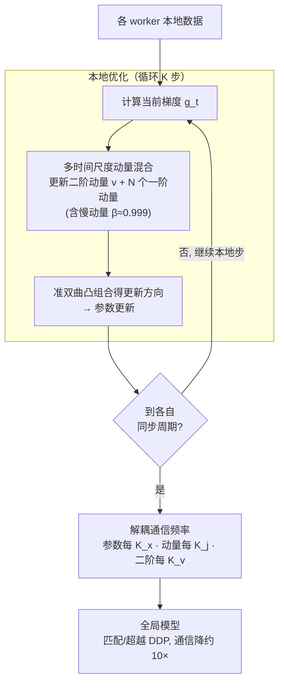

# MT-DAO: Multi-Timescale Distributed Adaptive Optimizers with Local Updates

**会议**: ICLR 2026  
**arXiv**: [2510.05361](https://arxiv.org/abs/2510.05361)  
**代码**: 无  
**领域**: 分布式优化 / LLM 预训练  
**关键词**: Distributed Training, Adaptive Optimizer, Multi-timescale Momentum, Communication Efficiency, Local SGD

## 一句话总结

提出 MT-DAO，一种多时间尺度分布式自适应优化器，通过引入慢动量（高 $\beta$）来解决低频通信训练中标准动量衰减过快导致的时间尺度失配问题，首次提供了收敛保证，在语言模型预训练中消除了与全同步 DDP 的性能差距，同时减少 6-27% 的端到端训练时间。

## 研究背景与动机

**分布式数据并行（DDP）的通信瓶颈**：DDP 要求每步同步梯度，当网络带宽有限时（如跨数据中心、以太网互联），通信开销成为训练效率的主要瓶颈。

**低频通信策略（如 Local SGD）存在性能差距**：每 $K$ 步才同步一次参数可以大幅减少通信，但当应用到自适应优化器（Adam 等）时，对比 DDP 存在明显的性能下降。Charles et al. (2024) 发现即使使用 Nesterov 动量做外部优化器，在 2.4B 参数以下和 2 个以上 worker 时仍落后于 DDP。

**性能差距的根源：时间尺度失配**：标准 Adam 使用 $\beta_1 \approx 0.9$ 的快动量，其半衰期 $\tau_{0.5}(\beta) = \frac{\ln 0.5}{\ln \beta} \approx 6.6$ 步。当通信间隔 $K \gg \tau_{0.5}$（如 $K = 32$），经过 $K$ 步后全局动量的影响衰减到 $\beta^K \approx 0.03$，worker 被迫依赖高方差的局部梯度。

**直接增大 $\beta$ 不可行**：高动量优化器对损失景观变化不够敏感，容易产生振荡，在实践中往往性能更差。

**多动量方法提供了解决思路**：QHM、AggMo、AdEMAMix 等方法已经证明混合快慢动量可以在不牺牲响应性的前提下获得长期记忆的好处，但它们尚未被引入分布式低频通信场景。

## 方法详解

### 整体框架

MT-DAO 把"多动量混合"这一原本属于单机优化器的技巧搬进分布式低频通信场景：每个 worker 维护一个二阶动量和 $N$ 个衰减率各不相同的一阶动量 $\beta_{1,j}$，更新方向取当前梯度与这 $N$ 个动量的凸组合（准双曲型），而参数、各动量、二阶状态可以各自以不同频率同步。直觉上，快梯度负责盯住本地损失景观的瞬时变化，慢动量则像一根"记忆锚"，把全局优化方向的信息保留到下一次通信，从而修补低频同步带来的性能裂缝。

### 关键设计

**1. 多时间尺度动量混合：让一根优化器同时拥有快慢两种记忆**

标准 Adam 只有一个 $\beta_1 \approx 0.9$ 的快动量，半衰期约 6.6 步，一旦通信间隔 $K=32$，跨同步的全局信号早已衰减殆尽，worker 只能靠高方差的局部梯度盲走。MT-DAO 的做法是在更新方向里同时摆进快慢两类信号：参数更新写成 $\Delta_t^m = \frac{1}{\sqrt{v_t^m} + \epsilon}\left[(1-\sum_{j=1}^N \omega_j)\hat{g}_t^m + \sum_{j=1}^N \omega_j u_t^{j,m}\right]$，其中 $\hat{g}_t^m$ 是当前（快）梯度，$u_t^{j,m}$ 是第 $j$ 个动量。慢动量取 $\beta \approx 0.999$，半衰期长达数百步，足以跨越同步间隔守住全局方向；快梯度则保留对局部景观的响应性，避免高动量优化器常见的振荡迟钝。最简形式 $N=1$（即 QH）只新增一组超参 $(\omega_1, \beta_1)$、不增加任何额外内存，在实践中就已够用。

**2. 解耦通信频率：按时间尺度分配带宽，慢的少传、快的多传**

既然不同动量承载的信息时效不同，没必要让它们用同一个频率同步。MT-DAO 让参数每 $K_x$ 步、第 $j$ 个动量每 $K_j$ 步、二阶状态每 $K_v$ 步各自独立同步。背后的依据来自理论分析——$\beta$ 越大的动量对同步频率越不敏感，所以慢动量完全可以拉长同步间隔而几乎不掉性能。把这些频率合起来，整体通信成本相对全同步降低 $(1/K_x + \sum_{j=1}^N 1/K_j + 1/K_v)^{-1}$ 倍，等于把有限的带宽优先让给真正需要频繁同步的快信号。

**3. 互信息保持分析：用信息论说清慢动量到底守住了什么**

为了把"慢动量保留全局方向"这句直觉量化，论文从信息论角度刻画动量在通信间隔内还能保留多少全局优化信号，给出 $I(U_{t+K}; U_t) = \frac{1}{2}\log\det(I + \beta^{2K}\Sigma_{U_t}\Sigma_L^{-1})$。关键在 $\beta^{2K}$ 这一项：标准快动量在 $K=32$ 时 $\beta^K \to 0$，互信息归零，意味着同步前后的动量几乎统计独立、全局信号丢失；而慢动量 $\beta^K \to 1$，互信息得以保留，全局方向被原样带过同步间隔。这一分析既解释了快动量为何在低频通信下失效，也为"用慢动量补裂缝"提供了定量支撑。

### 损失函数 / 训练策略

理论侧给出收敛保证（Theorem 1）：在标准非凸平滑假设下，MT-DAO-SGDM 达到最优的 $\mathcal{O}(1/\sqrt{T})$ 渐近收敛率，两个关键常数为 $\beta_\omega = \sum_{j=1}^N \frac{\omega_j \beta_j}{1 - \beta_j}$ 与 $\psi = \frac{4(1-p_x)}{p_x^2}\sum_{j=1}^N \omega_j \frac{(1-\beta_j)(1-p_j)}{1-(1-p_j)\beta_j}$。其中 $\beta_\omega$ 约束步长——$\beta$ 越大步长被限得越小；$\psi$ 则刻画通信惩罚——$\beta$ 越大 $\psi$ 越小，正好对应"慢动量对低频通信更鲁棒"的实验现象；而 client drift、数据异质性等分布式因素只落在高阶 $\mathcal{O}(1/T)$ 项里，不拖累渐近率。实践配置上，底座用 ADOPT 优化器（Adam 变体，$\beta_2 = 0.9999$），默认 $K = K_x = K_1 = K_v = 32$，并借 CompleteP 参数化把 16M 小模型上调好的学习率直接迁到大模型，省去重新调参。

## 实验关键数据

### 主实验

720M 参数语言模型（SmolLM2 数据集），4 个 H100 GPU，以太网互联：

| 方法 | 性能（vs DDP） | 通信量（vs DDP） |
|------|----------------|------------------|
| ADOPT-DDP | 基线 | 1× |
| QHADOPT-DDP | 略优于 DDP | 1× |
| Local ADOPT | 落后 DDP | 10× 减少 |
| Nesterov 外部优化器 | 落后 DDP | 10× 减少 |
| **MT-DAO** | **匹配/超越 DDP** | **10× 减少** |

MT-DAO 720M 关键数据：
- 达到目标 perplexity 比单动量 DDP 少 **24% steps** 和 **35% 时间**
- 比 QHADOPT-DDP 快约 **8% 时间**和 **5% tokens**
- 端到端时间减少 **6-27%**（取决于互联带宽）

### 消融实验

通信频率对性能的影响（16M 模型，$K_1=K_v=16$）：

| $K_x$ | $\beta_1=0.99$ 退化 | $\beta_1=0.995$ 退化 |
|--------|---------------------|----------------------|
| 32 | +1.7% | +1.0% |
| 128 | +3.9% | +3.2% |
| 512 | +5.6% | +3.4% |
| 1024 | +6.2% | +3.7% |

更高的 $\beta_1$ 在增大通信间隔时性能退化更少。

Worker 对齐度（余弦相似度）：

| 指标 | MT-DAO | Local ADOPT | Nesterov |
|------|--------|-------------|----------|
| 局部伪梯度↔全局动量 | >0.95 | ~0.7 | ~0.8 |
| 局部↔全局伪梯度 | >0.95 | ~0.7 | ~0.85 |

### 关键发现

1. **MT-DAO 首次消除了低频通信与 DDP 的性能差距**：在 720M 规模上，MT-DAO 不仅匹配还超越了 DDP
2. **慢动量充当正则化器**：使 worker 的更新方向高度对齐（余弦相似度 >0.95），减少了 worker 漂移
3. **互信息保持是关键**：MT-DAO 的慢动量在通信间隔内保持了与全局优化方向的统计依赖，而标准快动量的互信息迅速衰减
4. **更高 $\beta$ = 更抗低频通信**：理论预测与实验一致，$\beta=0.995$ 比 $\beta=0.99$ 在极端低频通信（$K=1024$）下性能退化少约 40%
5. **QH 形式（$N=1$）是最优实践选择**：不增加内存、只加一个超参，性能已足够

## 亮点与洞察

1. **时间尺度失配的诊断精准且有说服力**：从半衰期和互信息两个角度量化了问题，使解决方案的设计有理有据
2. **首次为分布式多动量优化器提供收敛保证**：理论分析揭示了慢动量在分布式场景中的独特优势（对同步频率不敏感）
3. **与 AdEMAMix 的互补关系**：AdEMAMix 在单机上展示了慢动量的记忆优势，MT-DAO 将这一优势带入分布式场景
4. **对跨数据中心训练的实际意义**：MT-DAO 能在高延迟网络上训练而不损失质量，使得利用地理分布的 GPU 资源成为可能

## 局限与展望

1. **最大规模仅 720M**：对于 7B+ 模型和数百 GPU 的场景，MT-DAO 的优势是否保持需要验证
2. **仅在 IID 数据分布上测试**：在数据异质性（non-IID）较强的联邦学习场景下，效果可能不同
3. **超参数敏感性**：虽然 CompleteP 可以转移学习率，但 $\omega$ 和 $\beta$ 的最优组合仍需在小模型上搜索
4. **与梯度压缩的联合使用**：MT-DAO 与量化/稀疏化等压缩方法的兼容性未探索（论文指出这是互补方向）
5. **仅在语言模型上评估**：对于视觉模型、多模态模型等架构的适用性未验证

## 相关工作与启发

- **Local SGD/Adam (McMahan et al., 2017; Reddi et al., 2021)**：经典分布式低频通信框架，MT-DAO 通过多时间尺度动量解决了其性能差距问题
- **QHM (Ma & Yarats, 2018)**：准双曲动量的开创者，MT-DAO 将其分布式化
- **AdEMAMix (Pagliardini et al., 2025)**：单机多动量优化器，展示了慢动量减少遗忘的能力；MT-DAO 在分布式场景中利用这一特性来减少 worker 漂移
- **Charles et al. (2024)**：诊断了低频通信 Adam 的性能差距，使用 Nesterov 外部优化器改善但未消除；MT-DAO 完全消除了这一差距
- 启发：时间尺度设计可能是分布式优化中被低估的维度，未来可以探索自适应时间尺度、层级多时间尺度等方向

## 评分

- **新颖性**: ⭐⭐⭐⭐ — 将多动量的思想引入分布式低频通信场景，时间尺度失配的诊断清晰；但核心思想建立在 QHM/AdEMAMix 之上
- **实验充分度**: ⭐⭐⭐⭐ — 16M/125M/720M 三个规模系统评估，余弦相似度和互信息的可视化有力支撑了理论分析；但缺少更大规模验证
- **写作质量**: ⭐⭐⭐⭐⭐ — 从问题诊断→理论分析→算法设计→实验验证的叙述逻辑极为流畅，图表设计精良
- **价值**: ⭐⭐⭐⭐ — 对于通信受限的分布式训练场景有直接的实用价值，特别适用于跨数据中心和边缘计算场景

<!-- RELATED:START -->

## 相关论文

- [\[ICLR 2026\] A Convergence Analysis of Adaptive Optimizers under Floating-Point Quantization](a_convergence_analysis_of_adaptive_optimizers_under_floating-point_quantization.md)
- [\[ICLR 2026\] The Affine Divergence: Aligning Activation Updates Beyond Normalisation](the_affine_divergence_aligning_activation_updates_beyond_normalisation.md)
- [\[ICLR 2026\] LCA: Local Classifier Alignment for Continual Learning](lca_local_classifier_alignment_for_continual_learning.md)
- [\[ICML 2026\] Multi-Objective Bayesian Optimization via Adaptive ε-Constraints Decomposition](../../ICML2026/optimization/multi-objective_bayesian_optimization_via_adaptive_varepsilon-constraints_decomp.md)
- [\[ICLR 2026\] Rethinking Consistent Multi-Label Classification Under Inexact Supervision](rethinking_consistent_multi-label_classification_under_inexact_supervision.md)

<!-- RELATED:END -->
