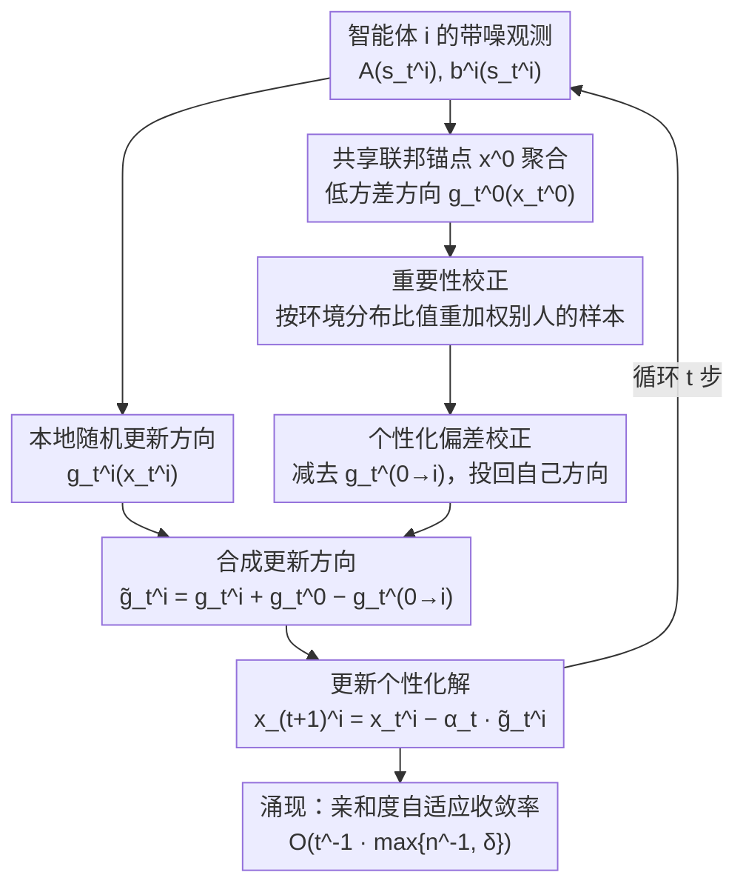

# Personalized Collaborative Learning with Affinity-Based Variance Reduction

**会议**: ICLR 2026  
**arXiv**: [2510.16232](https://arxiv.org/abs/2510.16232)  
**代码**: 无  
**领域**: 优化  
**关键词**: 个性化联邦学习, 协作学习, 方差缩减, 异质性, 亲和度加速

## 一句话总结

提出个性化协作学习框架 AffPCL，通过偏差校正和重要性校正机制，让异质智能体在无需先验知识的情况下协作学习个性化解，实现 $O(t^{-1} \cdot \max\{n^{-1}, \delta\})$ 的自适应收敛率——智能体相似时获得线性加速，差异大时不差于独立学习。

## 研究背景与动机

**领域现状**：多智能体学习面临一个根本张力——**协作效率 vs 个性化需求**。协作系统通常采用联邦学习（federated learning, FL）范式，让智能体通过中心服务器联合学习一个统一解；但在异质性（heterogeneity）存在时，这个统一解对单个智能体往往是次优甚至无关的，于是个性化成了异质智能体协作的刚需。

**现实需求**：个性化推荐要适应不同用户、自动驾驶要适应当地路况、机器人要适应不同作业环境、医疗诊断要适应不同患者群体、LLM Agent 要适应特定用户风格——这些场景都同时要求"既协作又个性化"。

**理想算法的三个目标**：(1) 为每个智能体找到**完全个性化**的解 $x^i_*$；(2) 通过协作获得**性能提升**；(3) **自适应**未知的异质性——智能体相似时获得加速、差异大时不退化，且不需要任何先验知识或调参。

**现有方法都差一截**：经典 FL 只学统一解、没有个性化保证；正则化/混合方法（如 Ditto）只提供部分个性化、权衡常是启发式的；聚类方法簇内仍无个性化、对超参敏感；FL + 微调速率次优（FL 带来的小初始化误差消失太快，独立学习的方差主导有限时间复杂度）；全局 + 局部分解需要特定结构假设、且独立学习部分主导整体复杂度；与本文最接近的选择性协作（Chayti et al.、Even et al.）只与相似智能体合作，要么需要异质性先验、要么需要偏差估计 oracle。本文要在不依赖任何先验的前提下，让任意异质的智能体都能协作学到各自的个性化解。

## 方法详解

### 整体框架

AffPCL 把个性化协作学习建模成 $n$ 个智能体各自求解一个随机线性系统 $\bar{A}^i x^i_* = \bar{b}^i$（满足 $\text{sym}(\bar{A}^i) \succ 0$），每步每个智能体只能采到带噪观测 $A(s^i_t)$、$b^i(s^i_t)$，且彼此的目标 $\bar{b}^i$ 和环境分布 $\mu_i$ 都可能不同。它的核心思路是：让每个智能体仍然学自己的个性化解 $x^i_*$，但在更新里借用一个共享的联邦锚点把方差压下去，再用两道校正把"借力"带来的偏差扣干净，最终让收敛速度随智能体间的相似程度，自动在"联邦线性加速"和"各学各的"之间插值。

具体到一步更新：每个智能体先用本地观测算出自己的随机更新方向 $g^i_t(x^i_t)$，同时维护一个跨智能体共享的锚点 $x^0$，由中心服务器聚合各方信息得到低方差的联邦方向 $g^0_t(x^0_t)$；聚合时对环境分布不同的样本做重要性重加权，再减去一道个性化偏差校正项 $g^{0\to i}_t(x^0_t)$ 把统一方向投回到智能体 $i$ 自己的方向上，三者合成校正后的更新方向后落到 $x^i_{t+1}$。重复这一步，亲和度自适应的收敛率便自然涌现。

### 关键设计

**1. 个性化偏差校正：让全个性化的更新也能吃到联邦方差缩减**

联邦学习之所以能把随机梯度的方差降到 $1/n$，是因为所有智能体都朝同一个统一解走、聚合时噪声相互抵消；可一旦每个智能体要走向自己独特的方向 $x^i_*$，简单聚合就会把别人的"目标偏置"混进来，方差缩减随之失效。AffPCL 的破解办法是在更新里同时维护一个共享锚点变量 $x^0$，并把单步更新写成 $x^i_{t+1} = x^i_t - \alpha_t \tilde{g}^i_t$，其中校正后的方向

$$\tilde{g}^i_t = g^i_t(x^i_t) + g^0_t(x^0_t) - g^{0\to i}_t(x^0_t)$$

由三块拼成：本地随机更新 $g^i_t(x^i_t)$ 保证朝个性化解走，联邦聚合项 $g^0_t(x^0_t)$ 提供低方差的共享信号，而个性化偏差校正项 $g^{0\to i}_t(x^0_t)$ 则把"统一方向"重新投回到智能体 $i$ 自己的方向上、抵消聚合引入的系统偏置。这样一来，聚合项贡献的方差缩减被保留下来，但更新的不动点仍然精确落在 $x^i_*$ 而非统一解，从而同时拿到协作的低噪声和个性化的正确性。

**2. 重要性校正：把环境分布不同造成的偏差扳正**

除了目标异质，智能体之间还可能采样自不同的环境分布 $\mu_i$，这意味着即使把别人的观测拿来聚合，它在期望意义下对应的也是"别人的环境"而不是自己的，直接平均会引入第二种偏差。AffPCL 为此在聚合时乘上一道重要性权重，按两个环境分布的比值重新加权别人的样本，使得借来的随机观测在期望上等价于在本智能体环境 $\mu_i$ 下采得的量，从而保持无偏。论文进一步给出该校正的异步变体——重要性权重可以用滞后的统计量估计，从而放松"所有智能体严格同步通信"的要求，让算法在更现实的异步场景下仍然无偏。

**3. 亲和度自适应：相似就加速、相异不退化，且不需要任何先验**

算法用一个异质性度量 $\delta \in [0,1]$ 刻画智能体群体的相似程度，$\delta = 0$ 表示完全同质、$\delta$ 越大越异质。AffPCL 最终的收敛率是 $O\!\left(t^{-1}\cdot\max\{n^{-1},\,\delta\}\right)$，这个 $\max$ 形式正是自适应的关键：当 $\delta \ll n^{-1}$ 即群体足够相似时，速率退到 $O(t^{-1}n^{-1})$，等同于联邦学习的 $n$ 倍线性加速；当 $\delta \gg n^{-1}$ 即群体差异很大时，速率退化为 $O(t^{-1})$，与各自独立学习持平、绝不更差；介于两者之间时，速率沿 $\delta$ 平滑插值。整个过程不需要预先知道 $\delta$、不需要偏差估计 oracle、也不需要为亲和度调任何超参数——相似度由偏差校正后的聚合自动"显形"，因此一个与所有人都不像的智能体，也可能因为其他智能体彼此相似、聚合估计更准而间接获得加速。

### 损失函数 / 训练策略

训练用接近常数步长的衰减策略 $\alpha_t \equiv \frac{\ln t}{\lambda t}$（$\lambda$ 为系统的强单调常数），以匹配 $O(t^{-1})$ 量级的收敛分析。论文采用渐进式的展开方式逐层加复杂度：先从同质联邦的简化情形出发，再依次引入个性化偏差校正、亲和度自适应、环境异质性下的重要性校正，最后给出包含异步通信的完整设定，每一层都对应一个独立可验证的收敛定理。

## 实验关键数据

### 主实验

论文采用渐进式理论分析，核心理论结果：

| 设定 | 收敛率 | 说明 |
|------|--------|------|
| FL（同质） | $\tilde{O}(\kappa^2 t^{-1} n^{-1})$ | Baseline：线性加速 |
| 独立学习 | $O(t^{-1})$ | Baseline：无协作 |
| AffPCL | $O(t^{-1} \cdot \max\{n^{-1}, \delta\})$ | 自适应插值 |
| 异步 AffPCL | 同上 + 异步重要性估计 | 放松同步要求 |

### 消融实验

| 配置 | 关键指标 | 说明 |
|------|---------|------|
| 纯联邦 vs AffPCL | FL 的偏差不随 $t$ 减小 | 异质性下 FL 收敛到错误解 |
| 独立学习 vs AffPCL | AffPCL 方差缩减因子 $\max\{n^{-1}, \delta\}$ | 至少不差于独立学习 |
| 选择性协作 vs AffPCL | AffPCL 即使与不相似智能体协作也可获得加速 | 前者需要先验或 oracle |

### 关键发现

1. **亲和度方差缩减**：AffPCL 通过个性化偏差校正，即使不同智能体学习不同的目标，也能从联邦聚合中获得方差缩减
2. **单个智能体也可获得线性加速**：即使某个智能体与其他所有智能体都不相似，它仍可能获得线性加速（因为其他智能体之间的相似性产生了更好的聚合估计）
3. **无需先验知识**：不需要知道异质性水平 $\delta$，不需要偏差估计 oracle，不需要超参数调优
4. **理论率紧致**：在 $\kappa$, $t$, $n$ 上均匹配已知下界

## 亮点与洞察

- **优雅的理论框架**：将个性化和协作的张力形式化为一个统一的学习率问题，分析清晰
- **自适应插值**：从 FL 的线性加速到独立学习的基线平滑过渡，无需调参
- **反直觉发现**：与不相似智能体协作也可能有益——这挑战了"只与相似者合作"的直觉
- **通用性强**：框架涵盖监督学习、强化学习（TD 学习）和统计决策

## 局限与展望

1. **线性系统假设**：核心理论基于线性系统 $\bar{A}^i x^i_* = \bar{b}^i$，向非线性深度学习场景的推广需要进一步工作
2. **通信效率**：当前假设每步都通信，更实际的设定应考虑间歇通信和通信压缩
3. **每智能体一个样本**：每步每智能体采一个样本的设定较为理想化
4. **隐私考虑**：未讨论差分隐私等约束下的性能
5. **实验规模**：理论工作为主，大规模深度学习实验有限

## 相关工作与启发

- **SCAFFOLD** (Karimireddy et al., 2021)：联邦学习中的方差缩减，但不支持个性化
- **Ditto** (Li et al., 2021)：通过正则化实现部分个性化
- **MAML/Per-FedAvg** (Fallah et al., 2020)：FL + 微调策略
- **Chayti et al., Even et al.**：全个性化的协作学习，但需要选择性协作或先验知识
- **启发**：个性化学习中"方差缩减"的关键在于识别和利用智能体间的亲和度（而非强制一致性）

## 评分
- 新颖性: ⭐⭐⭐⭐⭐ （亲和度驱动的个性化协作学习框架是全新的视角）
- 实验充分度: ⭐⭐⭐ （以理论为主，实验验证相对有限）
- 写作质量: ⭐⭐⭐⭐⭐ （渐进式展开非常清晰，理论精炼）
- 价值: ⭐⭐⭐⭐ （为个性化联邦学习提供了新的理论基础和实用框架）

<!-- RELATED:START -->

## 相关论文

- [\[CVPR 2026\] Few-for-Many Personalized Federated Learning](../../CVPR2026/optimization/few-for-many_personalized_federated_learning.md)
- [\[CVPR 2026\] FedRAC: Rolling Submodel Allocation for Collaborative Fairness in Federated Learning](../../CVPR2026/optimization/fedrac_rolling_submodel_allocation_for_collaborative_fairness_in_federated_learn.md)
- [\[ICML 2026\] TPV: Parameter Perturbations Through the Lens of Test Prediction Variance](../../ICML2026/optimization/tpv_parameter_perturbations_through_the_lens_of_test_prediction_variance.md)
- [\[CVPR 2026\] Generalized and Personalized Federated Learning with Black-Box Foundation Models via Orthogonal Transformations](../../CVPR2026/optimization/generalized_and_personalized_federated_learning_with_black-box_foundation_models.md)
- [\[AAAI 2026\] Personalized Federated Learning with Bidirectional Communication Compression via One-Bit Random Sketching](../../AAAI2026/optimization/personalized_federated_learning_with_bidirectional_communication_compression_via.md)

<!-- RELATED:END -->
