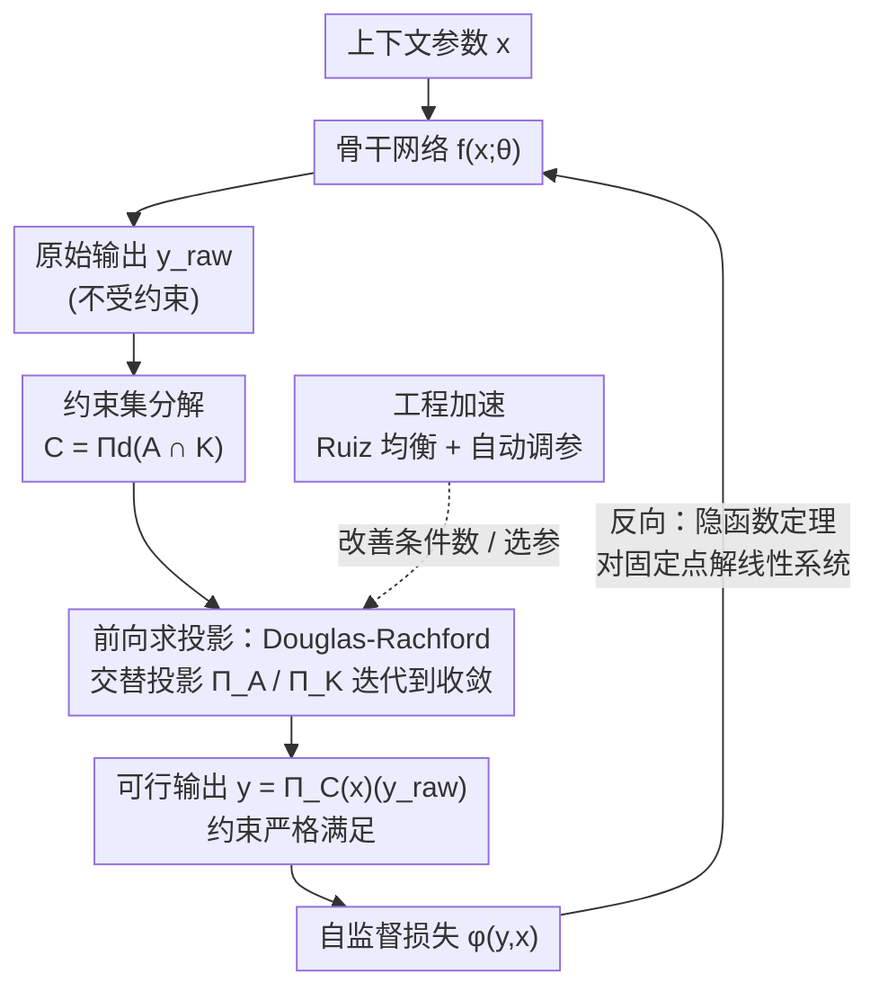

# Πnet: Optimizing Hard-Constrained Neural Networks with Orthogonal Projection Layers

**会议**: ICLR 2026 (Oral)  
**arXiv**: [2508.10480](https://arxiv.org/abs/2508.10480)  
**代码**: [github.com/antonioterpin/pinet](https://github.com/antonioterpin/pinet)  
**领域**: 优化 (Optimization) / 约束神经网络  
**关键词**: 硬约束神经网络, 正交投影, 算子分裂, 隐函数定理, Douglas-Rachford

## 一句话总结

提出 Πnet 架构，通过在神经网络输出层附加基于 Douglas-Rachford 算子分裂的正交投影层来保证凸约束的严格满足，并利用隐函数定理进行高效反向传播，在训练时间、求解质量和超参数鲁棒性上大幅超越现有方法。

## 研究背景与动机

许多实际应用需要求解参数化约束优化问题：给定上下文（参数）$x$，求解 $\min_y \varphi(y,x)$ s.t. $y \in \mathcal{C}(x)$。这类问题在电力系统、物流调度、模型预测控制、运动规划等领域频繁出现。

### 现有方法的不足

**软约束方法**：在损失函数中添加约束违反的惩罚项。缺点是推理时无法保证约束满足，且惩罚系数的调节非常困难

**DC3**：通过等式完成和不等式校正强制可行性，但类似软约束，且超参数敏感

**循环展开（Loop Unrolling）**：如 Dykstra 投影方法的梯度需要通过所有迭代步反向传播，内存和计算成本极高

**cvxpylayers/JAXopt**：功能通用但缺乏针对投影问题的结构优化，训练时间较长

### 核心动机

能否设计一种 **"设计即可行"（feasible-by-design）** 的神经网络架构，使得输出在任何网络权重下都自动满足给定的凸约束？关键在于：如何高效地实现投影操作的前向传播，以及如何在投影操作上进行高效的反向传播？

## 方法详解

### 整体框架

Πnet 把"满足约束"这件事从损失函数里彻底剥离出来，交给一个挂在网络输出端的正交投影层。任意标准骨干网络 $f(x;\theta)$ 先针对上下文参数 $x$ 产出一个不受约束的原始输出 $y_{raw}$，投影层再把它正交投影到当前 $x$ 对应的可行集 $\mathcal{C}(x)$ 上，得到严格可行的 $y = \Pi_{\mathcal{C}(x)}(y_{raw})$。这个投影本身没有闭式解，所以投影层内部分两步走：先把一般凸约束**分解**成两个能闭式投影的子集，再用 **Douglas-Rachford 算子分裂**交替投影、迭代到收敛。训练时不沿迭代步反传，而是借助**隐函数定理**对收敛后的固定点直接求导，让梯度照常回到骨干网络；同时一套**工程加速**（矩阵均衡 + 自动调参）保证前向迭代又快又稳。这样输出在任意网络权重下都"设计即可行"，代价只是一层结构化的投影计算。

### 关键设计

**1. 约束集分解：把一般凸约束拆成两个能闭式投影的子集**

直接对一般凸集做投影没有闭式解，是整个投影层绕不开的拦路石。Πnet 把约束集写成 $\mathcal{C} = \Pi_d(\mathcal{A} \cap \mathcal{K})$ 的形式：$\mathcal{A}$ 是由矩阵 $A$、偏移 $b$ 定义的仿射子空间（超平面），$\mathcal{K} = \mathcal{K}_1 \times \mathcal{K}_2$ 是笛卡尔积形式的简单集合（如盒约束、二阶锥）。这两类子集各自的投影 $\Pi_\mathcal{A}$、$\Pi_\mathcal{K}$ 都有闭式解，复杂约束的投影因此被转化为对两个简单集合反复投影的迭代过程。值得强调的是，这种分解并非额外假设——任何凸集都能这样写（极端情况取平凡分解 $\mathcal{A}=\mathcal{C}$），高效的闭式投影只是分解带来的红利；而它已经覆盖了多面体、二阶锥、稀疏约束、单纯形以及它们的交集等绝大多数实际约束类型。

**2. 前向求投影：用 Douglas-Rachford 算子分裂交替投影**

有了上面的分解，投影问题就被重写成复合优化 $\min_z g(z) + h(z)$，其中 $g = \mathcal{I}_\mathcal{A}$ 是仿射约束的指示函数、$h = \|y - y_{raw}\|^2 + \mathcal{I}_\mathcal{K}$ 把目标与 $\mathcal{K}$ 约束合在一起。Douglas-Rachford 分裂正好交替利用这两块的闭式投影：$z_{k+1} = \Pi_\mathcal{A}(s_k)$ 做仿射投影、$t_{k+1} = \Pi_\mathcal{K}(\cdot)$ 做盒/锥投影、再用 $s_{k+1} = s_k + \omega(t_{k+1} - z_{k+1})$ 更新辅助变量，松弛系数 $\omega$ 控制步长。在严格可行性条件下这组迭代收敛到真实投影，且每步只含闭式投影和向量运算，天然适合在 GPU 上批量执行。

**3. 反向：用隐函数定理替代循环展开**

投影层要能训练，梯度就得穿过这一串迭代回到骨干网络。如果像 Dykstra 那样把梯度沿着所有迭代步反传（loop unrolling），内存和计算都会随迭代数线性爆炸。Πnet 注意到前向迭代收敛到的是一个固定点 $s_\infty(y_{raw}) = \Phi(s_\infty(y_{raw}), y_{raw})$，满足隐函数定理的条件，于是反向传播不必关心前向迭代了多少步，只需解一个线性系统 $(I - \partial\Phi/\partial s)^\top \xi = v$。该系统用 bicgstab 迭代法求解，单步成本与前向传播一步相当，从而把反传开销与前向迭代数彻底解耦——这正是 Πnet 训练比循环展开类方法快上一两个数量级的根本原因。

**4. 工程加速：矩阵均衡 + 自动调参让前向迭代又快又稳**

前面的迭代收敛快慢，几乎全看仿射矩阵 $A$ 的条件数和几个超参数选得好不好，这一点恰恰决定了方法是否实用。Πnet 在投影前对 $A$ 做 Ruiz 均衡化，即用对角缩放 $D_r A D_c$ 把行列范数拉平、压低条件数，使同样精度下所需的前向迭代步数明显减少；同时它把真正需要调的少数参数（缩放因子 $\sigma$、松弛系数 $\omega$、迭代次数）交给一套自动流程，在验证集的一个子集上评估各配置的投影质量并择优。两者叠加的效果在消融里很直观：加均衡后每 batch 推理时间从 1.89s 降到 0.28s、求解质量同时改善；而正是自动调参，让它在 DC3 因默认参数在大问题上发散的场景下，几乎不用人工干预就能稳定工作。

### 损失函数 / 训练策略

训练采用自监督损失，直接优化原始目标 $\mathcal{L}(y,x) = \varphi(y,x)$，整个过程可理解为在原始输出空间上做投影梯度下降。一个关键决策是在训练阶段就启用约束层，而非只在推理时附加：一方面某些问题在无约束时目标会发散，另一方面无约束最优解的投影点通常并不是约束最优解，提前引入约束等于给网络注入一个有益的归纳偏置，帮助它直接学习可行解的分布。

## 实验关键数据

### 主实验

在凸和非凸基准问题（DC3 benchmark）上的对比：

| 方法 | 相对次优性 (RS) | 约束违反 (CV) | 单实例推理时间 | 批量推理时间 |
|------|----------------|--------------|--------------|-------------|
| Πnet | ≤5% (大多数) | <10⁻⁵ | 0.0056s | 0.013s |
| DC3 | 较差，尤其大问题 | 大问题上较大 | 0.0019s | 0.002s |
| JAXopt | 与Πnet相当 | 与Πnet相当 | 0.0134s | 0.137s |
| Solver (IPOPT) | 最优 | 0 | 0.034s | 41.7s |

### 训练效率

| 方法 | 训练轮数 | 训练时间 |
|------|---------|---------|
| Πnet | 50 epochs | 秒级 |
| DC3 | 1000 epochs | 较长 |
| JAXopt | 12 epochs | 大问题需约14小时 |

### 消融实验

| 配置 | RS | CV | 推理时间 |
|------|----|----|---------|
| Default (无均衡，默认参数) | 一般 | 较差 | 0.55s/batch |
| Auto (自动调优，无均衡) | 改善 | 改善 | 1.89s/batch |
| Πnet (自动调优+均衡) | 最优 | 最优 | 0.28s/batch |

### 关键发现

1. **约束满足可靠**：Πnet 在所有实验中始终保持极低的约束违反（<10⁻⁵），而 DC3 在大问题上约束违反严重
2. **训练极快**：50 个 epoch 即可达到满意性能，比 DC3(1000) 和 JAXopt 快一到两个数量级
3. **超参数鲁棒**：DC3 对超参数极为敏感（默认参数在大问题上发散），Πnet 配合自动调优几乎不需要手动调参
4. **多车运动规划应用**：成功处理了最多 15 辆车、750 步的运动规划问题（约9000变量和约束），证明了实际可扩展性
5. **二阶锥约束**：成功扩展到二阶锥约束，RS 和 CV 均低于 10⁻⁶

## 亮点与洞察

1. **方法论清晰**：核心思想简洁——投影+隐函数定理，但通过精心的工程实现（均衡化、自动调优等）达到了卓越的实际性能
2. **约束即归纳偏置**：训练时启用约束不是障碍而是优势，约束帮助网络更好地学习可行解的分布
3. **模块化设计**：投影层可直接附加到任意骨干网络上，无需修改网络架构
4. **JAX + GPU**：提供了高效的GPU-ready开源实现
5. **通用性强**：支持多种约束类型的组合（多面体+锥+稀疏），通过统一的分解框架处理

## 局限与展望

1. **仅限凸约束集**：当前框架要求 $\mathcal{C}(x)$ 为凸集，对非凸约束需要额外处理（如序列凸化）
2. **分解的选择**：不同的 $\mathcal{A}, \mathcal{K}$ 分解会影响效率，目前没有全自动的最优分解策略
3. **碰撞避免**：多车运动规划应用中约束是解耦的（车辆间独立），未处理碰撞避免等耦合非凸约束
4. **大规模问题**：虽然展示了9000变量的案例，但更大规模问题的可扩展性未充分验证
5. **与强化学习的结合**：仅初步展示了人类偏好优化的概念验证，更深入的RL集成值得探索

## 相关工作与启发

- **DC3 (Donti et al., 2021)**：最主要的比较基线，使用等式完成+不等式校正，但本质上是软约束
- **RAYEN (Tordesillas, 2023)**：通过缩放线段方式恢复可行性，但需昂贵的离线预处理
- **cvxpylayers/JAXopt**：通用可微凸优化层，但缺乏针对投影问题的结构优化
- **LinSATNet/GLinSAT**：仅限特定约束类型（非负线性/有界约束）

### 对研究的启发

1. 利用问题结构（投影 vs 一般优化）可以实现数量级的效率提升
2. 硬约束可以作为神经网络的有益归纳偏置，而非仅仅是需要满足的约束
3. 工程细节（矩阵均衡、自动调优）对实际性能至关重要

## 评分

- 新颖性: ⭐⭐⭐⭐ — Douglas-Rachford + 隐函数定理的组合虽非全新，但在HCNN中的系统化应用和工程优化是重要贡献
- 实验充分度: ⭐⭐⭐⭐⭐ — 从基准测试到实际应用（运动规划），从消融到超参数分析非常全面
- 写作质量: ⭐⭐⭐⭐⭐ — 结构清晰，附录详尽，口头报告级别的论文
- 价值: ⭐⭐⭐⭐⭐ — 提供了GPU-ready的开源工具包，对PDE求解、机器人、调度等领域有广泛影响

<!-- RELATED:START -->

## 相关论文

- [\[CVPR 2026\] SCOPE: Semantic Coreset with Orthogonal Projection Embeddings for Federated learning](../../CVPR2026/optimization/scope_semantic_coreset_with_orthogonal_projection_embeddings_for_federated_learn.md)
- [\[ICML 2026\] Balancing Learning Rates Across Layers: Exact Two-Step Dynamics and Optimal Scaling in Linear Neural Networks](../../ICML2026/optimization/balancing_learning_rates_across_layers_exact_two-step_dynamics_and_optimal_scali.md)
- [\[AAAI 2026\] Beyond the Mean: Fisher-Orthogonal Projection for Natural Gradient Descent in Large Batch Training](../../AAAI2026/optimization/beyond_the_mean_fisher-orthogonal_projection_for_natural_gradient_descent_in_lar.md)
- [\[ICLR 2026\] Entropic Confinement and Mode Connectivity in Overparameterized Neural Networks](entropic_confinement_and_mode_connectivity_in_overparameterized_neural_networks.md)
- [\[ICLR 2026\] Neural Networks Learn Generic Multi-Index Models Near Information-Theoretic Limit](neural_networks_learn_generic_multi-index_models_near_information-theoretic_limi.md)

<!-- RELATED:END -->
