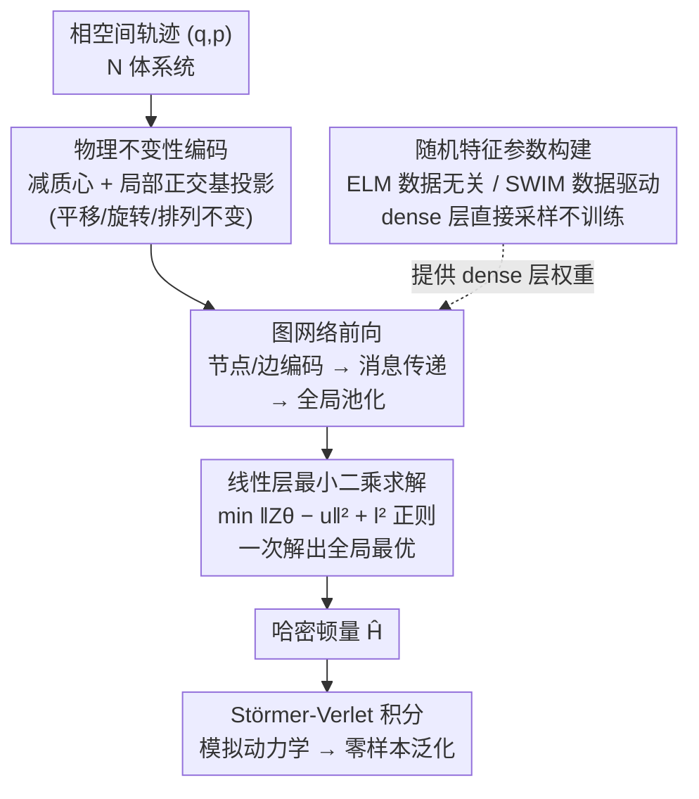

# Rapid Training of Hamiltonian Graph Networks using Random Features

**会议**: ICLR 2026  
**arXiv**: [2506.06558](https://arxiv.org/abs/2506.06558)  
**代码**: [GitLab](https://gitlab.com/fd-research/swimhgn)  
**领域**: 物理模拟 / 图神经网络  
**关键词**: Hamiltonian Graph Networks, Random Features, N-body Simulation, Zero-shot Generalization, Gradient-free Training

## 一句话总结

本文提出 RF-HGN，通过随机特征采样（ELM/SWIM）构建 dense 层参数并求解线性最小二乘问题来训练哈密顿图网络，完全绕过梯度下降迭代优化，在 N 体物理系统上实现 150-600 倍加速，同时保持可比精度和强零样本泛化能力。

## 研究背景与动机

**领域现状**：数据驱动建模物理系统是一个核心挑战，结合物理先验（如哈密顿力学）与图神经网络（GNN）是当前主流范式。哈密顿图网络（HGN）通过图结构编码 N 体系统的拓扑关系，配合哈密顿方程约束，能产生精确、排列不变的动力学预测。

**现有痛点**：训练图网络极其缓慢。GNN 的反向传播涉及不规则内存访问和负载不均衡，且物理模型对超参数敏感。当模型架构中包含数值积分器（如 Störmer-Verlet）时，训练难度进一步加剧。15 种常用优化器（Adam、LBFGS 等）在 3D lattice 系统上需要 23-96 秒训练，远不能满足大规模系统快速原型的需求。

**核心矛盾**：GNN 的物理归纳偏置（图结构 + 哈密顿约束）虽然提升了模型质量，但这些结构约束使得基于梯度的迭代优化变得更加困难和耗时。精度与训练效率之间存在根本性的张力。

**本文目标** (1) 如何在不牺牲精度的前提下大幅加速 HGN 训练？(2) 如何在图网络中融入随机特征方法同时保持物理不变性？(3) 训练后的模型能否零样本泛化到远超训练规模的系统？

**切入角度**：随机特征（Random Features）方法近年在近似物理系统方面展现出潜力，但尚未应用于图网络。核心观察是 HGN 的架构可以分为两部分——非线性 dense 层和线性输出层。如果 dense 层参数可以通过随机采样确定，那么训练就简化为一个凸的线性最小二乘问题。

**核心 idea**：用随机特征采样构建 HGN 的 dense 层参数，将非凸网络训练转化为凸线性系统求解，实现无梯度下降的超快训练。

## 方法详解

### 整体框架

RF-HGN 的 pipeline 分为三个阶段：(1) **不变性编码**：将 N 体系统的位置和动量转换为平移、旋转不变的坐标表示；(2) **图网络前向**：通过节点/边编码、消息传递和全局池化得到图级表示；(3) **随机特征训练**：dense 层参数由随机采样确定（ELM 或 SWIM），线性输出层通过最小二乘法求解。输入为相空间轨迹 $(q, p) \in \mathbb{R}^{2d \cdot N}$，输出为标量哈密顿量 $\hat{\mathcal{H}}$，推理时通过 Störmer-Verlet 积分器模拟动力学。关键在于把图网络拆成「非线性 dense 层 + 线性输出层」两半：前者用随机采样跳过训练，后者塌缩成凸的线性求解，整条训练链路就此摆脱梯度下降。

### 关键设计

**1. 物理不变性编码：把坐标洗成平移/旋转/排列不变，省去模型学冗余对称性**

物理系统的能量不该因为观察者换个参考系就改变，但原始坐标 $(q,p)$ 里塞满了这种冗余自由度，逼着网络白白浪费容量去学对称性、也推高了数据需求。RF-HGN 在入口处就把它们消掉：平移不变性靠减质心 $q_i \leftarrow q_i - \frac{1}{N}\sum_{i=1}^{N}q_i$；旋转不变性则构建一个局部正交基——挑离质心最近的节点定下第一基向量 $e_1 = q_1/\|q_1\|$，再用旋转（2D）或 Gram-Schmidt 正交化（高维）补齐成完整正交矩阵 $\mathcal{B}$，把所有坐标投影到这个局部坐标系 $\bar{q}_i = \mathcal{B}^T q_i$。排列不变性则不用额外处理，图结构加上消息传递的求和聚合天然就有。这样网络看到的输入已经是规范化的不变表示，要学的东西更少，也更省数据。

**2. 随机特征参数构建（ELM 与 SWIM）：dense 层权重直接采样，把非凸训练绕过去**

这是全篇的核心机制。HGN 的所有 dense 层（节点编码器 $\phi_V$、边编码器 $\phi_E$、消息构建器 $\phi_M$）本来要靠梯度下降一步步拟合，正是慢和不稳定的根源。RF-HGN 干脆不训练它们，而是直接采样出权重和偏置。两种采样方式各有取舍：**ELM**（数据无关）最简单，权重 $W$ 从标准正态分布采、偏置 $b$ 从均匀分布采，完全不看数据；**SWIM**（数据驱动）则更聪明，从输入数据里随机取两个点 $(x^{(1)}, x^{(2)})$，按

$$w_i = s_1(x^{(2)}_i - x^{(1)}_i)\|x^{(2)}_i - x^{(1)}_i\|^{-2}, \quad b_i = -\langle w_i, x^{(1)}_i \rangle - s_2$$

构造参数（$(s_1, s_2)$ 是激活函数相关的常数）。这个构造让每个超平面正好"卡"在数据中两个点之间需要区分的位置上，等于把数据分布的先验直接编码进了随机过程，所以后面实验里 SWIM 比 ELM 普遍高一两个数量级。无论哪种采样，dense 层参数一旦固定，整个非凸优化问题就塌缩成一个线性系统，梯度消失/爆炸和局部最优的麻烦也一并消失。

**3. 线性层最小二乘求解：唯一要"训"的输出层是凸问题，一次解出全局最优**

dense 层既然被采样固定，网络里就只剩线性输出层需要优化，而它恰好是凸的。RF-HGN 把它写成线性系统 $Z \cdot \theta_L = u$ 求解：$Z$ 由全局池化层输出的梯度 $\nabla\Phi(y)$ 和哈密顿方程约束拼成，$u$ 携带时间导数信息 $J^{-1}\dot{y}$。最终用带 $l^2$ 正则化的最小二乘法一次解出 $\theta_L$，既保证全局最优、又没有迭代。它的时间复杂度只有 $\mathcal{O}(K d_L^2)$，且对数据量 $M$、粒子数 $N$、空间维度 $d$ 都是线性的——训练成本随系统规模线性增长，这正是它能把大系统训得动的关键。

### 损失函数 / 训练策略

训练目标是最小化哈密顿方程残差的 $l^2$ 范数：$\min_{\theta_L}\|Z\theta_L - u\|^2$。训练数据为相空间轨迹及其时间导数（或纯时间序列数据）。仅需一个已知的哈密顿量真值 $\mathcal{H}(y_0)$ 来固定积分常数。训练过程无需超参数调优（学习率、epoch 数等），仅有 dense 层宽度和正则化常数两个参数。

## 实验关键数据

### 主实验：优化器对比

| 优化器 | Test MSE | 训练时间 (s) | 加速比 |
|--------|----------|-------------|--------|
| **RF-HGN (SWIM)** | **8.95e-5** | **0.16** | **—** |
| LBFGS | 3.56e-5 | 23.85 | 149× |
| Adam | 2.90e-3 | 91.64 | 572× |
| AdamW | 2.91e-3 | 92.15 | 576× |
| Adafactor | 2.41e-3 | 96.36 | 602× |
| SGD | 2.36e-2 | 91.75 | 573× |

RF-HGN 在 3D lattice 系统上比 15 种 PyTorch 优化器快 148-602 倍，精度仅略低于二阶优化器 LBFGS。

### 消融与泛化实验

| 设置 | 位置 MSE (最终) | 说明 |
|------|----------------|------|
| SWIM RF-HGN, 训练 3×3, 测试 100×100 | 低误差 | 零样本泛化成功 |
| ELM RF-HGN, 训练 3×3, 测试 100×100 | 中等误差 | SWIM 优于 ELM 约一个数量级 |
| 训练 2×2, 测试 100×100 | 高误差 | 2×2 系统边缘情况，缺少 4 度节点 |
| RF-HNN (非图), 训练 8, 测试 8 | 较高误差 | 图架构精度高 1-2 个数量级 |

| 势函数 | Adam HGN | ELM RF-HGN | SWIM RF-HGN |
|--------|----------|------------|-------------|
| 弹簧 $V(r)=\frac{1}{2}\beta r^2$ | 3.88e-3 | 2.33e-3 | **3.41e-5** |
| 非谐振子 | 4.56e-2 | 4.32e-2 | **5.23e-4** |
| Morse 势 | 8.89e-2 | **7.40e-4** | 1.22e-3 |

### 关键发现

- **SWIM 显著优于 ELM**：SWIM 利用数据分布信息放置超平面，在几乎所有实验中精度高一到两个数量级
- **零样本泛化极强**：仅用 $2^3=8$ 节点训练，可准确预测 $2^{12}=4096$ 节点系统的动力学；3×3 lattice 训练可泛化至 100×100
- **与 NeurIPS 2022 benchmark 对比**：RF-HGN 训练时间仅 2-5 秒，而其他物理 GNN（FGNN、LGN 等）需要 400-53000 秒
- **复杂势函数适用**：非谐振子和 Morse 势等非线性力场也能被 RF-HGN 合理近似，仍保持 200-300 倍加速

## 亮点与洞察

- **无梯度训练范式转换**：将神经网络训练从非凸迭代优化转化为凸线性求解，这是一个根本性的思路转变。对于结构化的物理模型，这种方法可能比传统深度学习训练更优，因为物理约束已经限定了解空间
- **SWIM 数据驱动采样的巧妙性**：SWIM 不是盲目采样，而是从数据对中构造超平面参数，使激活函数的"切换区域"精确对齐数据的变化梯度。这种采样策略将先验知识（数据分布）编码进了随机过程
- **零样本泛化的实用价值**：在小系统上训练 → 在大系统上部署，这在分子动力学模拟中极有价值，因为大系统的训练数据生成本身就很昂贵

## 局限与展望

- **图类型受限**：训练于链状图的模型无法泛化到 lattice 图（边度数不同），零样本泛化仅限同类型图结构
- **动态边场景效果一般**：分子动力学中使用截断距离定义的动态边约 10% 相对误差，所有优化器均如此
- **不支持多层消息传递**：当前仅使用单层消息传递，未来需要探索随机特征增强（RF boosting）来支持更深架构
- **小图场景非最优**：对于很小的系统，全连接的 HNN 架构训练更快，图结构的开销反而成为负担

## 相关工作与启发

- **vs Adam-trained HGN**: RF-HGN 训练快 100-600 倍，精度在弹簧系统上可比，在复杂势函数上略有损失但仍在合理范围
- **vs RF-HNN (Rahma et al., 2024)**: RF-HNN 仅适用于小系统且无图结构，RF-HGN 扩展到图架构后获得了排列不变性和零样本泛化能力，精度高 1-2 个数量级
- **vs Echo State Graph Networks**: 类似的随机权重思路，但 RF-HGN 专门为物理系统设计，集成了哈密顿约束和物理不变性

## 评分

- 新颖性: ⭐⭐⭐⭐ 首次将随机特征方法引入物理信息图网络，范式转换有意义
- 实验充分度: ⭐⭐⭐⭐⭐ 15 种优化器对比、多种势函数、零样本泛化、NeurIPS benchmark 复现，非常全面
- 写作质量: ⭐⭐⭐⭐ 结构清晰，理论推导完整，图表质量高
- 价值: ⭐⭐⭐⭐ 对物理模拟社区极有价值，但受限于特定的图网络架构类型

<!-- RELATED:START -->

## 相关论文

- [\[NeurIPS 2025\] Training Robust Graph Neural Networks by Modeling Noise Dependencies](../../NeurIPS2025/optimization/training_robust_graph_neural_networks_by_modeling_noise_dependencies.md)
- [\[ICLR 2026\] SCRAPL: Scattering Transform with Random Paths for Machine Learning](scrapl_scattering_transform_with_random_paths_for_machine_learning.md)
- [\[ICLR 2026\] Entropic Confinement and Mode Connectivity in Overparameterized Neural Networks](entropic_confinement_and_mode_connectivity_in_overparameterized_neural_networks.md)
- [\[ICLR 2026\] Directional Sheaf Hypergraph Networks: Unifying Learning on Directed and Undirected Hypergraphs](directional_sheaf_hypergraph_networks_unifying_learning_on_directed_and_undirect.md)
- [\[ICML 2025\] Random Feature Representation Boosting](../../ICML2025/optimization/random_feature_representation_boosting.md)

<!-- RELATED:END -->
