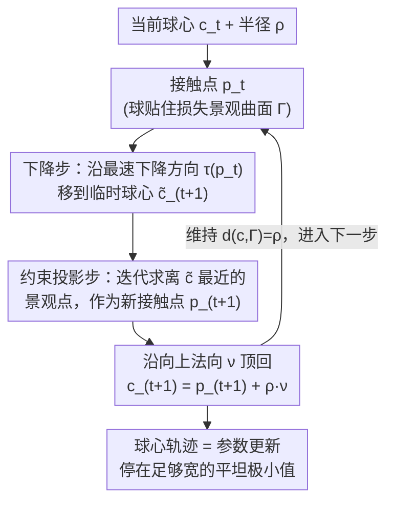

# Rolling Ball Optimizer: Learning by Ironing Out Loss Landscape Wrinkles

**会议**: ICLR 2026  
**arXiv**: [2505.19527](https://arxiv.org/abs/2505.19527)  
**领域**: 优化  
**关键词**: 优化器, 损失景观, 滚球, 平滑效应, 泛化  

## 一句话总结

提出 Rolling Ball Optimizer (RBO)，通过模拟有限半径刚性球在损失景观上的滚动运动来打破传统优化器的空间局部性，实现对损失函数的平滑效应（ironing property），在 MNIST 和 CIFAR-10/100 上展示了更好的收敛速度和泛化性能。

## 研究背景与动机

深度学习模型的训练本质上是最小化高维、数据依赖的损失函数。这些函数的优化景观通常极其复杂：

- 大量伪局部极小值（部分很尖锐）
- 病态山谷和鞍点
- 甚至具有分形结构
- 训练数据中的噪声会传播至景观的细粒度几何结构

**现有优化器的根本局限——"点状"本质**：

所有主流优化器（SGD、Adam、HeavyBall、NAG 等）都表现为损失景观上的"质点"运动，即它们仅依赖当前位置的局部信息（梯度）进行更新。这种**空间局部性**带来三重后果：对微观结构过度敏感，任意小的损失扰动（包括数据噪声引起的扰动）都会引起响应；对宏观结构无感，无法捕捉景观的全局几何特征；因而容易陷入尖锐极小值、病态山谷或鞍点。

SAM 和 Entropy-SGD 虽然放弃了空间局部性，但仅关注避免尖锐极小值，忽略了损失景观的其他几何特性。

## 方法详解

### 整体框架

RBO 把传统优化器在损失景观上滑动的"质点"换成一个有限半径 $\rho > 0$ 的刚性球，让球沿景观表面滚动，球心轨迹就是参数更新轨迹。每一步迭代分两步走：先沿当前接触点的最速下降方向把球心往低处推一小步，得到一个临时球心；这一步会破坏"球贴着景观"的几何关系，于是再做一次约束投影，把球心拉回到"到景观距离恰为 $\rho$"的约束面上，并定出新的接触点。两步交替推进，球就贴着地面滚了起来。半径 $\rho$ 是唯一控制感知粒度的旋钮——它既决定球能跳过多细的褶皱，也在理论上保证了下面要讲的平滑（ironing）效应与尖锐极小值不可达。

### 关键设计

**1. 有限半径刚性球：用尺度过滤掉细粒度噪声**

所有主流优化器都只看当前位置的局部梯度，因此对景观上任意小的扰动都敏感，容易被数据噪声诱导出的尖刺、病态山谷和鞍点困住。RBO 改用半径 $\rho$ 的球体，球的动力学只响应与 $\rho$ 成比例的景观特征尺度：比 $\rho$ 小得多的噪声压根托不起球、不影响轨迹，比球窄的尖锐极小值和病态山谷也"容纳"不下球体，于是被自然跳过。调大 $\rho$ 就让优化器看得更"粗"、只感知宏观地形，调小 $\rho$ 则退化回接近点状优化器，粒度因此可连续调节。

**2. 下降—投影交替更新：把球贴着景观滚起来**

这是把上面的"滚球"落成可执行算法的核心。一次迭代分两步：下降步类似梯度下降，沿接触点 $p_t$ 处的最速下降方向 $\tau(p_t)$ 把球心移到临时位置 $\tilde{c}_{t+1} = c_t - \eta \tau(p_t)$，其中 $p_t$ 是球与损失景观曲面 $\Gamma$ 的接触点。但这一步会破坏"球贴着景观"的几何关系，于是约束投影步通过

$$p_{t+1} = \arg\min_{p \in \Gamma} \|p - \tilde{c}_{t+1}\|^2$$

找到离临时球心最近的景观点作为新接触点，再沿该点向上单位法向量 $\nu(p_{t+1})$ 把球心顶回 $c_{t+1} = p_{t+1} + \rho \nu(p_{t+1})$。这套机制维持的核心不变式是球心到景观的距离恒等于半径，即 $\forall t \geq 0,\ d(c_t, \Gamma) = \inf_{p \in \Gamma} \|p - c_t\| = \rho$。投影本身没有闭式解，用迭代 $\theta^{(k+1)} = \theta^{(k)} - \gamma[\theta^{(k)} - \tilde{\theta} + (f(\theta^{(k)}) - \tilde{y}) \nabla f(\theta^{(k)})]$ 逐步逼近。正是这步求解会探查接触点周围更大范围的景观，使更新不再只依赖单点梯度——这也是 RBO 区别于梯度下降、真正打破空间局部性的地方。

**3. Ironing property：用半径在数学上"熨平"景观**

这一性质刻画了 RBO 为什么能忽略局部结构。弱 ironing（Lemma）证明对任意连续有界扰动 $\phi: \mathbb{R}^d \to \mathbb{R}$，当 $\rho \to +\infty$ 时球心轨迹所在的偏移流形趋于常数，等价于景观被完全熨平；线性 ironing（Proposition）进一步给出可控版本：对仿射函数 $f$ 叠加有界扰动 $\phi$ 的复合景观，只要 $\rho$ 足够大，RBO 在扰动景观上的行为就近似等同于在纯仿射景观上的行为。换句话说，半径越大，球看到的就越接近被抹平后的"底色"地形，扰动带来的褶皱被熨掉。更一般的强 ironing（对任意连续函数）目前仍是未证明的猜想。

**4. 不可达点理论：尖锐极小值自动被规避**

这条理论把"球进不去窄坑"量化成可计算的条件：若景观上某点的 Hessian 谱范数为 $\sigma = \|\nabla^2 f(\theta_0)\|$，则当 $\rho > 1/\sigma$ 时该点对 RBO 不可达。曲率越大（坑越尖）的极小值，只需越小的 $\rho$ 就足以规避；而且不可达点具有开集性质——一个点不可达，它的邻域也不可达，因此整片尖锐区域会被成片排除，球只会停在足够"宽"的平坦极小值里，这与好泛化偏好平坦解的经验一致。

## 实验关键数据

### 主实验：测试集性能对比

| 数据集/模型 | SGD (Acc) | Entropy-SGD (Acc) | SAM (Acc) | **RBO (Acc)** |
|------------|-----------|-------------------|-----------|---------------|
| MNIST/MLP | 91.77% | 95.22% | 97.22% | **97.51%** |
| MNIST/ResNet-6 | 97.59% | 98.18% | **99.11%** | 99.07% |
| MNIST/VGG-9 | 98.78% | 98.57% | **99.39%** | 99.27% |
| CIFAR-10/ResNet-8 | 56.54% | 59.16% | 69.09% | **71.58%** |
| CIFAR-10/VGG-9 | 66.04% | 65.46% | 77.81% | **81.87%** |
| CIFAR-100/ResNet-8 | 19.28% | 28.33% | 36.26% | **37.11%** |
| CIFAR-100/VGG-9 | 29.37% | 28.98% | 47.17% | **50.07%** |

### 半径 $\rho$ 对性能的影响（MNIST/MLP, 3 epochs）

| $\rho$ 范围 | 学习率范围 | 观察 |
|-------------|-----------|------|
| 0.1 - 1.0 | 0.001 - 1.0 | 微观区域，接近点状优化器 |
| 1.0 - 5.0 | 0.01 - 50 | 宏观区域，最佳性能 |
| > 10 | > 100 | 超宏观区域，可能不稳定 |

### 关键实验发现

1. RBO 在精度上全面超越 SGD 和 Entropy-SGD，与 SAM 互有胜负（精度更优，损失值 SAM 更优）
2. 收敛速度极快：在 CIFAR-10/100 上，RBO 用一半 epoch 就达到其他优化器的最终训练性能
3. RBO 可以稳定使用极大的学习率（$\eta = 6$, 甚至 $\eta = 100$），而 SGD 仅能使用 $\eta = 0.01$
4. 性能随 $\rho$ 和 $\eta$ 的增大单调提升，直到进入"超宏观"不稳定区域

## 亮点与洞察

1. **物理直觉优美**：用刚体球滚动替代质点运动的类比直观且深刻——就像汽车车轮感受不到普朗克尺度的路面变化，大球自然忽略细粒度噪声
2. **理论创新**：ironing property 和不可达点理论为优化器的非局部性提供了严格的数学刻画
3. **极端学习率稳定性**：RBO 在 $\eta = 100$ 下仍稳定，这在传统优化器中不可想象
4. **实验设计诚实**：作者明确表示未针对任何实验调参，结果非 RBO 的最优表现
5. **灵感来源有趣**：算法借鉴了 "Marble Marcher" 开源游戏中的球体运动物理模拟

## 局限性

1. **计算开销大**：约束投影步骤需要额外的迭代优化，计算成本远高于 SGD
2. **理论不完整**：强 ironing 猜想（对任意连续函数的一般化）尚未证明
3. **实验规模有限**：仅在 MNIST 和 CIFAR-10/100 上测试，使用的模型结构也偏小（MLP, ResNet-6/8, VGG-9）
4. **高维问题存疑**：投影步骤的近似误差可能随维度增加而累积，维度灾难的影响未知
5. **验证集性能优势不够突出**：训练集表现极佳，但验证集性能提升不如预期显著
6. 仅使用 10 个 epoch 的短训练实验，长期训练行为未知

## 评分

- **新颖性**: ⭐⭐⭐⭐⭐ — 从物理模拟角度重新思考优化器设计，极具创意
- **实验**: ⭐⭐⭐ — 实验结果有说服力但规模偏小，缺少大模型/大数据验证
- **写作**: ⭐⭐⭐⭐ — 物理直觉清晰，理论推导严谨，图示优美
- **价值**: ⭐⭐⭐⭐ — 开辟了非局部优化器的新方向，但实际应用还需克服计算成本

<!-- RELATED:START -->

## 相关论文

- [\[CVPR 2026\] Globscope: Toward a Global View of the Loss Landscape](../../CVPR2026/optimization/globscope_toward_a_global_view_of_the_loss_landscape.md)
- [\[ICLR 2026\] Convex Dominance in Deep Learning I: A Scaling Law of Loss and Learning Rate](convex_dominance_in_deep_learning_i_a_scaling_law_of_loss_and_learning_rate.md)
- [\[ICML 2026\] Sharp Description of Local Minima in the Loss Landscape of High-Dimensional Two-Layer ReLU Networks](../../ICML2026/optimization/sharp_description_of_local_minima_in_the_loss_landscape_of_high-dimensional_two-.md)
- [\[ICLR 2026\] Optimizer Choice Matters for the Emergence of Neural Collapse](optimizer_choice_matters_for_the_emergence_of_neural_collapse.md)
- [\[ICML 2026\] Taming the Loss Landscape of PINNs with Noisy Feynman-Kac Supervision: Operator Preconditioning and Non-Asymptotic Error Bounds](../../ICML2026/optimization/taming_the_loss_landscape_of_pinns_with_noisy_feynman-kac_supervision_operator_p.md)

<!-- RELATED:END -->
