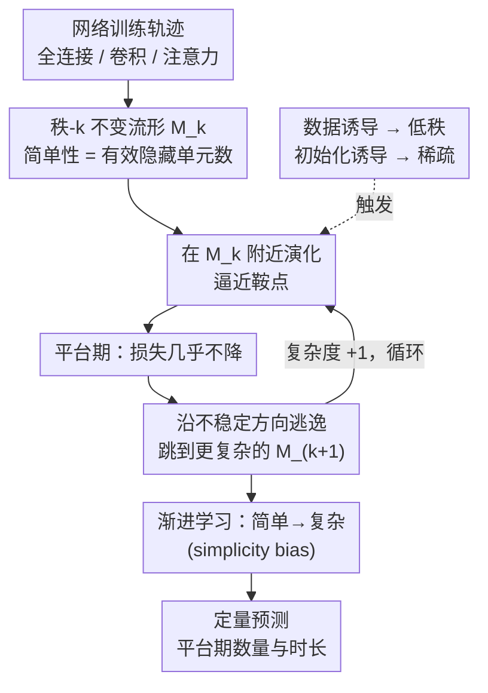

# Saddle-to-Saddle Dynamics Explains A Simplicity Bias Across Neural Network Architectures

**会议**: ICLR 2026  
**arXiv**: [2512.20607](https://arxiv.org/abs/2512.20607)  
**代码**: 无  
**领域**: 优化理论 / 深度学习理论  
**关键词**: simplicity bias, saddle-to-saddle dynamics, 神经网络学习动力学, 不变流形, 梯度下降

## 一句话总结

提出统一的理论框架，通过 saddle-to-saddle 学习动力学解释多种神经网络架构（全连接、卷积、注意力）中普遍存在的 simplicity bias——即梯度下降倾向于先学习简单解再逐步学习复杂解的现象。

## 研究背景与动机

Simplicity bias（简单性偏差）是深度学习中广泛观察到的现象：神经网络在训练过程中倾向于先学习"简单"的解，然后随着训练进行逐步学习更复杂的解。这种行为在多种架构中均有观察：

**现象描述**：
   - 线性网络先学低秩解，再逐步增加秩
   - ReLU 网络先学少量"折点（kinks）"的解，再增加折点
   - 卷积网络先使用少量卷积核，再逐步激活更多核
   - 注意力模型先使用少量注意力头，再逐步利用更多头

**现有理论的不足**：
   - 尽管 simplicity bias 在实验中广泛报告，但现有理论分析是碎片化的——各架构有各自独立的分析，缺乏统一框架
   - 线性网络的低秩偏差已有较深入研究，但 ReLU、CNN、Transformer 的 simplicity bias 缺乏理论解释
   - 数据分布 vs. 初始化对 simplicity bias 的影响未被清楚区分

**saddle-to-saddle 动力学**：
   - 梯度下降学习过程中经常出现"平台期"（plateaus）——损失在较长时间内几乎不变，然后突然快速下降
   - 这种阶梯式的学习行为与鞍点动力学密切相关
   - 但此前缺乏对这种动力学如何跨架构产生 simplicity bias 的统一理解

## 方法详解

### 整体框架

本文要回答的问题是：为什么从全连接、卷积到注意力，这些结构迥异的网络在梯度下降下都表现出"先简单后复杂"的学习节奏？作者的答案是把训练轨迹看成一场在损失景观里的"鞍点接力"。框架的搭建分三步：先把"简单"统一定义成"能用更少的有效隐藏单元表达"，并把每个复杂度档位形式化成一个秩-$k$ 不变流形；再证明梯度下降的轨迹会被困在这些流形附近，按"演化—停留—逃逸"的循环一级一级往上跳（saddle-to-saddle 动力学）；最后把这个机制拆成数据诱导和初始化诱导两条线，并用它定量预测学习曲线上会出现几个平台期、每个停多久。轨迹在某个低维流形上慢慢逼近一个鞍点、停留出一段平台期，再沿不稳定方向逃逸到下一个更复杂的流形——这一跳一停的节奏，正是 simplicity bias 的来源。

### 关键设计

**1. 统一简单性与秩-$k$ 不变流形：把"简单"锚定成一个干净的数学对象**

要跨架构谈"简单"，首先得让不同架构的"简单"可比。作者给出的统一口径是：**简单 = 能用更少的隐藏单元表达**——对全连接网络是隐藏神经元数量，对卷积网络是有效卷积核数量，对注意力网络是有效注意力头数量。这三者看似不同，但在参数空间里都对应同一种结构：低秩的权重矩阵（或等价的稀疏结构）。把这个口径形式化，就得到秩-$k$ 不变流形 $\mathcal{M}_k$——参数空间中权重矩阵秩恰好为 $k$ 的集合，对应"用 $k$ 个有效单元能实现的解"。作者证明在适当条件下梯度下降的轨迹会贴着这些流形附近演化，而它们天然形成嵌套结构 $\mathcal{M}_0 \subset \mathcal{M}_1 \subset \mathcal{M}_2 \subset \cdots$，每一层比前一层复杂一档（线性网络里是秩-$k$ 解空间，ReLU 网络里是有 $k$ 个活跃神经元的空间，CNN 里是有 $k$ 个活跃卷积核的空间）。这一步的关键在于：它把"轨迹现在处于哪个复杂度档位"这件含糊的事，化成了"轨迹贴在哪个 $\mathcal{M}_k$ 上"这个可分析的对象，后面的动力学才有地方落脚。

**2. Saddle-to-Saddle 动力学的形式化：一停一跳的循环产生渐进学习**

这是框架的核心机制，对应框架图里那个回环。作者证明梯度下降是按一个固定的循环在这些流形之间逐级攀升的：轨迹先在当前流形 $\mathcal{M}_k$ 附近演化，逼近该流形上的一个鞍点；在鞍点附近停留较长时间，损失几乎不下降，这就是训练曲线上看到的平台期；接着沿鞍点的不稳定方向（最大特征值对应的方向）逃逸，跳进下一个更复杂的流形 $\mathcal{M}_{k+1}$；然后在 $\mathcal{M}_{k+1}$ 上重复同样的"演化—停留—逃逸"过程。正是这种阶梯式的演化，让网络的复杂度一档一档地涨上去，自然解释了从简单到复杂的渐进学习——不需要任何外加的正则化来推动，simplicity bias 是梯度下降在这套景观里的固有产物。

**3. 数据诱导 vs. 初始化诱导：把 simplicity bias 拆成两个独立来源**

同样是 saddle-to-saddle 动力学，作者进一步指出它可以由两种不同的机制触发，效果也不同。一种是**数据诱导（data-induced）**：由数据的协方差结构决定，导致低秩权重，学习过程会从最大特征值方向开始、依次捕获数据中的主成分。另一种是**初始化诱导（initialization-induced）**：由权重初始化方式决定，导致稀疏权重，不同的初始化方案会决定哪些神经元/核/头先被激活。把这两条线分开，意义在于它们是可独立分离的——低秩来自数据、稀疏来自初始化，于是可以通过单独调整初始化来控制 simplicity bias 的表现，而不必动数据。

**4. 平台期的预测：从"为什么"升级到"什么时候、多久"**

前面三点解释了 simplicity bias 为什么发生，这一点则让框架具备定量预测力。作者给出两个可算的结论：平台期的**数量**等于网络能表达的有效复杂度级别数；平台期的**持续时间**则取决于数据的特征值间距（间距越大，平台越短）以及初始化的条件数。这意味着只要拿到数据的协方差谱和初始化方案，就能事先定量地预测整条学习曲线会呈现几个台阶、每个台阶停多久——把对 simplicity bias 的理解从"描述现象"推进到"预测曲线形状"。

### 损失函数 / 训练策略

本文是纯理论工作，分析的是标准梯度下降在均方误差等标准损失函数下的行为，不引入任何新的训练策略——它要做的恰恰相反，是为现有训练过程中已经观察到的平台期现象提供解释。相应地，理论推导在一定简化假设下成立，如小学习率、连续时间极限和特定的初始化分布。

## 实验关键数据

### 主实验

理论预测与实验验证（合成实验和小规模真实实验）：

| 架构 | Simplicity Bias 表现 | 理论预测 | 实验验证 |
|------|---------------------|---------|---------|
| 线性网络 | 秩逐步增加 | ✅ 预测平台期数/长度 | ✅ 吻合 |
| ReLU 网络 | kinks 数逐步增加 | ✅ 预测激活模式变化 | ✅ 吻合 |
| 卷积网络 | 活跃卷积核逐步增加 | ✅ 预测核激活顺序 | ✅ 吻合 |
| 注意力网络 | 活跃注意力头逐步增加 | ✅ 预测头激活顺序 | ✅ 吻合 |

### 消融实验

| 配置 | 关键指标 | 说明 |
|------|---------|------|
| 不同数据谱 | 平台期持续时间变化 | 特征值间距大 → 平台短 |
| 不同初始化方案 | 稀疏性模式变化 | 初始化决定了哪些单元先激活 |
| 学习率变化 | 动力学定性不变 | 小学习率近似下理论成立 |
| 不同隐藏层宽度 | 最大可达复杂度变化 | 宽度决定了能表达的最大秩 |

### 关键发现

1. **跨架构的统一机制**：全连接、卷积、注意力三种架构的 simplicity bias 都可以用相同的 saddle-to-saddle 框架解释
2. **数据 vs. 初始化的不同效应**：数据诱导的动力学导致低秩，初始化诱导的动力学导致稀疏——这两种效应是独立可分离的
3. **平台期可预测**：数据的协方差谱和初始化方案可以定量预测学习曲线的阶梯形状
4. **从简单到复杂是梯度下降的固有特性**：不需要特殊设计的正则化或训练策略

## 亮点与洞察

1. **统一框架的优雅性**：用一个数学工具（不变流形+鞍点动力学）解释了跨架构的普遍现象，而非为每种架构单独建模
2. **"简单性"的精确定义**：将模糊的"简单"概念精确化为"有效隐藏单元数"，使得不同架构可比
3. **因果分离的清晰性**：将 simplicity bias 的来源分解为数据效应（低秩）和初始化效应（稀疏），这种分解具有实际指导意义——例如可以通过调整初始化来控制 simplicity bias 的表现
4. **定量预测能力**：不仅解释了"为什么"会出现 simplicity bias，还能预测"什么时候"和"持续多久"——理论的预测力是其核心竞争力
5. **对实践的启示**：理解了 simplicity bias 的机制后，可以设计更智能的训练策略——例如自适应学习率来加速跨越平台期

## 局限与展望

1. **简化假设**：
    - 理论分析在小学习率、连续时间极限下进行，离散大学习率的情况更复杂
    - 对网络结构有一定限制（如单隐藏层或浅层分析）
    - 损失函数限于均方误差，交叉熵等损失的情况未完全覆盖

2. **规模局限**：
    - 实验验证主要在小规模网络和合成数据上进行
    - 对于 GPT 级别的大模型，saddle-to-saddle 动力学是否仍然是 simplicity bias 的主要解释机制有待验证

3. **与实际训练配置的差距**：
    - 实际训练中使用 Adam、学习率预热、Batch Normalization 等技术，这些可能改变动力学行为
    - 理论中假设的梯度流在 SGD 的噪声下会有偏差

4. **非线性交互**：
    - 注意力机制的分析可能简化了 softmax 的非线性效应
    - 卷积网络的分析假设了特定的核初始化条件

5. **扩展方向**：
    - 将框架推广到残差连接（ResNet）和 Transformer 的完整架构
    - 研究 simplicity bias 对泛化性能的定量影响
    - 连接 simplicity bias 与 double descent、grokking 等其他训练现象

## 相关工作与启发

- **线性网络理论**：Saxe et al. (2014, 2019) 对线性网络学习动力学的开创性工作是本文的直接基础
- **Simplicity bias 实证**：Shah et al. (2020) 等对 simplicity bias 的实验观察
- **损失景观分析**：Choromanska et al. (2015) 的鞍点分析和 Li et al. (2018) 的可视化工作
- **隐式正则化**：Gunasekar et al. (2017)、Arora et al. (2019) 等关于梯度下降隐式偏好低秩解的理论
- **启发**：saddle-to-saddle 框架可能为理解课程学习（curriculum learning）提供理论基础——课程学习本质上是人为加速 simplicity bias 的过程

## 评分

- **新颖性**: ⭐⭐⭐⭐⭐ — 首个跨架构统一的 simplicity bias 理论框架，贡献突出
- **实验充分度**: ⭐⭐⭐ — 理论为主的工作，实验主要是验证性的，规模有限
- **写作质量**: ⭐⭐⭐⭐ — 理论深度与可读性平衡得当，图示辅助理解
- **价值**: ⭐⭐⭐⭐⭐ — 对深度学习的基础理解具有重要推动作用

<!-- RELATED:START -->

## 相关论文

- [\[ICML 2026\] Asymmetric Perturbation in Solving Bilinear Saddle-Point Optimization](../../ICML2026/optimization/asymmetric_perturbation_in_solving_bilinear_saddle-point_optimization.md)
- [\[ICML 2026\] Balancing Learning Rates Across Layers: Exact Two-Step Dynamics and Optimal Scaling in Linear Neural Networks](../../ICML2026/optimization/balancing_learning_rates_across_layers_exact_two-step_dynamics_and_optimal_scali.md)
- [\[NeurIPS 2025\] Escaping Saddle Points without Lipschitz Smoothness: The Power of Nonlinear Preconditioning](../../NeurIPS2025/optimization/escaping_saddle_points_without_lipschitz_smoothness_the_power_of_nonlinear_preco.md)
- [\[ICLR 2026\] Gradient-Sign Masking for Task Vector Transport Across Pre-Trained Models](gradient-sign_masking_for_task_vector_transport_across_pre-trained_models.md)
- [\[ICLR 2026\] Implicit Bias of Per-sample Adam on Separable Data: Departure from the Full-batch Regime](implicit_bias_of_per-sample_adam_on_separable_data_departure_from_the_full-batch.md)

<!-- RELATED:END -->
