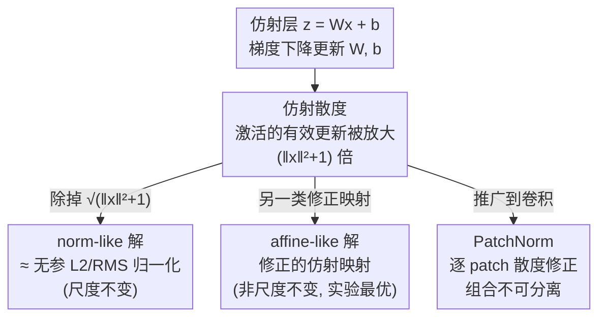

# The Affine Divergence: Aligning Activation Updates Beyond Normalisation

**会议**: ICLR 2026  
**arXiv**: [2512.22247](https://arxiv.org/abs/2512.22247)  
**代码**: 无  
**领域**: 优化理论  
**关键词**: 仿射散度, 归一化理论, 梯度下降, 表示更新, PatchNorm

## 一句话总结
揭示了梯度下降中参数最速下降方向与传播到激活后的有效更新之间存在根本性不对齐（"仿射散度"$\Delta\mathcal{L}/\Delta z_i = (\partial\mathcal{L}/\partial z_i) \cdot (\|\vec{x}\|^2+1)$），从第一性原理推导出归一化是消除此散度的自然解，并发现一种非归一化的替代方案在实验中超越传统归一化。

## 研究背景与动机

**领域现状**：深度学习中参数通过梯度下降在最速下降方向更新，但激活（表示）更接近损失函数且携带样本相关信息。归一化（BatchNorm 等）的成功已被广泛验证但机制解释众说纷纭。

**现有痛点**：
   - 参数的最速下降方向是否等同于激活的最优更新方向？答案是否
   - 归一化的现有解释（内部协变量偏移、平滑损失面等）缺乏从更新对齐角度的第一性原理推导

**核心矛盾**：参数更新传播到激活后会产生样本相关的二次偏差因子 $(\|\vec{x}\|^2+1)$——大幅值样本的有效学习率不成比例地大，几何上扭曲了梯度步

**切入角度**：不从统计正则化角度看归一化，而从"参数-激活更新对齐"角度重新推导，意外发现归一化是消除仿射散度的自然解

**核心 idea**：归一化的成功不是因为统计标准化，而是因为它恰好消除了参数更新传播到激活时产生的样本相关二次偏差。

## 方法详解

### 整体框架
全文围绕一个仿射层 $z_i = W_{ij}x_j + b_i$ 展开：先把"梯度下降更新参数 $(W,b)$ 之后激活 $z$ 实际被推动的方向"算清楚，和"直接对激活做最速下降"的理想方向一比，揭出二者相差一个样本相关的二次因子——这就是"仿射散度"。剩下的全部工作都从同一个目标出发：消掉这个因子。沿这条线走，会先**反推出**一个逐样本的 L2/RMS 类归一化（norm-like 解），再发现一个并不归一化、却同样能消除散度的修正仿射映射（affine-like 解），最后把分析推广到卷积层得到 PatchNorm。三条分支共享同一个根（仿射散度），只是消除方式与适用场景不同。

### 关键设计

**1. 仿射散度的推导：量化参数空间与激活空间更新的不对齐**

深度网络里损失最终由激活决定，但梯度下降只在参数空间走最速下降，于是真正落到激活上的更新方向未必是激活想要的方向。把这件事算清楚是全文的地基。设激活的梯度为 $g_i = \partial\mathcal{L}/\partial z_i$，一步梯度下降给出 $W'_{ij} = W_{ij} - \eta g_i x_j$、$b'_i = b_i - \eta g_i$；把更新后的参数代回前向，激活的实际变化是 $z'_i = z_i - \eta g_i(\|\vec{x}\|^2 + 1)$。而若直接对激活做最速下降，理想更新只该是 $\Delta z_i^{ideal} = -\eta g_i$。两者一比就得到核心结论——激活上的有效更新被放大了一个样本相关因子 $\frac{\Delta\mathcal{L}}{\Delta z_i} = \frac{\partial\mathcal{L}}{\partial z_i}\cdot(\|\vec{x}\|^2 + 1)$，等价于每个样本各自背着一个有效学习率 $\eta_{eff} = \eta(\|\vec{x}\|^2+1)$。后果是范数大的样本梯度步被不成比例地放大，几何上扭曲了整批样本的下降方向，这正是"仿射散度"得名的由来，也是后面所有解想抹平的东西。

**2. norm-like 解：从消除散度反推出 L2/RMS 归一化**

既然偏差因子是 $(\|\vec{x}\|^2+1)$，最直接的对策就是在激活上除掉它的平方根 $\sqrt{\|\vec{x}\|^2+1}$，把每个样本的有效学习率重新拉回到统一的 $\eta$。关键观察是：这一步恰好等价于把含 bias 的增广输入 $[\vec{x};1]$ 做一次 L2 归一化（因 $\|[\vec{x};1]\|^2=\|\vec{x}\|^2+1$）——也就是说，从"对齐参数更新与激活更新"这个纯几何动机出发，会自然推回到一个**无参数的归一化器**，它本质就是经典 L2 归一化、形式上近似于不带 $\sqrt{n}$ 宽度因子的（无参）RMSNorm。这给了归一化一个完全不依赖"内部协变量偏移""平滑损失面"等传统叙事的解释：它有效，是因为它正好抵消了仿射散度。要强调的是这里推出的是**逐样本**的 L2/RMS 类归一化，**不是 BatchNorm**——BatchNorm 依赖跨样本的批统计，在本文框架里只能靠压低 $\mathrm{Var}\,\|\vec{x}\|^2$ 来**近似缓解**散度，无法像 norm-like 那样精确消掉因子，这也预埋了二者在 batch size 实验里相反的趋势。

**3. affine-like 解：散度可消，尺度不变性非必需**

既然目标只是"消掉那个二次因子"，除以幅度并不是唯一手段。作者解出第二个映射，同样精确抹平仿射散度，但它是一个**修正的仿射映射**、并不具备尺度不变性——这与 BatchNorm、LayerNorm 等所有传统归一化都不同（后者天然对输入缩放免疫）。形式上它在 $\|\vec{x}\|\to\infty$ 时平滑趋于和 norm-like 相同的 $\vec{g}\hat{x}^T$，但在 $\|\vec{x}\|\to 0$ 时非奇异、不需要 $\epsilon$ 项兜底，几何上还保留了全部初始自由度（norm-like 则把径向自由度不可逆地投影掉了）。更关键的是，这个非尺度不变的解在实验里反而**超过**了 BatchNorm/LayerNorm，直接动摇了"尺度不变性是归一化成功之关键"这一长期默认假设：真正重要的是消除散度，缩放不变只是 norm-like 顺带的附属性质。

**4. PatchNorm：把散度分析推广到卷积层**

在卷积里，一个滤波器要在不同空间位置滑过不同的局部 patch，于是仿射散度不再是逐样本一个标量，而是随空间位置变化的 patchwise 散度。直接套用通道归一化或空间归一化都消不干净它。作者据此提出 PatchNorm——它不是加在卷积前后的归一化函数，而是对卷积过程本身的内在改造，且"组合不可分离"：无法写成通道维归一化与空间维归一化的乘积，是一种由理论驱动、此前并不存在的全新归一化族（同样有对应 norm-like / affine-like 的两个变体）。不过要诚实地说：实验里 PatchNorm 只是表现良好、与现有归一化大致相当，并没有复现全连接层下 affine-like 那种大幅领先，说明卷积场景下散度还没被这套近似完全消除，理论推广仍需更精细的构造。

此外作者还设计了一个**可证伪的辅助假设**为整套理论加证据：若仿射散度（尤其是批内跨样本干扰）确实是机制根源，那么精确消除散度的结构修正（norm-like、affine-like）的性能应当**反常地随 batch size 增大而下降**——因为 batch 越大、跨样本干扰越强、偏离理想更新越远。实验确认了这一预测，给该机制提供了独立于传统解释的支撑。

## 实验关键数据

> 全部实验在 **CIFAR-10** 上完成：全连接网络验证逐样本散度的两个结构修正，卷积网络验证 PatchNorm。模型有意保持简单（单层/一阶近似在此仍成立），均为无参（parameterless）形式以便公平消融。

### 全连接网络（CIFAR-10，Tanh / Leaky-ReLU，多种宽度深度）

| 方法 | 相对表现 | 尺度不变？ |
|------|---------|---------|
| 无归一化 / BatchNorm / LayerNorm / RMSNorm | 基线参照 | 部分是 |
| norm-like（L2，$\eta$ 与 $\eta/2$） | 显著优于上述基线 | 是 |
| **affine-like** | **最优**，差距随网络变宽变深而扩大 | **否** |

> 仅在 3 层 16 宽这一窄配置下 norm-like 略胜 affine-like；其余配置 affine-like 普遍领先。

### 批大小负相关（可证伪辅助假设）

| 预测 | 验证结果 |
|------|---------|
| 精确消除散度的结构修正性能应随 batch size 增大而下降 | **确认**——norm-like 与 affine-like 均为负斜率，统计显著 |
| 对比组：LayerNorm 近似持平；BatchNorm / RMSNorm / 无归一化 | 呈正相关，反衬结构修正的反常趋势 |

### 卷积网络（PatchNorm，约 160 个网络 / 32 个独立结构）

| 方法 | 相对表现 |
|------|---------|
| PatchNorm（各变体） | 表现良好，但与 LayerNorm/RMSNorm 等**大致相当**，未现 FC 下的大幅领先 |

### 关键发现
- **从第一性原理推导出归一化**：不假设任何统计正则化动机，纯几何的更新对齐就自然导出一个无参 L2/RMS 类归一化器
- **非归一化替代方案有效**：affine-like 非尺度不变却最优，打破"尺度不变性是归一化成功关键"的假设
- **Batch size 负相关**：结构修正性能随 batch 增大而下降，验证了仿射散度（跨样本干扰）机制，且独立于传统解释
- **PatchNorm 能推广但消除不彻底**：卷积下表现与现有归一化相当而非碾压，提示理论向卷积/注意力推广仍需更精细近似

## 亮点与洞察
- **从更新对齐角度重建归一化理论**是本文最大的贡献——将看似不相关的"参数-激活更新不对齐"问题与归一化的成功联系起来，提供了一个全新的理论视角。
- **非归一化解的存在**对深度学习架构设计有深刻启示——也许我们不需要归一化本身，只需要某种消除仿射散度的机制，形式可以多样化。
- **归一化 = 激活函数？** 论文在附录中论证归一化器和激活函数的界限应该溶解——两者都是参数化的非线性映射，这个观点值得关注。

## 局限与展望
- 单层近似 + 一阶近似——多层传播的散度分析会更复杂但更准确
- 实验规模有限——只在 CIFAR-10 上验证，需要在大规模 Transformer/LLM 上检验
- 分析建立在**无参（去掉可学习缩放）**的归一化形式上；一旦保留参数化缩放，散度会多出高阶项而只能被缓解、无法精确消除
- 与自然梯度下降的关系讨论充分但未实验对比
- PatchNorm 仅在卷积场景验证；注意力/残差的散度仅在附录中勾勒，未做实验

## 相关工作与启发
- **vs 自然梯度 (Amari)**: 都关注梯度方向的次优性，但自然梯度在输出函数空间操作（计算上不可行），本文在每层激活空间操作（计算简单）
- **vs BatchNorm (Ioffe & Szegedy)**: BN 从"内部协变量偏移"出发；本文从"更新对齐"出发，但推导出相同的操作——提供了独立的理论支持
- **vs LayerNorm/GroupNorm**: 这些是 BN 的变体；本文的分析框架统一解释了所有归一化的成功

## 评分
- 新颖性: ⭐⭐⭐⭐⭐ 从第一性原理推导归一化，发现非归一化替代方案，概念深度极高
- 实验充分度: ⭐⭐⭐ 实验规模偏小（CIFAR 级），需要更大规模验证
- 写作质量: ⭐⭐⭐⭐ 数学推导严谨，但符号和推导密度较高
- 价值: ⭐⭐⭐⭐⭐ 对归一化理论的根本性贡献，PatchNorm 是有实用潜力的新方法

<!-- RELATED:START -->

## 相关论文

- [\[ICLR 2026\] MT-DAO: Multi-Timescale Distributed Adaptive Optimizers with Local Updates](mt-dao_multi-timescale_distributed_adaptive_optimizers_with_local_updates.md)
- [\[ICLR 2026\] Learning to Recall with Transformers Beyond Orthogonal Embeddings](learning_to_recall_with_transformers_beyond_orthogonal_embeddings.md)
- [\[ICLR 2026\] Exploring Diverse Generation Paths via Inference-time Stiefel Activation Steering](exploring_diverse_generation_paths_via_inference-time_stiefel_activation_steerin.md)
- [\[NeurIPS 2025\] Stable Coresets via Posterior Sampling: Aligning Induced and Full Loss Landscapes](../../NeurIPS2025/optimization/stable_coresets_via_posterior_sampling_aligning_induced_and_full_loss_landscapes.md)
- [\[CVPR 2026\] Beyond Euclidean Gossip: KL-Barycentric Consensus on Heterogeneous and Imbalanced Images](../../CVPR2026/optimization/beyond_euclidean_gossip_kl-barycentric_consensus_on_heterogeneous_and_imbalanced.md)

<!-- RELATED:END -->
