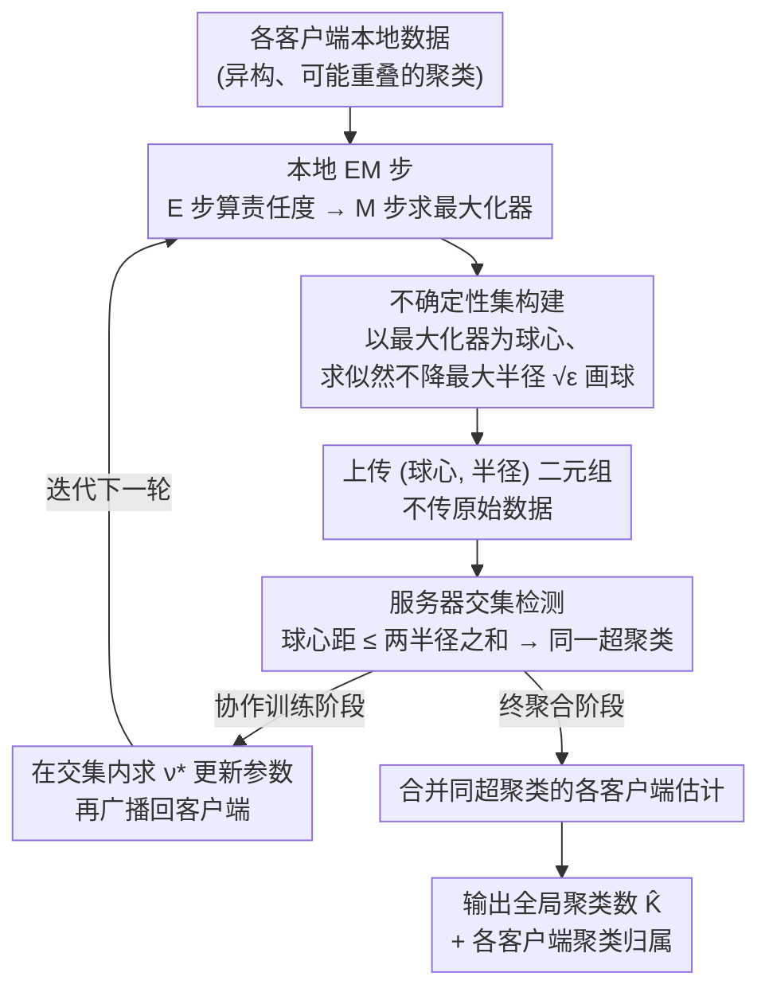

# A Federated Generalized Expectation-Maximization Algorithm for Mixture Models with an Unknown Number of Components

**会议**: ICLR 2026  
**arXiv**: [2601.21160](https://arxiv.org/abs/2601.21160)  
**代码**: 无  
**领域**: 其他  
**关键词**: 联邦聚类, 广义EM算法, 混合模型, 未知聚类数, 不确定性集  

## 一句话总结
提出 FedGEM 算法，通过客户端本地 EM 步后构建不确定性集、服务器利用不确定性集交集检测聚类重叠并推断全局聚类数，首次实现在全局聚类数未知情况下的联邦聚类，并提供了概率收敛保证。

## 研究背景与动机

**领域现状**：联邦学习中的聚类任务通常假设所有客户端共享相同的聚类集合且全局聚类数 $K$ 已知。

**现有痛点**：实际场景中（如 OEM 设备故障诊断），客户端具有异构但可能重叠的聚类集合，无人知道全局有多少种故障类别。现有联邦聚类方法 (k-FED, FFCM, FedKmeans) 都需要预先知道 $K$。唯一不需要知道 $K$ 的 AFCL 方法存在严重隐私问题——客户端共享的数据可被服务器通过简单运算重建。

**核心矛盾**：客户端不能共享原始数据（隐私约束），无统一的标签标准（异构标签），且全局聚类数未知——传统集中式训练和现有联邦方法都无法同时满足这些约束。

**本文目标** 设计一个隐私保护的联邦聚类算法，能在全局聚类数未知的条件下推断 $K$ 并训练混合模型。

**切入角度**：将 EM 算法与不确定性集结合——每个客户端在 M 步后计算不保证似然下降的最大扰动范围作为不确定性半径，服务器通过不确定性集的交集检测聚类重叠。

**核心 idea**：用 EM 最大化器周围的似然不降不确定性集的交集来发现跨客户端的聚类重叠，从而在不知道全局 $K$ 的情况下实现联邦聚类。

## 方法详解

### 整体框架
FedGEM 要解决的是一个棘手的联邦聚类场景：各客户端手里的数据来自不同但可能重叠的聚类，谁也不知道全局一共有多少个聚类 $K$，而且因为隐私约束谁都不能把原始数据交出去。它的破局思路是让每个客户端先在本地把 EM 跑一遍，然后不直接上传数据，而是上传一组「不确定性集」——也就是每个本地聚类组件参数周围的一个小球。服务器拿到所有客户端的这些小球后，靠判断哪些球互相相交来认定「这是同一类」，从而把分散在各客户端的聚类拼起来、推断出全局 $K$。整个过程分两个阶段：先是迭代协作训练阶段，客户端本地 EM 加不确定性集计算、服务器靠交集求一个落在交集内的向量来更新参数并广播回去、如此往复；收敛后进入终聚合阶段，服务器把同一类的各客户端估计合并、定下全局聚类数并给出每个客户端的聚类归属。

### 关键设计

**1. 客户端的不确定性集：把「M 步可以不精确」变成一个可上传的小球**

EM 的 M 步本来要找到使期望完整数据对数似然最大化的参数，但 GEM 允许 M 步不做到极致——只要不让似然下降即可。本文正是把这条松弛性质量化成了一个具体的几何对象。对每个聚类组件，客户端以它 M 步得到的最大化器 $M_{k_g}$ 为圆心、$\sqrt{\varepsilon_{k_g}}$ 为半径画一个欧氏球 $\mathcal{U}_{k_g}$，其中半径由一个优化问题确定：球内的任何参数取值都不会让期望完整数据对数似然下降。换句话说，这个球刻画的是「参数还能在多大范围里晃动而算法不退化」，球越小说明本地估计越精确。对各向同性 GMM 这一设定，求半径的问题可以重构成一个双凸的二维问题并得到闭式解，因此计算开销很低。关键在于，客户端最后只需把（球心，半径）这一对数上传，体量远小于原始数据，天然起到隐私保护的作用。

**2. 服务器的交集检测：用两个球相不相交来判断「是不是同一个聚类」**

服务器要做的是把不同客户端各自命名的本地聚类对应起来——但它看不到数据，只有一堆小球。本文给出的判据纯粹是几何的：若两个组件的球心距离不超过两半径之和，即 $\|M_{k_g} - M_{k_{g'}}\|_2 \leq \sqrt{\varepsilon_{k_g}} + \sqrt{\varepsilon_{k_{g'}}}$，则认为两个球相交、把这两个组件归入同一个「超聚类」。在协作训练阶段，服务器进一步在相交区域里求一个落在交集内的最优向量 $\nu^*$ 来更新参数；到最终聚合阶段，则直接把同一超聚类内的各客户端估计合并成一个全局估计。这套做法的好处是全程闭式、只需距离比较和线性运算，既不用迭代优化，也不用客户端共享原始数据或大数组就能完成跨客户端的聚类匹配。

**3. 收敛保证：从一般混合模型到 GMM 的概率收敛与 $K$ 可识别性**

本文不止给算法，还证明它在标准假设下会概率收敛到真实参数的邻域并正确数出 $K$。借助一阶稳定性（FOS）条件，作者证明 GEM 迭代会收敛到真实参数 $\theta^*$ 的 $\frac{1}{1-\beta/\lambda}\epsilon^{\text{unif}}$ 邻域；在此基础上进一步说明，只要把最终聚合的半径设为 $\epsilon^{\text{unif}}$ 且不超过 $R_{\min}/4$（$R_{\min}$ 为真实聚类间的最小分离度），交集检测就能正确推断全局聚类数 $K$。这条从一般混合模型逐层收紧到各向同性 GMM 的证明链，使 FedGEM 不只是个启发式，而是带有明确收敛速率和 $K$ 可识别条件的算法。

### 损失函数 / 训练策略
整体仍以 EM 框架优化对数似然，不引入额外训练目标；不确定性集半径则作为一个约束优化问题单独求解。在各向同性 GMM 设定下，半径问题的闭式解使整套流程保持低复杂度、可实际运行。

## 实验关键数据

### 主实验

| 数据集 | FedGEM (ARI) | AFCL (ARI) | DP-GMM (ARI) | GMM (已知K) | 估计K (真实K) |
|--------|-------------|-----------|-------------|------------|-------------|
| MNIST | 0.355±.064 | 0.137±.055 | 0.326±.080 | 0.287±.067 | 14.7 (10) |
| FMNIST | 0.415±.022 | 0.143±.019 | 0.332±.069 | 0.385±.023 | 12.3 (10) |
| CIFAR-10 | 0.058±.008 | 0.022±.007 | 0.032±.017 | 0.402±.022 | 33.7 (10) |
| Abalone | 0.128±.030 | 0.091±.022 | 0.061±.018 | 0.096±.028 | 4.5 (3) |

### 消融实验

| 配置 | ARI (合成数据) | 说明 |
|------|-------------|------|
| 集中式 EM | ~0.95 | 上界 |
| FedGEM | ~0.90 | 接近集中式 |
| AFCL | ~0.50 | 大幅落后 |
| k-FED (已知K) | ~0.85 | 需要知道K |

### 关键发现
- FedGEM 在所有数据集上一致超越唯一不需要知道 $K$ 的竞品 AFCL，在部分数据集上甚至超越需要知道 $K$ 的方法
- 在 CIFAR-10 等非高斯数据集上过高估计了聚类数 (33.7 vs 10)，说明各向同性 GMM 假设在复杂数据上有局限
- 算法可扩展性良好，随问题规模增长的性能衰减显著小于竞品
- 在违反高斯假设的真实数据集上仍能保持合理性能

## 亮点与洞察
- **不确定性集的巧妙设计**：将 GEM 的"允许不精确 M 步"性质转化为跨客户端聚类匹配的工具，理论上优雅且实践中高效。半径自然反映了估计精度，精度越高半径越小
- **闭式聚合**：服务器端仅需简单的距离比较和线性运算，无需迭代优化，计算效率高
- **理论完整性**：从一般混合模型到各向同性 GMM，层层递进的收敛证明链条完整

## 局限与展望
- 各向同性 GMM 假设限制了在复杂高维数据 (如 CIFAR-10) 上的表现，扩展到全协方差 GMM 或更复杂的混合模型是自然方向
- 在聚类数估计上仍有明显偏差（特别是过高估计），实际部署需要更好的最终聚合半径选择策略
- 收敛保证需要聚类充分分离的假设，聚类重叠严重时保证可能失效
- 差分隐私讨论仅为初步性质，正式的隐私保证有待加强

## 相关工作与启发
- **vs k-FED/FFCM**: 这些方法需要预先知道全局 $K$，限制了实际可用性；FedGEM 自动推断 $K$
- **vs AFCL**: 唯一可比的无需知道 $K$ 的方法，但 AFCL 有严重隐私漏洞；FedGEM 仅传输参数和半径
- **vs DP-GMM (集中式)**: FedGEM 在联邦设置下接近集中式 DP-GMM 的表现，甚至在 ARI 上有所超越

## 评分
- 新颖性: ⭐⭐⭐⭐ 不确定性集驱动的联邦聚类是新颖的思路，理论与算法设计有原创性
- 实验充分度: ⭐⭐⭐⭐ 8个数据集、7个baseline、可扩展性分析，较为全面
- 写作质量: ⭐⭐⭐⭐ 理论推导严谨，但符号较重，可读性一般
- 价值: ⭐⭐⭐⭐ 填补了联邦学习中未知聚类数聚类的理论和方法空白

<!-- RELATED:START -->

## 相关论文

- [\[ICLR 2026\] Federated ADMM from Bayesian Duality](federated_admm_from_bayesian_duality.md)
- [\[ACL 2025\] RMoA: Optimizing Mixture-of-Agents through Diversity Maximization and Residual Compensation](../../ACL2025/others/rmoa_optimizing_mixture-of-agents_through_diversity_maximization_and_residual_co.md)
- [\[ICLR 2026\] Neural Force Field: Few-shot Learning of Generalized Physical Reasoning](neural_force_field_few-shot_learning_of_generalized_physical_reasoning.md)
- [\[CVPR 2026\] Neural Mixture Density Processes](../../CVPR2026/others/neural_mixture_density_processes.md)
- [\[CVPR 2026\] Spectral Mixture-of-Experts for Continual Learning](../../CVPR2026/others/spectral_mixture-of-experts_for_continual_learning.md)

<!-- RELATED:END -->
