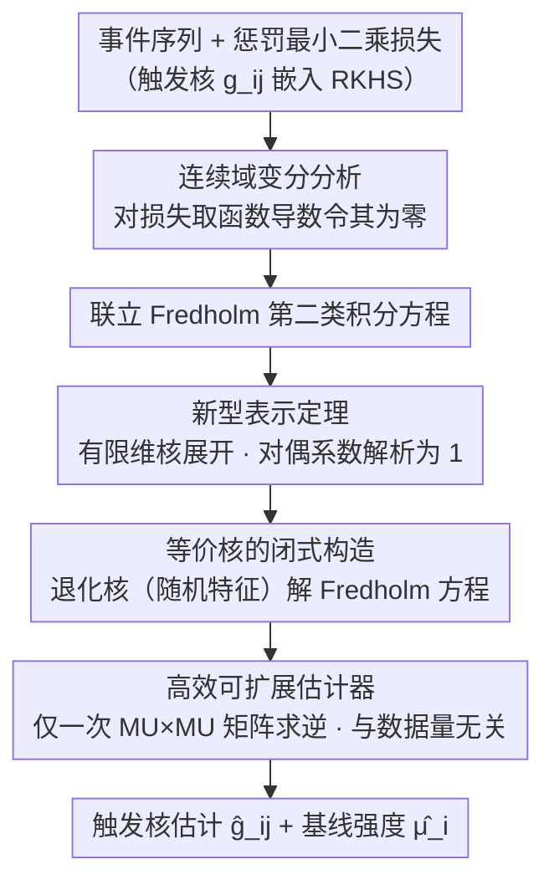

# A Representer Theorem for Hawkes Processes via Penalized Least Squares Minimization

**会议**: ICLR 2026  
**arXiv**: [2510.08916](https://arxiv.org/abs/2510.08916)  
**代码**: 无  
**领域**: 点过程 / 核方法  
**关键词**: Hawkes过程, 表示定理, RKHS, Fredholm积分方程, 非参数估计  

## 一句话总结
为线性多元 Hawkes 过程在 RKHS 框架下的触发核估计建立了新型表示定理，证明最优估计器可用等价核在数据点上的线性组合表示且对偶系数全部解析地等于 1，无需求解对偶优化问题，从而实现高效可扩展的非参数估计。

## 研究背景与动机

**领域现状**：核方法通过 RKHS 实现非参数函数估计，表示定理将无限维优化转为有限维。近年将核方法扩展到点过程的强度函数估计，Bonnet & Sangnier (2025) 推导了 Hawkes 过程的表示定理但依赖离散化近似。

**现有痛点**：Bonnet & Sangnier 的方法需要求解非线性优化问题来获得对偶系数，对偶系数维度随数据规模增长，导致大规模数据下计算不可行。此外其依赖于似然/最小二乘损失的离散化近似。

**核心矛盾**：Hawkes 过程的损失函数涉及强度函数在观测域上的积分且违反独立性假设，使经典表示定理不适用。而精确的变分分析又面临复杂的联立积分方程。

**本文目标** 为线性 Hawkes 过程的非近似惩罚最小二乘公式建立表示定理，实现可扩展的非参数触发核估计。

**切入角度**：利用路径积分表示和变分分析，直接在连续域上推导精确的变分方程，发现最小二乘损失的二次结构导致对偶系数自动为 1。

**核心 idea**：最小二乘损失在 RKHS 中的二次结构使得 Hawkes 过程的表示定理的对偶系数全部解析固定为 1，消除了对偶优化的需要。

## 方法详解

### 整体框架
目标是估计线性多元 Hawkes 过程的触发核：强度函数写成 $\lambda_i(t) = \mu_i + \sum_j \int_0^t g_{ij}(t-s) dN_j(s)$，其中 $\mu_i$ 是基线强度、$g_{ij}$ 刻画 $j$ 类事件如何激发 $i$ 类事件。把每个 $g_{ij}$ 放进再生核希尔伯特空间（RKHS），在惩罚最小二乘损失上做无限维优化。整条路线分三步：先对损失做精确的连续域变分分析，推出一个表示定理把无限维问题降到有限维（并发现对偶系数恒为 1）；再用随机特征映射把表示定理里出现的联立 Fredholm 第二类积分方程闭式解掉；最后整个估计器收敛成一次矩阵求逆，且这个矩阵的大小与数据量无关。下图是从损失到最终估计器的推导流水线，中间三个加深的环节正是下文的三个关键设计：

### 关键设计

**1. 新型表示定理：把无限维优化降到有限维，且对偶系数全部解析为 1**

经典表示定理之所以在 Hawkes 过程上失效，是因为损失函数里强度函数要在整个观测域上积分、且事件之间违反独立性假设。本文不走 Bonnet & Sangnier 那种先离散化再优化的路线，而是直接在连续域上对惩罚最小二乘目标取函数导数并令其为零，得到一组联立的 Fredholm 第二类积分方程。解出来的最优估计器形如

$$\hat{g}_{ij}(s) = \sum_{n \in \mathcal{N}_i} h_j(s, t_n) - \hat{\mu}_i \int h_j(s,t)\, dt,$$

即一个由观测事件点 $t_n$ 张成的有限维展开，其中等价核 $h_j$ 由那组 Fredholm 积分方程定义。关键的理论洞察在于：最小二乘损失是二次的，而非对数似然那种非线性结构，这让变分方程线性化，从而展开式里本该需要优化求解的对偶系数全部解析地固定为 1。换句话说，表示定理在这里不再附带一个对偶优化子问题，对偶系数被"算"出来而不是"优化"出来——这正是整套方法能高效可扩展的源头。

**2. 等价核的闭式构造：用随机特征映射把 Fredholm 积分方程解析解掉**

表示定理虽然给出了估计器的形式，但等价核 $h_j$ 仍由一组联立积分方程隐式定义，直接数值求解又会引入 Riemann 近似的离散化误差。这里改用退化核（随机特征映射）来近似 RKHS 核：取 $M$ 个随机特征令 $k(s,s') = \phi(s)^\top \phi(s')$，于是等价核可以写成闭式

$$h_j(s,s') = \phi(s)^\top \Big[\big(\tfrac{1}{\gamma}I_{MU} + \Xi\big)^{-1} \tilde{\phi}(s')\Big].$$

退化核的好处是表示定理里所有积分在随机特征映射下都能解析算出，不再依赖网格离散化，从根本上避开了数值积分的误差累积；代价只是求逆一个 $MU \times MU$ 的矩阵，而这个尺寸只跟特征维度 $M$ 和事件维度 $U$ 有关、与数据量无关。

**3. 高效可扩展估计器：核心计算量与数据量解耦**

前两步的结果是整个估计过程最终归结为若干加性矩阵运算加一次矩阵求逆。具体地，矩阵 $\Xi$ 可以遍历数据做增量式矩阵加法逐步累加构建，而真正要求逆的矩阵始终是 $MU \times MU$（$M$ 特征维度、$U$ 事件维度），与观测到的事件总数 $N(T)$ 无关。对比之下，Bonnet & Sangnier 的方法需要求解一个维度随数据规模 $O(N(T))$ 增长的非线性优化问题，数据一大就不可行；而本方法把核心计算量与数据量彻底解耦，数据越多、相对优势越明显。

### 损失函数 / 训练策略
目标是惩罚最小二乘损失加 RKHS 正则项 $\frac{1}{\gamma}\sum \|g_{ij}\|_{\mathcal{H}_k}^2$，正则系数 $\frac{1}{\gamma}$ 控制偏差-方差权衡。基线强度 $\mu_i$ 同样由变分分析给出闭式解（Proposition 2），无需单独优化。核近似采用随机 Fourier 特征。

## 实验关键数据

### 主实验

**合成数据上的预测精度和计算效率:**

| 方法 | 预测误差↓ | 计算时间↓ | 可扩展性 |
|------|---------|---------|---------|
| 本方法 (RFF) | 竞争性 | **显著更快** | $O(M^3 U^3 + NM^2U)$ |
| Bonnet & Sangnier | 竞争性 | 慢 (需对偶优化) | $O(N^3)$ |

### 消融实验

| 配置 | 说明 |
|------|------|
| 增大 M (特征维度) | 精度提升，计算增加 |
| 增大 $\gamma$ (正则化) | 偏差-方差权衡 |
| 增大 N (数据量) | 本方法效率优势越明显 |

### 关键发现
- 对偶系数全等于 1 的理论结果在实验中得到验证，消除了对偶优化后计算时间大幅减少
- 随机特征映射近似使所有积分闭式可计算，避免了离散化近似的误差累积
- 在大规模数据集上，本方法比 Bonnet & Sangnier 快数个数量级，同时保持竞争性的预测精度
- 矩阵求逆的大小仅为 $MU \times MU$，与数据量无关，是可扩展性的关键

## 亮点与洞察
- **最小二乘的隐藏结构**：最小二乘损失的二次性质——而非对数似然的非线性——使得变分方程线性化，对偶系数自动为 1。这是一个优雅的理论发现：损失函数的选择不仅影响统计性质，还影响表示定理的计算结构
- **从无限维到有限维的双重降维**：表示定理从函数空间降到核展开，随机特征映射从核展开降到有限维向量，两步降维使原本不可行的非参数估计变得高效
- **积分方程理论的应用**：Fredholm 第二类积分方程的退化核方法是经典数学的现代应用

## 局限与展望
- 仅适用于线性 Hawkes 过程（恒等链接函数），无法处理抑制性交互
- 不保证估计的触发核非负，可能产生负的条件强度
- 随机特征映射的近似质量依赖于特征维度 M 的选择
- 理论分析仅针对一维时间域上的 RKHS 核，空间-时间扩展有待探索

## 相关工作与启发
- **vs Bonnet & Sangnier 2025**: 他们用离散化近似的最小二乘/似然得到需要对偶优化的表示定理；本文用精确的变分分析达到无需对偶优化的更优雅结果
- **vs Flaxman et al. 2017**: Flaxman 将表示定理推广到点过程但仅限于单变量强度函数；本文处理多元 Hawkes 过程的触发核，面临联立积分方程的额外挑战
- **vs 经典表示定理**: 经典表示定理的对偶系数需要优化；本文发现在特定损失函数下对偶系数可解析固定，是表示定理家族的新成员

## 评分
- 新颖性: ⭐⭐⭐⭐⭐ 对偶系数全等于 1 的发现是优雅的理论贡献，首次为非近似的惩罚最小二乘 Hawkes 过程建立表示定理
- 实验充分度: ⭐⭐⭐ 仅在合成数据上验证，缺乏真实数据集的实验
- 写作质量: ⭐⭐⭐⭐ 数学推导严谨完整，但符号密度高，可读性有限
- 价值: ⭐⭐⭐⭐ 为 Hawkes 过程的非参数估计提供了理论基础和高效算法

<!-- RELATED:START -->

## 相关论文

- [\[CVPR 2025\] PLeaS: Merging Models with Permutations and Least Squares](../../CVPR2025/others/pleas_-_merging_models_with_permutations_and_least_squares.md)
- [\[ICLR 2026\] Revisiting Sharpness-Aware Minimization: A More Faithful and Effective Implementation](revisiting_sharpness-aware_minimization_a_more_faithful_and_effective_implementa.md)
- [\[CVPR 2026\] Neural Mixture Density Processes](../../CVPR2026/others/neural_mixture_density_processes.md)
- [\[ICML 2025\] Discrepancy Minimization in Input-Sparsity Time](../../ICML2025/others/discrepancy_minimization_in_input-sparsity_time.md)
- [\[ICLR 2026\] Noise-Aware Generalization: Robustness to In-Domain Noise and Out-of-Domain Generalization](noise-aware_generalization_robustness_to_in-domain_noise_and_out-of-domain_gener.md)

<!-- RELATED:END -->
