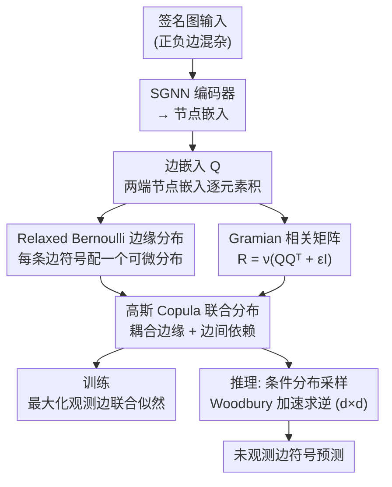

# A Scalable Inter-edge Correlation Modeling in CopulaGNN for Link Sign Prediction

**会议**: ICLR 2026  
**arXiv**: [2601.19175](https://arxiv.org/abs/2601.19175)  
**代码**: 无  
**领域**: 其他  
**关键词**: 签名图, 链接符号预测, 高斯Copula, 边间相关性, Gramian矩阵  

## 一句话总结
将 CopulaGNN 从节点级扩展到边级，通过将相关矩阵构造为边嵌入的 Gramian 矩阵并利用 Woodbury 恒等式重构条件概率分布，实现了在签名图上对边间统计依赖的可扩展建模，用于链接符号预测任务。

## 研究背景与动机

**领域现状**：签名图中的链接符号预测（判断边为正或负关系）是重要的图学习任务。现有 SGNN 方法通过辅助结构（如结构平衡理论、正负边分开处理）来处理负边违反同质性假设的问题。

**现有痛点**：辅助结构增加了架构复杂性，导致收敛慢，且有些方法内存使用低效。CopulaGNN 可建模节点间统计依赖，但扩展到边级面临相关矩阵 $O(|V|^4)$ 的内存和 $O(n^3)$ 的矩阵求逆计算瓶颈。

**核心矛盾**：直接建模边-边相关矩阵（$n \times n$，$n$ 为边数）在参数量和计算上不可行，但忽略边间依赖又会丢失重要的结构信息。

**本文目标** 在签名图上高效建模边间相关性用于链接符号预测。

**切入角度**：(a) 用低秩 Gramian 结构代替显式相关矩阵减少参数；(b) 用 Woodbury 恒等式将大矩阵求逆转化为小矩阵求逆减少计算。

**核心 idea**：将相关矩阵分解为边嵌入 Gramian $\mathbf{R} = \nu(\mathbf{QQ}^\top + \epsilon \mathbf{I})$，使内存从 $O(n^2)$ 降到 $O(nd)$，推理中的矩阵求逆从 $O(n^3)$ 降到 $O(d^3)$。

## 方法详解

### 整体框架
这篇论文要解决的是签名图上的链接符号预测——给定一张正负边混杂的图，判断每条边代表的是正关系还是负关系。它的核心思路是不再假设相邻节点彼此相似（签名图里负边天然违反这条同质性假设），而是退一步去建模「边和边之间的统计依赖」，并把这套依赖塞进一个可扩展的高斯 Copula 框架里。

整条 pipeline 是这样转的：先用一个 SGNN 编码器把签名图编码成节点嵌入；再把一条边两端节点嵌入做逐元素积，得到这条边的边嵌入，所有边嵌入堆成矩阵 $\mathbf{Q}$。从 $\mathbf{Q}$ 分出两条支路：一条给每条边的符号配一个 relaxed Bernoulli 分布刻画它的边缘分布，另一条用 $\mathbf{Q}$ 的 Gramian 直接构造边间相关矩阵；两条支路在高斯 Copula 处汇合，把所有边符号耦合成一个联合分布。训练时最大化观测边的联合似然，推理时则从条件分布里采样出未观测边的符号。真正的难点在于「相关矩阵是 $n\times n$（$n$ 为边数）」这个规模——下面三个设计分别解决三件事：让离散符号进得了 Copula（Relaxed Bernoulli）、把 $O(n^2)$ 的相关矩阵压成低秩（Gramian）、把推理里的大矩阵求逆换成小矩阵求逆（Woodbury）。

### 关键设计

**1. Relaxed Bernoulli 边缘分布：让离散的边符号能进可微的 Copula 框架**

Copula 要求每个变量有连续的边缘分布，但边符号本质是二值的离散量，没法直接喂进去。本文给每条边的符号配一个 relaxed（连续松弛）Bernoulli 分布，位置参数 $a_i$ 和温度参数 $t_i$ 都由边嵌入 $\mathbf{Q}$ 经两个可学习线性投影 $\mathbf{w}_1,\mathbf{w}_2\in\mathbb{R}^d$ 算出，它的 CDF 有闭式解

$$F(x;a,t) = \frac{x^t}{a(1-x)^t + x^t},$$

可以直接代进高斯 Copula 完成「边缘 → 联合」的耦合。这样既保住了二值分类的语义（松弛后仍逼近 0/1 两端），又让整条似然对参数可微，端到端训练得以成立。

**2. Gramian 相关矩阵：用低秩结构代替 $O(n^2)$ 的显式相关矩阵**

直接给边-边相关矩阵每个元素配一个参数是 $O(n^2)$ 的，边数一多就既存不下也学不动。本文不去显式存这个矩阵，而是让它从边嵌入「长出来」：取协方差 $\Sigma = \mathbf{QQ}^\top + \epsilon \mathbf{I}_n$，再用 $\nu(\cdot)$ 归一化成相关矩阵 $\mathbf{R} = \mathbf{D}^{-1}\Sigma\mathbf{D}^{-1}$（$\mathbf{D}_{ii}=\sqrt{\Sigma_{ii}}$ 为对角标准差）。因为边嵌入维度 $d \ll n$，整个 $\Sigma$ 被压成一个秩至多为 $d$ 的结构，需要学的只是图编码器的参数（边嵌入本身不入参），内存从 $O(n^2)$ 降到 $O(nd)$。用 Gramian 的另一个好处是它天然正半定，再加上 $\epsilon \mathbf{I}_n$ 就保证严格正定，正好满足高斯 Copula 对相关矩阵的合法性要求——表达力和数学合法性一并解决。

**3. Woodbury 条件分布重构：把推理里的大矩阵求逆换成 $d\times d$ 的小矩阵求逆**

推理时要算的是「在 $m$ 条观测边的符号已知的条件下，未观测边符号的条件分布」，这需要对观测边的相关子块 $\mathbf{R}_{00}$（$m \times m$）求逆，朴素做法是 $O(m^3)$，边一多就爆。本文利用 $\Sigma_{00} = \mathbf{Q}_0\mathbf{Q}_0^\top + \epsilon\mathbf{I}_m$ 同样是「低秩 + 对角」结构这一点，套 Woodbury 恒等式把对 $m\times m$ 矩阵的求逆等价转化成对一个 $d \times d$ 矩阵的求逆，条件分布因此能化简成一个低秩多元高斯。由于 $d \ll m$，计算开销只取决于可控超参 $d$ 而非图规模 $n$。值得注意的是，第 2 个设计的 Gramian 形式正是这里能用 Woodbury 的前提——同一个低秩选择同时喂饱了参数量和推理速度两个瓶颈。

### 损失函数 / 训练策略
训练目标是最大化观测边符号的联合对数似然

$$\log \mathcal{H}'(x_{1:m}) = \log c(u_{1:m}; \mathbf{R}_{00}) + \sum_i \log f_i(x_i),$$

其中 $c(\cdot)$ 是高斯 Copula 密度、$f_i$ 是第 $i$ 条边的松弛 Bernoulli 边缘密度，两者都有闭式表达，整条似然可微。推理时则从前面构造好的条件高斯分布里采样，得到未观测边的符号预测。

## 实验关键数据

### 主实验

| 数据集 | CopulaLSP AUC↑ | SGCN AUC | SiGAT AUC | 收敛速度↑ |
|--------|---------------|----------|-----------|---------|
| Bitcoin-Alpha | 竞争性 | 基线 | 基线 | **显著更快** |
| Bitcoin-OTC | 竞争性 | 基线 | 基线 | **显著更快** |
| Wiki-RfA | 竞争性 | 基线 | 基线 | **显著更快** |

### 消融实验

| 配置 | 性能 | 说明 |
|------|------|------|
| 完整模型 | 最佳 | Gramian + Woodbury |
| 无 Copula (仅边缘) | 下降 | 验证边间相关性的价值 |
| 不同 $d$ | $d$ 增大精度提升但计算增加 | 嵌入维度控制精度-效率权衡 |

### 关键发现
- CopulaLSP 的收敛速度显著快于所有基线方法，理论证明了线性收敛
- 预测精度与 SOTA 签名图方法竞争性，同时训练和推理效率大幅提升
- Gramian 结构的低秩相关矩阵具有足够的表达能力来捕获边间依赖
- 边间相关性的显式建模是收敛加速的关键驱动因素

## 亮点与洞察
- **从节点同质性到边依赖性**：不假设相邻节点相似（签名图下不成立），而是假设通过共同节点连接的相邻边不独立——这是对 GNN 假设的自然放松
- **结构化相关矩阵的双重收益**：Gramian 形式既减少了参数量，又通过 Woodbury 恒等式加速了推理中的矩阵求逆——一个设计选择同时解决两个瓶颈
- **线性收敛的理论保证**：不仅经验上收敛快，还提供了理论证明，增强了方法的可信度

## 局限与展望
- 边嵌入维度 $d$ 的选择需要手动调优，过大会增加计算，过小可能欠表达
- 松弛 Bernoulli 分布的温度参数对结果敏感
- 仅在链接符号预测上验证，未探索其他边级任务
- Gramian 的低秩假设可能无法捕获所有类型的边간相关结构

## 相关工作与启发
- **vs CopulaGNN (Ma et al. 2021)**: 原始 CopulaGNN 做节点级任务，相关矩阵可用 Laplacian 参数化；本文扩展到边级，需要处理更大的相关矩阵和正负边问题
- **vs SGCN/SiGAT**: 这些 SGNN 通过辅助结构处理负边；本文通过统计依赖建模更直接地处理边间关系
- **vs 结构平衡理论**: 社会学理论驱动的方法是离散的、规则化的；Copula 框架是连续的、数据驱动的

## 评分
- 新颖性: ⭐⭐⭐⭐ CopulaGNN 到边级的扩展有技术创新，Gramian+Woodbury 的结合优雅
- 实验充分度: ⭐⭐⭐⭐ 多数据集验证+收敛性分析+消融实验
- 写作质量: ⭐⭐⭐⭐ 数学推导清晰，问题阐述到位
- 价值: ⭐⭐⭐⭐ 为签名图学习提供了新的统计建模视角

<!-- RELATED:START -->

## 相关论文

- [\[ICCV 2025\] Intra-view and Inter-view Correlation Guided Multi-view Novel Class Discovery](../../ICCV2025/others/intra-view_and_inter-view_correlation_guided_multi-view_novel_class_discovery.md)
- [\[ICLR 2026\] Learning on a Razor's Edge: Identifiability and Singularity of Polynomial Neural Networks](learning_on_a_razors_edge_identifiability_and_singularity_of_polynomial_neural_n.md)
- [\[ICLR 2026\] Mitigating Spurious Correlation via Distributionally Robust Learning with Hierarchical Ambiguity Sets](mitigating_spurious_correlation_via_distributionally_robust_learning_with_hierar.md)
- [\[ICML 2026\] Riemannian Networks over Full-Rank Correlation Matrices](../../ICML2026/others/riemannian_networks_over_full-rank_correlation_matrices.md)
- [\[NeurIPS 2025\] Sign-In to the Lottery: Reparameterized Sparse Training from Scratch](../../NeurIPS2025/others/sign-in_to_the_lottery_reparameterizing_sparse_training_from_scratch.md)

<!-- RELATED:END -->
