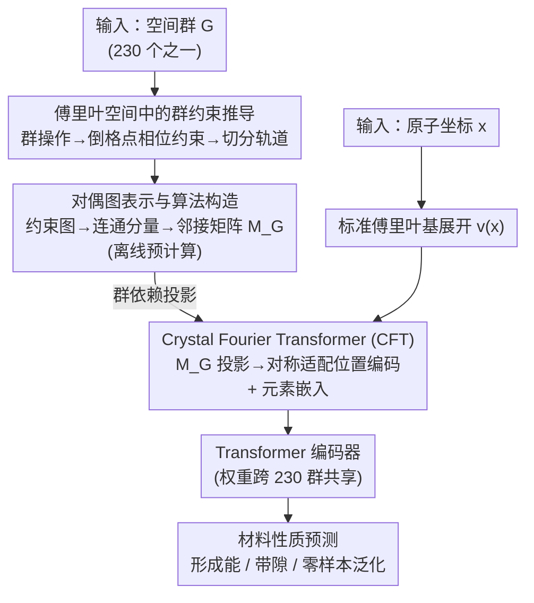

# A Single Architecture for Representing Invariance Under Any Space Group

**会议**: ICLR 2026  
**arXiv**: [2512.13989](https://arxiv.org/abs/2512.13989)  
**代码**: 无  
**领域**: 几何深度学习 / 材料科学  
**关键词**: 空间群, 对称性不变性, 傅里叶基, 晶体结构, 零样本泛化  

## 一句话总结
设计了一种可自适应任意空间群不变性的单一架构 (Crystal Fourier Transformer)，通过解析推导群操作对傅里叶系数的约束来构造对称适配的傅里叶基，用约束的对偶图表示实现了跨 230 个空间群的参数共享和零样本泛化。

## 研究背景与动机

**领域现状**：将已知对称性编码到 ML 模型中可提升精度和泛化性，但实现特定对称性的精确不变性通常需要为每个群设计定制架构。

**现有痛点**：三维空间中有 230 个空间群（晶体对称性），为每个群设计专用架构不可扩展。更严重的是数据稀缺——最大基准数据集 (Materials Project) 仅 ~20 万条数据，平均每个群不到 1000 个样本，许多群几乎无数据。

**核心矛盾**：需要精确的群不变性以尊重物理约束，但又需要跨群的参数共享来克服数据稀缺。

**本文目标**：开发一个能根据输入空间群自动调整权重以强制相应不变性的单一架构。

**切入角度**：在傅里叶空间中分析群对称性的约束——群操作在倒格点上引入相位约束，将这些约束编码为约束图的邻接矩阵，嵌入到神经网络层中。

**核心 idea**：空间群的不变性等价于倒格点上傅里叶系数的约束关系，这些约束可表示为图结构并编码到神经网络中，实现跨群参数共享。

## 方法详解

### 整体框架
这篇论文要解决的问题是：三维晶体有 230 个空间群，怎样用**一个**网络就能对任意空间群强制精确不变性，而不必为每个群手搓一套架构。它的做法是把"群不变性"这件事彻底搬到傅里叶空间里——一个 $G$-不变函数的傅里叶系数会被群操作约束成若干相互关联的轨道，于是不变性就等价于倒格点上一组线性约束。整条流水线分两段：**离线**针对给定空间群 $G$ 先推导傅里叶系数的相位约束、再把约束画成对偶图并跑一遍连通分量算出一张群依赖的邻接矩阵 $M_G$；**在线**时把原子位置用标准傅里叶基展开成频率系数，乘上 $M_G$ 投影到满足约束的不变子空间得到对称适配的位置编码，最后送进 Transformer 做性质预测。关键在于换空间群时只换那张邻接矩阵，网络权重始终不动，所以同一套参数能服务全部 230 个群。

### 关键设计

**1. 傅里叶空间中的群约束推导：把无限维的不变函数空间变成倒格点上可算的离散约束**

直接在连续函数空间里强制群不变性是无限维问题，难以精确实现。论文转而分析傅里叶系数受到的约束（Proposition 3.1 + Theorem 3.2）：对一个 $G$-不变函数 $f$ 和群操作 $\phi(x) = Ax + t$，其傅里叶系数必须满足

$$F(\omega) = e^{i2\pi\omega^\top A^\top t} F(A\omega).$$

这条等式把倒格点切成一组互不相交的**轨道** $\mathcal{O}$——同一轨道内的频率由群操作 $\omega \to A\omega$ 串联、相位被锁死，每个轨道恰好对应一个不变基函数

$$e_\mathcal{O}(x) = \sum_{\omega \in \mathcal{O}} w_{\xi \to \omega}\, e^{i2\pi\omega^\top x}.$$

这样原本无限维的不变函数空间就被离散成"按轨道枚举基函数"的可计算问题，而且是精确约束、不是近似。论文进一步证明这组基张成了 $L^2(\Pi)$ 中所有连续 $G$-不变函数，保证了表达完备性。

**2. 对偶图表示与算法构造：用一张有向加权图把抽象群论约束变成通用的图算法**

有了约束公式还需要一个对任意空间群都能跑的统一构造流程，论文为此把约束画成倒格点上的有向加权图（Algorithm 1）：节点是频率 $\omega$，每个群操作 $\phi$ 在 $\omega$ 和 $A\omega$ 之间连一条有向边，边权就是上面那个相位因子 $e^{i2\pi\omega^\top A^\top t}$。移除相位不一致的自环后，图的每个连通分量就是一个相位一致的轨道，沿边把权重连乘起来即得到该轨道基函数的各项系数。这样一来，"这个群允许哪些频率、它们怎样耦合"这种抽象群论判断，被还原成跑一遍连通分量 + 边权乘积的图算法，对 230 个群可以无差别地自动执行。

**3. Crystal Fourier Transformer (CFT)：用对称适配傅里叶基当位置编码，让全部空间群共享同一套权重**

最后把前两步的产物接进 Transformer。原子位置先在标准傅里叶基里展开，再经过群依赖的邻接矩阵投影到不变子空间——这张邻接矩阵正是 Algorithm 1 离线算好的轨道结构，编码了该空间群的全部约束。因为约束信息全部落在邻接矩阵里，网络架构和权重对所有空间群完全共享：换群时只换矩阵、不动参数。这正是零样本泛化的来源——一个训练中从未见过的空间群，只要预计算出它的邻接矩阵就能直接预测。位置编码也因此自带几何含义：同一轨道内的点距离近、不同轨道间距离远，准确反映了倒格点上的轨道结构。

### 损失函数 / 训练策略
用标准的材料性质回归/分类损失。训练时可把不同空间群的数据混在一起喂给同一个网络，模型靠各自的邻接矩阵自动适配对应的对称约束，无需为不同群切换架构。

## 实验关键数据

### 主实验

| 任务 | CFT | 标准PE | CGCNN | 说明 |
|------|-----|--------|-------|------|
| 形成能预测 | 竞争性 | 较差 | 基线 | CFT 利用精确对称性提升 |
| 带隙预测 | 竞争性 | 较差 | 基线 | 同上 |
| 零样本泛化 | ✓ 成功 | ✗ 失败 | ✗ 不适用 | 对从未见过的空间群能预测 |

### 消融实验

| 配置 | 性能 | 说明 |
|------|------|------|
| CFT (完整) | 最佳 | 对称适配傅里叶编码 |
| 标准傅里叶PE | 较差 | 无群约束 |
| 无PE | 最差 | 无位置信息 |

### 关键发现
- 对称适配傅里叶位置编码相比标准位置编码在材料性质预测上有显著提升
- 零样本泛化能力是核心亮点：模型可以对训练中从未见过的空间群做出合理预测
- 位置编码准确反映了轨道距离（同一轨道内的点距离近，不同轨道间距离远）
- 邻接矩阵的预计算成本低，可离线完成且对每个群只需计算一次

## 亮点与洞察
- **从不变基到自适应架构**：核心洞察是群不变性可以通过倒格点上的线性约束表达，这些约束自然地表示为图邻接矩阵，可直接嵌入到神经网络的矩阵乘法层中
- **统一 230 个群的单一架构**：不是为每个群设计专用网络，而是用一个共享网络 + 群特定的预计算投影矩阵。这种设计使得跨群的知识迁移和零样本泛化成为可能
- **理论完备性**：证明了构造的基函数张成 $L^2(\Pi)$ 中所有连续 $G$-不变函数，不仅是近似而是精确表示

## 局限与展望
- 实际仅用有限频率截断的近似基，截断频率的选择影响表达能力
- 目前仅在标量性质预测上验证，等变性质（如张量性质）的扩展需要从不变性推广到等变性
- 与图神经网络 baseline (CGCNN, ALIGNN) 的性能对比显示"竞争性"而非"大幅超越"
- 算法 1 对倒格点的遍历在高频截断下可能产生大量基函数

## 相关工作与启发
- **vs Adams & Orbanz 2023**: 他们证明了 $G$-不变傅里叶基的存在性但用数值方法求解 Laplace 特征函数；本文给出了解析构造算法
- **vs CGCNN/ALIGNN**: 这些图网络通过增强图结构编码周期性；本文直接在位置编码中编码空间群不变性
- **vs Thomas et al. (SE(3)-Transformers)**: SE(3) 等变网络处理连续旋转群；本文处理离散的晶体学群，面临不同的技术挑战

## 评分
- 新颖性: ⭐⭐⭐⭐⭐ 首次提出可自适应任意空间群的单一架构，傅里叶约束的对偶图表示新颖且优雅
- 实验充分度: ⭐⭐⭐⭐ 零样本泛化实验很有说服力，但与 SOTA 的定量比较不明显领先
- 写作质量: ⭐⭐⭐⭐⭐ 数学推导层层递进，从 1D 直觉到高维理论的叙述优秀
- 价值: ⭐⭐⭐⭐⭐ 为材料科学 ML 提供了原则性的对称性处理框架，零样本泛化能力有重大实际意义

<!-- RELATED:START -->

## 相关论文

- [\[AAAI 2026\] Learning Compact Latent Space for Representing Neural Signed Distance Functions with High-fidelity Geometry Details](../../AAAI2026/others/learning_compact_latent_space_for_representing_neural_signed_distance_functions_.md)
- [\[ACL 2025\] Are Any-to-Any Models More Consistent Across Modality Transfers Than Specialists?](../../ACL2025/others/are_any-to-any_models_more_consistent_across_modality_transfers_than_specialists.md)
- [\[ICLR 2026\] Out of the Shadows: Exploring a Latent Space for Neural Network Verification](out_of_the_shadows_exploring_a_latent_space_for_neural_network_verification.md)
- [\[ACL 2025\] Cramming 1568 Tokens into a Single Vector and Back Again: Exploring the Limits of Embedding Space Capacity](../../ACL2025/others/cramming_tokens_embedding_capacity.md)
- [\[CVPR 2026\] Progressive Neural Architecture Generation](../../CVPR2026/others/progressive_neural_architecture_generation.md)

<!-- RELATED:END -->
