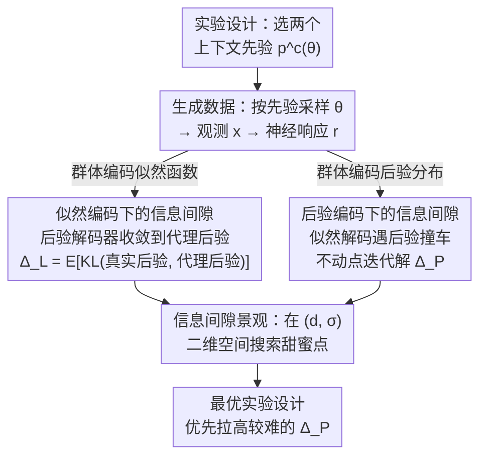

# An Information-Theoretic Framework For Optimizing Experimental Design To Distinguish Probabilistic Neural Codes

**会议**: ICLR 2026  
**arXiv**: [2603.01387](https://arxiv.org/abs/2603.01387)  
**代码**: [https://github.com/walkerlab/information-gap-probabilistic-neural-codes](https://github.com/walkerlab/information-gap-probabilistic-neural-codes)  
**作者**: Po-Chen Kuo, Edgar Y. Walker (University of Washington)  
**领域**: 计算神经科学 — 概率神经编码、贝叶斯感知、实验设计优化  
**关键词**: Information Gap, 概率编码假说, 似然编码, 后验编码, 最优实验设计

## 一句话总结

提出 **information gap** 这一信息论度量，通过推导在似然编码和后验编码假说下解码器交叉熵性能差异的解析表达式（本质是真实后验与任务边际化代理后验之间的 KL 散度），定量评估给定实验设计区分两种概率神经编码假说的能力，并通过最大化该度量来优化刺激先验分布，实现理论驱动的最优实验设计。

## 研究背景与动机

**领域现状**：贝叶斯脑假说（Bayesian brain hypothesis）是理解不确定性下感知决策的主导理论框架。大量心理物理学证据表明大脑在多感官整合、运动知觉、感觉运动学习等任务中执行近似贝叶斯最优计算。然而，概率分布究竟如何在感觉神经群体中编码——这一核心实现问题仍悬而未决。

**现有痛点**：当前存在两种相互竞争的假说：**似然编码假说**（以概率群体编码 PPC 为代表，认为初级感觉区编码似然函数 $p(x|\theta)$）和**后验编码假说**（以神经采样编码为代表，认为初级感觉区通过反馈连接整合先验直接编码后验分布 $p(\theta|x)$）。两种假说的关键区别在于刺激先验 $p(\theta)$ 是否会调制早期感觉群体的神经响应。然而，现有神经电生理实验大多采用单一固定的刺激上下文（均匀先验），使得两种假说的预测无法区分。

**核心矛盾**：要区分两种假说，需要操纵不同上下文下的刺激先验分布，但先验分布的选择涉及一个非平凡的 trade-off：先验差异太大则跨上下文的刺激重叠不足（无法比较同一刺激下的响应差异），先验差异太小则两种假说的预测差异微弱。这一 trade-off 无法仅凭直觉解决。

**本文目标** ① 如何定量衡量给定实验设计（即刺激先验分布的选择）区分两种编码假说的能力？② 如何系统地优化实验参数以最大化区分能力？

**切入角度**：作者从解码框架出发——如果神经群体编码似然函数，则似然解码器应优于后验解码器，反之亦然。通过推导最优解码器在理论极限下的交叉熵性能差异，可以解析地量化实验设计的区分能力。

**核心 idea**：将实验设计优化问题转化为最大化 information gap（最优解码器在解码匹配 vs 不匹配概率内容时的性能差异），从信息论角度为区分概率神经编码假说提供可计算、可优化的理论框架。

## 方法详解

### 整体框架

框架基于一个包含两个上下文 $c \in \{A, B\}$ 的实验范式：每个上下文有其特定的刺激先验分布 $p^c(\theta)$，隐变量 $\theta$（如朝向角）按先验采样后通过生成模型 $p(x|\theta)$ 产生感觉观测 $x$，神经群体对观测产生响应 $\boldsymbol{r}$。核心输出是 **information gap** $\Delta^{\text{info}}$——在给定实验设计 $(p(c), p^c(\theta))$ 下，最优似然解码器与最优后验解码器交叉熵性能差异的期望值。整条链路像一个分叉再汇合的流程：先固定一组实验设计生成数据，再分别假设群体"编码似然"或"编码后验"，各推出一个解析的信息间隙 $\Delta_L^{\text{info}}$ / $\Delta_P^{\text{info}}$，最后把这两个量铺成一张二维景观，在里面搜出让两者同时足够大的最优实验设计。

### 关键设计

**1. 似然编码下的信息间隙：用代理后验量化"解码不该解的后验"会损失多少**

第一种假说是神经群体编码似然函数，此时群体响应 $\boldsymbol{r}_L \sim p(x|\theta)$ 里根本不含先验信息，后验解码器无从知道当前是哪个上下文，自然无法还原真实后验。关键的观察是：此时最优后验解码器不会退化成乱猜，而是收敛到一个**任务边际化的代理后验**——它用两个上下文的混合先验 $\sum_c p(c)p^c(\theta)$ 替代真实的上下文先验，

$$q_{P,i}^*(\theta) = \frac{\left[\sum_c p(c)\, p^c(\theta)\right] \cdot p(x_i|\theta)}{\sum_{\theta'} \left[\sum_c p(c)\, p^c(\theta')\right] \cdot p(x_i|\theta')}.$$

于是似然编码下的信息间隙就是真实后验 $p^c(\theta|x_i)$ 与这个代理后验之间 KL 散度的期望：$\Delta_L^{\text{info}} = \mathbb{E}_{p(x_i,c)}\big[D_{\text{KL}}(p^c(\theta|x_i)\,\|\,q_{P,i}^*(\theta))\big]$。只要两个上下文的先验不同，每个观测 $x_i$ 都会贡献一份非零间隙，所以 $\Delta_L^{\text{info}}$ 通常较大——这也意味着"群体是否编码似然"在实验上相对好区分。

**2. 后验编码下的信息间隙：只有"后验撞车"的观测对才贡献**

第二种假说是神经群体直接编码后验分布，这时麻烦反过来：似然解码器面对的是已经被先验调制过的响应，要从里面反推干净的似然。难点在于不同上下文可能产生**完全相同的后验** $p^A(\theta|x_j)=p^B(\theta|x_k)$，但它们背后的似然却不同（$p(x_j|\theta)\neq p(x_k|\theta)$）。最优似然解码器对这种"后验撞车"的观测对只能输出一个折中的 Bayes-optimal 似然估计 $\ell_{jk}^*(\theta)$，需要靠不动点迭代求解。因此后验编码下的信息间隙 $\Delta_P^{\text{info}}$ **只由满足后验匹配条件的观测对** $(x_j, x_k)$ 贡献。由于这样的匹配对稀少，$\Delta_P^{\text{info}}$ 的量级往往比 $\Delta_L^{\text{info}}$ 小一个数量级——这恰恰说明"群体是否编码后验"才是实验设计真正要攻克的难关。

**3. 信息间隙景观：把"选什么先验"变成可优化的二维搜索**

有了两个解析的信息间隙，实验设计就归结为在任务参数空间里找一个让二者都足够大的"甜蜜点"。以高斯上下文先验 $p^c(\theta)=\mathcal{N}(\mu^c,\sigma^2)$ 为例，参数空间由两个上下文先验的均值间距 $d=|\mu^A-\mu^B|$ 和共享标准差 $\sigma$ 张成。遍历 $(d,\sigma)$ 网格分别算出两种假说下的信息间隙，就得到一张二维景观图，直接把"不同先验下两假说有多可分"可视化出来。由于 $\Delta_P^{\text{info}}$ 量级更小、更难拉高，优化策略是以它为瓶颈——优先最大化 $\Delta_P^{\text{info}}$，同时只要求 $\Delta_L^{\text{info}}$ 足够大即可；例如在低对比度刺激下最优参数约为 $d\approx 30°$、$\sigma\approx 20°$。这张景观还顺带排除了一类先验：重尾分布（Student's t、Cauchy）几乎不产生后验编码下的信息间隙，因为这种分布下几乎找不到满足后验匹配条件的观测对，从理论上就不该用来区分两种假说。

### 损失函数 / 训练策略

解码器使用深度神经网络（MLP）实现，训练目标为交叉熵损失。似然解码器 $g_L(\boldsymbol{r})$ 输出似然函数的离散化估计，后验解码器 $g_P(\boldsymbol{r})$ 输出后验分布的离散化估计。训练采用标准监督学习：从模拟的似然编码或后验编码群体生成 $(\boldsymbol{r}, \text{target})$ 对，target 分别为真实似然函数或后验分布的离散化表示。信息间隙的理论值作为解码器性能差异收敛的参考上界。

## 实验关键数据

### 主实验：理论预测与仿真验证

在 Poisson 神经元模型和增益调制 Poisson 模型上，跨多种任务参数和刺激对比度验证信息间隙的预测准确性。

| 验证维度 | 似然编码 $\Delta_L^{\text{info}}$ | 后验编码 $\Delta_P^{\text{info}}$ | 关键发现 |
|----------|--------------------------------|--------------------------------|---------|
| 高对比度刺激 | 理论-实测高度吻合 | 理论-实测高度吻合 | $\Delta_L$ 比 $\Delta_P$ 大一个数量级 |
| 中对比度刺激 | 信息间隙增大 | 信息间隙增大 | 低对比度使先验影响更显著 |
| 低对比度刺激 | 最大信息间隙 | 最大信息间隙 | 有效参数区域最广 |
| 增益调制 Poisson 模型 | 预测准确 | 预测准确 | 更生物真实的模型下框架仍有效 |
| 收敛性（试次数） | 30K 试次收敛 | 30K 试次收敛 | 解码器性能差异收敛到理论值 |
| 收敛性（神经元数） | 500 神经元收敛 | 500 神经元收敛 | 群体规模足够大即可 |

### 真实数据验证：Allen Brain Observatory

| 数据集 | 解码器性能差异 | 理论预测 | $p$-value | 结论 |
|--------|--------------|---------|-----------|------|
| Allen Visual Coding (169 sessions, >300 trials each) | $0.0024 \pm 0.064$ | 0 | $p = 0.63$ | 不显著 |

单一上下文（均匀先验）下理论预测信息间隙为 0，实测结果与预测高度一致，验证了使用多上下文先验操纵的必要性。

### 关键发现

- **信息间隙量级不对称**：似然编码下的信息间隙比后验编码大多达一个数量级，因为似然编码下每个观测都贡献非零间隙，而后验编码下仅满足后验匹配条件的观测对有贡献。这意味着区分后验编码群体在实验上更具挑战性。
- **刺激对比度影响区分能力**：低对比度刺激（高感觉不确定性）扩大了有效参数区域，因为此时先验对后验影响更大。实验设计应根据具体刺激特性（如对比度）量身定制。
- **重尾先验不适合区分编码假说**：Student's t 分布和 Cauchy 分布作为上下文先验时，后验编码的信息间隙在几乎整个参数空间为零，理论解释是重尾分布下几乎不存在满足后验匹配条件的观测对。
- **最优参数存在 trade-off**：两种假说的最优参数区域不完全重叠，需要策略性选择"甜蜜点"——优先最大化较难检测的后验编码信息间隙，同时保证似然编码信息间隙足够大。

## 亮点与洞察

1. **将实验设计优化统一为信息论框架**：核心贡献不是新的神经编码模型或解码算法，而是在理论层面确立了"实验设计的区分能力"可以被解析计算和优化的范式。这把实验神经科学中的设计问题从经验试错提升到了有理论保证的优化问题。

2. **代理后验的精巧推导**：当解码器被迫从编码不匹配的概率信息中提取时，最优输出收敛到任务边际化的 Bayes-optimal 估计（而非随机猜测）。这一结果既直觉优雅又数学严谨，是整个框架的理论基石。

3. **量级不对称的实际洞察**：$\Delta_L^{\text{info}} \gg \Delta_P^{\text{info}}$ 这一发现直接指导实验设计策略——应以后验编码的可区分性为瓶颈来优化实验参数，而非单纯最大化似然编码的区分度。

4. **负面结果的理论价值**：证明重尾先验不适合区分编码假说、单一上下文实验设计无法区分——这些"什么不该做"的结论同样为实验设计提供了明确的理论支撑。

## 局限与展望

1. **理想解码器假设**：框架推导基于最优解码器的理论极限，实际解码器（即使是深度网络）可能欠拟合，导致实测信息间隙低于理论值。论文通过充分训练和大数据量来缓解，但在有限数据场景下的可靠性未充分讨论。

2. **依赖生成模型的先验知识**：计算信息间隙需要已知生成模型 $p(x|\theta)$，而实际实验中生成模型需要通过前期实验建立。这引入了模型误指定风险——如果假设的生成模型与真实情况偏差较大，优化出的实验设计可能次优。

3. **仅考虑二元假说**：虽然论文在附录中讨论了混合编码假说的扩展可能性，但核心框架仍然是二元对立的似然 vs 后验。真实神经系统可能采用连续谱上的中间策略，框架对此类精细区分的灵敏度有待验证。

4. **仿真验证为主，缺乏真实多上下文实验**：真实数据分析仅用于验证"单上下文不能区分"这一消极结论。框架的核心价值——优化后的实验设计能否在真实神经记录中有效区分编码假说——还需要通过前瞻性实验验证。

5. **计算可扩展性**：后验编码下的信息间隙需要枚举满足后验匹配条件的观测对并求解不动点迭代，当观测空间维度增大时计算复杂度可能成为瓶颈。

## 相关工作与启发

| 方法/工作 | 核心思路 | 与本文关系 |
|----------|---------|-----------|
| PPC (Ma et al., 2006) | 泊松群体编码天然表示似然函数 | 似然编码假说的代表性模型，本文框架的一端 |
| Neural Sampling (Hoyer & Hyvärinen, 2002) | 神经变异性反映从后验采样 | 后验编码假说的代表性模型，本文框架的另一端 |
| Walker et al. (2020) | 从V1群体响应解码似然函数预测行为选择 | 本文解码框架的直接前身，但其实验设计无法区分两假说 |
| STRING (Lange et al., 2023) | 提出编码与解码是神经编码的两个不同视角 | 理论上互补，本文关注如何通过实验区分，STRING 关注概念框架 |
| Optimal stimulus design (Lewi et al., 2006/2011) | 信息论优化电生理实验刺激 | 方法论启发——将信息论优化思路从单神经元调谐曲线估计推广到群体编码假说检验 |

**启发方向**：信息间隙框架的核心思想——量化"不匹配解码"的性能损失来区分编码策略——可迁移到机器学习中的表征学习分析，例如用类似方法评估预训练模型是否编码了特定类型的信息（局部特征 vs 全局语义）。

## 评分

- 新颖性: ⭐⭐⭐⭐ 信息间隙的理论推导和代理后验的概念具有原创性，但实验范式（多上下文先验操纵）本身并非全新
- 实验充分度: ⭐⭐⭐⭐ 仿真验证充分（两种神经元模型、多参数、多对比度），但缺乏真实多上下文实验的前瞻性验证
- 写作质量: ⭐⭐⭐⭐⭐ 从直觉到理论再到实验的逻辑链极为清晰，图表设计优秀，符号系统一致
- 价值: ⭐⭐⭐⭐ 为计算神经科学的一个根本争论提供了可操作的理论工具，但影响面受限于领域规模

<!-- RELATED:START -->

## 相关论文

- [\[ACL 2025\] Entropy-UID: A Method for Optimizing Information Density](../../ACL2025/others/entropy-uid_a_method_for_optimizing_information_density.md)
- [\[ICLR 2026\] Probabilistic Kernel Function for Fast Angle Testing](probabilistic_kernel_function_for_fast_angle_testing.md)
- [\[AAAI 2026\] DeepRWCap: Neural-Guided Random-Walk Capacitance Solver for IC Design](../../AAAI2026/others/deeprwcap_neural-guided_random-walk_capacitance_solver_for_ic_design.md)
- [\[CVPR 2026\] Robust Spiking Neural Networks by Temporal Mutual Information](../../CVPR2026/others/robust_spiking_neural_networks_by_temporal_mutual_information.md)
- [\[ICLR 2026\] Characterizing and Optimizing the Spatial Kernel of Multi Resolution Hash Encodings](characterizing_and_optimizing_the_spatial_kernel_of_multi_resolution_hash_encodi.md)

<!-- RELATED:END -->
